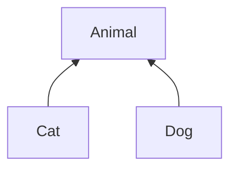

In het algemeen zijn er slechts twee plaatsen waar je een nieuwe generische parameter (meestal aangegeven met een enkele _letter_) kan introduceren:

1. Bij de definitie van een **klasse** (of interface, record, ...)
2. Bij de definitie van een **methode** (of constructor)

## Een generische klasse definiëren

Om een generische **klasse** te definiëren (de eerste optie), zet je de type-parameter tussen `<` en `>` achter de naam van de klasse die je definieert.
Vervolgens kan je die parameter (bijna[^static]) overal in die klasse gebruiken als type:

```java
class MyGenericClass<E> {
  // je kan hier (bijna) overal E gebruiken als type
}
```

[^static]: De generische parameter kan _niet_ gebruikt worden in de **statische** velden, methodes, inner classes, ... van de klasse.

Bijvoorbeeld, volgende klasse is een nieuwe versie van de `ArrayList`-klasse van eerder, maar nu met type-parameter `E` (waar `E` staat voor 'het type van de elementen').
Deze `E` wordt vervolgens gebruikt als type voor de elements-array, de parameter van de add-method, en het resultaat-type van de get-method:

```java
class ArrayList<E> {
  private E[] elements;
  public void add(E element) { /* ... */  }
  public E get(int index) { /* ... */  }
}
```

Je zal heel vaak zien dat generische type-parameters slechts bestaan uit 1 letter (populaire letters zijn bijvoorbeeld `E`, `R`, `T`, `U`, `V`). Dat is geen vereiste: onderstaande code mag ook, en is volledig equivalent aan die van hierboven.
De reden waarom vaak met individuele letters gewerkt wordt, is om duidelijk te maken dat het over een type-parameter gaat, en niet over een bestaande klasse.

```java
class ArrayList<Element> {
  private Element[] elements;
  public void add(Element element) { /* ... */ }
  public Element get(int index) { /* ... */ }
}
```

> [!info] Weetje
> Je kan een generische klasse ook zien als een **functie** (soms een [_type constructor_](https://en.wikipedia.org/wiki/Type_constructor) genoemd).
> Die functie geeft geen _object_ terug op basis van een of meerdere parameters zoals je dat gewoon bent van een functie, bijvoorbeeld `getPet : (Person p) → Animal`, maar geeft een nieuw _type_ (een nieuwe klasse) terug, gebaseerd op de type-parameters.
> Bijvoorbeeld, de generische klasse `ArrayList<T>` kan je beschouwen als een functie `ArrayList : (Type T) → Type`, die het type `ArrayListOfStudents` of `ArrayListOfAnimals` teruggeeft wanneer je ze oproept met `T=Student` of `T=Animal`, respectievelijk.
> In plaats van `ArrayListOfStudents` schrijven we dat type als `ArrayList<Student>`.

## Een generische klasse gebruiken

Bij het gebruik van een generische klasse (bijvoorbeeld `ArrayList<E>` van hierboven) moet je een concreet type opgeven voor de type-parameter (`E`).
Bijvoorbeeld, op plaatsen waar je een lijst met enkel studenten verwacht, gebruik je `ArrayList<Student>` als type.
Je kan dan de klasse gebruiken op dezelfde manier als de `ArrayListOfStudents` klasse van hierboven:

```java
{
ArrayList<Student> students = new ArrayList<Student>();
Student someStudent = new Student();
students.add(someStudent); // <-- OK 👍
// students.add(animal); // <-- niet toegelaten (compiler error) 👍
Student firstStudent = students.get(0); // <-- OK 👍
}
```

Merk op hoe de compiler afdwingt en garandeert dat er enkel Student-objecten in deze lijst terecht kunnen komen.

Om wat typwerk te besparen, laat Java in veel gevallen ook toe om het type weg te laten bij het instantiëren, met behulp van `<>`.
Dat type kan immers automatisch afgeleid worden van het type van de variabele:

```java
ArrayList<Student> students = new ArrayList<>(); // <- je hoeft geen tweede keer <Student> te typen
```

Het gebruik van generische methodes bespreken we [later](#generische-methodes) in meer detail.

## Een generische methode definiëren

Naast een generische klasse definiëren is er ook een tweede manier om een generische parameter te definiëren, namelijk eentje die enkel in één **methode** gebruikt kan worden.
Dat doe je door de parameter te declareren vóór het terugkeertype van de methode, opnieuw tussen `<` en `>`.
Je kan die parameter gebruiken in de methode zelf, en ook in de types van de parameters en het terugkeertype (dus overal na de definitie ervan).
Bijvoorbeeld, onderstaande methodes `doSomething` en `doSomethingElse` hebben beiden een generische parameter `T`.
Die parameter hoort enkel bij elke individuele methode; beide generische types staan dus volledig los van elkaar.
Ook NormalClass is geen generische klasse; enkel de twee methodes zijn generisch.

```java
class NormalClass {
  public <T> int doSomething(ArrayList<T> elements) {
    // je kan overal in deze methode type T gebruiken
  }
  public static <T> ArrayList<T> doSomethingElse(ArrayList<T> elements, T element) {
    // deze T is onafhankelijk van die van doSomething
  }
}
```

Het is trouwens ook mogelijk om generische klassen en generische methodes te combineren:

```java
class Foo<T> {
  public <U> ArrayList<U> doSomething(ArrayList<T> ts, ArrayList<U> us) {
    // code met T en U
  }
}
```

> [!note] Onthoud
> Er zijn slechts **2 plaatsen** waar je een nieuwe generische parameter (een 'letter' zoals `T` of `U`) mag introduceren:
> 1. vlak na de naam van een klasse die je definieert (`class Foo<T> { ... }`); en
> 2. vlak vóór het terugkeertype van een methode (`public <T> void doSomething(...) { }`).
>
> Op alle andere plaatsen waar je naar een generische parameter verwijst (door de letter te gebruiken), moet je ervoor zorgen dat deze eerst gedefinieerd werd op één van deze twee plaatsen.


## Meerdere type-parameters

De `ArrayList<E>`-klasse hierboven had één generische parameter (`E`).
Een generische klasse of methode kan ook meerdere type-parameters hebben, bijvoorbeeld een tuple van 3 elementen van mogelijk verschillend type:

```java
class Tuple3<T1, T2, T3> {
  private T1 first;
  private T2 second;
  private T3 third;
  public T1 getFirst() { return first; }
  /* ... */
}
```

Bij het gebruik van deze klasse (bijvoorbeeld bij het aanmaken van een nieuw object) moet je dan voor elke parameter (`T1`, `T2`, en `T3`) een concreet type opgeven:

```java
Tuple3<String, Integer, Student> tuple = new Tuple3<>("John", 23, student);
```

Ook hier kan je met de verkorte notatie `<>` werken om jezelf niet te moeten herhalen.

{}
Het lijkt erg handig om zo'n `Tuple`-type overal in je code te gebruiken waar je drie objecten samen wil behandelen, maar dat wordt afgeraden.
Niet omdat het drie generische parameters heeft (dat is perfect legitiem), maar wel omdat het niets zegt over de betekenis van de velden (wat zit er in 'first', 'second', 'third'?).
Gebruik in plaats van een algemene `Tuple`-klasse veel liever een record waar je de individuele componenten een naam kan geven.
Bijvoorbeeld: `record ExtractedStudentInfo(String firstName, int age, Student student) {}` of `record Point3D(double x, double y, double x) {}`.
{}

## Generische parameters begrenzen (bounds)

Een type-parameter `<E>` zoals we die tot nu toe gezien hebben kan om het even welk type voorstellen.
Soms willen we dat niet, en willen we beperkingen opleggen.
Stel bijvoorbeeld dat we volgende klasse-hierarchie hebben:

<div style="display: grid; grid-template-columns: 1fr 1fr; align-items: center;">

```java
abstract class Animal {
  /* ... */
  abstract void showLike();
}
class Cat extends Animal {
  /* ... */
  void showLike() { System.out.println("Purring"); }
}
class Dog extends Animal {
  /* ... */
  void showLike() { System.out.println("Wagging tail"); }
}
```



</div>

We maken nu een generische klasse `Food`, geparametriseerd met het type dier (`T`) dat dat voedsel eet:

```java
class Food<T> {
  public void giveTo(T animal) {
    /* ... */
    animal.showLike(); // <= compiler error 🙁
  }
}

Food<Cat> catFood = new Food<>();       // OK
Food<String> stringFood = new Food<>(); // ook OK? 🙁
```

De `Food`-klasse is enkel bedoeld om met `Animal` (en de subklassen van Animal) gebruikt te worden, bijvoorbeeld `Food<Cat>` en `Food<Dog>`.
Maar niets houdt ons op dit moment tegen om ook een `Food<String>` te maken.
Daarenboven zal de compiler (terecht) ook een compilatiefout geven in de methode `giveTo` van `Food`: er wordt een `Animal`-specifieke methode opgeroepen (namelijk `showLike`) op de parameter `animal`, maar die heeft type `T` en dat kan eender wat zijn, bijvoorbeeld ook `String`.
En `String` biedt natuurlijk geen methode `showLike()` aan.

We kunnen daarom aangeven dat type `T` een subtype moet zijn van `Animal` door bij de definitie van de generische parameter `<T extends Animal>` te schrijven.
Je zal dan niet langer `Food<String>` mogen schrijven, aangezien `String` geen subklasse is van `Animal`.
We **begrenzen** dus de mogelijke types die gebruikt kunnen worden voor de type-parameter `T` tot alle types die overerven van `Animal` (inclusief `Animal` zelf).

```java
class Food<T extends Animal> {
  public void giveTo(T animal) {
    /* ... */
    animal.showLike(); // <= OK! 👍
  }
}

Food<Cat> catFood = new Food<>();       // nog steeds OK
Food<String> stringFood = new Food<>(); // <-- compiler error 👍
```

{}
Wanneer je deze materie later opnieuw doorneemt, heb je naast `extends` ook al gehoord van `super` en wildcards (`?`) --- dit wordt [later](#covariantie-en-contravariantie-wildcards) besproken.
Het is belangrijk om op te merken dat je `super` en `?` en **nooit** kan gebruiken bij de _definitie_ van een nieuwe generische parameter (de Java compiler laat dit niet toe).
Dat kan enkel op de plaatsen waar je een generische klasse of methode _gebruikt_.
Onthoud dus: op de plaatsen waar je een nieuwe parameter (een nieuwe 'letter') introduceert, kan je enkel aangeven dat die een subtype van iets moet zijn met behulp van `extends`.
{}

## Generische methodes

> [!todo]
> Gebruik generische methodes: type opgeven (maar meestal niet nodig - type inference).

In de voorbeelden hierboven hebben we steeds een hele klasse generisch gemaakt.
We vermeldden dat het ook mogelijk is om een generische **methode** te definiëren, wat soms nuttig kan zijn.
Dat kan ook in een klasse die zelf geen type-parameters heeft.
Hieronder definiëren we (in een niet-generische klasse `AnimalHelper`) een generische (statische) methode `findHappyAnimals`.
Deze heeft 1 generische parameter `T`, en we leggen meteen ook op dat dat een subtype van `Animal` moet zijn (`<T extends Animal>`).

```java
class AnimalHelper {
  public static <T extends Animal> ArrayList<T> findHappyAnimals(ArrayList<T> animals) { /* ... */ }
}

ArrayList<Cat> cats = new ArrayList<>();
/* ... */
ArrayList<Cat> happyCats = AnimalHelper.findHappyAnimals(cats);
```

Merk op dat we het type `T` zowel gebruiken bij de `animals`-parameter als bij het terugkeertype van de methode.
Zo kunnen we garanderen dat de teruggegeven lijst precies hetzelfde type elementen heeft als de lijst `animals`, zonder dat we al moeten vastleggen welk type dier (bv. `Cat` of `Dog`) dat precies is.
Dus: als we een `ArrayList<Cat>` meegeven aan de methode, krijgen we ook een `ArrayList<Cat>` terug.

Op dezelfde manier kan je ook het type van meerdere parameters (en eventueel het terugkeertype) aan elkaar verbinden.
In het voorbeeld hieronder zie je een methode die paren kan maken tussen dieren; de methode kan gebruikt worden voor elk type dier, maar maakt enkel paren van dezelfde soort.
Je ziet meteen ook een voorbeeld van een generisch record-type `AnimalPair`.

```java
class AnimalHelper {
  public record AnimalPair<T extends Animal>(T male, T female) {} // <= voorbeeld van een generisch record

  public static <T extends Animal> ArrayList<AnimalPair<T>> makePairs(ArrayList<T> males, ArrayList<T> females) {
    /* ... */
  }
}

ArrayList<Cat> maleCats = ...
ArrayList<Cat> femaleCats = ...
ArrayList<Dog> femaleDogs = ...
ArrayList<AnimalPair<Cat>> pairedCats = makePairs(maleCats, femaleCats); // OK

ArrayList<AnimalPair<Animal>> pairedMix = makePairs(maleCats, femaleDogs); // niet OK (compiler error) 👍
```

Als het type `T` niet van belang is omdat het nergens terugkomt (bijvoorbeeld niet in het terugkeertype van de methode en ook niet bij een andere parameter), dan heb je strikt gezien geen generische methode nodig.
Zoals we [later](#covariantie-en-contravariantie-wildcards) zullen zien, kan je dan ook gewoon het wildcard-type `<? extends X>` gebruiken, of `<?>` indien het type niet begrensd moet worden.
In plaats van

```java
  public static <T extends Animal> void feedAll(ArrayList<T> animals) {
    // code die T nergens vermeldt
  }
```

kan je dus ook de generische parameter weglaten, en hetvolgende schrijven:

```java
  public static void feedAll(ArrayList<? extends Animal> animals) { /* ... */ }
```

Je leest deze methode-signatuur als 'de methode `feedAll` neemt als parameter een lijst met elementen van een willekeurig (niet nader bepaald) subtype van `Animal`'.


