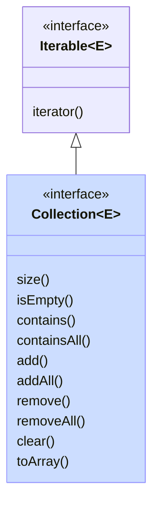
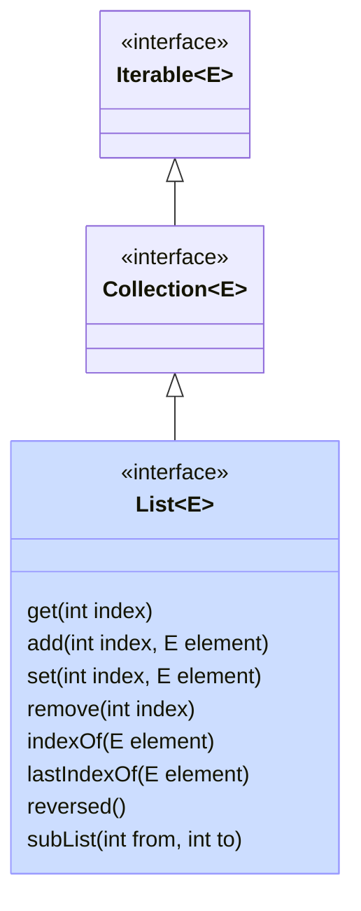
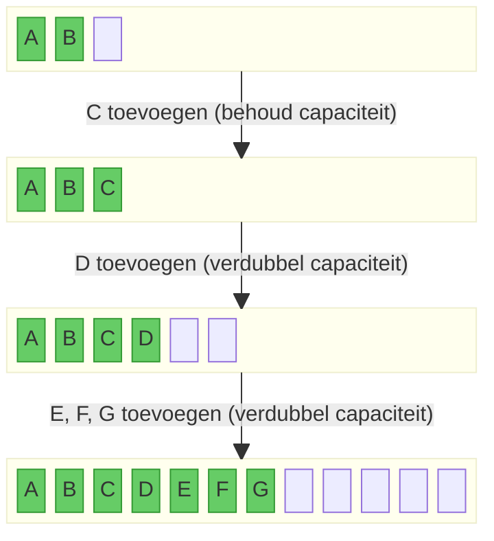
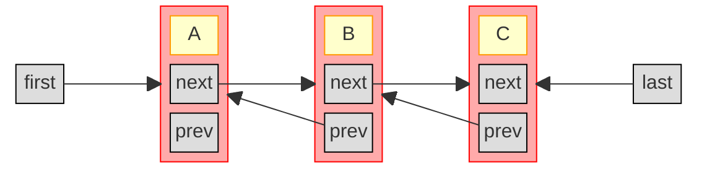
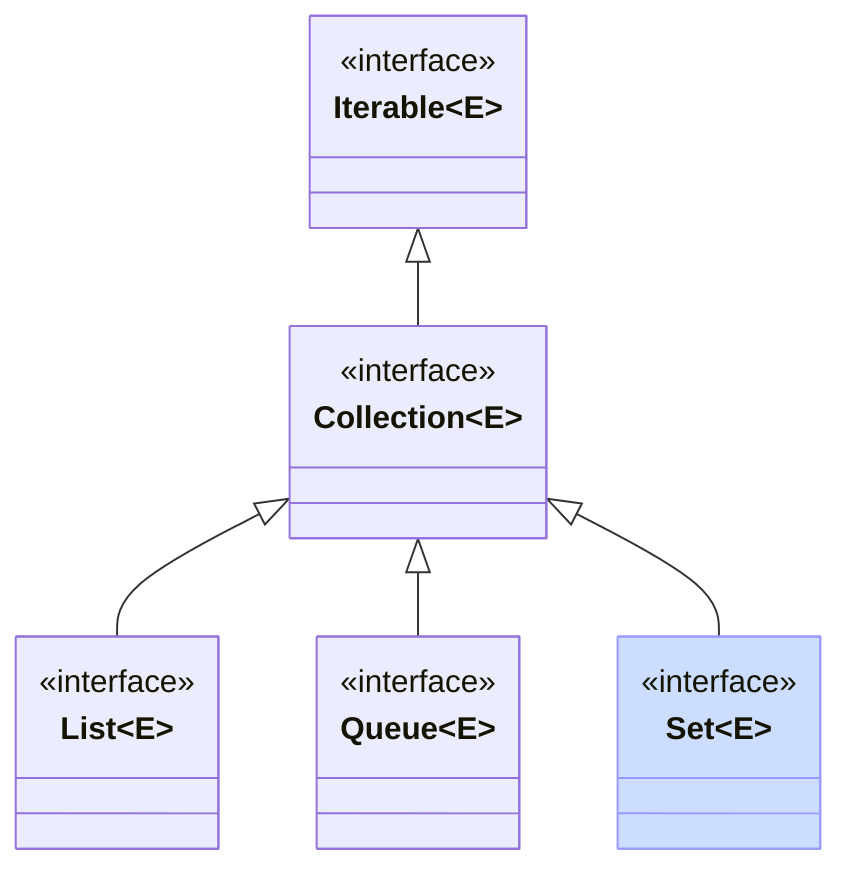

{}
De concepten in andere programmeertalen die het dichtst aanleunen bij Java collections zijn
- de Standard Template Library (STL) in C++
- enkele ingebouwde types, alsook de `collections` module in Python
- de collecties in `System.Collections.Generic` in C#
{}

Het komt vaak voor dat we meerdere objecten willen kunnen bijhouden.
Totnogtoe heb je hiervoor in de cursus *Software-ontwerp in Java* enkel gewerkt met een Java array `[]` (vaste grootte), en met `ArrayList<T>` (kan groter of kleiner worden).
In dit hoofdstuk kijken we in meer detail naar `ArrayList`, en behandelen we ook verschillende andere collectie-types in Java.
De meeste van die types vind je ook (soms onder een andere naam) terug in andere programmeertalen.

Je kan je afvragen waarom we andere collectie-types nodig hebben; uiteindelijk kan je (met genoeg werk) alles toch implementeren met een `ArrayList`? Dat klopt, maar de collectie-types verschillen in welke operaties snel zijn, en welke meer tijd vragen. Om dat preciezer uit te drukken, kan je gebruik maken van de notie van *tijdscomplexiteit*. We gaan daar in deze cursus niet verder op in; dat komt uitgebreid aan bod in de cursus *Algoritmen en datastructuren*.

De Java Collections API bestaat uit

- interfaces (bv. `Iterable`, `Collection`, `List`, `Set`, `SortedSet`, `Queue`, `Deque`, `Map`, `SortedMap`, en `NavigableMap`)
- implementaties van die interfaces (bv. `ArrayList`, `LinkedList`, `Vector`, `Stack`, `ArrayDeque`, `PriorityQueue`, `HashSet`, `LinkedHashSet`, `TreeSet`, en `TreeMap`)
- algoritmes voor veel voorkomende operaties (bv. `shuffle`, `sort`, `swap`, `reverse`, ...)

Je vindt een overzicht van de hele API op [deze pagina](https://docs.oracle.com/en/java/javase/25/docs/api/java.base/java/util/doc-files/coll-reference.html).

{}
Behalve de Java Collections API zijn er ook externe bibliotheken met collectie-implementaties die je (bijvoorbeeld via Gradle) kan gebruiken in je projecten.
De twee meest gekende voorbeelden zijn

- [Google Guava](https://github.com/google/guava), en bijhorende [documentatie](https://guava.dev/releases/snapshot-jre/api/docs/com/google/common/collect/package-summary.html)
- [Apache Commons](https://commons.apache.org/), en bijhorende [documentatie](https://commons.apache.org/proper/commons-collections/apidocs/index.html)
{}

## Woordje vooraf: generics

Collecties maken veelvuldig gebruik van zogenaamde **generische (type-)parameters**.
Dat zijn parameters die bij de naam van een klasse horen.
Ze staan steeds tussen `<` en `>`, bijvoorbeeld de `<String>` die je vroeger al tegenkwam bij `ArrayList<String>`.

We zullen generische parameters later in veel meer detail behandelen.
Voorlopig volstaat het om `Collectie<E>` te lezen als *"Collectie van E's"*.

Om (straks bij de oefeningen) een zelfgedefinieerde klasse een generische parameter te geven, voeg je `<E>` toe achter de klasse-naam (je mag gerust ook andere namen gebruiken dan `E`, bijvoorbeeld `T`, `Element`, ...).
Bijvoorbeeld:

```java
class MijnCollectie<E> {

  void voegToe(E element) { ... }

}
```

Binnen in de klasse kan je dan `E` gebruiken als type voor methode-parameters, lokale variabelen, en velden.
In het voorbeeld hiervoven heeft de parameter `element` van methode `voegToe` het type `E`.

Wat `E` precies is moet later bepaald worden, bij het gebruik van de klasse (= het aanmaken van een object).
Op dat moment moet je een concrete waarde opgeven voor `E`.
Bijvoorbeeld, als je een object van `MijnCollectie` wil maken waaraan je enkel `Persoon`-objecten kan toevoegen, dan kan dat als volgt:

```java
MijnCollectie<Persoon> personen = new MijnCollectie<>();
Persoon p = ...
personen.voegToe(p); // ok

personen.voegToe("brood"); // NIET ok - de String "brood" is geen Persoon-object.
```

Je kan het type `MijnCollectie<Persoon>` dus zien als de klasse `MijnCollectie<E>`  waarin alle voorkomens van `E` vervangen werden door `Persoon`.

## Iterable en Iterator

De interfaces [`Iterable<E>`](https://docs.oracle.com/en/java/javase/25/docs/api/java.base/java/lang/Iterable.html) en [`Iterator<E>`](https://docs.oracle.com/en/java/javase/25/docs/api/java.base/java/util/Iterator.html) maken eigenlijk geen deel uit van de Java Collections API, maar zijn er wel sterk aan verwant.

Een [`Iterable<E>`](https://docs.oracle.com/en/java/javase/25/docs/api/java.base/java/lang/Iterable.html) is een object dat **meerdere objecten van type `E` één voor één kan teruggeven**.
Er moet slechts één methode geïmplementeerd worden, namelijk `iterator()`, die een `Iterator<E>`-object teruggeeft (zie hieronder).

Elke klasse die `Iterable` implementeert, kan automatisch gebruikt worden in een zogenaamd *'enhanced for-statement'*:

```java
Iterable<E> iterable = ...
for (E element : iterable) {
  ... // code die element gebruikt
}
```

Een [`Iterator<E>`](https://docs.oracle.com/en/java/javase/25/docs/api/java.base/java/util/Iterator.html) is een object dat gebruikt kan worden om (éénmalig) **door alle elementen van een collectie te lopen**.
Een `Iterator<E>` heeft twee methodes:

- `boolean hasNext()`: geeft aan of er nog objecten zijn om terug te geven
- `E next()`: geeft het volgende object (van type `E`) terug (als er nog objecten zijn).

Elke keer je `next()` oproept krijg je dus een ander object, tot `hasNext()` false teruggeeft. Vanaf dan krijg je een exception (`NoSuchElementException`).
Een `Iterator` moet dus een interne toestand bijhouden om te bepalen welke objecten al teruggegeven zijn en welke nog niet.
Eens alle elementen teruggegeven zijn, en `hasNext()` dus `false` teruggeeft, is de iterator 'opgebruikt'.
Als je daarna nog eens over de elementen wil itereren, moet je een nieuwe iterator aanmaken.

Bij een enhanced for-statement wordt achter de schermen een iterator gebruikt.
Het enhanced for-statement van hierboven is equivalent aan volgende code:

```java
Iterable<E> iterable = ...
Iterator<E> iterator = iterable.iterator();
while (iterator.hasNext()) {
  E element = iterator.next();
  ... // code die element gebruikt
}
```

Alle collectie-types die een verzameling elementen voorstellen (dus alles behalve `Map`), implementeren de `Iterable` interface.
Dat betekent dus dat je elk van die collecties in een enhanced for-lus kan gebruiken.
Je kan daarenboven ook zelf een nieuwe klasse maken die deze interface implementeert, en die vervolgens gebruikt kan worden in een enhanced for-loop.
Dat doen we later in de oefeningen.

## Collection



Zoals je hierboven zag, kan een `Iterable` dus enkel elementen opsommen.
De basisinterface [`Collection`](https://docs.oracle.com/en/java/javase/25/docs/api/java.base/java/util/Collection.html) erft hiervan over maar is uitgebreider: het stelt een **eindige groep objecten** voor.
Er zit nog steeds bitter weinig structuur in een Collection:

- de volgorde van de elementen in een Collection ligt niet vast
- er kunnen wel of geen dubbels in een Collection zitten

De belangrijkste operaties die je op een Collection-object kan uitvoeren zijn [(volledige documentatie)](https://docs.oracle.com/en/java/javase/25/docs/api/java.base/java/util/Collection.html)

- `iterator()`, geërfd van `Iterable`
- `size()`: de grootte opvragen
- `isEmpty()`: nagaan of de collectie leeg is
- `contains` en `containsAll`: nakijken of een of meerdere elementen in de collectie zitten
- `add` en `addAll`: een of meerdere elementen toevoegen
- `remove` en `removeAll`: een of meerdere elementen verwijderen
- `clear`: de collectie volledig leegmaken
- `toArray`: alle elementen uit de collectie in een array plaatsen

Alle operaties die een collectie aanpassen (bv. add, addAll, remove, clear, ...) zijn optioneel.
Dat betekent dat sommige implementaties een `UnsupportedOperationException` kunnen gooien als je die methode oproept.
Niet elke collectie hoeft dus alle operaties te ondersteunen.

## List



Een lijst is een collectie waar alle elementen een **vaste plaats** hebben.
De elementen in een lijst zijn dus geordend: je kan spreken over het eerste element, het tweede element, en het laatste element.
Merk op dat een lijst niet noodzakelijk gesorteerd is: het eerste element hoeft niet het kleinste (of grootste) element te zijn.

Een lijst wordt voorgesteld door de `List` interface, die `Collection` uitbreidt met operaties die kunnen werken met de plaats (index) van een object.
De `ArrayList` die je al kent, is een klasse die de `List`-interface implementeert.

Bijvoorbeeld [(volledige documentatie)](https://docs.oracle.com/en/java/javase/25/docs/api/java.base/java/util/List.html):

- `get(int index)`: het element op een specifieke plaats opvragen
- `add(int index, E element)`: een element invoegen op een specifieke plaats (en de latere elementen opschuiven)
- `set(int index, E element)`: het element op een specifieke plaats wijzigen
- `remove(int index)`: het element op de gegeven index verwijderen (en de latere elementen opschuiven)
- `indexOf(E element)` en `lastIndexOf(E)`: de eerste en laatste index zoeken waarop het gegeven element voorkomt
- `reversed()`: geeft een lijst terug in de omgekeerde volgorde
- `subList(int from, int to)`: geeft een lijst terug die een deel (slice) van de oorspronkelijke lijst voorstelt

Merk op dat de laatste twee methodes (`reversed` en `subList`) een zogenaamde **view** teruggeven op de oorspronkelijke lijst.
Het is dus geen nieuwe lijst, maar gewoon een andere manier om naar de oorspronkelijke lijst te kijken.
Bijvoorbeeld, in onderstaande code:

```java
List<String> alphabet = new ArrayList<>(List.of("A", "B", "C", "D", "E", "F"));
                                   // alphabet = [A, B, C, D, E, F]

List<String> rev = alphabet.reversed(); // rev = [F, E, D, C, B, A]
alphabet.set(5, "X");              // alphabet = [A, B, C, D, E, X]
System.out.println(rev);           //      rev = [X, E, D, C, B, A]

List<String> cde = alphabet.subList(2, 5); //    cde = [C, D, E]
cde.clear();                       //            cde = [       ]

System.out.println(alphabet);      // alphabet = [A, B,          X]
System.out.println(rev);           //      rev = [X,          B, A]

```

zie je dat

- in de lijst `rev` het laatste element veranderen in `X` ook de oorspronkelijke lijst aanpast
- de sublist `cde` leegmaken deze elementen ook verwijdert uit de oorspronkelijke lijst, alsook uit de omgekeerde view op de lijst (`rev`)

De reden is dat zowel `rev` als `cde` enkel verwijzen naar de onderliggende lijst `alphabet`, en zelf geen elementen bevatten:


Indien je wat Python kent: `subList` is dus een manier om functionaliteit gelijkaardig aan slices te verkrijgen in Java. Maar, in tegenstelling tot slices in Python, maakt `subList` geen kopie, en is dus efficiënter!

### ArrayList

ArrayList is de eerste concrete implementatie van de List-interface die we bekijken.
In een ArrayList wordt intern een array gebruikt om de elementen bij te houden.

Aangezien arrays in Java een vaste grootte hebben, kan je niet zomaar elementen toevoegen eens die onderliggende array vol is.
Daarom wordt er een onderscheid gemaakt tussen de de **grootte** van de lijst (het aantal elementen dat er effectief inzit), en de **capaciteit** van de lijst (de lengte van de onderliggende array).
Zolang de grootte kleiner is dan de capaciteit, gebeurt er niets speciaals. Op het moment dat de volledige capaciteit benut is, en er nog een element toegevoegd wordt, wordt een nieuwe (grotere) array gemaakt (bijvoorbeeld tweemaal zo lang) en worden alle huidige elementen daarin gekopieerd.


Bijvoorbeeld, voor een lijst met capaciteit 3 en twee elementen:



{}
Stel dat we ervoor zouden kiezen om, elke keer wanneer we een element toevoegen, de array één extra plaats te geven.
We moeten dan telkens alle vorige elementen kopiëren, en dat wordt al snel erg inefficiënt.
Bijvoorbeeld, stel dat we met een lege array beginnen:

- om het eerste element toe te voegen, moeten we niets kopiëren
- om het tweede element toe te voegen, moeten we één element kopiëren (het eerste element uit de vorige array van lengte 1)
- om het derde element toe te voegen, moeten we twee elementen kopieëren (het eerste en tweede element uit de vorige array van lengte 2)
- om het vierde element toe te voegen 3 kopieën, enzovoort.

Eén voor één \\(n\\) elementen toevoegen aan een initieel lege lijst zou dus in totaal \\(0+1+...+(n-1) = (n^2-n)/2\\) kopieën vereisen.
Dat is erg veel werk als \\(n\\) groot wordt.
Om die reden wordt de lengte van de array niet telkens met 1 verhoogd, maar meteen vermenigvuldigd met een constante (meestal 2, zodat de lengte van de array verdubbelt).
{}

{}
Een `ArrayList` is de juiste keuze wanneer je een **lijst** nodig hebt (geordende elementen) en verwacht dat je vaak elementen op een specifieke positie wil opvragen of vervangen, en/of de verwachte aanpassingen voornamelijk het achteraan toevoegen en verwijderen zijn.
{}

### LinkedList

Een gelinkte lijst (`LinkedList`) is een andere implementatie van de `List` interface.
Hier wordt geen array gebruikt, maar wordt de lijst opgebouwd uit knopen (nodes).
Elke knoop bevat

- een waarde (`value`)
- een verwijzing (`next`) naar de _volgende_ knoop
- (in een **dubbel gelinkte lijst**) een verwijzing (`prev`) naar de _vorige_ knoop.

De LinkedList zelf bevat enkel een verwijzing naar de eerste knoop (`first`), en voor een dubbel gelinkte lijst ook nog een verwijzing naar de laatste knoop van de lijst (`last`).
Vaak wordt ook het aantal elementen (`size`) bijgehouden.

Hieronder zie je een grafische voorstelling van een dubbel gelinkte lijst met 3 knopen:



Een `LinkedList` is efficiënter voor sommige operaties dan een `ArrayList`, maar trager voor andere.
Meer specifiek: we moeten nooit elementen kopiëren of verplaatsen als we een gelinkte lijst aanpassen, enkel referenties verleggen.
Dat is erg efficiënt.
Maar: we moeten wel eerst op de juiste plaats (knoop) geraken in de lijst, en daarvoor moeten we eerst wel een aantal referenties volgen (beginnend bij `first` of `last`), wat voor een lange lijst inefficiënt is.

{}
Een `LinkedList` is de juiste keuze wanneer je een **lijst** nodig hebt (geordende elementen) en verwacht dat je **veel aanpassingen** aan je lijst zal doen, en die aanpassingen vooral voor- of achteraan zullen plaatsvinden.
{}

### Lijsten aanmaken

Je kan natuurlijk steeds een lijst aanmaken door een nieuwe, lege lijst te maken en daaraan je elementen toe te voegen:

```java
List<String> anArrayList = new ArrayList<>();
anArrayList.add("first");
anArrayList.add("second");
...

List<String> aLinkedList = new LinkedList<>();
aLinkedList.add("first");
...
```

Als je een lijst wil maken met gekende elementen (constanten), dan kan je ook de `List.of()`-methode gebruiken:

```java
List<String> lst = List.of("first", "second", "third");
```

Hierbij moet je wel opletten dat de lijst die je zo maakt **immutable** (onveranderbaar) is. Je kan aan de lijst die je zo gemaakt hebt dus later geen wijzigingen meer aanbrengen via add, remove, etc.:

```java
List<String> lst = List.of("first", "second", "third");
lst.add("fourth"); // gooit UnsupportedOperationException
```

Als je toch een wijzigbare lijst wil maken, kan je een constructor gebruiken die de meegegeven lijst kopieert:

```java
List<String> mutable = new ArrayList<>(List.of("first", "second", "third"));
mutable.add("fourth"); // OK
```

### Meer operaties op lijsten

De [`List`-interface](https://docs.oracle.com/en/java/javase/21/docs/api/java.base/java/util/List.html) zelf bevat al enkele nuttige operaties op lijsten.
In de [`Collections`-klasse](https://docs.oracle.com/en/java/javase/21/docs/api/java.base/java/util/Collections.html) (niet hetzelfde als de `Collection`-interface!) vind je nog een heleboel extra operaties die je kan uitvoeren op lijsten (of soms op collecties), bijvoorbeeld:

- `disjoint` om na te gaan of twee collecties geen overlappende elementen hebben
- `sort` om een lijst te sorteren
- `shuffle` om een lijst willekeurig te permuteren
- `swap` om twee elementen van plaats te verwisselen
- `frequency` om te tellen hoe vaak een element voorkomt in een lijst
- `min` en `max` om het grootste element in een collectie te zoeken
- `indexOfSubList` om te zoeken of en waar een lijst voorkomt in een langere lijst
- `nCopies` om een lijst te maken die bestaat uit een aantal keer hetzelfde element
- `fill` om alle elementen in een lijst te vervangen door eenzelfde element
- `rotate` om de elementen in een lijst cyclisch te roteren

### Unmodifiable list

Soms wil je als resultaat van een methode een gewone (wijzigbare) lijst teruggeven maar er zeker van zijn dat de ontvanger die lijst niet kan aanpassen.
Bijvoorbeeld:

```java
class Library {
  private List<Book> borrowedBooks;
  public void borrow(Book book) { ... }
  public List<Book> getBorrowedBooks() {
    return this.borrowedBooks;
  }
}
```

We willen niet dat een gebruiker van de klasse die lijst zomaar kan aanpassen --- dat moet via de borrow-methode gaan.
We kunnen natuurlijk een nieuwe lijst teruggeven met een kopie van de elementen:

```java
public List<Book> getBorrowedBooks() {
  return new ArrayList<>(this.borrowedBooks);
}
```

Maar dat kost en hoop werk om al die elementen te kopiëren.
Een alternatief is gebruik maken van `Collections.unmodifiableList`:

```java
public List<Book> getBorrowedBooks() {
  return Collections.unmodifiableList(this.borrowedBooks);
}
```

Er wordt dan geen nieuwe lijst gemaakt, maar wel een 'view' op de originele lijst (net zoals we eerder gezien hebben bij `reversed` en `subList`).
Het verschil is dat deze view nu geen wijzigingen toelaat; alle operaties die de lijst wijzigen, gooien een `UnsupportedOperationException`.

{}
Is er, vanuit het standpunt van de code die `getBorrowedBooks()` oproept, een verschil tussen een kopie en een `unmodifiableList()`?
Denk bijvoorbeeld aan de situatie waar de lijst `borrowedBooks` later aangepast wordt (via `borrow`)?

{}
Ja, er is wel degelijk een verschil.
Bij een kopie zal een nieuw toegevoegd boek niet verschijnen in die kopie.
De lijst gemaakt via `unmodifiableList` is echter een *view*: latere aanpassingen zullen ook onmiddellijk zichtbaar zijn.
{}

{}

## Set




Alle collecties die we totnogtoe gezien hebben, kunnen dubbels bevatten.
Bij een `Set` is dat niet het geval. Het is een **abstractie voor een (eindige) wiskundige verzameling**: elk element komt hoogstens één keer voor.
In een wiskundige verzameling is ook de volgorde van de elementen niet van belang.
De `Set` interface legt geen volgorde van elementen vast, maar er bestaan sub-interfaces van `Set` (bijvoorbeeld `SequencedSet` en `SortedSet`) die wél toelaten dat de elementen een bepaalde volgorde hebben.

De [`Set`](https://docs.oracle.com/en/java/javase/21/docs/api/java.base/java/util/Set.html) interface voegt in feite geen nieuwe operaties toe aan de Collection-interface. Je kan elementen toevoegen, verwijderen, en nagaan of een element in de verzameling zit.

Het is leerrijk om even stil te staan bij hoe een set efficiënt geïmplementeerd kan worden.
Immers, verzekeren dat er geen duplicaten inzitten vereist dat we gaan zoeken tussen de huidige elementen, en dat kan makkelijk traag worden als er veel elementen zijn.
We bekijken één implementatie van een manier om dat efficiënt te doen, namelijk een `HashSet`.

### HashSet

Een HashSet kan gebruikt worden om willekeurige objecten in een set bij te houden.
De objecten worden bijgehouden in een **hashtable** (in essentie een gewone array).
Om te voorkomen dat we een reeds bestaand element een tweede keer toevoegen, moeten we echter snel kunnen nagaan of het toe te voegen element al in de set voorkomt.

Een `HashSet` kan efficiënt nagaan of een element bestaat, alsook efficiënt een element toevoegen en verwijderen.
De sleutel om dat te doen is de `hashCode()` methode die ieder object in Java heeft.
Die methode moet, voor elk object, een hashCode (een int) teruggeven, zodanig dat als twee objecten gelijk zijn volgens hun `equals`-methode, ook hun hashcodes gelijk zijn.
Gewoonlijk zal je, als je `equals` zelf implementeert, ook `hashCode` moeten implementeren en omgekeerd.
De hashCode moet niet uniek zijn: meerdere objecten mogen dezelfde hashCode hebben, ook al zijn ze niet gelijk (al kan dat tot een tragere werking van een HashSet leiden; zie verder). Hoe uniformer de hashCode verdeeld is over alle objecten, hoe beter.

{}
Java records, die we later zullen behandelen, voorzien standaard een zinvolle `equals`- en `hashCode`-methode die afhangt van de attributen van het record.
Bij records hoef je dus normaliter niet zelf een `hashCode`-methode te voorzien.
{}

De hashCode wordt gebruikt om een index te bepalen in de onderliggende hashtable (array).
De plaats in die hashtable is een **bucket**.
Het element wordt opgeslagen in de bucket op die index.
Als we later willen nagaan of een element al voorkomt in de hashtable, berekenen we opnieuw de index aan de hand van de hashCode en kijken we of het element zich effectief in de overeenkomstige bucket bevindt.

Idealiter geeft elk object dus een unieke hashcode, en zorgen die voor perfecte spreiding van alle objecten in de hashtable.
Er zijn echter twee problemen in de praktijk:

- twee verschillende objecten kunnen dezelfde hashCode hebben. Dat is een **collision**. Hiermee moeten we kunnen omgaan.
- als er teveel elementen toegevoegd worden, moet de onderliggende hashtable dynamisch kunnen uitbreiden. Dat maakt dat elementen plots op een andere plaats (index) terecht kunnen komen als voorheen. Uitbreiden vraagt vaak **rehashing**, oftwel het opnieuw berekenen van de index (nu in een grotere hashtable) aan de hand van de hashcodes. De **load factor** van de hash table geeft aan hoe vol de hashtable mag zijn voor ze uitgebreid wordt. Bijvoorbeeld, een load factor van 0.75 betekent dat het aantal elementen in de hashtable tot 75% van het aantal buckets mag gaan.

Beide problemen zijn al goed onderzocht in de computerwetenschappen, en zullen in het vak *Algoritmen en datastructuren* uitgebreider aan bod komen.

### SortedSet en TreeSet

Naast `Set` bestaat ook de interface [`SortedSet`](https://docs.oracle.com/en/java/javase/25/docs/api/java.base/java/util/SortedSet.html).
In een `SortedSet` worden de elementen steeds in gesorteerde volgorde opgeslagen en teruggegeven.

In tegenstelling tot een `Set`, kan een `SortedSet` geen willekeurige objecten bevatten.
De objecten moeten namelijk gesorteerd kunnen worden.
Met andere woorden, we moeten kunnen bepalen welk van twee objecten het grootste is (net zoals `>` bij getallen).
Dat kan op twee manieren:

- de klasse van het op te slagen element kan zelf de `Comparable`-interface implementeren, die aangeeft welk van twee elementen het grootst is;
- of je kan een `Comparator`-object meegeven bij het maken van een `SortedSet`, waarop beroep gedaan wordt om de volgorde van twee elementen te bepalen.

De [`TreeSet`](https://docs.oracle.com/en/java/javase/25/docs/api/java.base/java/util/TreeSet.html) klasse is een efficiënte implementatie van SortedSet die gebruik maakt van een gebalanceerde boomstructuur (een [red-black tree](https://en.wikipedia.org/wiki/Red%E2%80%93black_tree) --- de werking daarvan is hier niet van belang).

### Voorbeeld

Een voorbeeld van het gebruik van een `HashSet`:
```java
Set<String> mySet = new HashSet<>();
mySet.add("John");
mySet.add("Mary");

System.out.println(mySet); // => [John, Mary]

mySet.add("John"); // John zit al in de set

System.out.println(mySet); // => [Mary, John]
```

Merk op dat er geen garanties zijn over de volgorde van de elementen in de set.
Als we dat wel willen, gebruiken we een `SortedSet` (met `TreeSet` als implementatie):

```java
SortedSet<String> mySet = new TreeSet<>();
mySet.add("John");
mySet.add("Mary");

for (String el : mySet) {
  System.out.println(el);
}
// gegarandeerd in alfabetische volgorde:
//  John
//  Mary
```

De `String`-klasse implementeert `Comparable` om String-objecten alfabetisch te sorteren.


{}
Gebruik een `Set` als je een collectie zonder dubbels wil voorstellen.
De elementen in een `Set` hebben geen vaste positie.
Als je gebruik maakt van een `SortedSet` kan je de elementen wel sorteren (bv. van klein naar groot).
{}

## Map (Dictionary)

De collecties hierboven stellen allemaal een groep elementen voor, en erven over van de `Collection`-interface.
Een [`Map`](https://docs.oracle.com/en/java/javase/25/docs/api/java.base/java/util/Map.html) is iets anders.
Hier worden **sleutels** bijgehouden, en bij elke sleutel hoort een **waarde** (een object).
Denk aan een telefoonboek, waar bij elke naam (de sleutel) een telefoonnummer (de waarde) hoort, of een woordenboek waar bij elk woord (de sleutel) een definitie hoort (de waarde).
Een andere naam voor een map is dan ook een **dictionary**.
Sleutels mogen slechts één keer voorkomen; eenzelfde waarde mag wel onder meerdere sleutels opgeslagen worden.

De interface `Map<K, V>` heeft niet één, maar twee generische parameters: een (`K`) voor het type van de sleutels, een een (`V`) voor het type van de waarden.
Elementen toevoegen aan een `Map<K, V>` gaat via de `put(K key, V value)`-methode.
De waarde opvragen kan via de methode `V get(K key)`.
Verder zijn er methodes om na te gaan of een map een bepaalde sleutel of waarde bevat.
Een Map is sterk geoptimaliseerd voor deze operaties.

Er zijn verder ook drie manieren om een `Map<K, V>` als een `Collection` te beschouwen:

- de `keySet`: de verzameling van alle sleutels in de Map (een `Set<K>`)
- de `values`: de collectie van alle waarden in de Map (een `Collection<V>`, want dubbels zijn mogelijk)
- de `entrySet`: een verzameling (`Set<Entry<K, V>>`) van alle sleutel-waarde paren (de _entries_).

### HashMap

Net zoals bij Set kunnen we de Map-interface implementeren met een hashtable.
Dat gebeurt in de `HashMap` klasse.
Entries in een hashmap worden in een niet-gespecifieerde volgorde bijgehouden.

De werking van een hashmap is zeer gelijkaardig aan wat we besproken hebben bij HashSet hierboven.
Meer zelfs, de implementatie van HashSet in Java maakt gebruik van een HashMap.
Het belangrijkste verschil met de HashSet is dat we in een HashMap, naast de waarde, ook de sleutel moeten bewaren.

### SortedMap en TreeMap

Een [`SortedMap`](https://docs.oracle.com/en/java/javase/25/docs/api/java.base/java/util/SortedMap.html) is een map waarbij de **sleutels** (dus niet de waarden) gesorteerd worden bijgehouden (zoals bij een SortedSet). Een concrete implementatie van de `SortedMap`-interface is een `TreeMap`.

### Voorbeeld

Een voorbeeld van het gebruik van `Map` als een telefoonbook:

```java
class Person implements Comparable<Person> { ... }
class PhoneNumber { ... }

Person mary = new Person("Mary");
Person john = new Person("John");

Map<Person, PhoneNumber> phoneBook = new HashMap<>();
phoneBook.put(john, new PhoneNumber("0470123456"));
phoneBook.put(mary, new PhoneNumber("0480999999"));

Person somePerson = ...

PhoneNumber numberOrInfo;
if (phoneBook.containsKey(somePerson)) {
  // geeft `null` terug indien persoon niet gevonden
  numberOrInfo = phoneBook.get(somePerson);
} else {
  numberOrInfo = new PhoneNumber("1207")
}
```

Een `Map` bevat ook een `getOrDefault`-methode, waarmee we bovenstaande if-test kunnen vermijden door meteen aan te geven welke waarde teruggegeven moet worden als de sleutel niet in de map zit:

```java
var numberOrInfo = phoneBook.getOrDefault(somePerson, new PhoneNumber("1207"));
```

Aangezien we personen alfabetisch kunnen sorteren (`Person` hierboven implementeert namelijk `Comparable`), kunnen we ook een `SortedMap` gebruiken. 
Als implementatie gebruiken we dan een `TreeMap` in plaats van `HashMap`:

```java
SortedMap<Person, PhoneNumber> phoneBook = new TreeMap<>();
phoneBook.put(john, new PhoneNumber("0470123456"));
phoneBook.put(mary, new PhoneNumber("0480999999"));
```

We zijn nu zeker dat we, bij het itereren over alle items, de personen in alfabetische volgorde terugkrijgen:

```java
for (Map.Entry<Person, String> entry : phoneBook.entrySet()) {
    System.out.println(entry.getKey() + " -> " + entry.getValue());
}
// => Person[name=John] -> 0470123456
//    Person[name=Mary] -> 0480999999
``` 

{}
Gebruik een `Map` om efficiënt een waarde-object op te slaan bij een gekend sleutel-object.
Het verwachte gebruik is dat je aan de hand van de sleutel de waarde opvraagt --- niet omgekeerd.
De elementen in een `Map` hebben geen vaste positie.
Als je gebruik maakt van een `SortedMap` kan je de elementen wel sorteren (bv. van klein naar groot).
{}

## Oefeningen

### Setup

Voor deze oefeningen is er al wat code beschikbaar op GitHub om van te vertrekken.
Je kan deze code in IntelliJ makkelijk inladen als project.
Doe daarvoor hetvolgende:

1. Kies in IntelliJ voor *New* > *Project from Version Control*
2. Zorg dat *Git* geselecteerd is, en geef als URL volgende URL in:

    ```bash
    https://github.com/KULeuven-Diepenbeek/ses-deel2-oefeningen-01-collecties.git
    ```
3. Kies de folder waar je je code wil bewaren
4. Klik op **Clone**.
5. Na het laden zie je rechtsonder een pop-up *Gradle build scripts found*. Klik op **Load**.

Het project wordt nu ingeladen. Wacht tot de voortgangsbalk rechtsonder verdwenen is.
{}
In dit project wordt reeds Gradle gebruikt als build system.
Dat is nog niet aan bod gekomen in deel 1.
Je hoeft je hier echter niet veel van aan te trekken; je kan de code gewoon uitvoeren met de play-knop zoals voorheen.

Merk wel op dat de broncode en testcode in verschillende folders staan:

- alle broncode (de code van je applicatie) staat in `src/main/java`
- alle testcode staat in `src/test/java`.

Ook testen (met JUnit/AssertJ) is nog niet aan bod gekomen in deel 1. Weet dat je de tests ook gewoon kan uitvoeren via de play-knop.
{}

### Oefening 1: Parking

Maak een klasse `Parking` die gebruikt wordt voor betalend parkeren.
Kies een of meerdere datastructuren om volgende methodes te implementeren:

- `void enterParking(String licensePlate)`: een auto (met gegeven nummerplaat) rijdt de parking binnen
- `double amountToPay(String licensePlate)`: bereken het te betalen bedrag voor de gegeven auto (nummerplaat). De parking kost 2 euro per begonnen uur.
- `void pay(String licensePlate)`: markeer dat de auto met de gegeven nummerplaat betaald heeft
- `boolean tryLeaveParking(String licensePlate)`: geef terug of de gegeven auto de parking mag verlaten (betaald heeft), en verwijder de auto uit het systeem indien betaald werd.
- `history()`: geeft de nummerplaten van de auto's terug die de parking zijn binnengereden, in volgorde van minst naar meest recent (kies zelf een geschikt terugkeertype).

Om te werken met huidige tijd en intervallen tussen twee tijdstippen, kan je gebruik maken van [`java.time.Instant`](https://docs.oracle.com/en/java/javase/25/docs/api/java.base/java/time/Instant.html). Een `Instant` verwijst naar een bepaald moment, en kan je verkrijgen via de `instant()`-methode van een `Clock`-object.
Omdat je `Parking`-object dus over een klok moet beschikken, voorzie je een constructor `Parking(Clock clock)` met een `Clock`-object als parameter.

{}

```java
import java.time.Clock;
import java.time.Instant;

public class Parking {
    private final Clock clock;
    
    public Parking(Clock clock) {
        this.clock = clock;
    }

    public void enterParking(String licensePlate) {
      Instant enteredAt = clock.instant();
        // ...
    }

    public double amountToPay(String licensePlate) {
        // ...
    }

    public boolean tryLeaveParking(String licensePlate) {
        // ...
    }

    public void pay(String licensePlate) {
        // ...
    }

    public ??? history() {
        // ...
    }
}
```

{}

{}

```java
import org.junit.jupiter.api.Test;

import java.time.*;

import static org.assertj.core.api.Assertions.*;

public class ParkingTest {
    @Test
    public void test_parking_30min() {
        MutableClock clock = new MutableClock(Instant.now());

        Parking parking = new Parking(clock);
        parking.enterParking("ABC123");

        clock.tick(Duration.ofMinutes(30));

        var amount = parking.amountToPay("ABC123");
        assertThat(amount).isEqualTo(2.0);
        assertThat(parking.tryLeaveParking("ABC123")).isFalse();

        parking.pay("ABC123");
        assertThat(parking.tryLeaveParking("ABC123")).isTrue();
    }

    @Test
    public void test_parking_75min() {
        MutableClock clock = new MutableClock(Instant.now());

        Parking parking = new Parking(clock);
        parking.enterParking("ABC123");

        clock.tick(Duration.ofMinutes(75));

        var amount = parking.amountToPay("ABC123");
        assertThat(amount).isEqualTo(4.0);
    }

    @Test
    public void test_parking_can_only_leave_after_paying() {
        MutableClock clock = new MutableClock(Instant.now());
        Parking parking = new Parking(clock);
        parking.enterParking("ABC123");
        clock.tick(Duration.ofMinutes(75));

        assertThat(parking.tryLeaveParking("ABC123")).isFalse();
        parking.pay("ABC123");
        assertThat(parking.tryLeaveParking("ABC123")).isTrue();
    }

    @Test
    public void test_parking_history() {
        MutableClock clock = new MutableClock(Instant.now());
        Parking parking = new Parking(clock);
        parking.enterParking("LMN456");
        parking.enterParking("XYZ789");
        parking.enterParking("ABC123");
        
        assertThat(parking.history()).containsExactly("LMN456", "XYZ789", "ABC123");
    }


    private static class MutableClock extends Clock {
        private Instant instant;

        public MutableClock(Instant instant) {
            this.instant = instant;
        }
        @Override
        public ZoneId getZone() {
            return ZoneId.systemDefault();
        }

        @Override
        public Clock withZone(ZoneId zone) {
            return this;
        }

        @Override
        public Instant instant() {
            return instant;
        }

        public void tick(Duration duration) {
            instant = instant.plus(duration);
        }
    }
}
```

{}

### Oefening 2: Unieke hashcode

Test uit hoe belangrijk het is dat de hashcodes van verschillende objecten in een `HashSet` goed verdeeld zijn aan de hand van de code hieronder.
Deze code meet hoelang het duurt om een `HashSet` te vullen met 50000 objecten; de eerste keer met goed verspreide hashcodes, en de tweede keer een keer met steeds dezelfde hashcode. Voer uit; merk je een verschil?

```java
import java.util.HashSet;
import java.util.concurrent.TimeUnit;
import java.util.function.Function;

public class Timing {

    record DefaultHashcode(int i) {}
    record CustomHashcode(int i) {
        @Override
        public int hashCode() {
            return 4; // altijd 4!
        }
    }

    public static void main(String[] args) {
        IO.print("With default hashcode: ");
        test(DefaultHashcode::new);
        System.gc();
        IO.print("With identical hashcode: ");
        test(CustomHashcode::new);
    }

    private static <T> void test(Function<Integer, T> ctor) {
        var set = new HashSet<T>();
        var start = System.nanoTime();
        // vul de set op met 50000 nieuwe objecten
        for (int i = 0; i < 50_000; i++) {
            set.add(ctor.apply(i));
        }
        var end = System.nanoTime();
        IO.println("%d elements added in %.3f seconds".formatted(
                set.size(),
                TimeUnit.NANOSECONDS.toMillis(end - start)/1000.0));
    }
}

```

### Oefening 3: Veranderende hashcode

Is het nodig dat de hashCode van een object hetzelfde blijft doorheen de levensduur van het object, of mag deze veranderen?
Verklaar je antwoord.

{}
Nee, deze mag niet veranderen. Mocht die wel veranderen, kan het zijn dat je een object niet meer terugvindt in een set, omdat er (door de veranderde hashcode) in een andere bucket gezocht wordt dan waar het object zich bevindt.

{}
```java
import java.util.HashSet;
import java.util.Set;

public class Demo {

    static class MyObject {
        public int hashCode = 1;

        @Override
        public int hashCode() {
            return hashCode;
        }
    }

    public static void main(String[] args) {
        Set<MyObject> set = new HashSet<>();

        MyObject obj = new MyObject();
        set.add(obj);
        IO.println("Before changing hashcode");
        IO.println("Contains: " + set.contains(obj));

        obj.hashCode++;

        IO.println("After changing hashcode");
        IO.println("Contains: " + set.contains(obj));
    }
}
```
{}
{}


### Oefening 4: IntRange

We willen een klasse `IntRange` maken waarmee we een gewone for-lus kunnen vervangen door een enhanced for-lus.
Je moet deze klasse als volgt kunnen gebruiken:

```java
IntRange range = new IntRange(3, 6);
for (int x : range) {
  IO.println(x);
}
// Uitvoer:
// 3
// 4
// 5
// 6

```


1. Schrijf eerst een klasse `IntRangeIterator` die `Iterator<Integer>` implementeert, en alle getallen teruggeeft tussen twee grensgetallen `lowest` en `highest` (beiden inclusief) die je meegeeft in de constructor. Je houdt hiervoor enkel de onder- en bovengrens bij, alsook het volgende terug te geven getal.
2. Schrijf nu ook een klasse `IntRange` die `Iterable<Integer>` implementeert, en die een `IntRangeIterator`-object aanmaakt en teruggeeft.

{}
Java laat niet toe om primitieve types als generische parameters te gebruiken.
Voor elk primitief type bestaat er een wrapper-klasse, bijvoorbeeld `Integer` voor `int`.
Daarom gebruiken we hierboven bijvoorbeeld `Iterator<Integer>` in plaats van `Iterator<int>`.
Achter de schermen worden `int`-waarden automatisch omgezet in `Integer`-objecten en omgekeerd.
Dat heet [auto-boxing en -unboxing](https://docs.oracle.com/javase/tutorial/java/data/autoboxing.html).
Je kan beide types in je code grotendeels door elkaar gebruiken zonder problemen.
{}

### Oefening 5: MultiMap

Schrijf een klasse `MultiMap<K, V>` die een `Map` voorstelt, maar waar bij elke key een _verzameling_ (`Set`) van waarden hoort in plaats van slechts één waarde.
Bijvoorbeeld: een `MultiMap<Manager, Employee>` kan bijhouden voor welke werknemers (meervoud!) een manager verantwoordelijk is.

Maak gebruik een `Map` in je implementatie.

Hieronder vind je skeletcode die aangeeft welke methodes je moet voorzien, alsook enkele tests.

{}

Skelet-code voor MultiMap:

```java
// MultiMap.java
import java.util.Set;

public class MultiMap<K, V> {
    public int size() {
        return 0;
    }

    public void put(K key, V value) {
    }

    public Set<V> get(K key) {
        return null;
    }

    public void remove(K key, V value) {

    }
}
```

Enkele tests: 

```java
// MultiMapTest.java
import org.junit.jupiter.api.Test;

import static org.assertj.core.api.Assertions.assertThat;

public class MultiMapTest {

    @Test
    public void empty_multimap() {
        var mm = new MultiMap<Integer, String>();
        assertThat(mm.size()).isEqualTo(0);
    }

    @Test
    public void add_one_element() {
        var mm = new MultiMap<Integer, String>();
        mm.put(1, "first");
        assertThat(mm.size()).isEqualTo(1);
        assertThat(mm.get(1)).containsExactly("first");
    }

    @Test
    public void add_multiple_with_same_key() {
        var mm = new MultiMap<Integer, String>();
        mm.put(1, "first");
        mm.put(1, "second");
        mm.put(1, "third");
        mm.put(2, "fourth");
        mm.put(2, "fifth");
        assertThat(mm.size()).isEqualTo(2);
        assertThat(mm.get(1)).containsExactlyInAnyOrder("first", "second", "third");
        assertThat(mm.get(2)).containsExactlyInAnyOrder("fourth", "fifth");
    }

    @Test
    public void remove_one_value() {
        var mm = new MultiMap<Integer, String>();
        mm.put(1, "first");
        mm.put(1, "second");
        mm.put(1, "third");
        assertThat(mm.size()).isEqualTo(1);
        mm.remove(1, "second");
        assertThat(mm.size()).isEqualTo(1);
        assertThat(mm.get(1)).containsExactlyInAnyOrder("first", "third");
    }
}
```

{}

## Extra oefeningen

### Set implementeren met Map

Leg uit hoe je een HashSet zou kunnen implementeren gebruik makend van een HashMap.
(Dit is ook wat Java (en Python) doen in de praktijk.)

{}
Je gebruikt de elementen die je in de set wil opslaan als sleutel (key), en als waarde (value) neem je een willekeurig object.
Als het element in de HashMap een geassocieerde waarde heeft, zit het in de set; anders niet.
{}

### MyArrayList

Schrijf zelf een simpele klasse `MyArrayList<E>` die werkt zoals de ArrayList uit Java.
Voorzie in je lijst een initiële capaciteit van 4, maar zonder elementen.
Implementeer volgende operaties:

- `int size()` die de grootte (het huidig aantal elementen in de lijst) teruggeeft
- `int capacity()` die de huidige capaciteit (het aantal plaatsen in de array) van de lijst teruggeeft
- `E get(int index)` om het element op positie `index` op te vragen (of een `IndexOutOfBoundsException` indien de index ongeldig is)
- `void add(E element)` om een element achteraan toe te voegen (en de onderliggende array dubbel zo groot te maken indien nodig)
- `void remove(int index)` om het element op plaats index te verwijderen (of een `IndexOutOfBoundsException` indien de index ongeldig is). De capaciteit moet niet terug dalen als er veel elementen verwijderd werden (dat gebeurt in Java ook niet).
- `E last()` om het laatste element terug te krijgen (of een `NoSuchElementException` indien de lijst leeg is)

Hier vind je een test die een deel van dit gedrag controleert:

{}
```java
@Test
public void test_my_arraylist() {
    MyArrayList<String> lst = new MyArrayList<>();
    // initial capacity and size
    assertThat(lst.capacity()).isEqualTo(4);
    assertThat(lst.size()).isEqualTo(0);

    // adding elements
    for (int i = 0; i < 4; i++) {
        lst.add("item" + i);
    }
    assertThat(lst.size()).isEqualTo(4);
    assertThat(lst.capacity()).isEqualTo(4);
    assertThat(lst.last()).isEqualTo("item3");

    // adding more elements
    for (int i = 4; i < 10; i++) {
        lst.add("item" + i);
    }
    assertThat(lst.size()).isEqualTo(10);
    assertThat(lst.capacity()).isEqualTo(16);
    assertThat(lst.last()).isEqualTo("item9");

    // remove an element
    lst.remove(3);
    assertThat(lst.size()).isEqualTo(9);
    assertThat(lst.capacity()).isEqualTo(16);
    assertThat(lst.get(3)).isEqualTo("item4");
    assertThatThrownBy(() -> lst.get(10)).isInstanceOf(IndexOutOfBoundsException.class);
}
```
{}

### MyLinkedList

Schrijf zelf een klasse `MyLinkedList<E>` om een **dubbel** gelinkte lijst voor te stellen. Voorzie volgende operaties:

- `int size()` om het aantal elementen terug te geven
- `void add(E element)` om het gegeven element achteraan toe te voegen
- `E get(int index)` om het element op positie `index` op te vragen
- `void remove(int index)` om het element op positie `index` te verwijderen

Hieronder vind je enkele tests voor je klasse. Je zal misschien merken dat je implementatie helemaal juist krijgen niet zo eenvoudig is als het op het eerste zicht lijkt, zeker bij de `remove`-methode.
Gebruik de [visuele voorstelling van eerder](_index.md#linkedlist), en ga na wat je moet doen om elk van de getekende knopen te verwijderen.

{}
```java
@Test
public void add_first_element() {
    MyLinkedList<String> lst = new MyLinkedList<>();
    lst.add("element0");
    assertThat(lst.size()).isEqualTo(1);
    assertThat(lst.get(0)).isEqualTo("element0");
}

@Test
public void add_more_elements() {
    MyLinkedList<String> lst = new MyLinkedList<>();
    lst.add("element0");
    lst.add("element1");
    assertThat(lst.size()).isEqualTo(2);
    assertThat(lst.get(0)).isEqualTo("element0");
    assertThat(lst.get(1)).isEqualTo("element1");

    lst.add("element2");
    assertThat(lst.size()).isEqualTo(3);
    assertThat(lst.get(0)).isEqualTo("element0");
    assertThat(lst.get(1)).isEqualTo("element1");
    assertThat(lst.get(2)).isEqualTo("element2");
}

@Test
public void remove_elements() {
    MyLinkedList<String> lst = new MyLinkedList<>();
    lst.add("element0");
    lst.add("element1");
    lst.add("element2");

    lst.remove(1);
    assertThat(lst.size()).isEqualTo(2);
    assertThat(lst.get(0)).isEqualTo("element0");
    assertThat(lst.get(1)).isEqualTo("element2");

    lst.remove(1);
    assertThat(lst.size()).isEqualTo(1);
    assertThat(lst.get(0)).isEqualTo("element0");
}

@Test
public void get_from_empty() {
    MyLinkedList<String> lst = new MyLinkedList<>();
    assertThatIndexOutOfBoundsException().isThrownBy(() -> lst.get(0));
}

@Test
public void remove_from_empty() {
    MyLinkedList<String> lst = new MyLinkedList<>();
    assertThatIndexOutOfBoundsException().isThrownBy(() -> lst.remove(0));
}

@Test
public void get_from_single() {
    MyLinkedList<String> lst = new MyLinkedList<>();
    lst.add("element0");
    assertThat(lst.get(0)).isEqualTo("element0");
}

@Test
public void remove_from_single() {
    MyLinkedList<String> lst = new MyLinkedList<>();
    lst.add("element0");
    lst.remove(0);
    assertThat(lst.size()).isEqualTo(0);
}
```
{}
