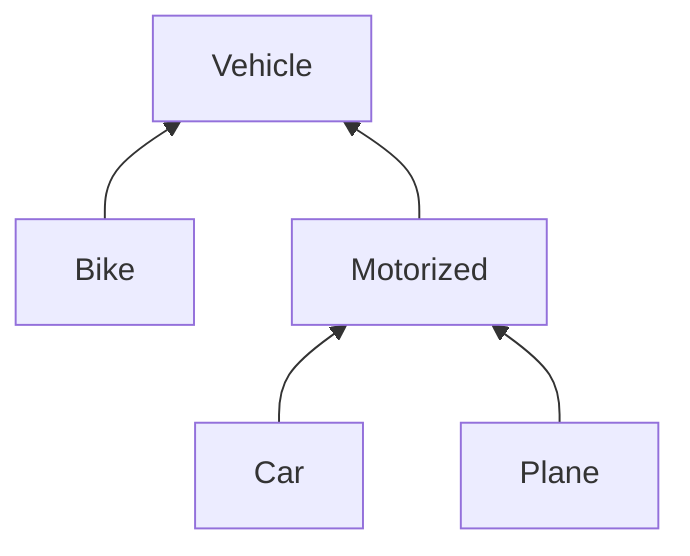
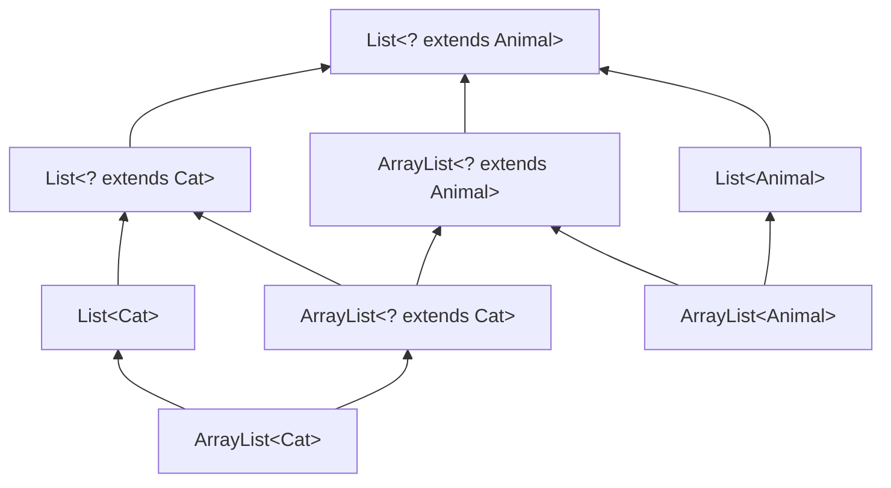

Voor de tests maken we gebruik van [assertJ](https://assertj.github.io/doc).


## Maybe-klasse

1. Schrijf een generische klasse (of record) `Maybe` die een object voorstelt dat nul of één waarde van een bepaald type kan bevatten.
   Dat type wordt bepaald door een generische parameter. Je kan Maybe-objecten enkel aanmaken via de statische methodes `some` en `none`.
   Hieronder vind je twee tests:

```java
@Test
public void maybeWithValue() {
    Maybe<String> maybe = Maybe.some("Yes");
    assertThat(maybe.hasValue()).isTrue();
    assertThat(maybe.getValue()).isEqualTo("Yes");
}

@Test
public void maybeWithoutValue() {
    Maybe<String> maybe = Maybe.none();
    assertThat(maybe.hasValue()).isFalse();
    assertThat(maybe.getValue()).isNull();
}
```

2. Maak de `print`-methode hieronder ook generisch, zodat deze niet enkel werkt voor een `Maybe<String>` maar ook voor andere types dan `String`.

```java
class MaybePrint {
  public static void print(Maybe<String> maybe) {
    if (maybe.hasValue()) {
      System.out.println("Contains a value: " + maybe.getValue());
    } else {
      System.out.println("No value :(");
    }
  }

  public static void main(String[] args) {
    Maybe<String> maybeAString = Maybe.some("yes");
    Maybe<String> maybeAnotherString = Maybe.none();

    print(maybeAString);
    print(maybeAnotherString);
  }
}
```

3. Voeg aan `Maybe` een generische methode `map` toe die een `java.util.function.Function<T, R>`-object als parameter heeft, en die een nieuw Maybe-object teruggeeft, met daarin het resultaat van de functie toegepast op het element als er een element is, of een leeg Maybe-object in het andere geval.
   Zie de tests hieronder voor een voorbeeld van hoe deze map-functie gebruikt wordt:

```java
@Test
public void maybeMapWithValue() {
    Maybe<String> maybe = Maybe.some("Hello");
    Maybe<Integer> result = maybe.map((str) -> str.length());
    assertThat(result.hasValue()).isTrue();
    assertThat(result.getValue()).isEqualTo(5);
}

@Test
public void maybeMapWithValue2() {
    Maybe<String> maybe = Maybe.some("Hello");
    Maybe<String> result = maybe.map((str) -> str + "!");
    assertThat(result.hasValue()).isTrue();
    assertThat(result.getValue()).isEqualTo("Hello!");
}

@Test
public void maybeMapWithoutValue() {
    Maybe<String> maybe = Maybe.none();
    Maybe<Integer> result = maybe.map((str) -> str.length());
    assertThat(result.hasValue()).isFalse();
}
```

4. (optioneel) Herschrijf `Maybe` als een sealed interface met twee record-subklassen `None` en `Some`.
   Geef een voorbeeld van hoe je deze klasse gebruikt met pattern matching.
   Kan je ervoor zorgen dat je getValue() nooit kan oproepen als er geen waarde is (compiler error)?

{}
Java bevat een ingebouwd type gelijkaardig aan de Maybe-klasse uit deze oefening, namelijk `Optional<T>`.
{}


## Repository

Schrijf een generische klasse `Repository` die een repository van objecten voorstelt. De objecten hebben ook een ID. Zowel het type van objecten als het type van de ID moeten generische parameters zijn.

Definieer en implementeer volgende methodes (maak gebruik van een ArrayList):
  - `add(id, obj)`: toevoegen van een object
  - `findById(id)`: opvragen van een object aan de hand van de id
  - `findAll()`: opvragen van alle objecten in de repository
  - `update(id, obj)`: vervangen van een object met gegeven id door het meegegeven object
  - `remove(id)`: verwijderen van een object aan de hand van een id


## SuccessOrFail

Schrijf een generische klasse (of record) `SuccessOrFail` die een object voorstelt dat precies één element bevat.
Dat element heeft 1 van 2 mogelijke types (die types zijn generische parameters).
Het eerste type stelt het type van een succesvol resultaat voor; het tweede type is dat van een fout.
Je kan objecten enkel aanmaken via de statische methodes `success` en `fail`.
Een voorbeeld van tests voor die klasse vind je hieronder:

```java
@Test
public void success() {
    SuccessOrFail<String, Exception> result = SuccessOrFail.success("This is the result");
    assertThat(result.isSuccess()).isTrue();
    assertThat(result.successValue()).isEqualTo("This is the result");
}

@Test
public void failure() {
    SuccessOrFail<String, Exception> result = SuccessOrFail.fail(new IllegalStateException());
    assertThat(result.isSuccess()).isFalse();
    assertThat(result.failValue()).isInstanceOf(IllegalStateException.class);
}
```


## Subtyping: voertuigen

Vetrek van volgende klasse-hiërarchie en zeg van elk van volgende lijnen code of ze toegelaten worden door de Java compiler:



```java
/* 1 */  Motorized myCar = new Car();
/* 2 */  Vehicle yourPlane = new Plane();
/* 3 */  Collection<Vehicle> vehicles = new ArrayList<Vehicle>();
/* 4 */  vehicles.add(myCar);
/* 5 */  List<Car> cars = new ArrayList<Car>();
/* 6 */  List<Vehicle> carsAsVehicles = cars;
```

{}
Alles behalve lijn 6 is toegelaten.
{}

## Covariantie

Maak een schema met de overervingsrelaties tussen

- `List<Cat>`
- `List<? extends Cat>`
- `ArrayList<Cat>`
- `ArrayList<? extends Cat>`
- `List<Animal>`
- `List<? extends Animal>`
- `ArrayList<Animal>`
- `ArrayList<? extends Animal>`

{}

- `ArrayList<Cat>` is een subtype van `List<Cat>` en van `ArrayList<? extends Cat>`.
- `List<Cat>` is een subtype van `List<? extends Cat>`
- `ArrayList<? extends Cat>` is een subtype van `List<? extends Cat>` en van `ArrayList<? extends Animal>`
- `ArrayList<Animal>` is een subtype van `ArrayList<? extends Animal>` en `List<Animal>`
- `List<? extends Cat>`, `ArrayList<? extends Animal>` en `List<Animal>` zijn alledrie subtypes van `List<? extends Animal>`
{}

## Shop

Maak een klasse `Shop` die een winkel voorstelt die items (subklasse van `StockItem`) aankoopt.
Een Shop-object wordt geparametriseerd met het type items dat aangekocht kan worden. We beschouwen hier `Fruit` en `Electronics`; daarmee kunnen we dus een fruitwinkel (`Shop<Fruit>`) en elektronica-winkel (`Shop<Electronics>`) maken.

`Shop` heeft twee methodes:

- `buy`, die een lijst van items toevoegt aan de stock;
- `addStockToInventory`, die de lijst van items in stock toevoegt aan de meegegeven inventaris-lijst.

Voor het fruit maak je een abstracte klasse `Fruit`, en subklassen `Apple` en `Orange`.
Maak daarnaast nog een abstracte klasse `Electronics`, met als subklasse `Smartphone`.

Zorg dat onderstaande code (ongewijzigd) compileert en dat de test slaagt:

```java
@Test
public void testGenerics() {
  Shop<Fruit> fruitShop = new Shop<>();
  Shop<Electronics> electronicsShop = new Shop<>();

  List<Apple> apples = List.of(new Apple(), new Apple());
  List<Fruit> oranges = List.of(new Orange(), new Orange(), new Orange());

  List<Smartphone> phones = List.of(new Smartphone(), new Smartphone());

  fruitShop.buy(apples);
  fruitShop.buy(oranges);

  electronicsShop.buy(phones);

  List<StockItem> inventory = new ArrayList<>();
  fruitShop.addStockToInventory(inventory);
  Assertions.assertThat(inventory).hasSize(5);

  electronicsShop.addStockToInventory(inventory);

  Assertions.assertThat(inventory).hasSize(7);
}
```

## Functie compositie

Java bevat een ingebouwde interface `java.util.function.Function<T, R>`, wat een functie voorstelt met één parameter van type `T`, en een resultaat van type `R`. Deze interface voorziet 1 methode `R apply(T value)` om de functie uit te voeren.

Schrijf nu een generische methode `compose` die twee functie-objecten als parameters heeft, en als resultaat een nieuwe functie teruggeeft die de compositie voorstelt: eerst wordt de eerste functie uitgevoerd, en dan wordt de tweede functie uitgevoerd op het resultaat van de eerste.

Dus: voor functies
```java
Function<A, B> f1 = ...
Function<B, C> f2 = ...
```
moet `compose(f1, f2)` een `Function<A, C>` teruggeven, die als resultaat `f2.apply(f1.apply(a))` teruggeeft.

Pas de PECS-regel toe om ook functies te kunnen samenstellen die niet exact overeenkomen qua type.
Bijvoorbeeld, volgende code moet compileren en de test moet slagen:

```java
interface Ingredient {}
record Fruit() implements Ingredient {}
record PeeledFruit(Fruit fruit) implements Ingredient {}
record Chopped(Ingredient food) implements Ingredient {}

@Test
public void testCompose() {
    Function<Fruit, PeeledFruit> peelFruit = (var fruit) -> new PeeledFruit(fruit);
    Function<Ingredient, Chopped> chopIngredient = (var food) -> new Chopped(food);

    var makeFruitSalad = compose(peelFruit, chopIngredient);

    assertThat(makeFruitSalad.apply(new Fruit())).isEqualTo(new Chopped(new PeeledFruit(new Fruit())));
}
```

## Game engine

{}
Dit is een oud-examenvraag.
{}

Vul de types en generische parameters aan op de 7 genummerde plaatsen zodat onderstaande code en main-methode compileert (behalve de laatste regel van de main-methode) en voldaan is aan volgende voorwaarden:
1.	Elk actie-type kan enkel uitgevoerd worden door een bepaald karakter-type. Bijvoorbeeld: een FightAction kan enkel uitgevoerd worden door een karakter dat CanFight implementeert.
2.	doAction mag enkel opgeroepen worden met een actie die uitgevoerd kan worden door alle karakters in de meegegeven lijst.

Als er op een bepaalde plaats geen type of generische parameter nodig is, vul je $\emptyset$ in.

3. Verklaar je keuze voor de combinatie van (5), (6), en (7).


```java
interface Character {}
interface CanFight extends Character {}
record Warrior() implements CanFight {}
record Knight() implements CanFight {}
record Wizard() implements Character {}
interface Action<___/* 1 */___> {
    void execute(___/* 2 */____ character);
}
class FightAction implements Action<___/* 3 */_____> {
    @Override
    public void execute(___/* 4 */______ character) {
        System.out.println(character + " fights!");
    }
}
class GameEngine {
    public <___/* 5 */______> void doAction(
            List<___/* 6 */____> characters,
            Action<___/* 7 */____> action) {
        for (var character : characters) {
            action.execute(character);
        }
    }
}
public static void main(String[] args) {
    var engine = new GameEngine();
    Action<CanFight> fight = new FightAction();

    List<Warrior> warriors = List.of(new Warrior(), new Warrior());
    engine.doAction(warriors, fight);

    List<Wizard> wizards = List.of(new Wizard());
    engine.doAction(wizards, fight); // deze regel mag NIET compileren
}
```

{}
- 1: `C extends Character` : acties kunnen enkel uitgevoerd worden door subtypes van Character
- 2: `C`: C is het type van Character dat de actie zal uitvoeren
- 3: `CanFight`: FightAction is enkel mogelijk voor characters die `CanFight` implementeren
- 4: `CanFight`: aangezien de generische paremeter `C` van superinterface `Action` geinitialiseerd werd met `CanFight`, moet hier ook `CanFight` gebruikt worden.
- 5: `T extends Character`: we noemen T het type van de objecten in de meegeven lijst; we hebben hier een begrenzing nodig (want we willen enkel subtypes van Character toelaten)
- 6: `T`: lijst van T's, zoals verondersteld in 5
- 7: `? super T`: de meegegeven actie moet een actie zijn die door alle T's uitgevoerd kan worden (dus door T of een van de supertypes van T).
     Redenering met behulp van PECS: de meegegeven actie gebruikt/_consumeert_ het character, dus _super_.

Alternatieve keuze voor 5/6/7:
- 5: `T extends Character`: we noemen T het type dat bij de actie hoort; we hebben hier een begrenzing nodig (want we willen enkel subtypes van Character toelaten)
- 6: `? extends T`: lijst van T's of subtypes ervan.
     Redenering met behulp van PECS: de lijst levert/_produceert_ de characters, dus _extends_.
- 7: `T`: het type van de actie, zoals verondersteld in 5
{}

## Animal food

**Dit is een uitdagende oefening, voor als je je kennis over generics echt wil testen.**

Voeg generics (met grenzen/bounds) toe aan de code hieronder, zodat de code (behalve de laatste regel) compileert,
en de compiler enkel toelaat om kattenvoer te geven aan katten, en hondenvoer aan honden:

```java
public class AnimalFood {
    static class Animal {
        public void eat(Food food) {
            System.out.println(this.getClass().getSimpleName() + " says 'Yummie!'");
        }
    }
    static class Mammal extends Animal {
        public void drink(Milk milk) {
            this.eat(milk);
        }
    }
    static class Cat extends Mammal {}
    static class Kitten extends Cat {}
    static class Dog extends Mammal {}
    static class Food {}
    static class Milk extends Food {}

    static class Main {
        public static void main(String[] args) {
            Food catFood = new Food();
            Milk catMilk = new Milk();
            Food dogFood = new Food();
            Milk dogMilk = new Milk();

            Cat cat = new Cat();
            Dog dog = new Dog();
            Kitten kitten = new Kitten();

            cat.eat(catFood); // OK 👍
            cat.drink(catMilk); // OK 👍
            dog.eat(dogFood); // OK 👍
            dog.drink(dogMilk); // OK 👍
            kitten.eat(catFood); // OK 👍
            kitten.drink(catMilk); // OK 👍

            cat.eat(dogFood); // <- moet een compiler error geven! ❌
            kitten.eat(dogFood); // <- moet een compiler error geven! ❌
            kitten.drink(dogMilk); // <- moet een compiler error geven! ❌
        }
    }
}
```

(Hint: Begin met het type `Food` te parametriseren met een generische parameter die het `Animal`-type voorstelt dat dit voedsel eet.)

## Self-type

**Dit is een uitdagende oefening, voor als je je kennis over generics echt wil testen.**

Heb je je al eens afgevraagd hoe `assertThat(obj)` uit AssertJ werkt?
Afhankelijk van het type van `obj` dat je meegeeft, worden er andere assertions beschikbaar die door de compiler aanvaard worden:

```java
// een List<String>
List<String> someListOfStrings = List.of("hello", "there", "how", "are", "you");
assertThat(someListOfStrings).isNotNull().hasSize(5).containsItem("hello");

// een String
String someString = "hello";
assertThat(someString).isNotNull().isEqualToIgnoringCase("hello");

// een Integer
int someInteger = 4;
assertThat(someInteger).isNotNull().isGreaterThan(4);

assertThat(someInteger).isNotNull().isEqualToIgnoringCase("hello"); // <= compileert niet ❌ 
```

Sommige assertions (zoals `isNotNull`) zijn echter generiek, en wil je slechts op 1 plaats implementeren.
Probeer zelf een `assertThat`-methode te schrijven die werkt zoals bovenstaande,  maar waar `isNotNull` slechts op 1 plaats geïmplementeerd is.
De `assertThat`-methode moet een `Assertion`-object teruggeven, waarop de verschillende methodes gedefinieerd zijn afhankelijk van het type dat meegegeven wordt aan `assertThat`.

- _Hint 1_: maak verschillende klassen, bijvoorbeeld `ListAssertion`, `StringAssertion`, `IntegerAssertion` die de type-specifieke methodes bevatten. Begin met `isNotNull` toe te voegen aan elk van die klassen (dus door de implementatie te kopiëren).

- _Hint 2_: in een zogenaamde 'fluent interface' geeft elke operatie zoals `isNotNull` en `hasSize` het this-object op het einde terug (`return this`), zodat je oproepen na elkaar kan doen. Bijvoorbeeld `.isNotNull().hasSize(5)`.

- _Hint 3_: maak nu een abstracte klasse `GenericAssertion` die `isNotNull` bevat, en waarvan de andere assertions overerven. Verwijder de andere implementaties van `isNotNull`.

- _Hint 4_: In `isNotNull` is geen informatie beschikbaar over het type dat gebruikt moet worden als terugkeertype van `isNotNull`. `assertThat(someString).isNotNull()` moet bijvoorbeeld opnieuw een `StringAssertion` teruggeven. Dat kan je oplossen met generics, en een abstracte methode die het juiste object teruggeeft.

- _Hint 5_: Je zal een zogenaamd 'self-type' moeten gebruiken. Dat is een generische parameter die wijst naar de (sub)klasse zelf.

- _Hint 6_: op [deze pagina](http://web.archive.org/web/20130721224442/http:/passion.forco.de/content/emulating-self-types-using-java-generics-simplify-fluent-api-implementation) wordt uitgelegd hoe AssertJ dit doet. Probeer eerst zelf, zonder dit te lezen!
