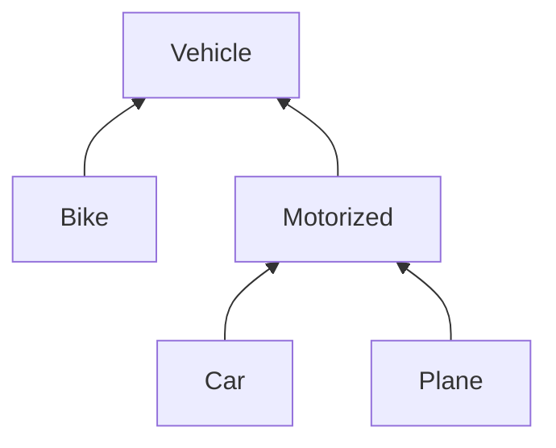

## Oefening: subtyping

Vetrek van volgende klasse-hiërarchie en zeg van elk van volgende lijnen code of ze toegelaten worden door de Java compiler:



```java
/* 1 */  Motorized myCar = new Car();
/* 2 */  Vehicle yourPlane = new Plane();
/* 3 */  Collection<Vehicle> vehicles = new ArrayList<Vehicle>();
/* 4 */  vehicles.add(myCar);
/* 5 */  List<Car> cars = new ArrayList<Car>();
/* 6 */  List<Vehicle> carsAsVehicles = cars;
```