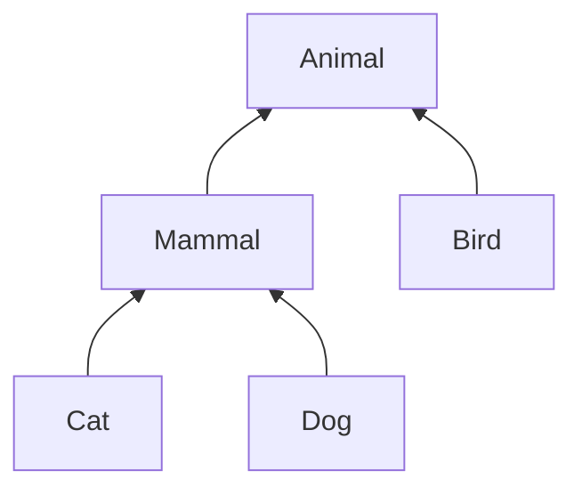
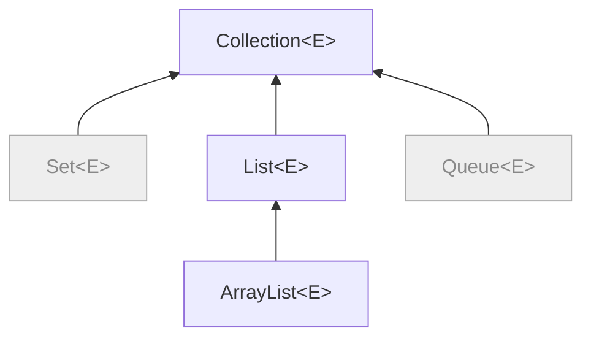
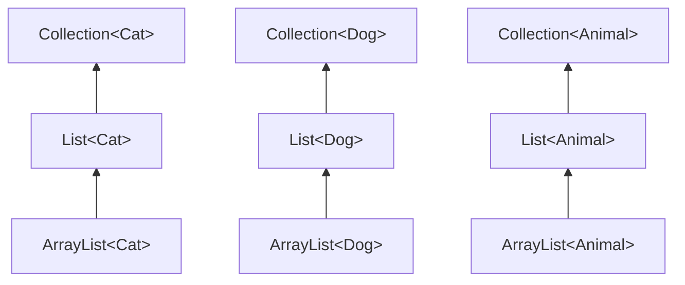
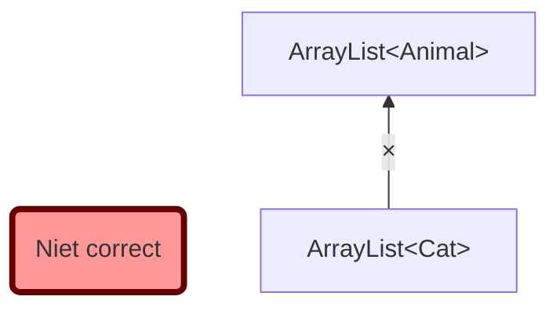

Stel we hebben klassen `Animal`, `Mammal`, `Cat`, `Dog`, en `Bird` met volgende overervingsrelatie:

{}
```java
class Animal { /* ... */ }
class Mammal extends Animal { /* ... */ }
class Cat extends Mammal { /* ... */ }
class Dog extends Mammal { /* ... */ }
class Bird extends Animal { /* ... */ }
```


{}

Een van de basisregels van object-georiënteerd programmeren is dat **overal waar een object van type `X` verwacht wordt, ook een object van een subtype van `X` toegelaten wordt**.
De Java compiler respecteert deze regel uiteraard.
Volgende toekenningen zijn bijvoorbeeld toegelaten:


```java
Animal animal = new Cat();
Mammal mammal = new Dog();
animal = new Bird();
```

maar `mammal = new Bird();` is bijvoorbeeld niet toegelaten, want `Bird` is geen subtype van `Mammal`.

In onderstaande code is de eerste oproep toegelaten (cat heeft type `Cat`, en dat is een subtype van `Mammal`), maar de tweede niet (cat is geen `Dog`) en de derde ook niet (`Cat` is geen subtype van `Bird`):

```java
static void pet(Mammal mammal) { /* ... */ }
static void bark(Dog dog) { /* ... */ }
static void layEgg(Bird bird) { /* ... */ }

Cat cat = new Cat();
pet(cat);    // <- toegelaten (voldoet aan principe)
bark(cat);   // <- niet toegelaten (compiler error) 👍
layEgg(cat); // <- niet toegelaten (compiler error) 👍
```

## Subtyping en generische lijsten

Een lijst in Java is een geordende groep van elementen van hetzelfde type.
`List<E>` is de interface[^interface] die aan de basis ligt van alle lijsten.
`ArrayList<E>` is een klasse die een lijst implementeert met behulp van een array.
`ArrayList<E>` is een subtype van `List<E>`; dus overal waar een `List`-object verwacht wordt, mag ook een `ArrayList` gebruikt worden.
Later (in het hoofdstuk rond Collections) zullen we ook zien dat er een interface `Collection<E>` bestaat, wat een willekeurige groep van elementen voorstelt: niet enkel een lijst, maar bijvoorbeeld ook verzamelingen (`Set`) of wachtrijen (`Queue`).
`List<E>` is een subtype van `Collection<E>`. Bijgevolg (via transitiviteit) is `ArrayList<E>` dus ook subtype van `Collection<E>`.

In code ziet deze situatie er als volgt uit:

{}
```java
interface Collection<E> {
  public void add(E element);
  public int size();
  /* ... */
}

interface List<E> extends Collection<E> {
  public E get(int index);
  /* ... */
}

class ArrayList<E> implements List<E> {
  private E[] elements;
  /* ... */
}

interface Set<E> extends Collection<E> { /* ... */ }
interface Queue<E> extends Collection<E> { /* ... */ }
```


{}

[^interface]: Een interface kan je zien als een abstracte klasse waarvan alle methodes abstract zijn. Het defineert alle methodes die geïmplementeerd moeten worden, maar bevat zelf geen implementatie.

{}

<div>
Volgende code is geldig:

```java
List<Cat> cats = new ArrayList<Cat>();
Collection<Dog> dogs = new ArrayList<Dog>();
List<Animal> animals = new ArrayList<Animal>();
```

maar hetvolgende kan uiteraard niet:

```java
Collection<Dog> dogs = new ArrayList<Cat>(); // compileert niet 👍
```
</div>


{}

Het lijkt intuïtief misschien logisch dat `ArrayList<Cat>` ook een subtype moet zijn van `ArrayList<Animal>`.
Een lijst van katten lijkt tenslotte toch een speciaal geval te zijn van een lijst van dieren?
Maar dat is niet het geval.

{}
```java
ArrayList<Animal> = new ArrayList<Cat>(); // compileert niet
```


{}

Waarom niet?
Stel dat `ArrayList<Cat>` toch een subtype zou zijn van `ArrayList<Animal>`. Dan zou volgende code ook geldig zijn:

```java
ArrayList<Cat> cats = new ArrayList<Cat>();
ArrayList<Animal> animals = cats; // <- dit zou geldig zijn (maar is het niet!)
Dog dog = new Dog();
animals.add(dog); // <- OOPS: er zit nu een hond in de lijst van katten 🙁
```

Je zou dus honden kunnen toevoegen aan je lijst van katten zonder dat de compiler je waarschuwt, en dat is niet gewenst.
Om die reden beschouwt Java `ArrayList<Cat>` dus niet als subtype van `ArrayList<Animal>`, ondanks dat `Cat` wél een subtype van `Animal` is.

{}
Zelfs als klasse `Sub` een subtype is van klasse `Super`, dan is `ArrayList<Sub>` toch **geen** subtype van `ArrayList<Super>`.
{}

Later zullen we zien hoe we hier met [wildcards](wildcards.md) in sommige gevallen wel flexibeler mee kunnen omgaan.

## Overerven van een generisch type

Hierboven gebruikten we vooral `ArrayList` als voorbeeld van een generische klasse.
We hebben echter ook gezien dat je zelf generische klassen kan definiëren, en daarvan kan je uiteraard ook overerven.

Bij de definitie van een subklasse moet je voor de generische parameter van de superklasse een waarde (type) meegeven. Je kan ervoor kiezen om je subklasse zelf generisch te maken (dus een nieuwe generische parameter te introduceren), of om een vooraf bepaald type mee te geven.
Bijvoorbeeld:

```java
class Super<T> { ... }

class SubForAnimal<A extends Animal> extends Super<A> { ... }

class SubForCat extends SubAnimal<Cat> { ... }
```

De superklasse `Super` heeft een generische parameter `T`.
De subklasse `SubForAnimal` definieert zelf een generische parameter `A` (hier met begrenzing), en gebruikt parameter `A` als type voor `T` uit de superklasse.
De klasse `SubForCat` tenslotte definieert zelf geen nieuwe generische parameter, maar geeft het type `Cat` op als type voor parameter `A` uit diens superklasse.