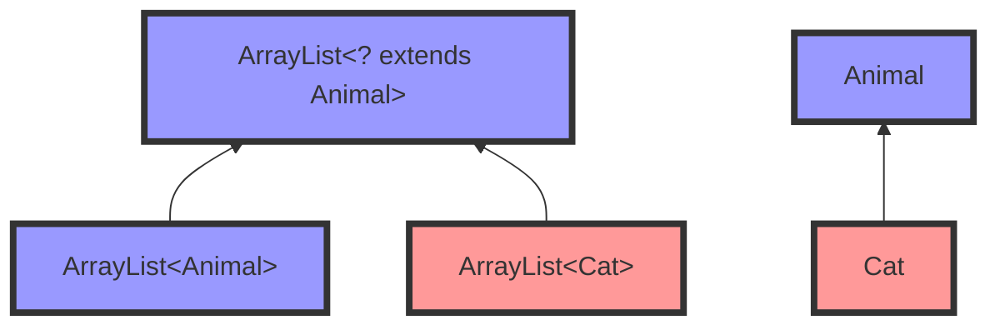
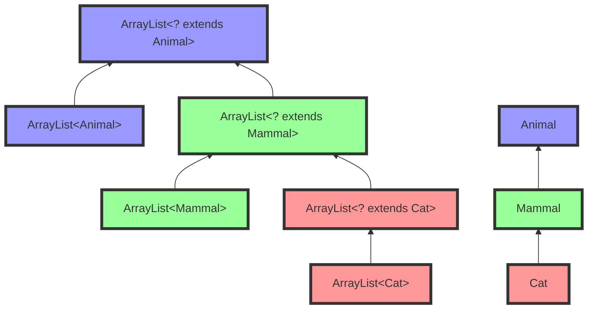
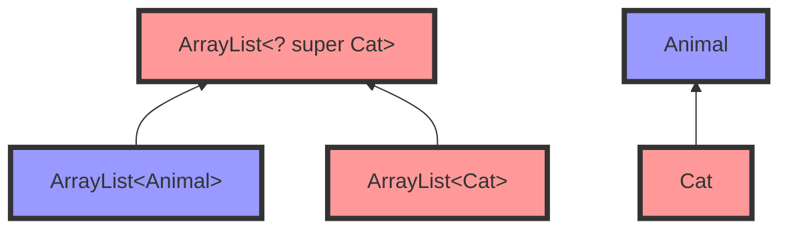
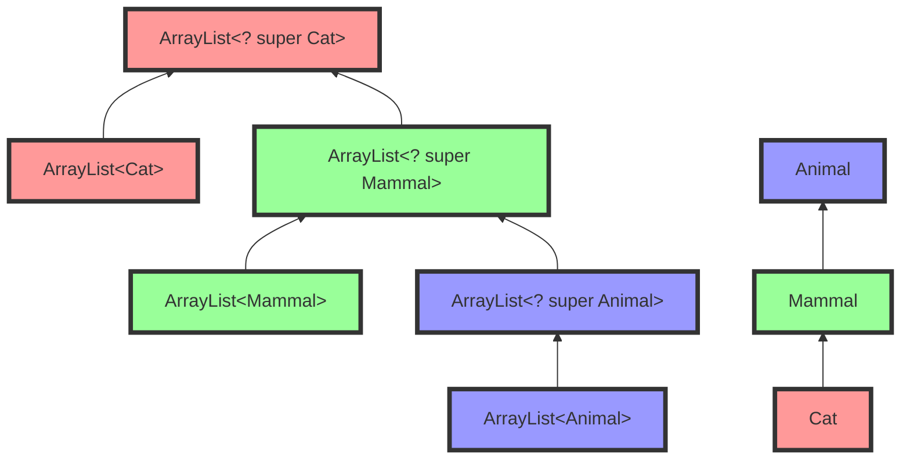
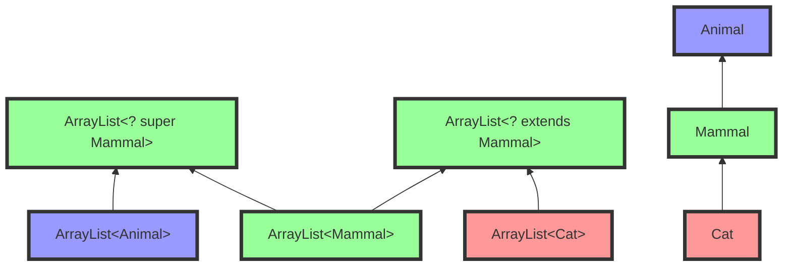

We zagen eerder dat de types `List<Dog>` en `List<Animal>` niets met elkaar te maken hebben, ondanks het feit dat `Dog` een subtype is van `Animal`.
Dat geldt in het algemeen voor generische types. Bijvoorbeeld, in volgende situatie:

```java
class Shelter<T> { }
class AnimalShelter<A extends Animal> extends Shelter<A> { ... }
```

is `AnimalShelter<Dog>` een subtype van `Shelter<Dog>`, om dezelfde reden dat `ArrayList<Dog>` een subtype is van `List<Dog>`.
Volgende toekenning en methode-oproep zijn dus toegelaten:

```java
Shelter<Dog> shelter = new AnimalShelter<Dog>(); // OK! 👍

public void protectDog(Shelter<Dog> s) { ... }
AnimalShelter<Dog> animalShelter = new AnimalShelter<Dog>();
protectDog(animalShelter); // OK! 👍
```

Dat komt omdat `AnimalShelter` een subtype is van `Shelter`, en de generische parameter bij beiden hetzelfde is.

Als de generische parameters verschillend zijn, is er geen overervingsrelatie.
Bijvoorveeld, tussen `AnimalShelter<Cat>` en `Shelter<Animal>` is er geen overervingsrelatie.
Ook is `Shelter<Cat>` geen subtype van `Shelter<Animal>`.
Het volgende is bijgevolg **niet** toegelaten:

```java
Shelter<Animal> s = new AnimalShelter<Cat>(); // NIET toegelaten

public void protectAnimal(Shelter<Animal> s) { ... }
AnimalShelter<Cat> animalShelter = new AnimalShelter<Cat>(); // wel OK!
protectAnimal(animalShelter); // NIET toegelaten
```

In sommige situaties willen we _wel_ zo'n overervingsrelatie kunnen maken.
We bekijken daarvoor twee soorten relaties, namelijk **covariantie** en **contravariantie**.

{}
**Opgelet**: Zowel covariantie als contravariantie gaan enkel over het **gebruik** van generische klassen.
Meer bepaald beïnvloeden ze wanneer twee generische klassen door de compiler als subtype van elkaar beschouwd worden.
Dat staat los van de **definitie** van een generische klasse --- die definities (en bijhorende begrenzing) blijven onveranderd!
{}

## Covariantie (extends)

Wat als we een methode `copyFromTo` willen schrijven die de dieren uit een gegeven (bron-)lijst toevoegt aan een andere (doel-)lijst van dieren? Bijvoorbeeld:

```java
public static void copyFromTo(ArrayList<Animal> source, ArrayList<Animal> target) {
  for (Animal a : source) { target.add(a); }
}

ArrayList<Animal> animals = new ArrayList<>();
ArrayList<Cat> cats = /* ... */
ArrayList<Dog> dogs = /* ... */
/* ... */
copyFromTo(dogs, animals); // niet toegelaten 🙁
copyFromTo(cats, animals); // niet toegelaten 🙁
```

Volgens de regels die we hierboven gezien hebben, kunnen we deze methode niet gebruiken om de dieren uit een lijst van honden (`ArrayList<Dog>`) of katten (`ArrayList<Cat>`) te kopiëren naar een lijst van dieren (`ArrayList<Animal>`).
Maar dat lijkt wel een zinnige operatie.
Een oplossing kan zijn om verschillende versies van de methode te schrijven:

```java
public static void copyFromCatsTo(ArrayList<Cat> source, ArrayList<Animal> target) {
  for (Cat cat : source) { target.add(cat); }
}
public static void copyFromDogsTo(ArrayList<Dog> source, ArrayList<Animal> target) {
  for (Dog dog : source) { target.add(dog); }
}
public static void copyFromBirdsTo(ArrayList<Bird> source, ArrayList<Animal> target) {
  for (Bird bird : source) { target.add(bird); }
}
```

{}
Merk op dat de oproep `target.add(cat)`, alsook die met `dog` en `bird`, toegelaten is, omdat `Cat`, `Dog` en `Bird` subtypes zijn van `Animal`.
{}

Maar dan lopen we opnieuw tegen het probleem van gedupliceerde code aan.
Een eerste oplossing daarvoor is een generische methode, met een generische parameter die begrensd is (`T extends Animal`):

```java
public static <T extends Animal> void copyFromTo_generic(ArrayList<T> source, ArrayList<Animal> target) {
  for (Animal a : source) { target.add(a); }
}
```

Dat werkt, maar de generische parameter `T` wordt slechts eenmaal gebruikt, namelijk bij de parameter `ArrayList<T> source`.
In zo'n situatie kunnen we ook gebruik maken van het **wildcard-type `<? extends X>`**.
We kunnen bovenstaande methode dus ook zonder generische parameter schrijven als volgt:

```java
public static void copyFromTo_wildcard(ArrayList<? extends Animal> source, ArrayList<Animal> target) {
  for (Animal a : source) { target.add(a); }
}
```

Het type `ArrayList<? extends Animal>` staat dus voor _"elke ArrayList waar het element-type een (niet nader bepaald) subtype is van `Animal`"_.
Volgende code is nu toegelaten:

```java
copyFromTo_wildcard(dogs, animals); // OK! 👍
copyFromTo_wildcard(cats, animals); // OK! 👍
```

Dit heet **covariantie**: omdat `Cat` een subtype is van `Animal`, is `ArrayList<Cat>` een subtype van `ArrayList<? extends Animal>`.
De 'co' in covariantie wijst erop dat de overervingsrelatie tussen `Cat` en `Animal` in dezelfde richting loopt als die tussen `ArrayList<Cat>` en `ArrayList<? extends Animal>` (in tegenstelling tot contravariantie, wat zodadelijk aan bod komt).
Dat zie je op de afbeelding hieronder:



Merk op dat `ArrayList<Animal>` ook een subtype is van `ArrayList<? extends Animal>`.

We kunnen ook de relatie met `Mammal` toevoegen:



Tenslotte kan je in Java ook `<?>` schrijven (bijvoorbeeld `ArrayList<?>`); dat is een verkorte notatie voor `ArrayList<? extends Object>`. Je interpreteert `ArrayList<?>` dus als _een lijst van een willekeurig maar niet gekend type_. Merk op dat `ArrayList<?>` dus niet hetzelfde is als `ArrayList<Object>`. Een `ArrayList<Cat>` is een subtype van `ArrayList<?>`, maar niet van `ArrayList<Object>`.

Hou er ook rekening mee dat elk voorkomen van `?` voor een ander type staat (of kan staan). Hetvolgende kan dus niet:

```java
public void copyMammalsFromTo(
      ArrayList<? extends Mammal> source,
      ArrayList<? extends Mammal> target) {
  for (Mammal m : source) { target.add(m); } // compileert niet! 🙁
}
```

omdat de eerste `ArrayList<? extends Mammal>` (`source`) bijvoorbeeld een `ArrayList<Cat>` kan zijn, en de tweede (`target`) een `ArrayList<Dog>`. Als je de types van beide parameters wil linken aan elkaar, moet je een generische methode gebruiken (zoals eerder gezien):

```java
public <T extends Mammal> void copyMammalsFromTo(
    ArrayList<T> source,
    ArrayList<T> target) {
  for (Mammal m : source) { target.add(m); } // OK! 👍
}
```

Onderstaande code is ook ongeldig. Waarom?

```java
ArrayList<?> lijst = new ArrayList<String>();
lijst.add("Hello");
```

> [!tip]- Antwoord
> De `lijst`-variabele is gedeclareerd als een ArrayList van een ongekend type. Op basis van het type van de variabele kan de compiler niet afleiden dat er  Strings toegevoegd mogen worden aan de lijst (het zou evengoed een ArrayList van Animals kunnen zijn).
> Het feit dat `lijst` geinititialiseerd wordt met `<String>` doet hier niet terzake; enkel het type van de declaratie is van belang.


## Contravariantie (super)

Wat als we een methode willen die de objecten uit een gegeven lijst van katten kopieert naar een lijst van willekeurige dieren? Bijvoorbeeld:

```java
public static void copyFromCatsTo(
      ArrayList<Cat> source,
      ArrayList<Animal> target) {
  for (Cat cat : source) { target.add(cat); }
}

ArrayList<Cat> cats = /* ... */

ArrayList<Cat> otherCats = new ArrayList<>();
ArrayList<Mammal> mammals = new ArrayList<>();
ArrayList<Animal> animals = new ArrayList<>();

copyFromTo(cats, otherCats); // niet toegelaten 🙁
copyFromTo(cats, mammals);   // niet toegelaten 🙁
copyFromTo(cats, animals);   // OK 👍
```

De eerste twee `copyFromTo`-regels zijn niet toegelaten, maar zouden opnieuw erg nuttig kunnen zijn.
Co-variantie met extends helpt ook niet (target zou dan immers ook een `ArrayList<Dog>` kunnen zijn):

```java
public static void copyFromCatsTo(
      ArrayList<Cat> source,
      ArrayList<? extends Animal> target) {
  for (Cat cat : source) { target.add(cat); } // ook niet toegelaten 🙁
}
```

En aparte methodes schrijven leidt opnieuw tot code-duplicatie:

```java
public static void copyFromCatsToCats(ArrayList<Cat> source, ArrayList<Cat> target) {
  for (Cat cat : source) { target.add(a); }
}
public static void copyFromCatsToMammals(ArrayList<Cat> source, ArrayList<Mammal> target) {
  for (Cat cat : source) { target.add(a); }
}
public static void copyFromCatsToAnimals(ArrayList<Cat> source, ArrayList<Animal> target) {
  for (Cat cat : source) { target.add(a); }
}
```

{}
Zou het nuttig zijn om een methode `copyFromCatsToBirds(ArrayList<Cat> source, ArrayList<Bird> target)` te voorzien? Waarom (niet)?
{}

De oplossing in dit geval is gebruik maken van het **wildcard-type `<? super T>`**.
Het type `ArrayList<? super Cat>` staat dus voor _"elke ArrayList waar het element-type een supertype is van `Cat`"_ (inclusief het type `Cat` zelf).
We kunnen dus schrijven:

```java
public static void copyFromCatsTo_wildcard(ArrayList<Cat> source, ArrayList<? super Cat> target) {
  for (Cat cat : source) { target.add(a); }
}
```

en kunnen nu hetvolgende uitvoeren:

```java
copyFromCatsTo_wildcard(cats, otherCats); // OK 👍
copyFromCatsTo_wildcard(cats, mammals);   // OK 👍
copyFromCatsTo_wildcard(cats, animals);   // OK 👍
```

Dit heet **contravariantie**: hoewel `Cat` een **subtype** is van `Animal`, is `ArrayList<? super Cat>` een **supertype** van`ArrayList<Animal>`.
De 'contra' in contravariantie wijst erop dat de overervingsrelatie tussen `Cat` en `Animal` in de omgekeerde richting loopt als die tussen `ArrayList<? super Cat>` en `ArrayList<Animal>`.
Bekijk volgende figuur aandachtig:



Als we ook `ArrayList<Mammal>`, `ArrayList<? super Mammal>`, en `ArrayList<? super Animal>` toevoegen aan het plaatje, ziet dat er als volgt uit:



Aan de hand van de kleuren kan je snel zien dat de overervingsrelatie omgekeerd verloopt.

## Covariantie of contravariantie: PECS

Als we covariantie en contravariantie combineren, krijgen we volgend beeld (we focussen op de extends- en super-relatie vanaf `Mammal`):



Hier zien we dat `ArrayList<? extends Mammal>` (covariant) als subtypes `ArrayList<Mammal>` en `ArrayList<Cat>` heeft.
Het contravariante `ArrayList<? super Mammal>` heeft óók `ArrayList<Mammal>` als subtype, maar ook `ArrayList<Animal>`.

Hoe weet je nu wanneer je wat gebruikt als type voor een parameter? Wanneer kies je `<? extends T>`, en wanneer `<? super T>`?
Een goede vuistregel is het acroniem **PECS**, wat staat voor **P**roducer **E**xtends, **C**onsumer **S**uper.
Dus:

- Wanneer het object gebruikt wordt als een producent van `T`'s (met andere woorden, het object is een levancier van `T`-objecten voor jouw code, die ze vervolgens gebruikt), gebruik je `<? extends T>`. Dat is logisch: als jouw code met aangeleverde `T`'s omkan, dan kan jouw code ook om met de aanlevering van een subklasse van `T` (basisprincipe objectgeoriënteerd programmeren).
- Wanneer het object gebruikt wordt als een consument van `T`'s (met andere woorden, het neemt `T`-objecten aan van jouw code), gebruik je `<? super T>`. Ook dat is logisch: een object dat beweert om te kunnen met elke superklasse van `T` kan zeker overweg met een `T` die jouw code aanlevert.
- Wanneer het object zowel als consument als als producent gebruikt wordt, gebruik je gewoon `<T>` (dus geen co- of contra-variantie). Er is dan weinig tot geen flexibiliteit meer in het type.

Een voorbeeld om PECS toe te passen: we willen een methode `copyFromTo` die zo flexibel mogelijk is, om elementen uit een lijst van zoogdieren te kopiëren naar een andere lijst.

```java
void copyMammalsFromTo(
    ??? source,
    ??? target) {
  for (Mammal m : source) {
    target.add(m);
  }
}
```

De `source`-lijst is de **producent**: daaruit halen we Mammal-objecten op. Daar gebruiken we dus **extends**:

```java
void copyMammalsFromTo(
    List<? extends Mammal> source,
    ??? target) {
  for (Mammal m : source) {
    target.add(m);
  }
}
```

De `target`-lijst is de **consument**: daar sturen we Mammal-objecten naartoe. Daar gebruiken we dus **super**:

```java
void copyMammalsFromTo(
    List<? extends Mammal> source,
    List<? super Mammal> target) {
  for (Mammal m : source) {
    target.add(m);
  }
}
```

Met deze methode kunnen we nu alle zinvolle operaties uitvoeren, terwijl de zinloze operaties tegengehouden worden door de compiler:

```java
ArrayList<Cat> cats = /* ... */
ArrayList<Dog> dogs = /* ... */
ArrayList<Bird> birds = /* ... */
ArrayList<Mammal> mammals = /* ... */
ArrayList<Animal> animals = /* ... */

copyMammalsFromTo(cats, animals); // OK 👍
copyMammalsFromTo(cats, mammals); // OK 👍
copyMammalsFromTo(cats, cats); // OK 👍

copyMammalsFromTo(mammals, animals); // OK 👍

copyMammalsFromTo(cats, dogs);
// compiler error (Dog is geen supertype van Mammal) 👍

copyMammalsFromTo(birds, animals);
// compiler error (Bird is geen subtype van Mammal) 👍
```

Merk op dat het type Mammal in onze laatste versie van `copyMammalsFromTo` hierboven eigenlijk onnodig is. We kunnen de methode nog verder veralgemenen door er een generische methode van te maken, die werkt voor alle lijsten:

```java
<T> void copyFromTo(
    List<? extends T> source,
    List<? super T> target) {
  for (T element : source) {
    target.add(element);
  }
}
```

Met deze versie kunnen we nu bijvoorbeeld ook Birds kopiëren naar een lijst van dieren:

```java
copyFromTo(birds, animals); // OK 👍
```

## Arrays en type erasure

In tegenstelling tot ArrayLists (en andere generische types), beschouwt Java arrays wel altijd als co-variant.
Dat betekent dat `Cat[]` een subtype is van `Animal[]`.
Volgende code compileert dus (maar gooit een uitzondering bij het uitvoeren):

```java
Animal[] cats = new Cat[2];
cats[0] = new Dog(); // compileert, maar faalt tijdens het uitvoeren
```

De reden hiervoor is, in het kort, dat informatie over generics gewist wordt bij het compileren van de code.
Dit heet **type erasure**.
In de gecompileerde code is een `ArrayList<Animal>` en `ArrayList<Cat>` dus exact hetzelfde.
Er kan dus, tijdens de uitvoering, niet gecontroleerd worden of je steeds het juiste type gebruikt.
Dat moet de compiler dus doen, en die moet het zekere voor het onzekere nemen.

Bij arrays wordt er _wel_ type-informatie bijgehouden na het compileren, en kan dus gecontroleerd worden dat je geen ongeldig getypeerde elementen toevoegt. De compiler hoeft het niet af te dwingen --- maar het wordt wel nog steeds gecontroleerd tijdens de uitvoering, en kan leiden tot een exception.

## Aandachtspunten

### Enkel bij generische types!

Tenslotte nog een opmerking.
Co- en contra-variantie (extends, super, en wildcards dus) zijn enkel van toepassing op **generische** types.
Alles wat we hierboven gezien hebben is dus enkel nuttig op plaatsen waar je een generisch type (`List<T>`, `Food<T>`, ...) gebruikt voor een parameter, terugkeertype, variabele, ....
Dergelijke types kan je met behulp van co-/contra-variantie en wildcards verrijken tot bijvoorbeeld `List<? extends T>`, `Food<? super T>`, ...
Maar je kan deze constructies niet gebruiken op plaatsen waar een gewoon type verwacht wordt, bijvoorbeeld bij een parameter of terugkeertype.
Onderstaande regels code zijn dus allemaal **ongeldig**:

```java
public void pet(? extends Mammal mammal) { ... } // ONGELDIG! ❌
public void pet(<? extends Mammal> mammal) { ... } // ONGELDIG! ❌
public void pet(<? super Cat> mammal) { ... } // ONGELDIG! ❌
```

Schrijf in dat geval gewoon

```java
public void pet(Mammal mammal) { ... }
```

Deze methode kan óók al opgeroepen worden met een `Cat`-object, `Dog`-object, of elk ander type `Mammal` als argument.
Je hebt hier geen co- of contra-variantie van generische types nodig; je maakt gewoon gebruik van overerving uit objectgeoriënteerd programmeren.

### Bounds vs. co-/contravariantie en wildcards

Tot slot is het nuttig om nog eens te benadrukken dat er een verschil is tussen het begrenzen van een generische parameter (met `extends`) enerzijds, en het gebruik van co-variantie, contra-variantie en wildcards (`? extends T`, `? super T`) anderzijds. Het feit dat `extends` in beide gevallen gebruikt wordt, kan misschien tot wat verwarring leiden.

Een begrenzing (via `<T extends SomeClass>`) **beperkt** welke types geldige waarden zijn voor de type-parameter `T`. Dus: elke keer wanneer je een concreet type wil meegeven in de plaats van `T` moet dat type voldoen aan bepaalde eisen.
Je kan zo'n begrenzing enkel aangeven op de plaats waar je een nieuwe generische parameter (`T`) introduceert (dus bij een nieuwe klasse-definitie of methode-definitie).
Bijvoorbeeld: `class Food<T extends Animal>` laat later enkel toe om `Food<X>` te schrijven als type wanneer `X` ook een subtype is van `Animal`.

Door **co- en contra-variantie** (met `<? extends X>` en `<? super X>`) te gebruiken **verbreed** je de toegelaten types.
Een methode-parameter met als type `Food<? extends Animal>` laat een `Food<Animal>` toe als argument, maar ook een `Food<Cat>` of `Food<Dog>`.
Omgekeerd zal een parameter met als type `Food<? super Cat>` een `Food<Cat>` toelaten, maar ook een `Food<Animal>`.
Er wordt in beide gevallen dus meer toegelaten, wat meer flexibiliteit biedt.

Je kan co- en contravariantie toepassen op elke plaats waar je een generisch type gebruikt (en waar dat gepast is volgens de PECS regels).
Het kan dus perfect zijn dat je de ene keer in je code eens `Food<Cat>` gebruikt, ergens anders `Food<? extends Cat>`, en nog ergens anders `Food<? super Cat>`.
Bij begrenzing is dat niet zo; dat legt de grenzen eenmalig vast, en die moeten overal gerespecteerd worden waar het generisch type gebruikt wordt.

