{}
De concepten in andere programmeertalen die het dichtst aanleunen bij Java collections zijn
- de Standard Template Library (STL) in C++
- enkele ingebouwde types, alsook de `collections` module in Python
- de collecties in `System.Collections.Generic` in C#
{}

Totnogtoe hebben we enkel gewerkt met een Java array (vaste grootte), en met `ArrayList` (kan groter of kleiner worden).
In dit hoofdstuk kijken we in meer detail naar ArrayList, en behandelen we ook verschillende andere collectie-types in Java.
De meeste van die types vind je ook (soms onder een andere naam) terug in andere programmeertalen.

Je kan je afvragen waarom we andere collectie-types nodig hebben; uiteindelijk kan je (met genoeg werk) alles toch implementeren met een ArrayList? Dat klopt, maar de collectie-types verschillen in welke operaties snel zijn, en welke meer tijd vragen. Om dat wat preciezer te maken, kijken we eerst even naar de notie van **tijdscomplexiteit**.

{}

## Tijdscomplexiteit

Tijdscomplexiteit is een begrip dat gebruikt wordt bij de analyse van algoritmes.
Met tijdscomplexiteit wordt gekwantificeerd hoe snel een algoritme zijn invoer verwerkt.
Het is dus een eigenschap van een (implementatie van een) algoritme, naast bijvoorbeeld de correctheid en leesbaarheid van dat algoritme.

In tegenstelling tot wat je misschien zou denken, wordt er bij tijdscomplexiteit niet gekeken naar de tijd (in seconden).
In plaats daarvan wordt het totale aantal operaties dat uitgevoerd wordt geteld.
Daarenboven worden niet alle operaties geteld; er wordt een keuze gemaakt voor een verzameling **basisoperaties**.
Het voordeel hiervan is dat, in tegenstelling tot de reële tijd, het aantal operaties niet afhankelijk is van de snelheid van de processor.
Bijvoorbeeld, bij sorteeralgoritmes wordt soms de vergelijking tussen twee elementen als (enige) basisoperatie gebruikt, of soms elke operatie die een element uit de te sorteren rij opvraagt of aanpast.
Het totale aantal uitgevoerde basisoperaties is dan (bij benadering) een maat voor de uitvoeringstijd van het algoritme, aangezien elke basisoperatie een bepaalde reële uitvoeringstijd heeft op een machine.

Voor de meeste algoritmes zal een grotere invoer leiden tot meer uit te voeren operaties (denk aan een lus die vaker herhaald wordt).
Grotere invoer leidt dus tot meer operaties, en daardoor tot een langere uitvoeringstijd.
Zo is het bijvoorbeeld niet meer dan logisch dat een hele lange lijst sorteren langer duurt dan een heel korte lijst sorteren.
De grootte van de invoer wordt met \\(n\\) aangeduid; de tijdscomplexiteit van het algoritme in functie van de invoergrootte met de functie \\(T(n)\\).

We maken bij tijdscomplexiteit onderscheid tussen:

- **Best case**: een invoer (van een bepaalde grootte \\( n \\)) die leidt tot de best mogelijke (kortste) uitvoeringstijd. Bijvoorbeeld, sommige sorteeralgoritmes doen minder werk (en zijn dus snel klaar) als de lijst al gesorteerd blijkt te zijn.
- **Worst case**: een invoer (van een bepaalde grootte \\( n \\)) die leidt tot de slechtst mogelijke (langste) uitvoeringstijd. Bijvoorbeeld, sommige sorteeralgoritmes hebben erg veel last met een omgekeerd gesorteerde lijst: ze moeten dan heel veel operaties uitvoeren om de lijst gesorteerd te krijgen.
- **Average case**: een invoer (van een bepaalde grootte \\( n \\)) waarover we niets weten en geen veronderstellingen kunnen of willen maken. Bijvoorbeeld, voor sorteeralgoritmes kan dit een willekeurige volgorde (permutatie) van de elementen zijn, zonder speciale structuur. De uitvoeringstijd in de average case zal ergens tussen die van de worst case en best case liggen.

Worst- en best-case zijn in veel gevallen redelijk eenvoudig te bepalen. De average case wordt vaak complexer.

Belangrijk om te onthouden is dat worst/best/average case dus **niet** gaan over een kleinere of grotere invoer, maar wel over **hoe** die invoer eruit ziet of gestructureerd is.
Bijvoorbeeld, de best case voor een sorteeralgoritme is **niet** een lege lijst. Hoewel er in dat geval amper operaties uitgevoerd moeten worden, zegt dat niet veel: het is immers niet meer dan logisch dat een kleinere invoer ook minder tijd vraagt.
Wat we wel willen weten is bijvoorbeeld _wélke_ lijst (van alle mogelijke lijsten van lengte \\(n=1000\\), bijvoorbeeld) het langst duurt om te sorteren met dat bepaald algoritme.

### Voorbeeld: selection sort

Hieronder vind je een voorbeeld-implementatie van selection sort, een eenvoudig sorteeralgoritme.
In elke iteratie van de lus wordt het reeds gesorteerde deel van de lijst (dat is het deel vóór index `startUnsorted`) uitgebreid met 1 element, namelijk het kleinste nog niet gesorteerde element. Dat element wordt gezocht met de hulpfunctie `indexOfSmallest`, dewelke de index van het kleinste element in de lijst teruggeeft vanaf een bepaalde index `start`.
Dat kleinste element wordt vervolgens omgewisseld met het element op plaats `startUnsorted`.
Dat zoeken en omwisselen blijven we doen tot de hele lijst gesorteerd is.

Bijvoorbeeld, in de vierde iteratie van de lus ziet de situatie er als volgt uit net voordat de `swap`-operatie uitgevoerd wordt:

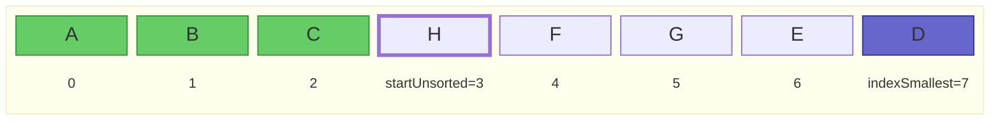

En in de vijfde iteratie als volgt:

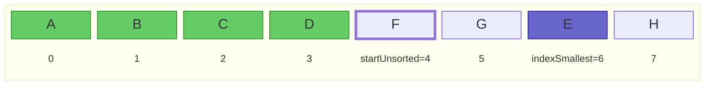

```java
public static <E extends Comparable<E>> void selectionSort(ArrayList<E> list) {
    for (int startUnsorted = 0; startUnsorted < list.size(); startUnsorted++) {
        int indexSmallest = indexOfSmallest(list, startUnsorted);
        Collections.swap(list, startUnsorted, indexSmallest);
    }
}
private static <E extends Comparable<E>> int indexOfSmallest(List<E> list, int start) {
    if (start >= list.size()) return -1;
    int indexSmallestSoFar = start;
    E smallestSoFar = list.get(start);
    for (int i = start+1; i < list.size(); i++) {
        E candidate = list.get(i);
        if (candidate.compareTo(smallestSoFar) < 0) {
            indexSmallestSoFar = i;
            smallestSoFar = candidate;
        }
    }
    return indexSmallestSoFar;
}
```

{}
Merk op hoe de functie het generische type `<E extends Comparable<E>>` gebruikt.
Dat legt op dat de elementen (aangeduid met generische type `E`) bovendien de interface `Comparable<E>` moeten implementeren, waardoor ze met elkaar vergeleken kunnen worden via de `compareTo`-methode (gebruikt in `indexOfSmallest`).
Ingebouwde Java-klassen zoals String, Integer, etc. implementeren `Comparable`, waardoor deze methode gebruikt kan worden om lijsten van Strings te sorteren.
Als je deze methode wil gebruiken om objecten van je eigen klasse (bijvoorbeeld `Person`) te sorteren, zal je Person-klasse ook de interface Comparable moeten implementeren om aan te geven hoe personen met elkaar vergeleken moeten worden.
{}

### Basisoperaties tellen

Afhankelijk van het type algoritme kunnen we verschillende operaties als basisoperatie kiezen.
Als we voor selection sort als enige basisoperatie de methode `compareTo` nemen, dan zal voor een lijst van lengte \\(n\\):

- tijdens de eerste iteratie het element op index 0 vergeleken worden met alle volgende \\(n-1\\) elementen;
- tijdens de tweede iteratie het element op index 1 vergeleken worden met alle volgende \\(n-2\\) elementen;
- etc.
- tijdens iteratie \\(n-1\\) het element op index \\(n-2\\) vergeleken worden met het laatste element;
- tijdens iteratie \\(n\\) het element op index \\(n-1\\) met geen enkel element vergeleken worden.

Er gebeuren in totaal dus
$$ T(n) = (n-1) + (n-2) + \ldots + 1 + 0 = \frac{n(n-1)}{2} = \frac{n^2}{2} - \frac{n}{2}$$ vergelijkingen van elementen via `compareTo`.

Daaruit kunnen we ook afleiden dat, als we de invoer 10 keer groter maken, we
$$ \frac{T(10n)}{T(n)} = \frac{(10n)^2/2-10n/2}{n^2/2-n/2} = 100 + 90/(n-1) $$
keer zoveel operaties uitvoeren. Als \\( n \\) voldoende groot is, zal de lijst 10 keer langer maken dus neerkomen op ongeveer 100 keer zoveel werk, en zal selection sort dus 100 keer trager zijn.

In de rest van dit hoofdstuk over datastructuren gaan we verder voornamelijk werken met één specifieke basisoperatie, namelijk het aantal keer dat een element uit het geheugen (of uit een array) bezocht (uitgelezen) worden.

### Grote O-notatie

We kunnen het aantal basisoperaties exact berekenen, zoals hierboven voor selection sort.
Dat is echter veel werk, en vaak hebben we dergelijke precisie niet nodig.
Voor tijdscomplexiteit wordt er daarom veelal gebruik gemaakt van **grote O**-notatie.
Dat is, informeel gezegd, de snelst stijgende term, zonder constanten.
In het voorbeeld van selection sort hierboven is de snelst stijgende term van \\( T(n) \\) de kwadratische term. We noteren dat als
\\( T(n) \in \mathcal{O}(n^2) \\)
of soms gewoon
\\( T(n) = \mathcal{O}(n^2) \\)

Formeel betekent \\( T(n) \in \mathcal{O}(f(n)) \\) dat \\( \exists c, n_0.\ \forall n > n_0.\ T(n)/f(n) \leq c \\). Met andere woorden, zodra \\( n \\) groot genoeg is (groter dan een bepaalde \\(n_0\\)), is de verhouding \\(T(n)/f(n)\\) begrensd door een constante, wat uitdrukt dat \\(T(n)\\) niet sneller stijgt dan \\(f(n)\\).

\\( \mathcal{O}(n^2) \\) is de **complexiteitsklasse** (de verzameling van alle functies die niet sneller dan kwadratisch stijgen), en we zeggen dat selection sort een **kwadratische tijdscomplexiteit** heeft.

{}
Er zijn nog andere notaties die vaak gebruikt worden in de context van tijdscomplexiteit, waaronder grote theta (\\( \Theta \\)), grote omega (\\( \Omega \\)), en tilde (~). Deze hebben allen een andere formele definitie.
In de dagelijkse (informele) praktijk wordt vaak grote O gebruikt, zelfs als eigenlijk een van deze andere bedoeld wordt.
{}

### Vaak voorkomende complexiteitsklassen

Hieronder vind je een tabel met vaak voorkomende complexiteitsklassen.
In de laatste kolom vind je de tijd die zo'n algoritme doet over een invoer van grootte \\(n=1000\\), in de veronderstelling dat het een probleem van grootte \\(n=100\\) kan oplossen in 1 milliseconde.

| Klasse                        | Naam          | \\( T(1000) \\) (als \\( T(100) = 1 \textrm{ms} \\))                                 |
| ----------------------------- | ------------- | ------------------------------------------------------------------------------------ |
| \\( \mathcal{O}(1) \\)        | Constant      | \\(1\ \textrm{ms} \\)                                                                |
| \\( \mathcal{O}(\log n) \\)   | Logaritmisch  | \\(1.5\ \textrm{ms} \\)                                                              |
| \\( \mathcal{O}(n) \\)        | Lineair       | \\(10\ \textrm{ms} \\)                                                               |
| \\( \mathcal{O}(n \log n) \\) | Linearitmisch | \\(15\ \textrm{ms} \\)                                                               |
| \\( \mathcal{O}(n^2) \\)      | Kwadratisch   | \\(100\ \textrm{ms} \\)                                                              |
| \\( \mathcal{O}(n^3) \\)      | Kubisch       | \\(1000\ \textrm{ms} \\)                                                             |
| \\( \mathcal{O}(2^n) \\)      | Exponentieel  | \\( 2^{900}\ \textrm{ms} \\) = \\( 2.7 \times 10^{260}\ \textrm{jaar}\\)             |
| \\( \mathcal{O}(n!) \\)       | Factorieel    | \\( \frac{1000!}{100!}\ \textrm{ms} \\) = \\( 1.4 \times 10^{2399}\ \textrm{jaar}\\) |

Je ziet dat de constante tot en met linearitmische complexiteitsklassen zeer gunstig zijn.
Kwadratisch en kubisch zijn te vermijden, omdat de tijd veel sneller toeneemt dan de grootte van de invoer.
Exponentiële en factoriële algoritmes tenslotte zijn dramatisch en schalen bijzonder slecht naar grotere problemen.
Backtracking-algoritmes (zie later) vallen vaak in deze laatste klassen, en kunnen dus zeer inefficiënt zijn voor grotere problemen.

We zullen deze tijdscomplexiteitsklassen gebruiken om (operaties op) datastructuren te vergelijken.

## De Collection API

We kunnen nu de Java Collections-API verkennen.
Deze API bestaat uit

- interfaces (bv. `Iterable`, `Collection`, `List`, `Set`, `SortedSet`, `Queue`, `Deque`, `Map`, `SortedMap`, en `NavigableMap`)
- implementaties van die interface (bv. `ArrayList`, `LinkedList`, `Vector`, `Stack`, `ArrayDeque`, `PriorityQueue`, `HashSet`, `LinkedHashSet`, `TreeSet`, en `TreeMap`)
- algoritmes voor veel voorkomende operaties (bv. `shuffle`, `sort`, `swap`, `reverse`, ...)

Je vindt een overzicht van de hele API op [deze pagina](https://docs.oracle.com/en/java/javase/21/docs/api/java.base/java/util/doc-files/coll-reference.html).

We beginnen bij de basisinterface: `Iterable`.

## Iterable en Iterator

[`Iterable`](https://docs.oracle.com/en/java/javase/21/docs/api/java.base/java/lang/Iterable.html) maakt eigenlijk geen deel uit van de Java Collections API, maar is er wel sterk aan verwant.
Een `Iterable` is namelijk een object dat meerdere objecten van hetzelfde type één voor één kan teruggeven.
Er moet slechts 1 methode geïmplementeerd worden, namelijk `iterator()`, die een `Iterator`-object teruggeeft.

Een [`Iterator`](https://docs.oracle.com/en/java/javase/21/docs/api/java.base/java/util/Iterator.html) is een object met twee methodes:

- `hasNext()`, wat aangeeft of er nog objecten zijn om terug te geven, en
- `next()`, wat (als er nog objecten zijn) het volgende object teruggeeft.

Elke keer je `next()` oproept krijg je dus een ander object, tot `hasNext()` false teruggeeft. Vanaf dan krijg je een exception (`NoSuchElementException`).
Een `Iterator` moet dus een toestand bijhouden, om te bepalen welke objecten al teruggegeven zijn en welke nog niet.
Eens alle elementen teruggegeven zijn, en hasNext dus false teruggeeft, is de iterator 'opgebruikt'.
Als je daarna nog eens over de elementen wil itereren, moet je een nieuwe iterator aanmaken.

Elke klasse die `Iterable` implementeert, kan gebruikt worden in een 'enhanced for-statement':

```java
Iterable<E> iterable = ...
for (var element : iterable) {
  ... // code die element gebruikt
}
```

Achter de schermen wordt hierbij de iterator gebruikt. Het enhanced for-statement van hierboven is equivalent aan:

```java
Iterable<E> iterable = ...
Iterator<E> iterator = iterable.iterator();
while (iterator.hasNext()) {
  E element = iterator.next();
  ... // code die element gebruikt
}
```

Alle collectie-types die een verzameling elementen voorstellen (dus alles behalve `Map`), implementeren deze interface.
Dat betekent dus dat je elk van die collecties in een enhanced for-lus kan gebruiken.
Je kan daarenboven ook zelf een nieuwe klasse maken die deze interface implementeert, en die vervolgens gebruikt kan worden in een enhanced for-loop.
Dat doen we in volgende oefening.

### Oefening: IntRange

1. Schrijf eerst een klasse `IntRangeIterator` die `Iterator<Integer>` implementeert, en alle getallen teruggeeft tussen twee grensgetallen `lowest` en `highest` die je meegeeft aan de constructor. Je houdt hiervoor enkel de onder- en bovengrens bij, alsook het volgende terug te geven getal.
2. Schrijf nu ook een record `IntRange` die `Iterable<Integer>` implementeert, en die een `IntRangeIterator`-object aanmaakt en teruggeeft.
   Je moet deze klasse nu als volgt kunnen gebruiken:

```java
IntRange range = new IntRange(3, 6);
for (int x : range) {
  System.out.println(x);
}
// Uitvoer:
// 3
// 4
// 5
// 6

```

{}
Java laat niet toe om primitieve types als generische parameters te gebruiken.
Voor elk primitief type bestaat er een wrapper-klasse, bijvoorbeeld `Integer` voor `int`.
Daarom gebruiken we hierboven bijvoorbeeld `Iterator<Integer>` in plaats van `Iterator<int>`.
Achter de schermen worden `int`-waarden automatisch omgezet in `Integer`-objecten en omgekeerd.
Dat heet [auto-boxing en -unboxing](https://docs.oracle.com/javase/tutorial/java/data/autoboxing.html).
Je kan beide types in je code grotendeels door elkaar gebruiken zonder problemen.
{}

## Collection

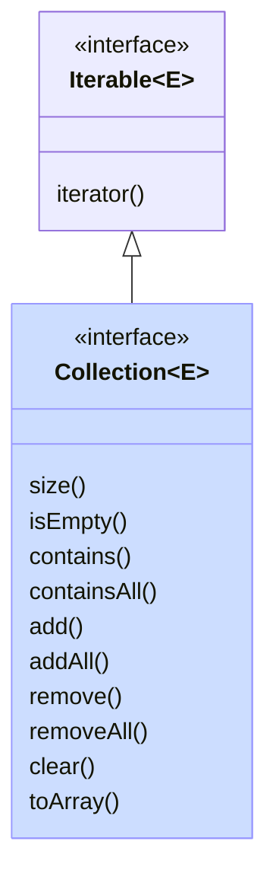

Zoals je hierboven zag, kan een `Iterable` dus enkel elementen opsommen.
De basisinterface [`Collection`](https://docs.oracle.com/en/java/javase/21/docs/api/java.base/java/util/Collection.html) erft hiervan over maar is uitgebreider: het stelt een groep objecten voor.
Er zit nog steeds bitter weinig structuur in een Collection:

- de volgorde van de elementen in een Collection ligt niet vast
- er kunnen wel of geen dubbels in een Collection zitten

De belangrijkste operaties die je op een Collection-object kan uitvoeren zijn

- `iterator()`, geërfd van `Iterable`
- `size()`: de grootte opvragen
- `isEmpty()`: nagaan of de collectie leeg is
- `contains` en `containsAll`: nakijken of een of meerdere elementen in de collectie zitten
- `add` en `addAll`: een of meerdere elementen toevoegen
- `remove` en `removeAll`: een of meerdere elementen verwijderen
- `clear`: de collectie volledig leegmaken
- `toArray`: alle elementen uit de collectie in een array plaatsen

Alle operaties die een collectie aanpassen (bv. add, addAll, remove, clear, ...) zijn optioneel.
Dat betekent dat sommige implementaties een `UnsupportedOperationException` kunnen gooien als je die methode oproept.
Niet elke collectie hoeft dus alle operaties te ondersteunen.

## Lijst (List)

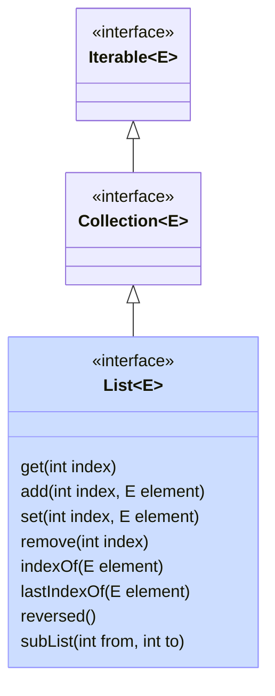

Een lijst is een collectie waar alle elementen een vaste plaats hebben.
De elementen in een lijst zijn dus geordend (maar niet noodzakelijk gesorteerd).
Een lijst wordt voorgesteld door de `List` interface, die `Collection` uitbreidt met operaties die kunnen werken met de plaats (index) van een object.

Bijvoorbeeld:

- `get(int index)`: het element op een specifieke plaats opvragen
- `add(int index, E element)`: een element invoegen op een specifieke plaats (en de latere elementen opschuiven)
- `set(int index, E element)`: het element op een specifieke plaats wijzigen
- `remove(int index)`: het element op de gegeven index verwijderen (en de latere elementen opschuiven)
- `indexOf(E element)` en `lastIndexOf(E)`: de eerste en laatste index zoeken waarop het gegeven element voorkomt
- `reversed()`: geeft een lijst terug in de omgekeerde volgorde
- `subList(int from, int to)`: geeft een lijst terug die een deel (slice) van de oorspronkelijke lijst voorstelt

Merk op dat de laatste twee methodes (reversed en subList) een zogenaamde **view** teruggeven op de oorspronkelijke lijst.
Het is dus geen nieuwe lijst, maar gewoon een andere manier om naar de oorspronkelijke lijst te kijken.
Bijvoorbeeld, in onderstaande code:

```java
List<String> alphabet = new ArrayList<>(List.of("A", "B", "C", "D", "E", "F"));
                                   // alphabet = [A, B, C, D, E, F]
List<String> rev = alphabet.reversed(); // rev = [F, E, D, C, B, A]
alphabet.set(5, "X");              // alphabet = [A, B, C, D, E, X]
System.out.println(rev);           //      rev = [X, E, D, C, B, A]
List<String> cde = alphabet.subList(2, 5); //    cde = [C, D, E]
cde.clear();                       //            cde = [       ]
System.out.println(alphabet);      // alphabet = [A, B,          X]
System.out.println(rev);           //      rev = [X,          B, A]
```

zie je dat

- de lijst `rev` de aanpassing (het laatste element veranderen in `X`) in de oorspronkelijke lijst weerspiegelt
- de sublist `cde` leegmaken deze elementen verwijdert uit de oorspronkelijke lijst, en ook uit de omgekeerde view op de lijst (`rev`)

De reden is dat zowel `rev` als `cde` enkel verwijzen naar de onderliggende lijst `alphabet`, en zelf geen elementen bevatten:


Indien je wat Python kent: `subList` is dus een manier om functionaliteit gelijkaardig aan slices te verkrijgen in Java. Maar, in tegenstelling tot slices in Python, maakt `subList` geen kopie!

### ArrayList

ArrayList is de eerste concrete implementatie van de List-interface die we bekijken.
In een ArrayList wordt een array gebruikt om de elementen bij te houden.

Aangezien arrays in Java een vaste grootte hebben, kan je niet zomaar elementen toevoegen als de lijst vol is.
Daarom wordt er een onderscheid gemaakt tussen de de **grootte** van de lijst (het aantal elementen dat er effectief inzit), en de **capaciteit** van de lijst (de lengte van de onderliggende array).
Zolang de grootte kleiner is dan de capaciteit, gebeurt er niets speciaals. Op het moment dat de volledige capaciteit benut is, en er nog een element toegevoegd wordt, wordt een nieuwe (grotere) array gemaakt en worden alle huidige elementen daarin gekopieerd.

Het kopiëren van een lijst is een \\( \mathcal{O}(n) \\) operatie, met \\( n\\) het huidige aantal elementen in de lijst.
Stel dat we kiezen om, elke keer wanneer we een element toevoegen, de array één extra plaats te geven.
We moeten dan telkens alle vorige elementen kopiëren, en dat wordt al snel erg inefficiënt.
Bijvoorbeeld, stel dat we met een lege array beginnen:

- om het eerste element toe te voegen, moeten we niets kopiëren
- om het tweede element toe te voegen, moeten we één element kopiëren (het eerste element uit de vorige array van lengte 1)
- om het derde element toe te voegen, moeten we twee elementen kopieëren (het eerste en tweede element uit de vorige array van lengte 2)
- om het vierde element toe te voegen 3 kopieën, enzovoort.

Eén voor één \\(n\\) elementen toevoegen aan een initieel lege lijst zou dus neerkomen op \\(0+1+...+(n-1) = n(n-1)/2 = \mathcal{O}(n^2)\\) kopieën (operaties).
Dat is erg veel werk als \\(n\\) groot wordt.
Om die reden wordt de lengte van de array niet telkens met 1 verhoogd, maar meteen vermenigvuldigd met een constante (meestal 2, zodat de lengte van de array verdubbelt).
Bijvoorbeeld, voor een lijst met capaciteit 3 en twee elementen:

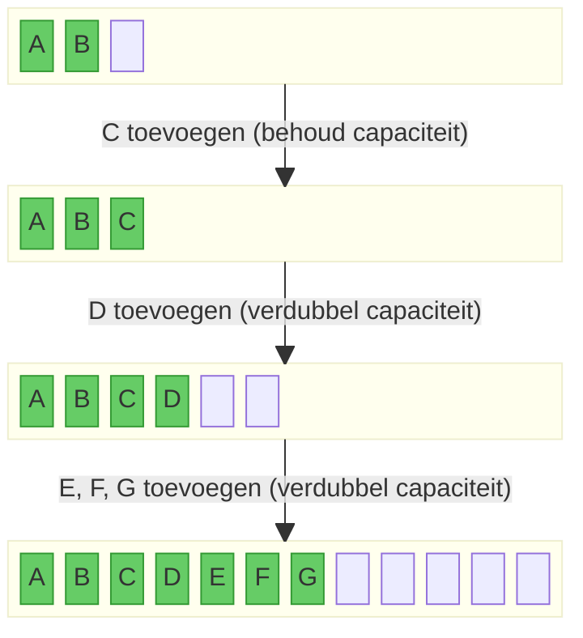

De meeste toevoegingen gebeuren dus in \\(\mathcal{O}(1)\\), maar af en toe kost een toevoeging \\(\mathcal{O}(n)\\) omdat alle elementen gekopieerd moeten worden naar de grotere array.
Als de lijst op een gegeven moment \\(n\\) elementen bevat, en de capaciteit telkens verdubbeld werd wanneer de vorige capaciteit bereikt werd, zijn er dus in totaal \\(n/2 + n/4 + ... \leq n = \mathcal{O}(n)\\) elementen gekopieerd. Gemiddeld werd elk van de \\(n\\) elementen dus met tijdscomplexiteit \\(\mathcal{O}(n)/n = \mathcal{O}(1)\\) toegevoegd[^amort].

[^amort]: Dit heet _geamortiseerde_ (_amortized_) tijdscomplexiteit.

| Operatie    | Complexiteit (best case)                                                                  | Complexiteit (worst case)                          |
| ----------- | ----------------------------------------------------------------------------------------- | -------------------------------------------------- |
| Opvragen    | \\(\mathcal{O}(1)\\)                                                                      | \\(\mathcal{O}(1)\\)                               |
| Invoegen    | \\(\mathcal{O}(1)\\) (einde van lijst), of \\(\mathcal{O}(n)\\) bij uitbreiden capaciteit | \\(\mathcal{O}(n)\\) (begin van lijst)             |
| Verwijderen | \\(\mathcal{O}(1)\\) (laatste element)                                                    | \\(\mathcal{O}(n)\\) (eerste element)              |
| Zoeken      | \\(\mathcal{O}(1)\\) (gezochte element is eerste element)                                 | \\(\mathcal{O}(n)\\) (gezochte element is laatste) |

#### Oefening: MyArrayList

Schrijf zelf een simpele klasse `MyArrayList<E>` die werkt zoals de ArrayList uit Java.
Voorzie in je lijst een initiële capaciteit van 4, maar zonder elementen.
Implementeer volgende operaties:

- `int size()` die de grootte (het huidig aantal elementen in de lijst) teruggeeft
- `int capacity()` die de huidige capaciteit (het aantal plaatsen in de array) van de lijst teruggeeft
- `E get(int index)` om het element op positie `index` op te vragen (of een `IndexOutOfBoundsException` indien de index ongeldig is)
- `void add(E element)` om een element achteraan toe te voegen (en de onderliggende array dubbel zo groot te maken indien nodig)
- `void remove(int index)` om het element op plaats index te verwijderen (of een `IndexOutOfBoundsException` indien de index ongeldig is). De capaciteit moet niet terug dalen als er veel elementen verwijderd werden (dat gebeurt in Java ook niet).
- `E last()` om het laatste element terug te krijgen (of een `NoSuchElementException` indien de lijst leeg is)

Hier vind je een test die een deel van dit gedrag controleert:

```java
@Test
public void test_my_arraylist() {
    MyArrayList<String> lst = new MyArrayList<>();
    // initial capacity and size
    assertThat(lst.capacity()).isEqualTo(4);
    assertThat(lst.size()).isEqualTo(0);

    // adding elements
    for (int i = 0; i < 4; i++) {
        lst.add("item" + i);
    }
    assertThat(lst.size()).isEqualTo(4);
    assertThat(lst.capacity()).isEqualTo(4);
    assertThat(lst.last()).isEqualTo("item3");

    // adding more elements
    for (int i = 4; i < 10; i++) {
        lst.add("item" + i);
    }
    assertThat(lst.size()).isEqualTo(10);
    assertThat(lst.capacity()).isEqualTo(16);
    assertThat(lst.last()).isEqualTo("item9");

    // remove an element
    lst.remove(3);
    assertThat(lst.size()).isEqualTo(9);
    assertThat(lst.capacity()).isEqualTo(16);
    assertThat(lst.get(3)).isEqualTo("item4");
    assertThatThrownBy(() -> lst.get(10)).isInstanceOf(IndexOutOfBoundsException.class);
}
```

### LinkedList

Een gelinkte lijst (`LinkedList`) is een andere implementatie van de `List` interface.
Hier wordt geen array gebruikt, maar wordt de lijst opgebouwd uit knopen (nodes).
Elke knoop bevat

- een waarde (`value`)
- een verwijzing (`next`) naar de _volgende_ knoop
- (in een **dubbel gelinkte lijst**) een verwijzing (`prev`) naar de _vorige_ knoop.

De LinkedList zelf bevat enkel een verwijzing naar de eerste knoop (`first`), en voor een dubbel gelinkte lijst ook nog een verwijzing naar de laatste knoop van de lijst (`last`).
Vaak wordt ook het aantal elementen (`size`) bijgehouden.

Hieronder zie je een grafische voorstelling van een dubbel gelinkte lijst met 3 knopen:

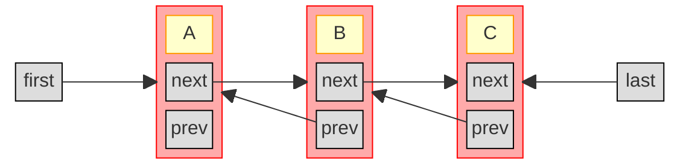

De tijdscomplexiteit van een (dubbel) gelinkte lijst is anders dan die van een ArrayList:

| Operatie    | Complexiteit (best case)                           | Complexiteit (worst case)                  |
| ----------- | -------------------------------------------------- | ------------------------------------------ |
| Opvragen    | \\(\mathcal{O}(1)\\) (begin of einde van de lijst) | \\(\mathcal{O}(n)\\) (midden van de lijst) |
| Invoegen    | \\(\mathcal{O}(1)\\) (begin of einde van de lijst) | \\(\mathcal{O}(n)\\) (midden van de lijst) |
| Verwijderen | \\(\mathcal{O}(1)\\) (begin of einde van de lijst) | \\(\mathcal{O}(n)\\) (midden van de lijst) |
| Zoeken      | \\(\mathcal{O}(1)\\) (begin of einde van de lijst) | \\(\mathcal{O}(n)\\) (midden van de lijst) |

Merk op dat we nooit elementen moeten kopiëren of verplaatsen in een gelinkte lijst, enkel referenties aanpassen.
Het aanpassen van een referentie is steeds \\(\mathcal{O}(1)\\).
Maar: we moeten eerst op de juiste plaats (knoop) geraken in de lijst, en dat kost mogelijk \\(\mathcal{O}(n)\\) werk: in een dubbel gelinkte lijst moeten we tot \\(n/2\\) referenties volgen (beginnend bij `first` of `last`).
Vandaar de \\(\mathcal{O}(n)\\) in de laatste kolom in de tabel hierboven.

Een gelinkte lijst is dus de juiste keuze wanneer je verwacht dat je **veel aanpassingen** aan je lijst zal doen, en die aanpassingen vooral voor- of achteraan zullen plaatsvinden.

#### Oefening: Linked list

Schrijf zelf een klasse `MyLinkedList<E>` en voorzie volgende operaties:

- `int size()` om het aantal elementen terug te geven
- `void add(E element)` om het gegeven element achteraan toe te voegen
- `E get(int index)` om het element op positie `index` op te vragen
- `void remove(int index)` om het element op positie `index` te verwijderen

Hieronder vind je enkele tests voor je klasse. Je zal misschien merken dat je implementatie helemaal juist krijgen niet zo eenvoudig is als het op het eerste zicht lijkt, zeker bij de `remove`-methode.
Gebruik de visuele voorstelling van hierboven, en ga na wat je moet doen om elk van de getekende knopen te verwijderen.

```java
@Test
public void test_my_linkedlist() {
    MyLinkedList<String> lst = new MyLinkedList<>();
    lst.add("element0");
    assertThat(lst.size()).isEqualTo(1);
    assertThat(lst.get(0)).isEqualTo("element0");

    lst.add("element1");
    assertThat(lst.size()).isEqualTo(2);
    assertThat(lst.get(0)).isEqualTo("element0");
    assertThat(lst.get(1)).isEqualTo("element1");

    lst.add("element2");
    assertThat(lst.size()).isEqualTo(3);
    assertThat(lst.get(0)).isEqualTo("element0");
    assertThat(lst.get(1)).isEqualTo("element1");
    assertThat(lst.get(2)).isEqualTo("element2");

    lst.remove(1);
    assertThat(lst.size()).isEqualTo(2);
    assertThat(lst.get(0)).isEqualTo("element0");
    assertThat(lst.get(1)).isEqualTo("element2");

    lst.remove(1);
    assertThat(lst.size()).isEqualTo(1);
    assertThat(lst.get(0)).isEqualTo("element0");
}
```

### Lijsten aanmaken

Je kan natuurlijk steeds een lijst aanmaken door een nieuwe, lege lijst te maken en daaraan je elementen toe te voegen:

```java
List<String> anArrayList = new ArrayList<>();
anArrayList.add("first");
anArrayList.add("second");
...

List<String> aLinkedList = new LinkedList<>();
aLinkedList.add("first");
...
```

Als je een lijst wil maken met gekende elementen (constanten), dan kan je ook de `List.of()`-methode gebruiken:

```java
List<String> lst = List.of("first", "second", "third");
```

Hierbij moet je wel opletten dat de lijst die je zo maakt **immutable** is. Je kan aan de lijst die je zo gemaakt hebt dus later geen wijzigingen meer aanbrengen via add, remove, etc.:

```java
List<String> lst = List.of("first", "second", "third");
lst.add("fourth"); // gooit UnsupportedOperationException
```

Als je toch een wijzigbare lijst wil maken, kan je een constructor gebruiken die de meegegeven lijst kopieert:

```java
List<String> mutable = new ArrayList<>(List.of("first", "second", "third"));
mutable.add("fourth"); // OK
```

### Operaties met lijsten

De [`List`-interface](https://docs.oracle.com/en/java/javase/21/docs/api/java.base/java/util/List.html) zelf bevat al enkele nuttige operaties op lijsten.
In de [`Collections`-klasse](https://docs.oracle.com/en/java/javase/21/docs/api/java.base/java/util/Collections.html) (niet hetzelfde als de `Collection`-interface!) vind je nog een heleboel extra operaties die je kan uitvoeren op lijsten (of soms op collecties), bijvoorbeeld:

- `disjoint` om na te gaan of twee collecties geen overlappende elementen hebben
- `sort` om een lijst te sorteren
- `shuffle` om een lijst willekeurig te permuteren
- `swap` om twee elementen van plaats te verwisselen
- `frequency` om te tellen hoe vaak een element voorkomt in een lijst
- `min` en `max` om het grootste element in een collectie te zoeken
- `indexOfSubList` om te zoeken of en waar een lijst voorkomt in een langere lijst
- `nCopies` om een lijst te maken die bestaat uit een aantal keer hetzelfde element
- `fill` om alle elementen in een lijst te vervangen door eenzelfde element
- `rotate` om de elementen in een lijst cyclisch te roteren

#### Unmodifiable list

Soms wil je een gewone (wijzigbare) lijst teruggeven maar er zeker van zijn dat de lijst niet aangepast kan worden.
Bijvoorbeeld, als je een lijst teruggeeft als resultaat van een methode:

```java
class Library {
  private List<Book> borrowedBooks;
  public void borrow(Book book) { ... }
  public List<Book> getBorrowedBooks() {
    return this.borrowedBooks;
  }
}
```

We willen niet dat een gebruiker van de klasse die lijst zomaar kan aanpassen --- dat moet via de borrow-methode gaan.
We kunnen natuurlijk een nieuwe lijst teruggeven met een kopie van de elementen:

```java
public List<Book> getBorrowedBooks() {
  return new ArrayList<>(this.borrowedBooks);
}
```

Maar dat kost \\(\mathcal{O}(n)\\) werk om die elementen te kopiëren.
Een alternatief is gebruik maken van `Collections.unmodifiableList`:

```java
public List<Book> getBorrowedBooks() {
  return Collections.unmodifiableList(this.borrowedBooks);
}
```

Er wordt dan geen nieuwe lijst gemaakt, maar wel een 'view' op de originele lijst (net zoals we eerder gezien hebben bij `reversed` en `subList`).
Het verschil is dat deze view nu geen wijzigingen toelaat; alle operaties die de lijst wijzigen, gooien een `UnsupportedOperationException`.

## Wachtrijen (Queue, Deque, PriorityQueue)

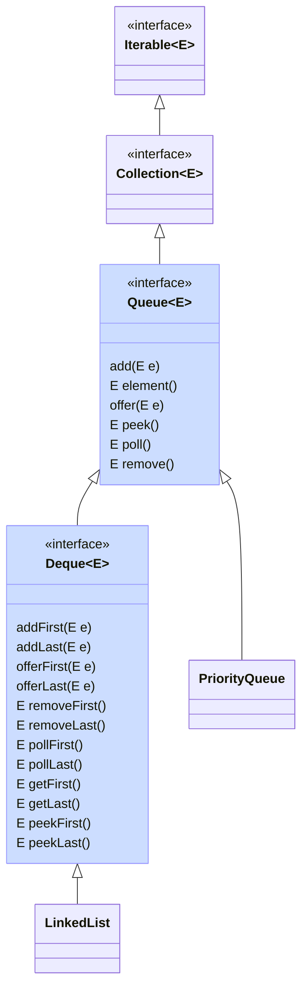

Een [`Queue`](https://docs.oracle.com/en/java/javase/21/docs/api/java.base/java/util/Queue.html) is een collectie die lijkt op een lijst.
Het voornaamste verschil met een lijst is dat een queue specifiek dient elk toegevoegd elementen er later terug uit te halen, en dat een queue niet toelaat om te werken met de positie (index) van een element.
Het volgende element dat teruggegeven wordt uit de queue wordt het hoofd (**head**) van de queue genoemd, de andere elementen de staart (**tail**).
Er bestaan operaties om het element aan het hoofd van de queue terug te geven en meteen te verwijderen (`poll`), alsook een andere operatie om het hoofd op te vragen zonder het meteen te verwijderen (`peek`). Als er geen elementen in de queue zitten, geven beiden `null` terug.

Sommige subtypes van Queue kunnen begrensd zijn qua capaciteit. Je kan dan geen elementen toevoegen als de queue vol is.

Elementen toevoegen aan een queue kan met `add` of `offer`. De `add`-methode gooit een exception als de queue vol is; `offer` geeft gewoon false terug.
Ook voor `poll` en `peek` bestaan varianten (namelijk `remove` en `element`) die een exception gooien in plaats van null terug te geven als de queue leeg is.

De volgorde waarin elementen teruggegeven worden uit de queue bepaalt het soort queue:

- een **FIFO** (first-in-first-out) queue geeft de elementen terug in de volgorde dat ze toegevoegd zijn: het eerst toegevoegde element wordt eerst teruggegeven
- een **LIFO** (last-in-first-out) queue geeft steeds het laatst toegevoegde element als eerste terug. Dit wordt ook een **stack** genoemd.
- een priority queue laat toe om aan elk toegevoegd element een prioriteit toe te kennen, en geeft de elementen terug volgens die prioriteit

Java voorziet ook een [`Deque`](https://docs.oracle.com/en/java/javase/21/docs/api/java.base/java/util/Deque.html) interface.
Dit staat voor **double-ended queue** en laat toe om elementen vooraan en achteraan toe te voegen aan en te verwijderen uit de deque.
Deze interface erft over van `Queue`.
Bovenop de methodes uit Queue worden methodes toegevoegd met suffix -First en -Last, bijvoorbeeld `pollFirst()` en `offerLast()`.
De methodes uit Queue om elementen toe te voegen (`offer()`, `add()`) komen overeen met `offerLast()` en `addLast()`.
De methodes uit Queue om elementen op te vragen (`peek()`, `poll()`, etc.) komen overeen met `peekFirst()`, `pollFirst()`, etc.

De basisimplementatie in Java, zowel voor de Queue als Deque interface, is de klasse `LinkedList` (een dubbel gelinkte lijst).
In een (dubbel) gelinkte lijst is het immers heel eenvoudig en efficiënt (\\(\mathcal{O}(1)\\)) om een element vooraan of achteraan toe te voegen en te verwijderen.
Afhankelijk van welke methodes je gebruikt, gebruik je een LinkedList dus als FIFO of LIFO queue.

### FIFO queue

In een FIFO queue worden de elementen teruggegeven in de volgorde dat ze toegevoegd zijn:

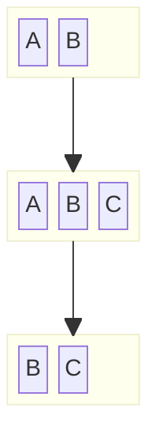

{}
Welke operaties gebruik je om een Deque (of LinkedList) als FIFO queue te gebruiken?
{}

### LIFO queue (stack)

In een LIFO queue, vaak ook _stack_ genoemd, worden het laatst toegevoegde element eerst teruggegeven:

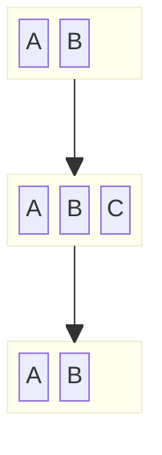

{}
Welke operaties gebruik je om een Deque (of LinkedList) als LIFO/stack te gebruiken?
{}

### PriorityQueue

De [`PriorityQueue`](https://docs.oracle.com/en/java/javase/21/docs/api/java.base/java/util/PriorityQueue.html) klasse implementeert een priority queue.
De prioriteit van elementen wordt bepaald door:

- ofwel de _natuurlijke ordening_ indien de elementen de `Comparable`-interface implementeren;
- ofwel door een `Comparator`-object dat meegegeven wordt bij het aanmaken van de priority queue.

Deze implementatie is zeer efficiënt voor de vaak voorkomende operaties. De worst-case tijdscomplexiteit om

- het hoofd van de queue op te vragen is \\(\mathcal{O}(1)\\)
- het hoofd van de queue te verwijderen uit de queue is \\(\mathcal{O}(\log n)\\)
- een element aan de queue toe te voegen is \\(\mathcal{O}(\log n)\\)

Nagaan of de queue een element bevat, alsook een willekeurig element verwijderen, is \\(\mathcal{O}(n)\\) --- maar beiden zijn geen typisch gebruik van een queue.

### Oefeningen

#### Oefening: MyFIFO

Implementeer zelf een klasse `MyFIFO<E>` die een FIFO queue voorstelt met beperkte capaciteit, en die gebruik maakt van een array om de elementen te bewaren.
De capaciteit wordt opgegeven bij het aanmaken.
Invoegen en terug verwijderen van elementen moet zeer efficiënt zijn (\\(\mathcal{O}(1)\\)).
Implementeer volgende operaties:

- `size()`: het aantal elementen in je queue
- `E poll()`: het hoofd van je FIFO queue opvragen en verwijderen; geeft null terug indien de queue leeg is
- `boolean add(E)`: een element (niet-null) toevoegen aan je queue; geeft false terug indien er niet voldoende capaciteit is

Hieronder vind je enkele tests:

```java
@Test
public void my_fifo_test() {
    MyFIFO<String> fifo = new MyFIFO<>(5);
    assertThat(fifo.size()).isEqualTo(0);

    fifo.add("first");
    assertThat(fifo.size()).isEqualTo(1);

    assertThat(fifo.poll()).isEqualTo("first");

    for (var e : List.of("first", "second", "third", "fourth", "fifth")) {
        assertThat(fifo.add(e)).isTrue();
    }
    assertThat(fifo.size()).isEqualTo(5);

    assertThat(fifo.add("sixth")).isFalse();
    assertThat(fifo.size()).isEqualTo(5);

    assertThat(fifo.poll()).isEqualTo("first");
    assertThat(fifo.poll()).isEqualTo("second");
    assertThat(fifo.size()).isEqualTo(3);
}
```

{}
Wat zou je moeten doen om je MyFIFO-klasse dynamisch te laten groeien als er meer elementen aan toegevoegd worden?
{}

#### Oefening: Priority boarding

Hieronder is een record die een vliegtuigpassagier voorstelt.

```java
record Passenger(String name, int priority) { }
```

Maak een klasse `PriorityBoarding` waar je een PriorityQueue gebruikt om passagiers te laten boarden.
Passagiers mogen het vliegtuig betreden volgens afnemende prioriteit (prioriteit 3 mag voor 2), en bij gelijke prioriteit, in alfabetische volgorde (A mag voor B).
Maak daarvoor twee operaties in je klasse:

- `checkin(Passenger p)` om een passagier toe te voegen aan de lijst van passagiers die kunnen instappen
- `Passenger nextPassenger()` die de volgende passagier teruggeeft die mag instappen, of `null` indien er geen passagiers meer zijn.

Hint: schrijf een Comparator. Je kan daarbij gebruik maken van de statische methodes uit de Comparator-interface.

## Verzameling (Set)

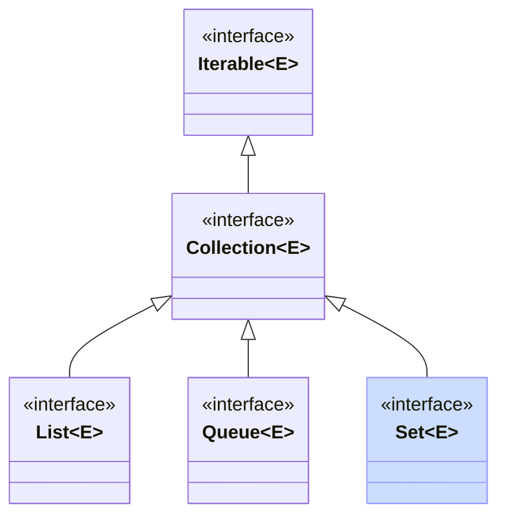

Alle collecties die we hierboven gezien hebben, kunnen dubbels bevatten.
Bij een `Set` is dat niet het geval. Het is een abstractie voor een wiskundige verzameling: elk element komt hoogstens één keer voor.
In een wiskundige verzameling is ook de volgorde van de elementen niet van belang.
De `Set` interface legt geen volgorde van elementen vast, maar er bestaan sub-interfaces van `Set` (bijvoorbeeld `SequencedSet` en `SortedSet`) die wel toelaten dat de elementen een bepaalde volgorde hebben.

De [`Set`](https://docs.oracle.com/en/java/javase/21/docs/api/java.base/java/util/Set.html) interface voegt in feite geen nieuwe operaties toe aan de Collection-interface. Je kan elementen toevoegen, verwijderen, en nagaan of een element in de verzameling zit.

Het is leerrijk om even stil te staan bij hoe een set efficiënt geïmplementeerd kan worden.
Immers, verzekeren dat er geen duplicaten inzitten vereist dat we gaan zoeken tussen de huidige elementen, en dat wordt al gauw een \\(\mathcal{O}(n)\\) operatie.
We bekijken twee implementaties van hoe dat efficiënter kan: HashSet en TreeSet.

### HashSet

Een HashSet kan gebruikt worden om willekeurige objecten in een set bij te houden.
De objecten worden bijgehouden in een **hashtable** (in essentie een gewone array).
Om te voorkomen dat we een reeds bestaand element een tweede keer toevoegen, moeten we echter snel kunnen nagaan of het toe te voegen element al in de set voorkomt.
De hele hashtable overlopen kost teveel tijd (\\(\mathcal{O}(n)\\) met \\(n\\) het aantal objecten in de set), dus dat moeten we verbeteren.

Een `HashSet` kan nagaan of een element bestaat, alsook een element toevoegen en verwijderen, in \\(\mathcal{O}(1)\\).
De sleutel om dat te doen is de `hashCode()` methode die ieder object in Java heeft.
Die methode moet, voor elk object, een hashCode (een int) teruggeven, zodanig dat als twee objecten gelijk zijn volgens hun `equals`-methode, ook hun hashcodes gelijk zijn.
Gewoonlijk zal je, als je `equals` zelf implementeert, ook `hashCode` moeten implementeren en omgekeerd.
De hashCode moet niet uniek zijn: meerdere objecten mogen dezelfde hashCode hebben, ook al zijn ze niet gelijk (al kan dat tot een tragere werking van een HashSet leiden; zie verder). Hoe uniformer de hashCode verdeeld is over alle objecten, hoe beter.

{}
Java records voorzien standaard een zinvolle equals- en hashCode-methode die afhangt van de attributen van het record.
Deze hoef je dus normaliter niet zelf te voorzien.
{}

De hashCode wordt gebruikt om een index te bepalen in de onderliggende hashtable (array).
De plaats in die hashtable is een **bucket**.
Het element wordt opgeslagen in de bucket op die index.
Als we later willen nagaan of een element al voorkomt in de hashtable, berekenen we opnieuw de index aan de hand van de hashCode en kijken we of het element zich effectief in de overeenkomstige bucket bevindt.

Idealiter geeft elk object dus een unieke hashCode, en zorgen die voor perfecte spreiding van alle objecten in de hashtable.
Er zijn echter twee problemen in de praktijk:

- twee verschillende objecten kunnen dezelfde hashCode hebben. Dat is een **collision**. Hiermee moeten we kunnen omgaan.
- als er teveel elementen toegevoegd worden, moet de onderliggende hashtable dynamisch kunnen uitbreiden. Dat maakt dat elementen plots op een andere plaats (index) terecht kunnen komen als voorheen. Uitbreiden vraagt vaak **rehashing**, oftwel het opnieuw berekenen van de index (nu in een grotere hashtable) aan de hand van de hashcodes. De **load factor** van de hash table geeft aan hoe vol de hashtable mag zijn voor ze uitgebreid wordt. Bijvoorbeeld, een load factor van 0.75 betekent dat het aantal elementen in de hashtable tot 75% van het aantal buckets mag gaan.

Beide problemen zijn al goed onderzocht in de computerwetenschappen.
We overlopen twee technieken voor het eerste probleem (collisions): chaining en probing.

#### Chaining

Bij chaining houden we in de hashtable niet rechtstreeks de elementen bij, maar wijzen we in elke bucket naar een afzonderlijke gelinkte lijst.
Elke keer wanneer we een element toevoegen, voegen we een knoop toe aan de gelinkte lijst in de bucket.
Wanneer we een element opvragen, doorlopen we de gelinkte lijst om na te gaan of het element daarin voorkomt.
Als er veel collisions zijn, verliezen we zo natuurlijk het performantie-voordeel van de hashtable.
Inderdaad, in extremis hebben alle objecten dezelfde hashcode, en bevat de hashtable slechts één gelinkte lijst met daarin alle elementen.
Een goede hashfunctie, die elemnten goed verspreidt over de verschillende buckets, is dus essentieel voor de performantie.

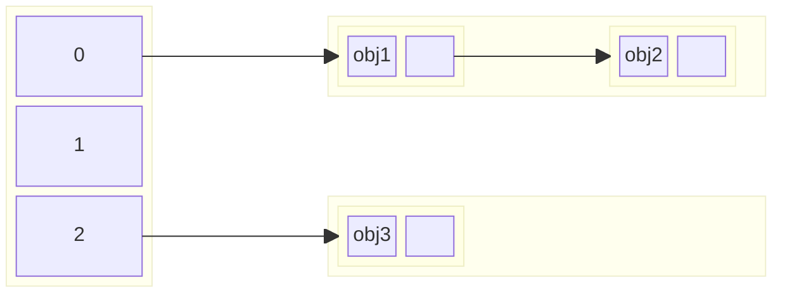

#### Probing (open addressing)

Een andere techniek om om te gaan met collisions is **probing**.
Als we een element willen toevoegen op een index, en er al een (ander) element op die index staat, berekenen we (volgens een deterministische formule) een volgende index, en proberen we daar opnieuw.
Dat doen we tot we een lege plaats tegenkomen, waar we het element kunnen bijhouden.
Die volgende index kan bijvoorbeeld (heel eenvoudig) index+1 zijn, maar we kunnen ook complexere formules bedenken waarmee we naar een heel andere plaats in de lijst springen.
Bij het opzoeken volgen we hetzelfde stramien: blijven zoeken tot we het element terugvinden, of een lege plaats tegenkomen.
Een element verwijderen wordt nu wel wat complexer: we moeten ervoor zorgen dat we geen lege plaats veroorzaken in de sequentie van indices.

### SortedSet en TreeSet

Naast `Set` bestaat ook de interface [`SortedSet`](https://docs.oracle.com/en/java/javase/21/docs/api/java.base/java/util/SortedSet.html).
In tegenstelling tot een Set, kan een SortedSet geen willekeurige objecten bevatten.
De objecten moeten een volgorde hebben (hetzij door Comparable te implementeren, hetzij door een Comparator-object mee te geven).
De elementen worden steeds in gesorteerde volgorde opgeslagen en teruggegeven.

De [`TreeSet`](https://docs.oracle.com/en/java/javase/21/docs/api/java.base/java/util/TreeSet.html) klasse is een implementatie van SortedSet die gebruik maakt van een gebalanceerde boomstructuur (een [red-black tree](https://en.wikipedia.org/wiki/Red%E2%80%93black_tree) --- de werking daarvan is hier niet van belang).

Alle basisoperaties (add, remove, contains) hebben worst-case tijdscomplexiteit \\(\mathcal{O}(\log n)\\); invoegen en verwijderen zijn best-case \\(\mathcal{O}(1)\\).

#### Oefening: veranderende hashcode

Is het nodig dat de hashCode van een object hetzelfde blijft doorheen de levensduur van het object, of mag deze veranderen?
Verklaar je antwoord.

#### Oefening: boomstructuur

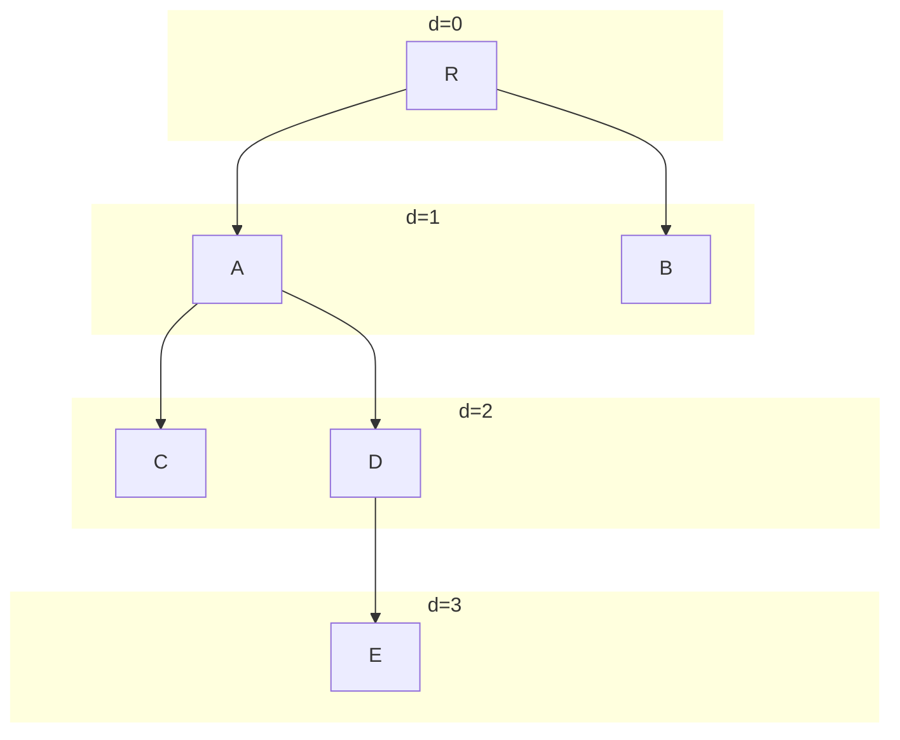

Stel dat je een binaire boom hebt: een boomstructuur hebt waar elke knoop in de boom maximaal 2 kinderen heeft, zoals het voorbeeld hierboven.
De diepte van een knoop is de afstand van die knoop tot de wortelknoop (bv. in de boom hierboven heeft knoop A diepte 1, knoop E diepte 3, en knoop R diepte 0).
De hoogte van de boom is de maximale diepte van alle knopen (dus: de diepte van de knoop die het verst van de wortel ligt; E in het voorbeeld hierboven).

- wat is de **maximale** hoogte van een binaire boom met \\(n\\) knopen?
- wat is het maximaal aantal elementen met diepte gelijk aan \\(d\\) in een binaire boom?
- wanneer heeft een binaire boom met \\(n\\) knopen een **minimale** hoogte? Wat is die hoogte?

#### Oefening: Scheduler

Maak een record `Job` met attributen time (je kan gewoon een double gebruiken) en een description (String).
Maak ook een klasse `Scheduler` die een TreeSet gebruikt om volgende methodes te implementeren:

- `schedule(Job job)` om de gegeven job toe te voegen aan de scheduler
- `List<Job> allJobs()` om alle jobs (in volgorde) terug te krijgen
- `Job nextJob(double after)` om de eerstvolgende job op of na het gegeven tijdstip terug te vinden.

## Map (Dictionary)

De collecties hierboven stellen allemaal een groep elementen voor, en erven over van de `Collection`-interface.
Een [`Map`](https://docs.oracle.com/en/java/javase/21/docs/api/java.base/java/util/Map.html) is iets anders.
Hier worden **sleutels** bijgehouden, en bij elke sleutel hoort een **waarde** (een object).
Denk aan een telefoonboek, waar bij elke naam (de sleutel) een telefoonnummer (de waarde) hoort, of een woordenboek waar bij elk woord (de sleutel) een definitie hoort (de waarde).
Een andere naam voor een map is dan ook een **dictionary**.
Sleutels mogen slechts één keer voorkomen; eenzelfde waarde mag wel onder meerdere sleutels opgeslagen worden.

De interface `Map<K, V>` heeft twee generische parameters: een (`K`) voor het type van de sleutels, een een (`V`) voor het type van de waarden.
Elementen toevoegen aan een `Map<K, V>` gaat via de `put(K key, V value)`-methode.
De waarde opvragen kan via de methode `V get(K key)`.
Verder zijn er methodes om na te gaan of een map een bepaalde sleutel of waarde bevat.
Een Map is vaak geoptimaliseerd voor deze operaties; deze hebben vaak tijdscomplexiteit \\(\mathcal{O}(1)\\) (hashtable-gebaseerde implementaties) of \\(\mathcal{O}(\log n)\\) (boom-gebaseerde implementaties).

Er zijn verder ook drie manieren om een `Map<K, V>` als `Collection` te beschouwen:

- de `keySet`: de verzameling sleutels (een `Set<K>`)
- de `values`: de collectie waarden (een `Collection<V>`, want dubbels zijn mogelijk)
- de `entrySet`: een verzameling (`Set<Entry<K, V>>`) van sleutel-waarde paren (de _entries_).

Belangrijk om te onthouden is dat een Map geoptimaliseerd is om waardes op te vragen aan de hand van hun sleutels.

### HashMap

Net zoals bij Set kunnen we de Map-interface implementeren met een hashtable.
Dat gebeurt in de `HashMap` klasse.
Entries in een hashmap worden in een niet-gespecifieerde volgorde bijgehouden.

De werking van een hashmap is zeer gelijkaardig aan wat we besproken hebben bij HashSet hierboven.
Meer zelfs, de implementatie van HashSet in Java maakt gebruik van een HashMap.
Het belangrijkste verschil met de HashSet is dat we in een HashMap, naast de waarde, ook de sleutel moeten bewaren.

### SortedMap en TreeMap

Een [`SortedMap`](https://docs.oracle.com/en/java/javase/21/docs/api/java.base/java/util/SortedMap.html) is een map waarbij de **sleutels** (dus niet de waarden) gesorteerd worden bijgehouden (zoals bij een SortedSet).

De [TreeMap](https://docs.oracle.com/en/java/javase/21/docs/api/java.base/java/util/TreeMap.html) klasse implementeert een SortedMap aan de hand van een boomstructuur.

### Oefeningen

#### Oefening: Set implementeren met Map

Leg uit hoe je een HashSet zou kunnen implementeren gebruik makend van een HashMap.
(Dit is ook wat Java (en Python) doen in de praktijk.)

#### Oefening: Parking

Maak een klasse `Parking` die gebruikt wordt voor betalend parkeren.
Kies een of meerdere datastructuren om volgende methodes te implementeren:

- `enterParking(String licencePlate)`: een auto rijdt de parking binnen
- `double amountToPay(String licensePlate)`: bereken het te betalen bedrag voor de gegeven auto (nummerplaat). De parking kost 2 euro per begonnen uur.
- `pay(String licensePlate)`: markeer dat de auto met de gegeven nummerplaat betaald heeft
- `boolean leaveParking(String licensePlate)`: geef terug of de gegeven auto de parking mag verlaten (betaald heeft), en verwijder de auto uit het systeem indien betaald werd.

Om te werken met huidige tijd en intervallen tussen twee tijdstippen, kan je gebruik maken van [`java.time.Instant`](https://docs.oracle.com/en/java/javase/21/docs/api/java.base/java/time/Instant.html).

#### Oefening: Multimap

Schrijf een klasse `MultiMap` die een map voorstelt, maar waar bij elke key een _verzameling_ (Set) van waarden hoort in plaats van slechts één waarde.
Gebruik een `Map` in je implementatie.

## Andere collectie-API's

Behalve de Java Collections API zijn er ook externe bibliotheken met collectie-implementaties die je (bijvoorbeeld via Gradle) kan gebruiken in je projecten.
De twee meest gekende voorbeelden zijn

- [Google Guava](https://github.com/google/guava), en bijhorende [documentatie](https://guava.dev/releases/snapshot-jre/api/docs/com/google/common/collect/package-summary.html)
- [Apache Commons](https://commons.apache.org/), en bijhorende [documentatie](https://commons.apache.org/proper/commons-collections/javadocs/api-4.4/index.html)
