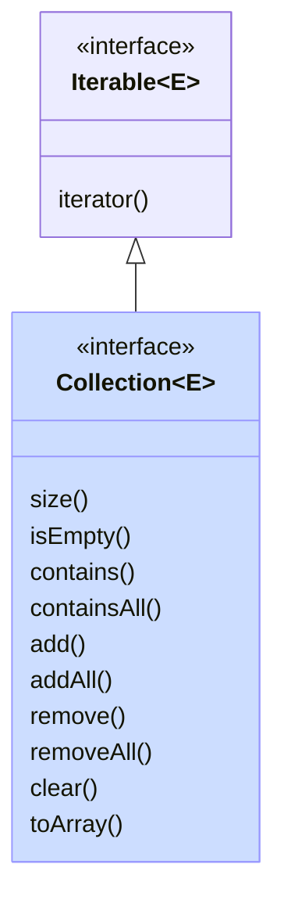

We kunnen nu de Java Collections-API verkennen.
Deze API bestaat uit

- interfaces (bv. `Iterable`, `Collection`, `List`, `Set`, `SortedSet`, `Queue`, `Deque`, `Map`, `SortedMap`, en `NavigableMap`)
- implementaties van die interface (bv. `ArrayList`, `LinkedList`, `Vector`, `Stack`, `ArrayDeque`, `PriorityQueue`, `HashSet`, `LinkedHashSet`, `TreeSet`, en `TreeMap`)
- algoritmes voor veel voorkomende operaties (bv. `shuffle`, `sort`, `swap`, `reverse`, ...)

Je vindt een overzicht van de hele API op [deze pagina](https://docs.oracle.com/en/java/javase/21/docs/api/java.base/java/util/doc-files/coll-reference.html).

We beginnen bij de basisinterface: `Iterable`.

## Iterable en Iterator

[`Iterable`](https://docs.oracle.com/en/java/javase/21/docs/api/java.base/java/lang/Iterable.html) maakt eigenlijk geen deel uit van de Java Collections API, maar is er wel sterk aan verwant.
Een `Iterable` is namelijk een object dat meerdere objecten van hetzelfde type één voor één kan teruggeven.
Er moet slechts 1 methode geïmplementeerd worden, namelijk `iterator()`, die een `Iterator`-object teruggeeft.

Een [`Iterator`](https://docs.oracle.com/en/java/javase/21/docs/api/java.base/java/util/Iterator.html) is een object met twee methodes:

- `hasNext()`, wat aangeeft of er nog objecten zijn om terug te geven, en
- `next()`, wat (als er nog objecten zijn) het volgende object teruggeeft.

Elke keer je `next()` oproept krijg je dus een ander object, tot `hasNext()` false teruggeeft. Vanaf dan krijg je een exception (`NoSuchElementException`).
Een `Iterator` moet dus een toestand bijhouden, om te bepalen welke objecten al teruggegeven zijn en welke nog niet.
Eens alle elementen teruggegeven zijn, en hasNext dus false teruggeeft, is de iterator 'opgebruikt'.
Als je daarna nog eens over de elementen wil itereren, moet je een nieuwe iterator aanmaken.

Elke klasse die `Iterable` implementeert, kan gebruikt worden in een 'enhanced for-statement':

```java
Iterable<E> iterable = ...
for (var element : iterable) {
  ... // code die element gebruikt
}
```

Achter de schermen wordt hierbij de iterator gebruikt. Het enhanced for-statement van hierboven is equivalent aan:

```java
Iterable<E> iterable = ...
Iterator<E> iterator = iterable.iterator();
while (iterator.hasNext()) {
  E element = iterator.next();
  ... // code die element gebruikt
}
```

Alle collectie-types die een verzameling elementen voorstellen (dus alles behalve `Map`), implementeren deze interface.
Dat betekent dus dat je elk van die collecties in een enhanced for-lus kan gebruiken.
Je kan daarenboven ook zelf een nieuwe klasse maken die deze interface implementeert, en die vervolgens gebruikt kan worden in een enhanced for-loop.
Dat doen we in [deze oefening](oefeningen.md#intrange).

## Collection



Zoals je hierboven zag, kan een `Iterable` dus enkel elementen opsommen.
De basisinterface [`Collection`](https://docs.oracle.com/en/java/javase/21/docs/api/java.base/java/util/Collection.html) erft hiervan over maar is uitgebreider: het stelt een groep objecten voor.
Er zit nog steeds bitter weinig structuur in een Collection:

- de volgorde van de elementen in een Collection ligt niet vast
- er kunnen wel of geen dubbels in een Collection zitten

De belangrijkste operaties die je op een Collection-object kan uitvoeren zijn

- `iterator()`, geërfd van `Iterable`
- `size()`: de grootte opvragen
- `isEmpty()`: nagaan of de collectie leeg is
- `contains` en `containsAll`: nakijken of een of meerdere elementen in de collectie zitten
- `add` en `addAll`: een of meerdere elementen toevoegen
- `remove` en `removeAll`: een of meerdere elementen verwijderen
- `clear`: de collectie volledig leegmaken
- `toArray`: alle elementen uit de collectie in een array plaatsen

Alle operaties die een collectie aanpassen (bv. add, addAll, remove, clear, ...) zijn optioneel.
Dat betekent dat sommige implementaties een `UnsupportedOperationException` kunnen gooien als je die methode oproept.
Niet elke collectie hoeft dus alle operaties te ondersteunen.
