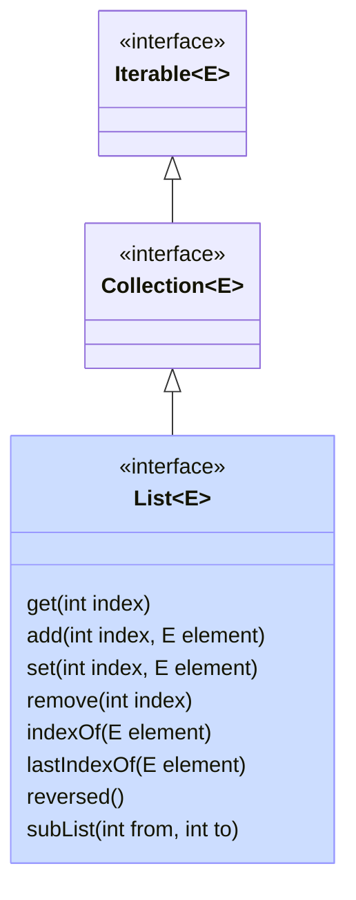
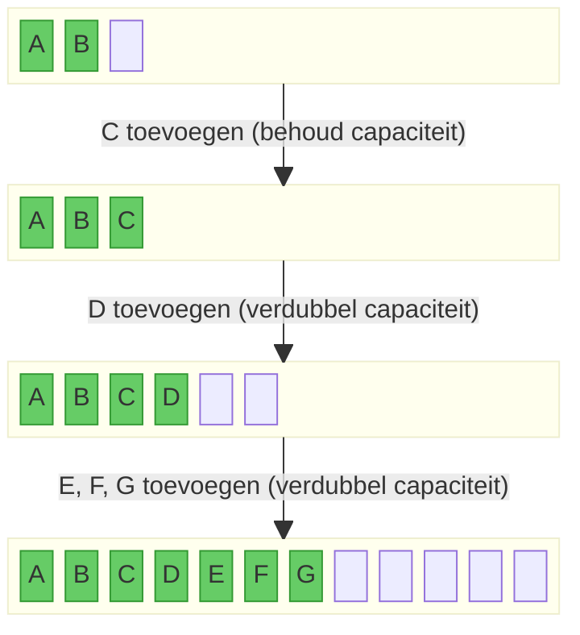
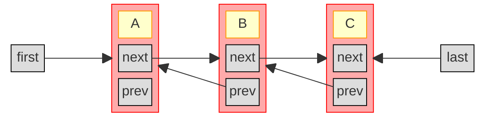

## List

Een lijst is een collectie waar alle elementen een vaste plaats hebben.
De elementen in een lijst zijn dus geordend (maar niet noodzakelijk gesorteerd).
Een lijst wordt voorgesteld door de `List` interface, die `Collection` uitbreidt met operaties die kunnen werken met de plaats (index) van een object.

Bijvoorbeeld:

- `get(int index)`: het element op een specifieke plaats opvragen
- `add(int index, E element)`: een element invoegen op een specifieke plaats (en de latere elementen opschuiven)
- `set(int index, E element)`: het element op een specifieke plaats wijzigen
- `remove(int index)`: het element op de gegeven index verwijderen (en de latere elementen opschuiven)
- `indexOf(E element)` en `lastIndexOf(E)`: de eerste en laatste index zoeken waarop het gegeven element voorkomt
- `reversed()`: geeft een lijst terug in de omgekeerde volgorde
- `subList(int from, int to)`: geeft een lijst terug die een deel (slice) van de oorspronkelijke lijst voorstelt

Merk op dat de laatste twee methodes (reversed en subList) een zogenaamde **view** teruggeven op de oorspronkelijke lijst.
Het is dus geen nieuwe lijst, maar gewoon een andere manier om naar de oorspronkelijke lijst te kijken.
Bijvoorbeeld, in onderstaande code:

```java
List<String> alphabet = new ArrayList<>(List.of("A", "B", "C", "D", "E", "F"));
                                   // alphabet = [A, B, C, D, E, F]
List<String> rev = alphabet.reversed(); // rev = [F, E, D, C, B, A]
alphabet.set(5, "X");              // alphabet = [A, B, C, D, E, X]
System.out.println(rev);           //      rev = [X, E, D, C, B, A]
List<String> cde = alphabet.subList(2, 5); //    cde = [C, D, E]
cde.clear();                       //            cde = [       ]
System.out.println(alphabet);      // alphabet = [A, B,          X]
System.out.println(rev);           //      rev = [X,          B, A]
```

zie je dat

- de lijst `rev` de aanpassing (het laatste element veranderen in `X`) in de oorspronkelijke lijst weerspiegelt
- de sublist `cde` leegmaken deze elementen verwijdert uit de oorspronkelijke lijst, en ook uit de omgekeerde view op de lijst (`rev`)

De reden is dat zowel `rev` als `cde` enkel verwijzen naar de onderliggende lijst `alphabet`, en zelf geen elementen bevatten:


Indien je wat Python kent: `subList` is dus een manier om functionaliteit gelijkaardig aan slices te verkrijgen in Java. Maar, in tegenstelling tot slices in Python, maakt `subList` geen kopie!

## ArrayList

ArrayList is de eerste concrete implementatie van de List-interface die we bekijken.
In een ArrayList wordt een array gebruikt om de elementen bij te houden.

Aangezien arrays in Java een vaste grootte hebben, kan je niet zomaar elementen toevoegen als de lijst vol is.
Daarom wordt er een onderscheid gemaakt tussen de de **grootte** van de lijst (het aantal elementen dat er effectief inzit), en de **capaciteit** van de lijst (de lengte van de onderliggende array).
Zolang de grootte kleiner is dan de capaciteit, gebeurt er niets speciaals. Op het moment dat de volledige capaciteit benut is, en er nog een element toegevoegd wordt, wordt een nieuwe (grotere) array gemaakt en worden alle huidige elementen daarin gekopieerd.

Het kopiëren van een lijst is een \\( \mathcal{O}(n) \\) operatie, met \\( n\\) het huidige aantal elementen in de lijst.
Stel dat we kiezen om, elke keer wanneer we een element toevoegen, de array één extra plaats te geven.
We moeten dan telkens alle vorige elementen kopiëren, en dat wordt al snel erg inefficiënt.
Bijvoorbeeld, stel dat we met een lege array beginnen:

- om het eerste element toe te voegen, moeten we niets kopiëren
- om het tweede element toe te voegen, moeten we één element kopiëren (het eerste element uit de vorige array van lengte 1)
- om het derde element toe te voegen, moeten we twee elementen kopieëren (het eerste en tweede element uit de vorige array van lengte 2)
- om het vierde element toe te voegen 3 kopieën, enzovoort.

Eén voor één \\(n\\) elementen toevoegen aan een initieel lege lijst zou dus neerkomen op \\(0+1+...+(n-1) = n(n-1)/2 = \mathcal{O}(n^2)\\) kopieën (operaties).
Dat is erg veel werk als \\(n\\) groot wordt.
Om die reden wordt de lengte van de array niet telkens met 1 verhoogd, maar meteen vermenigvuldigd met een constante (meestal 2, zodat de lengte van de array verdubbelt).
Bijvoorbeeld, voor een lijst met capaciteit 3 en twee elementen:



De meeste toevoegingen gebeuren dus in \\(\mathcal{O}(1)\\), maar af en toe kost een toevoeging \\(\mathcal{O}(n)\\) omdat alle elementen gekopieerd moeten worden naar de grotere array.
Als de lijst op een gegeven moment \\(n\\) elementen bevat, en de capaciteit telkens verdubbeld werd wanneer de vorige capaciteit bereikt werd, zijn er dus in totaal \\(n/2 + n/4 + ... \leq n = \mathcal{O}(n)\\) elementen gekopieerd. Gemiddeld werd elk van de \\(n\\) elementen dus met tijdscomplexiteit \\(\mathcal{O}(n)/n = \mathcal{O}(1)\\) toegevoegd[^amort].

[^amort]: Dit heet _geamortiseerde_ (_amortized_) tijdscomplexiteit.

| Operatie    | Complexiteit (best case)                                                                  | Complexiteit (worst case)                          |
| ----------- | ----------------------------------------------------------------------------------------- | -------------------------------------------------- |
| Opvragen    | \\(\mathcal{O}(1)\\)                                                                      | \\(\mathcal{O}(1)\\)                               |
| Invoegen    | \\(\mathcal{O}(1)\\) (einde van lijst), of \\(\mathcal{O}(n)\\) bij uitbreiden capaciteit | \\(\mathcal{O}(n)\\) (begin van lijst)             |
| Verwijderen | \\(\mathcal{O}(1)\\) (laatste element)                                                    | \\(\mathcal{O}(n)\\) (eerste element)              |
| Zoeken      | \\(\mathcal{O}(1)\\) (gezochte element is eerste element)                                 | \\(\mathcal{O}(n)\\) (gezochte element is laatste) |


## LinkedList

Een gelinkte lijst (`LinkedList`) is een andere implementatie van de `List` interface.
Hier wordt geen array gebruikt, maar wordt de lijst opgebouwd uit knopen (nodes).
Elke knoop bevat

- een waarde (`value`)
- een verwijzing (`next`) naar de _volgende_ knoop
- (in een **dubbel gelinkte lijst**) een verwijzing (`prev`) naar de _vorige_ knoop.

De LinkedList zelf bevat enkel een verwijzing naar de eerste knoop (`first`), en voor een dubbel gelinkte lijst ook nog een verwijzing naar de laatste knoop van de lijst (`last`).
Vaak wordt ook het aantal elementen (`size`) bijgehouden.

Hieronder zie je een grafische voorstelling van een dubbel gelinkte lijst met 3 knopen:



De tijdscomplexiteit van een (dubbel) gelinkte lijst is anders dan die van een ArrayList:

| Operatie    | Complexiteit (best case)                           | Complexiteit (worst case)                  |
| ----------- | -------------------------------------------------- | ------------------------------------------ |
| Opvragen    | \\(\mathcal{O}(1)\\) (begin of einde van de lijst) | \\(\mathcal{O}(n)\\) (midden van de lijst) |
| Invoegen    | \\(\mathcal{O}(1)\\) (begin of einde van de lijst) | \\(\mathcal{O}(n)\\) (midden van de lijst) |
| Verwijderen | \\(\mathcal{O}(1)\\) (begin of einde van de lijst) | \\(\mathcal{O}(n)\\) (midden van de lijst) |
| Zoeken      | \\(\mathcal{O}(1)\\) (begin of einde van de lijst) | \\(\mathcal{O}(n)\\) (midden van de lijst) |

Merk op dat we nooit elementen moeten kopiëren of verplaatsen in een gelinkte lijst, enkel referenties aanpassen.
Het aanpassen van een referentie is steeds \\(\mathcal{O}(1)\\).
Maar: we moeten eerst op de juiste plaats (knoop) geraken in de lijst, en dat kost mogelijk \\(\mathcal{O}(n)\\) werk: in een dubbel gelinkte lijst moeten we tot \\(n/2\\) referenties volgen (beginnend bij `first` of `last`).
Vandaar de \\(\mathcal{O}(n)\\) in de laatste kolom in de tabel hierboven.

Een gelinkte lijst is dus de juiste keuze wanneer je verwacht dat je **veel aanpassingen** aan je lijst zal doen, en die aanpassingen vooral voor- of achteraan zullen plaatsvinden.


## Lijsten aanmaken

Je kan natuurlijk steeds een lijst aanmaken door een nieuwe, lege lijst te maken en daaraan je elementen toe te voegen:

```java
List<String> anArrayList = new ArrayList<>();
anArrayList.add("first");
anArrayList.add("second");
...

List<String> aLinkedList = new LinkedList<>();
aLinkedList.add("first");
...
```

Als je een lijst wil maken met gekende elementen (constanten), dan kan je ook de `List.of()`-methode gebruiken:

```java
List<String> lst = List.of("first", "second", "third");
```

Hierbij moet je wel opletten dat de lijst die je zo maakt **immutable** is. Je kan aan de lijst die je zo gemaakt hebt dus later geen wijzigingen meer aanbrengen via add, remove, etc.:

```java
List<String> lst = List.of("first", "second", "third");
lst.add("fourth"); // gooit UnsupportedOperationException
```

Als je toch een wijzigbare lijst wil maken, kan je een constructor gebruiken die de meegegeven lijst kopieert:

```java
List<String> mutable = new ArrayList<>(List.of("first", "second", "third"));
mutable.add("fourth"); // OK
```

## Operaties met lijsten

De [`List`-interface](https://docs.oracle.com/en/java/javase/21/docs/api/java.base/java/util/List.html) zelf bevat al enkele nuttige operaties op lijsten.
In de [`Collections`-klasse](https://docs.oracle.com/en/java/javase/21/docs/api/java.base/java/util/Collections.html) (niet hetzelfde als de `Collection`-interface!) vind je nog een heleboel extra operaties die je kan uitvoeren op lijsten (of soms op collecties), bijvoorbeeld:

- `disjoint` om na te gaan of twee collecties geen overlappende elementen hebben
- `sort` om een lijst te sorteren
- `shuffle` om een lijst willekeurig te permuteren
- `swap` om twee elementen van plaats te verwisselen
- `frequency` om te tellen hoe vaak een element voorkomt in een lijst
- `min` en `max` om het grootste element in een collectie te zoeken
- `indexOfSubList` om te zoeken of en waar een lijst voorkomt in een langere lijst
- `nCopies` om een lijst te maken die bestaat uit een aantal keer hetzelfde element
- `fill` om alle elementen in een lijst te vervangen door eenzelfde element
- `rotate` om de elementen in een lijst cyclisch te roteren

## Unmodifiable list

Soms wil je een gewone (wijzigbare) lijst teruggeven maar er zeker van zijn dat de lijst niet aangepast kan worden.
Bijvoorbeeld, als je een lijst teruggeeft als resultaat van een methode:

```java
class Library {
  private List<Book> borrowedBooks;
  public void borrow(Book book) { ... }
  public List<Book> getBorrowedBooks() {
    return this.borrowedBooks;
  }
}
```

We willen niet dat een gebruiker van de klasse die lijst zomaar kan aanpassen --- dat moet via de borrow-methode gaan.
We kunnen natuurlijk een nieuwe lijst teruggeven met een kopie van de elementen:

```java
public List<Book> getBorrowedBooks() {
  return new ArrayList<>(this.borrowedBooks);
}
```

Maar dat kost \\(\mathcal{O}(n)\\) werk om die elementen te kopiëren.
Een alternatief is gebruik maken van `Collections.unmodifiableList`:

```java
public List<Book> getBorrowedBooks() {
  return Collections.unmodifiableList(this.borrowedBooks);
}
```

Er wordt dan geen nieuwe lijst gemaakt, maar wel een 'view' op de originele lijst (net zoals we eerder gezien hebben bij `reversed` en `subList`).
Het verschil is dat deze view nu geen wijzigingen toelaat; alle operaties die de lijst wijzigen, gooien een `UnsupportedOperationException`.

