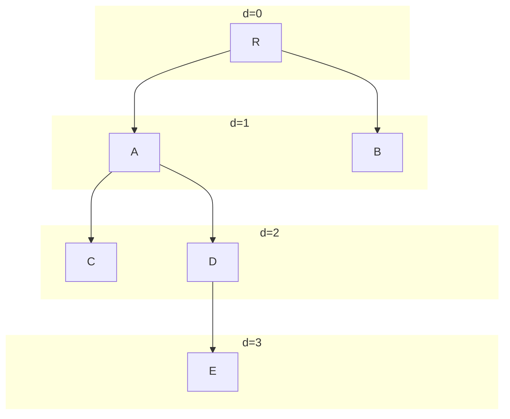

## De Collections API

### IntRange

1. Schrijf eerst een klasse `IntRangeIterator` die `Iterator<Integer>` implementeert, en alle getallen teruggeeft tussen twee grensgetallen `lowest` en `highest` die je meegeeft aan de constructor. Je houdt hiervoor enkel de onder- en bovengrens bij, alsook het volgende terug te geven getal.
2. Schrijf nu ook een record `IntRange` die `Iterable<Integer>` implementeert, en die een `IntRangeIterator`-object aanmaakt en teruggeeft.
   Je moet deze klasse nu als volgt kunnen gebruiken:

```java
IntRange range = new IntRange(3, 6);
for (int x : range) {
  System.out.println(x);
}
// Uitvoer:
// 3
// 4
// 5
// 6

```

{}
Java laat niet toe om primitieve types als generische parameters te gebruiken.
Voor elk primitief type bestaat er een wrapper-klasse, bijvoorbeeld `Integer` voor `int`.
Daarom gebruiken we hierboven bijvoorbeeld `Iterator<Integer>` in plaats van `Iterator<int>`.
Achter de schermen worden `int`-waarden automatisch omgezet in `Integer`-objecten en omgekeerd.
Dat heet [auto-boxing en -unboxing](https://docs.oracle.com/javase/tutorial/java/data/autoboxing.html).
Je kan beide types in je code grotendeels door elkaar gebruiken zonder problemen.
{}

## Lijsten

### MyArrayList

Schrijf zelf een simpele klasse `MyArrayList<E>` die werkt zoals de ArrayList uit Java.
Voorzie in je lijst een initiële capaciteit van 4, maar zonder elementen.
Implementeer volgende operaties:

- `int size()` die de grootte (het huidig aantal elementen in de lijst) teruggeeft
- `int capacity()` die de huidige capaciteit (het aantal plaatsen in de array) van de lijst teruggeeft
- `E get(int index)` om het element op positie `index` op te vragen (of een `IndexOutOfBoundsException` indien de index ongeldig is)
- `void add(E element)` om een element achteraan toe te voegen (en de onderliggende array dubbel zo groot te maken indien nodig)
- `void remove(int index)` om het element op plaats index te verwijderen (of een `IndexOutOfBoundsException` indien de index ongeldig is). De capaciteit moet niet terug dalen als er veel elementen verwijderd werden (dat gebeurt in Java ook niet).
- `E last()` om het laatste element terug te krijgen (of een `NoSuchElementException` indien de lijst leeg is)

Hier vind je een test die een deel van dit gedrag controleert:

```java
@Test
public void test_my_arraylist() {
    MyArrayList<String> lst = new MyArrayList<>();
    // initial capacity and size
    assertThat(lst.capacity()).isEqualTo(4);
    assertThat(lst.size()).isEqualTo(0);

    // adding elements
    for (int i = 0; i < 4; i++) {
        lst.add("item" + i);
    }
    assertThat(lst.size()).isEqualTo(4);
    assertThat(lst.capacity()).isEqualTo(4);
    assertThat(lst.last()).isEqualTo("item3");

    // adding more elements
    for (int i = 4; i < 10; i++) {
        lst.add("item" + i);
    }
    assertThat(lst.size()).isEqualTo(10);
    assertThat(lst.capacity()).isEqualTo(16);
    assertThat(lst.last()).isEqualTo("item9");

    // remove an element
    lst.remove(3);
    assertThat(lst.size()).isEqualTo(9);
    assertThat(lst.capacity()).isEqualTo(16);
    assertThat(lst.get(3)).isEqualTo("item4");
    assertThatThrownBy(() -> lst.get(10)).isInstanceOf(IndexOutOfBoundsException.class);
}
```

### Linked list

Schrijf zelf een klasse `MyLinkedList<E>` en voorzie volgende operaties:

- `int size()` om het aantal elementen terug te geven
- `void add(E element)` om het gegeven element achteraan toe te voegen
- `E get(int index)` om het element op positie `index` op te vragen
- `void remove(int index)` om het element op positie `index` te verwijderen

Hieronder vind je enkele tests voor je klasse. Je zal misschien merken dat je implementatie helemaal juist krijgen niet zo eenvoudig is als het op het eerste zicht lijkt, zeker bij de `remove`-methode.
Gebruik de visuele voorstelling van hierboven, en ga na wat je moet doen om elk van de getekende knopen te verwijderen.

```java
@Test
public void test_my_linkedlist() {
    MyLinkedList<String> lst = new MyLinkedList<>();
    lst.add("element0");
    assertThat(lst.size()).isEqualTo(1);
    assertThat(lst.get(0)).isEqualTo("element0");

    lst.add("element1");
    assertThat(lst.size()).isEqualTo(2);
    assertThat(lst.get(0)).isEqualTo("element0");
    assertThat(lst.get(1)).isEqualTo("element1");

    lst.add("element2");
    assertThat(lst.size()).isEqualTo(3);
    assertThat(lst.get(0)).isEqualTo("element0");
    assertThat(lst.get(1)).isEqualTo("element1");
    assertThat(lst.get(2)).isEqualTo("element2");

    lst.remove(1);
    assertThat(lst.size()).isEqualTo(2);
    assertThat(lst.get(0)).isEqualTo("element0");
    assertThat(lst.get(1)).isEqualTo("element2");

    lst.remove(1);
    assertThat(lst.size()).isEqualTo(1);
    assertThat(lst.get(0)).isEqualTo("element0");
}
```


## Wachtrijen

### MyFIFO

Implementeer zelf een klasse `MyFIFO<E>` die een FIFO queue voorstelt met beperkte capaciteit, en die gebruik maakt van een array om de elementen te bewaren.
De capaciteit wordt opgegeven bij het aanmaken.
Invoegen en terug verwijderen van elementen moet zeer efficiënt zijn (\\(\mathcal{O}(1)\\)).
Implementeer volgende operaties:

- `size()`: het aantal elementen in je queue
- `E poll()`: het hoofd van je FIFO queue opvragen en verwijderen; geeft null terug indien de queue leeg is
- `boolean add(E)`: een element (niet-null) toevoegen aan je queue; geeft false terug indien er niet voldoende capaciteit is

Hieronder vind je enkele tests:

```java
@Test
public void my_fifo_test() {
    MyFIFO<String> fifo = new MyFIFO<>(5);
    assertThat(fifo.size()).isEqualTo(0);

    fifo.add("first");
    assertThat(fifo.size()).isEqualTo(1);

    assertThat(fifo.poll()).isEqualTo("first");

    for (var e : List.of("first", "second", "third", "fourth", "fifth")) {
        assertThat(fifo.add(e)).isTrue();
    }
    assertThat(fifo.size()).isEqualTo(5);

    assertThat(fifo.add("sixth")).isFalse();
    assertThat(fifo.size()).isEqualTo(5);

    assertThat(fifo.poll()).isEqualTo("first");
    assertThat(fifo.poll()).isEqualTo("second");
    assertThat(fifo.size()).isEqualTo(3);
}
```

{}
Wat zou je moeten doen om je MyFIFO-klasse dynamisch te laten groeien als er meer elementen aan toegevoegd worden?
{}

### Priority boarding

Hieronder is een record die een vliegtuigpassagier voorstelt.

```java
record Passenger(String name, int priority) { }
```

Maak een klasse `PriorityBoarding` waar je een PriorityQueue gebruikt om passagiers te laten boarden.
Passagiers mogen het vliegtuig betreden volgens afnemende prioriteit (prioriteit 3 mag voor 2), en bij gelijke prioriteit, in alfabetische volgorde (A mag voor B).
Maak daarvoor twee operaties in je klasse:

- `checkin(Passenger p)` om een passagier toe te voegen aan de lijst van passagiers die kunnen instappen
- `Passenger nextPassenger()` die de volgende passagier teruggeeft die mag instappen, of `null` indien er geen passagiers meer zijn.

Hint: schrijf een Comparator. Je kan daarbij gebruik maken van de statische methodes uit de Comparator-interface.


## Sets

### Unieke hashcode
Test uit hoe belangrijk het is dat de hashcodes van verschillende objecten in een HashSet goed verdeeld zijn aan de hand van de code hieronder.
Deze code meet hoelang het duurt om een HashSet te vullen met 50000 objecten; de eerste keer met goed verspreide hashcodes, en de tweede keer een keer met steeds dezelfde hashcode. Voer uit; merk je een verschil?

```java
import java.util.HashSet;
import java.util.concurrent.TimeUnit;
import java.util.function.Function;

public class Timing {

    record DefaultHashcode(int i) {}
    record CustomHashcode(int i) {
        @Override
        public int hashCode() {
            return 4;
        }
    }

    public static void main(String[] args) {
        test(DefaultHashcode::new);
        System.gc();
        test(CustomHashcode::new);
    }

    private static <T> void test(Function<Integer, T> ctor) {
        var set = new HashSet<T>();
        var start = System.nanoTime();
        for (int i = 0; i < 50_000; i++) {
            set.add(ctor.apply(i));
        }
        var end = System.nanoTime();
        System.out.println(set.size() + " elements added in " + TimeUnit.NANOSECONDS.toMillis(end - start) + "ms");
    }
}
```

### Veranderende hashcode

Is het nodig dat de hashCode van een object hetzelfde blijft doorheen de levensduur van het object, of mag deze veranderen?
Verklaar je antwoord.

{}
Nee, deze mag niet veranderen. Mocht die wel veranderen, kan het zijn dat je een object niet meer terugvindt in een set, omdat er (door de veranderde hashcode) in een andere bucket gezocht wordt dan waar het object zich bevindt.
{}

### Boomstructuur



Stel dat je een binaire boom hebt: een boomstructuur hebt waar elke knoop in de boom maximaal 2 kinderen heeft, zoals het voorbeeld hierboven.
De diepte van een knoop is de afstand van die knoop tot de wortelknoop (bv. in de boom hierboven heeft knoop A diepte 1, knoop E diepte 3, en knoop R diepte 0).
De hoogte van de boom is de maximale diepte van alle knopen (dus: de diepte van de knoop die het verst van de wortel ligt; E in het voorbeeld hierboven).

- wat is de **maximale** hoogte van een binaire boom met \\(n\\) knopen?
- wat is het maximaal aantal elementen met diepte gelijk aan \\(d\\) in een binaire boom?
- wanneer heeft een binaire boom met \\(n\\) knopen een **minimale** hoogte? Wat is die hoogte?

### Scheduler

Maak een record `Job` met attributen time (je kan gewoon een double gebruiken) en een description (String).
Maak ook een klasse `Scheduler` die een TreeSet gebruikt om volgende methodes te implementeren:

- `schedule(Job job)` om de gegeven job toe te voegen aan de scheduler
- `List<Job> allJobs()` om alle jobs (in volgorde) terug te krijgen
- `Job nextJob(double after)` om de eerstvolgende job op of na het gegeven tijdstip terug te vinden.


## Maps

### Set implementeren met Map

Leg uit hoe je een HashSet zou kunnen implementeren gebruik makend van een HashMap.
(Dit is ook wat Java (en Python) doen in de praktijk.)

### Parking

Maak een klasse `Parking` die gebruikt wordt voor betalend parkeren.
Kies een of meerdere datastructuren om volgende methodes te implementeren:

- `enterParking(String licencePlate)`: een auto rijdt de parking binnen
- `double amountToPay(String licensePlate)`: bereken het te betalen bedrag voor de gegeven auto (nummerplaat). De parking kost 2 euro per begonnen uur.
- `pay(String licensePlate)`: markeer dat de auto met de gegeven nummerplaat betaald heeft
- `boolean leaveParking(String licensePlate)`: geef terug of de gegeven auto de parking mag verlaten (betaald heeft), en verwijder de auto uit het systeem indien betaald werd.

Om te werken met huidige tijd en intervallen tussen twee tijdstippen, kan je gebruik maken van [`java.time.Instant`](https://docs.oracle.com/en/java/javase/21/docs/api/java.base/java/time/Instant.html).

### MultiMap

Schrijf een klasse `MultiMap` die een map voorstelt, maar waar bij elke key een _verzameling_ (Set) van waarden hoort in plaats van slechts één waarde.
Gebruik een `Map` in je implementatie.
