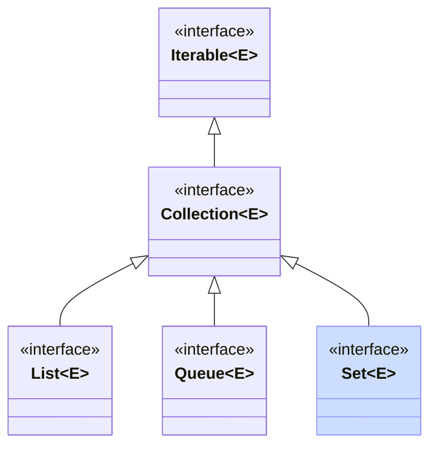
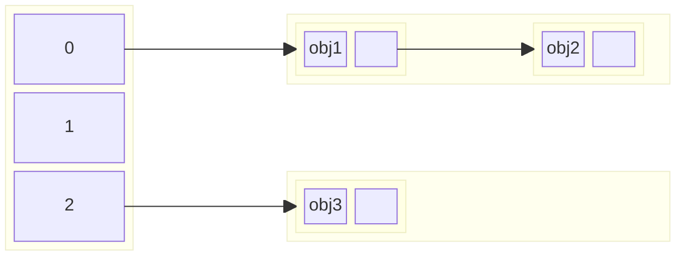

## Set

Alle collecties die we hierboven gezien hebben, kunnen dubbels bevatten.
Bij een `Set` is dat niet het geval. Het is een abstractie voor een wiskundige verzameling: elk element komt hoogstens één keer voor.
In een wiskundige verzameling is ook de volgorde van de elementen niet van belang.
De `Set` interface legt geen volgorde van elementen vast, maar er bestaan sub-interfaces van `Set` (bijvoorbeeld `SequencedSet` en `SortedSet`) die wel toelaten dat de elementen een bepaalde volgorde hebben.

De [`Set`](https://docs.oracle.com/en/java/javase/21/docs/api/java.base/java/util/Set.html) interface voegt in feite geen nieuwe operaties toe aan de Collection-interface. Je kan elementen toevoegen, verwijderen, en nagaan of een element in de verzameling zit.

Het is leerrijk om even stil te staan bij hoe een set efficiënt geïmplementeerd kan worden.
Immers, verzekeren dat er geen duplicaten inzitten vereist dat we gaan zoeken tussen de huidige elementen, en dat wordt al gauw een \\(\mathcal{O}(n)\\) operatie.
We bekijken twee implementaties van hoe dat efficiënter kan: HashSet en TreeSet.

## HashSet

Een HashSet kan gebruikt worden om willekeurige objecten in een set bij te houden.
De objecten worden bijgehouden in een **hashtable** (in essentie een gewone array).
Om te voorkomen dat we een reeds bestaand element een tweede keer toevoegen, moeten we echter snel kunnen nagaan of het toe te voegen element al in de set voorkomt.
De hele hashtable overlopen kost teveel tijd (\\(\mathcal{O}(n)\\) met \\(n\\) het aantal objecten in de set), dus dat moeten we verbeteren.

Een `HashSet` kan nagaan of een element bestaat, alsook een element toevoegen en verwijderen, in \\(\mathcal{O}(1)\\).
De sleutel om dat te doen is de `hashCode()` methode die ieder object in Java heeft.
Die methode moet, voor elk object, een hashCode (een int) teruggeven, zodanig dat als twee objecten gelijk zijn volgens hun `equals`-methode, ook hun hashcodes gelijk zijn.
Gewoonlijk zal je, als je `equals` zelf implementeert, ook `hashCode` moeten implementeren en omgekeerd.
De hashCode moet niet uniek zijn: meerdere objecten mogen dezelfde hashCode hebben, ook al zijn ze niet gelijk (al kan dat tot een tragere werking van een HashSet leiden; zie verder). Hoe uniformer de hashCode verdeeld is over alle objecten, hoe beter.

{}
Java records voorzien standaard een zinvolle equals- en hashCode-methode die afhangt van de attributen van het record.
Deze hoef je dus normaliter niet zelf te voorzien.
{}

De hashCode wordt gebruikt om een index te bepalen in de onderliggende hashtable (array).
De plaats in die hashtable is een **bucket**.
Het element wordt opgeslagen in de bucket op die index.
Als we later willen nagaan of een element al voorkomt in de hashtable, berekenen we opnieuw de index aan de hand van de hashCode en kijken we of het element zich effectief in de overeenkomstige bucket bevindt.

Idealiter geeft elk object dus een unieke hashCode, en zorgen die voor perfecte spreiding van alle objecten in de hashtable.
Er zijn echter twee problemen in de praktijk:

- twee verschillende objecten kunnen dezelfde hashCode hebben. Dat is een **collision**. Hiermee moeten we kunnen omgaan.
- als er teveel elementen toegevoegd worden, moet de onderliggende hashtable dynamisch kunnen uitbreiden. Dat maakt dat elementen plots op een andere plaats (index) terecht kunnen komen als voorheen. Uitbreiden vraagt vaak **rehashing**, oftwel het opnieuw berekenen van de index (nu in een grotere hashtable) aan de hand van de hashcodes. De **load factor** van de hash table geeft aan hoe vol de hashtable mag zijn voor ze uitgebreid wordt. Bijvoorbeeld, een load factor van 0.75 betekent dat het aantal elementen in de hashtable tot 75% van het aantal buckets mag gaan.

Beide problemen zijn al goed onderzocht in de computerwetenschappen.
We overlopen twee technieken voor het eerste probleem (collisions): chaining en probing.

### Chaining

Bij chaining houden we in de hashtable niet rechtstreeks de elementen bij, maar wijzen we in elke bucket naar een afzonderlijke gelinkte lijst.
Elke keer wanneer we een element toevoegen, voegen we een knoop toe aan de gelinkte lijst in de bucket.
Wanneer we een element opvragen, doorlopen we de gelinkte lijst om na te gaan of het element daarin voorkomt.
Als er veel collisions zijn, verliezen we zo natuurlijk het performantie-voordeel van de hashtable.
Inderdaad, in extremis hebben alle objecten dezelfde hashcode, en bevat de hashtable slechts één gelinkte lijst met daarin alle elementen.
Een goede hashfunctie, die elemnten goed verspreidt over de verschillende buckets, is dus essentieel voor de performantie.

### Probing (open addressing)

Een andere techniek om om te gaan met collisions is **probing**.
Als we een element willen toevoegen op een index, en er al een (ander) element op die index staat, berekenen we (volgens een deterministische formule) een volgende index, en proberen we daar opnieuw.
Dat doen we tot we een lege plaats tegenkomen, waar we het element kunnen bijhouden.
Die volgende index kan bijvoorbeeld (heel eenvoudig) index+1 zijn, maar we kunnen ook complexere formules bedenken waarmee we naar een heel andere plaats in de lijst springen.
Bij het opzoeken volgen we hetzelfde stramien: blijven zoeken tot we het element terugvinden, of een lege plaats tegenkomen.
Een element verwijderen wordt nu wel wat complexer: we moeten ervoor zorgen dat we geen lege plaats veroorzaken in de sequentie van indices.

## SortedSet en TreeSet

Naast `Set` bestaat ook de interface [`SortedSet`](https://docs.oracle.com/en/java/javase/21/docs/api/java.base/java/util/SortedSet.html).
In tegenstelling tot een Set, kan een SortedSet geen willekeurige objecten bevatten.
De objecten moeten een volgorde hebben (hetzij door Comparable te implementeren, hetzij door een Comparator-object mee te geven).
De elementen worden steeds in gesorteerde volgorde opgeslagen en teruggegeven.

De [`TreeSet`](https://docs.oracle.com/en/java/javase/21/docs/api/java.base/java/util/TreeSet.html) klasse is een implementatie van SortedSet die gebruik maakt van een gebalanceerde boomstructuur (een [red-black tree](https://en.wikipedia.org/wiki/Red%E2%80%93black_tree) --- de werking daarvan is hier niet van belang).

Alle basisoperaties (add, remove, contains) hebben worst-case tijdscomplexiteit \\(\mathcal{O}(\log n)\\); invoegen en verwijderen zijn best-case \\(\mathcal{O}(1)\\).

