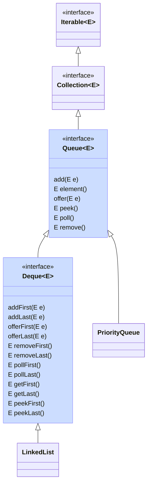
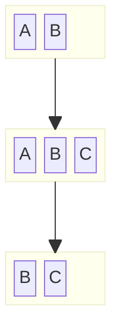
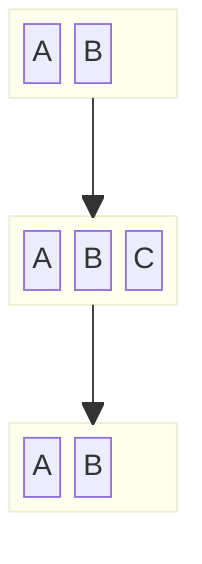

## Queue, Deque

Een [`Queue`](https://docs.oracle.com/en/java/javase/21/docs/api/java.base/java/util/Queue.html) is een collectie die lijkt op een lijst.
Het voornaamste verschil met een lijst is dat een queue specifiek dient om elk toegevoegd elementen er later terug uit te halen, en dat een queue niet toelaat om te werken met de positie (index) van een element.
Het volgende element dat teruggegeven wordt uit de queue wordt het hoofd (**head**) van de queue genoemd, de andere elementen de staart (**tail**).
Er bestaan operaties om het element aan het hoofd van de queue terug te geven en meteen te verwijderen (`poll`), alsook een andere operatie om het hoofd op te vragen zonder het meteen te verwijderen (`peek`). Als er geen elementen in de queue zitten, geven beiden `null` terug.

Sommige subtypes van Queue kunnen begrensd zijn qua capaciteit. Je kan dan geen elementen toevoegen als de queue vol is.

Elementen toevoegen aan een queue kan met `add` of `offer`. De `add`-methode gooit een exception als de queue vol is; `offer` geeft gewoon false terug.
Ook voor `poll` en `peek` bestaan varianten (namelijk `remove` en `element`) die een exception gooien in plaats van null terug te geven als de queue leeg is.

De volgorde waarin elementen teruggegeven worden uit de queue bepaalt het soort queue:

- een **FIFO** (first-in-first-out) queue geeft de elementen terug in de volgorde dat ze toegevoegd zijn: het eerst toegevoegde element wordt eerst teruggegeven
- een **LIFO** (last-in-first-out) queue geeft steeds het laatst toegevoegde element als eerste terug. Dit wordt ook een **stack** genoemd.
- een priority queue laat toe om aan elk toegevoegd element een prioriteit toe te kennen, en geeft de elementen terug volgens die prioriteit

Java voorziet ook een [`Deque`](https://docs.oracle.com/en/java/javase/21/docs/api/java.base/java/util/Deque.html) interface.
Dit staat voor **double-ended queue** en laat toe om elementen vooraan en achteraan toe te voegen aan en te verwijderen uit de deque.
Deze interface erft over van `Queue`.
Bovenop de methodes uit Queue worden methodes toegevoegd met suffix -First en -Last, bijvoorbeeld `pollFirst()` en `offerLast()`.
De methodes uit Queue om elementen toe te voegen (`offer()`, `add()`) komen overeen met `offerLast()` en `addLast()`.
De methodes uit Queue om elementen op te vragen (`peek()`, `poll()`, etc.) komen overeen met `peekFirst()`, `pollFirst()`, etc.

De basisimplementatie in Java, zowel voor de Queue als Deque interface, is de klasse `LinkedList` (een dubbel gelinkte lijst).
In een (dubbel) gelinkte lijst is het immers heel eenvoudig en efficiënt (\\(\mathcal{O}(1)\\)) om een element vooraan of achteraan toe te voegen en te verwijderen.
Afhankelijk van welke methodes je gebruikt, gebruik je een LinkedList dus als FIFO of LIFO queue.

## FIFO queue

In een FIFO queue worden de elementen teruggegeven in de volgorde dat ze toegevoegd zijn:

{}
Welke operaties gebruik je om een Deque (of LinkedList) als FIFO queue te gebruiken?
{}

## LIFO queue (stack)

In een LIFO queue, vaak ook _stack_ genoemd, worden het laatst toegevoegde element eerst teruggegeven:

{}
Welke operaties gebruik je om een Deque (of LinkedList) als LIFO/stack te gebruiken?
{}

## PriorityQueue

De [`PriorityQueue`](https://docs.oracle.com/en/java/javase/21/docs/api/java.base/java/util/PriorityQueue.html) klasse implementeert een priority queue.
De prioriteit van elementen wordt bepaald door:

- ofwel de _natuurlijke ordening_ indien de elementen de `Comparable`-interface implementeren;
- ofwel door een `Comparator`-object dat meegegeven wordt bij het aanmaken van de priority queue.

Deze implementatie is zeer efficiënt voor de vaak voorkomende operaties. De worst-case tijdscomplexiteit om

- het hoofd van de queue op te vragen is \\(\mathcal{O}(1)\\)
- het hoofd van de queue te verwijderen uit de queue is \\(\mathcal{O}(\log n)\\)
- een element aan de queue toe te voegen is \\(\mathcal{O}(\log n)\\)

Nagaan of de queue een element bevat, alsook een willekeurig element verwijderen, is \\(\mathcal{O}(n)\\) --- maar beiden zijn geen typisch gebruik van een queue.
