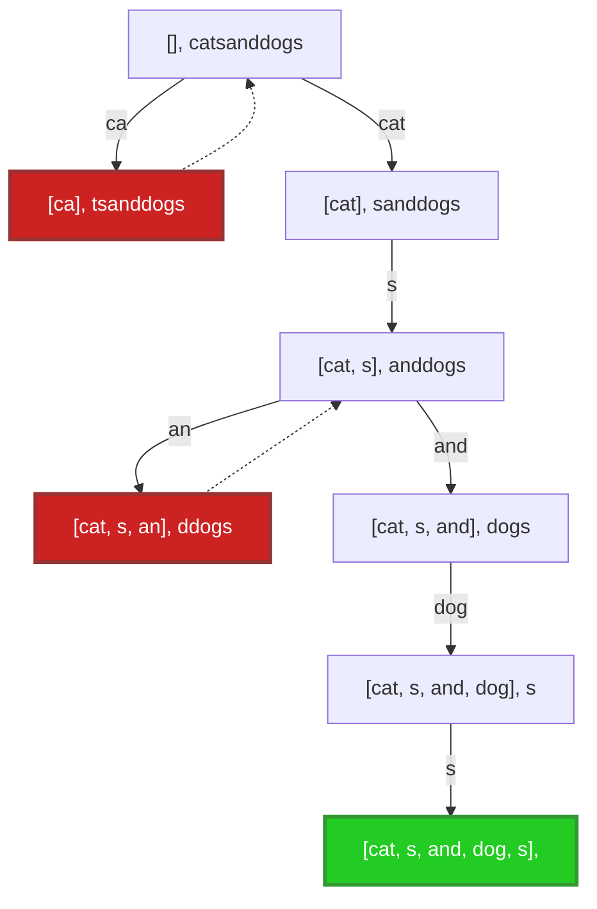
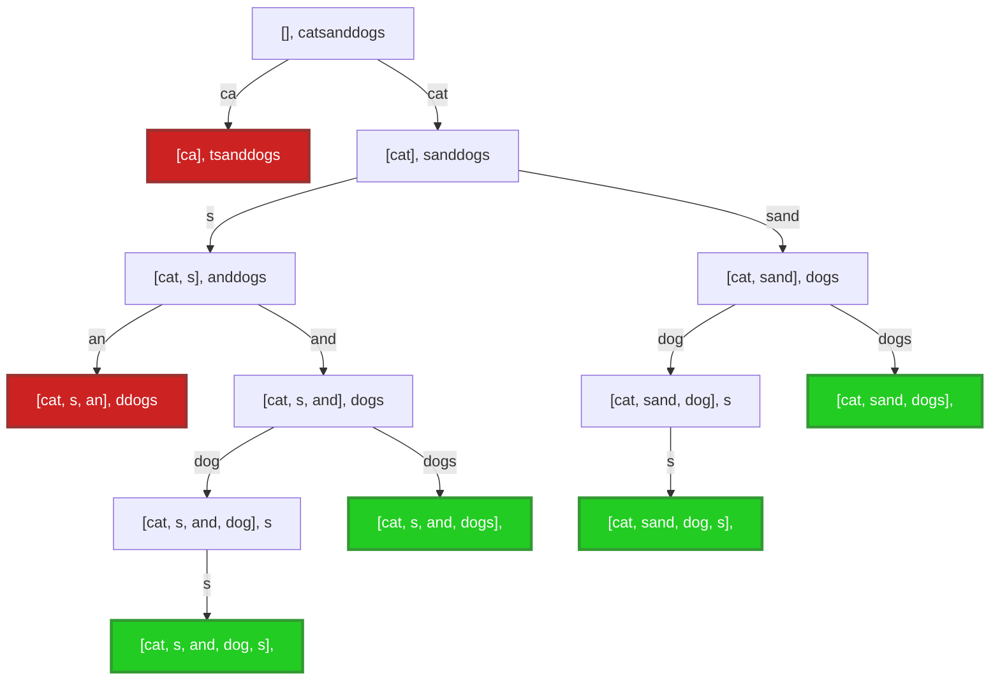
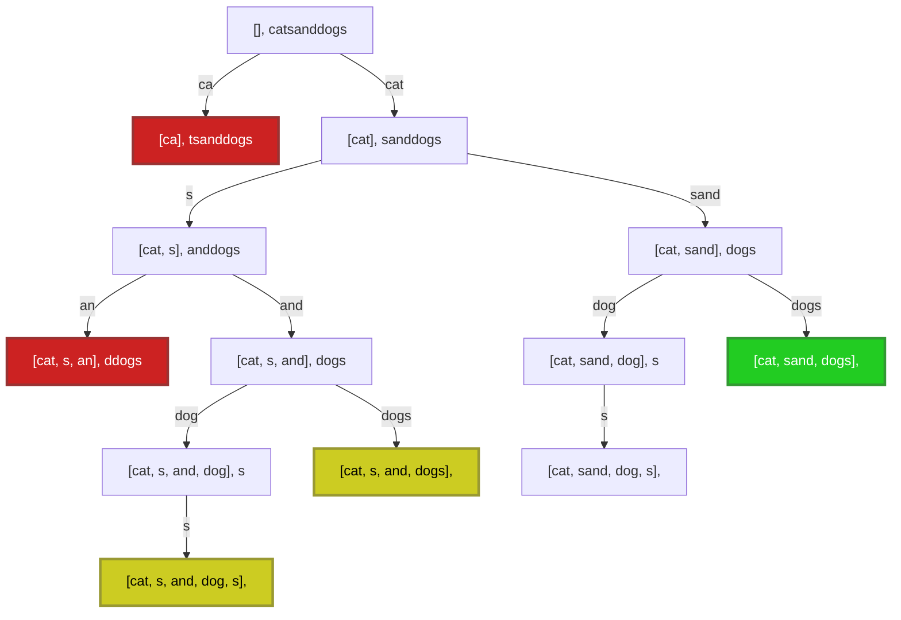

## Wat is backtracking?

Backtracking is een techniek om oplossingen te zoeken voor een probleem.
Een eenvoudig voorbeeld waar je backtracking kan toepassen is de weg zoeken in een doolhof: op elke splitsing waar je kan kiezen welke richting je uitgaat, maak je een keuze.
Als je later niet meer verder blijkt te kunnen, keer je terug naar die splitsing en probeer je een van de andere richtingen.


Meer algemeen werkt een backtracking-algoritme als volgt:
- je vertrekt van een gedeeltelijke oplossing (in het begin is die leeg). In het voorbeeld van de doolhof: het pad dat je al afgelegd hebt om tot bij een splitsing te komen.
- je breidt die gedeeltelijke oplossing stapsgewijs uit naar een volledige(re) oplossing, waar je bij elke uitbreiding een keuze maakt.
  Wanneer die keuze later niet blijkt te leiden tot een geschikte oplossing, keer je terug naar dat keuzepunt (_backtracking_) en maak je een andere keuze.
  In het voorbeeld van de doolhof: als je vastzit, keer keer je terug naar de vorige splitsing, en je kiest een andere gang.
  Als je alle gangen geprobeerd hebt zonder resultaat, keer je terug naar de splitsing daarvoor, etc.

Een backtracking-algoritme maakt meestal gebruik van _recursie_.
De stack die impliciet gebruikt wordt bij recursie is immers heel handig om bij te houden welke keuzes al gemaakt werden, en in welke volgorde.

## Voorbeeld: token segmentatie

Het token segmentatie probleem bestaat erin na te gaan of je een gegeven string kan bekomen als sequentie van een of meerdere tokens uit een gegeven lijst van tokens.
Bijvoorbeeld: voor de string `"catsanddogs"` en de tokenlijst `[s, an, ca, cat, dog, and, sand, dogs]` zijn volgende segmentaties mogelijk:

- `cat sand dogs`
- `cat sand dog s`
- `cat s and dog s`
- `cat s and dogs`

Met dezelfde woordenlijst kan de string `acatandadog` niet gesegmenteerd worden.

We bespreken hieronder hoe we dit probleem kunnen oplossen met backtracking.
We beschouwen drie varianten:

- uitzoeken of er minstens één segmentatie bestaat (en die teruggeven)
- alle mogelijke segmentaties teruggeven
- de segmentatie die het minst aantal tokens gebruikt teruggeven.

## Eén (willekeurige) oplossing zoeken

De essentie van een backtracking-algoritme is het zoeken van één oplossing.
Dit ligt ook aan de basis van de andere twee varianten (zoeken van alle oplossingen en zoeken van een optimale oplossing).
Het achterliggend idee is zeer eenvoudig: probeer telkens iets, en als dat niet tot een oplossing leidt, keer terug en probeer iets anders, tot je een oplossing gevonden hebt of alles geprobeerd hebt (dan is er geen oplossing).
We bekijken nu hoe we dit idee concreet kunnen beschrijven met een algoritme.

### Voorbeeld: token segmentatie

Stel: we willen voor het segmentatie-probleem een (willekeurige) oplossing teruggeven (als die bestaat).
De oplossing zoeken met een backtracking-algoritme zal, zoals gezegd, gebaseerd zijn op recursie.
Dus: om token segmentatie voor een string van lengte \( n \) te doen, veronderstellen we dat we dit al kunnen oplossen voor alle strings van lengte \( n' < n \).
Het basisgeval is een lege string segmenteren; we moeten dan geen tokens gebruiken.

We moeten nu enkel nog nadenken over hoe een oplossing voor een kortere string ons precies kan helpen om het hele probleem op te lossen.
> Denk hier zelf even over na

Hier is een idee: wat als we, voor elke mogelijke token, nagaan of die overeenkomt met het begin van de string, en als dat zo is, die token wegknippen uit het begin van de string?
Zo wordt de string korter, en kunnen we recursie gebruiken om het probleem verder op te lossen voor die kortere string.
De oplossing voor het hele probleem bestaat dan uit de weggeknipte token, gevolgd door de tokens die nodig zijn om de kortere string op te bouwen (die bekomen we via de recursie).

We maken dus telkens één keuze, namelijk welk token (uit de lijst van mogelijke tokens) we proberen te matchen met het begin van de string.

Hieronder zie je een zoekboom die een mogelijke uitvoering van dat idee weergeeft voor de string `catsanddogs` en de tokenlijst `[s, an, ca, cat, dog, and, sand, dogs]`.
Om die te begrijpen, beginnen we bovenaan.
In de rechthoeken staat telkens de lijst van tokens die we tot dan toe gekozen hebben, en de resterende string.
In het begin hebben we nog geen tokens gekozen (`[]`), en is de resterende string nog gelijk aan de volledige string `catsanddogs`.
De pijltjes geven aan welke token we kiezen (we tonen enkel de tokens die overeenkomen met het begin van de string; de anderen leiden sowieso tot niets).
We volgen steeds eerst de linkerpijl naar beneden.
De gestippelde lijnen geven aan waar we backtracken.

Een situatie die niet tot een oplossing kan leiden (geen enkele token komt overeen met het begin van de string) wordt rood gekleurd; we gaan dan terug een knoop naar boven en nemen de volgende tak.
De gevonden oplossing wordt in het groen aangeduid. Eens deze gevonden is, zoeken we niet meer verder.




De informatie in de rechthoeken stelt de _gedeeltelijke/partiële oplossing_ voor die we bijhouden.
Die bevat hier dus twee zaken:

- de reeds gebruikte token-sequentie (initieel een lege lijst)
- het deel van de string dat nog overblijft (initieel de hele string)

Nadat we een token gekozen hebben, moeten we deze gedeeltelijke oplossing uitbreiden (aanpassen) op basis van die keuze.
Om dat te doen, moeten we
- nakijken of het gekozen token voorkomt aan het begin van de resterende string
- dat token toevoegen aan de lijst van gebruikte tokens
- de resterende string inkorten, door het token vooraan te verwijderen

Eens we dat gedaan hebben, kiezen we opnieuw een token en doen we hetzelfde.
Die herhaling gebeurt door middel van recursie.

We hebben een oplossing gevonden wanneer het overblijvende deel van de string leeg is.

Als later zou blijken dat een gemaakte keuze fout was (dus dat we met die keuze niet tot een oplossing komen), moeten we deze keuze ongedaan maken (_backtracken_, overeenkomstig de gestippelde pijlen).
Om dat te doen, verwijderen we het laatste token terug uit de token-sequentie, en moeten we zorgen dat we terug de niet-ingekorte string gebruiken.
We proberen dan opnieuw met een ander token.

Hoe ziet dat eruit in code? Zo:

```java
private static List<String> findAny(String remainingString,
                                    List<String> allTokens,
                                    List<String> usedTokens) {
    // basisgeval
    if (remainingString.isEmpty()) return usedTokens;

    for (String tok : allTokens) {
        // probeer token tok
        if (remainingString.startsWith(tok)) {
            // uitbreiden gedeeltelijke oplossing
            usedTokens.add(tok); 
            var shorterString = remainingString.substring(tok.length());
            // recursief verder zoeken
            var solution = findAny(shorterString, allTokens, usedTokens);
            if (solution != null) {
                return solution;
            } else {
                // ongedaan maken
                usedTokens.removeLast();
            }
        }
    }
    return null;
}
```

De gedeeltelijke oplossing wordt voorgesteld met de twee parameters `remainingString` en `usedTokens`.
Het basisgeval komt overeen met een lege string; we hebben dan een oplossing gevonden.
Die oplossing zit in de parameter `usedTokens`.

Als de string niet leeg is, proberen we alle tokens beurt om de beurt uit.
- Als een token niet overeenkomt met het begin van de string, kunnen we die token meteen overslaan.
- Als die wel overeenkomt met het begin, voegen we de token toe aan de lijst met gebruikte keuzes en korten we de string in door de token vooraan te verwijderen.
  We zoeken vervolgens recursief verder naar een oplossing.
  Als we een oplossing vinden, hebben we meteen ook een oplossing voor het hele probleem.
  Zo niet, dan verwijderen we onze token terug uit de lijst van gebruikte tokens, vooraleer we opnieuw proberen met de volgende token.
  (De string hoeven we niet terug langer te maken; we kunnen gewoon `remainingString` blijven gebruiken)

Als we alle tokens geprobeerd hebben zonder een oplossing te vinden (`return solution` werd nooit uitgevoerd), dan is er geen oplossing en geven we `null` terug.

Om deze methode wat eenvoudiger bruikbaar te maken, kunnen we het worker-wrapper patroon toepassen. 
We voegen dan een tweede `findAny`-methode toe, die geen lijst van gebruikte tokens bevat, en de methode hierboven oproept met een lege lijst.

```java
public static List<String> findAny(String string, List<String> tokens) {
    return findAny(string, tokens, new ArrayList<>());
}

public static void main(String[] args) {
    // voorbeeld van gebruik
    System.out.println(findAny("catsanddogs", 
                               List.of("s", "an", "ca", "cat", "dog", "and", "sand", "dogs")));
}
```


### Skelet-programma (algemeen)

Backtracking-algoritmes volgen vaak een gelijkaardige structuur.
Naast een voorbeeld geven we daarom telkens ook een **skelet-programma**: een algemene structuur die je vaak kan herbruiken.
Backtracking-algoritmes draaien allemaal rond het gebruik van een **partiële oplossing**: dat is de sequentie van keuzes die je reeds gemaakt hebt, en de toestand waarin je je daardoor bevindt.
Voor elk probleem zal je een geschikte representatie (datastructuur) moeten kiezen voor je partiële oplossing.
Om de skelet-programma's algemeen te houden, gebruiken we hiervoor volgende interfaces (het zal later duidelijk worden waarvoor de verschillende methodes precies dienen):

```java
interface PartialSolution {
    boolean isComplete();  // volledige oplossing?
    boolean shouldAbort(); // leidt sowieso niet tot oplossing?
    Collection<Extension> extensions(); // mogelijke keuzes/extensies
    Solution toSolution(); // zet om naar finale oplossing
    boolean canImproveUpon(Solution solution); // vergelijken van oplossingen
}

public interface Extension {
    void apply(PartialSolution solution); // pas keuze toe op partiële oplossing
    void undo(PartialSolution solution);  // maak keuze ongedaan
}

interface Solution {
    boolean isBetterThan(Solution other); // vergelijken van oplossingen
}
```

In de algoritmes die je zelf schrijft zal je natuurlijk niet exact deze interfaces gebruiken, maar kan je zelf kiezen hoe je de oplossingen best voorstelt.
Maar zelfs zonder deze interfaces te gebruiken is het vaak wel nuttig om eens na te denken over hoe je de operaties uit de interfaces kan uitvoeren met jouw voorstelling.

### Skelet-programma: een willekeurige oplossing zoeken

Onderstaande code geeft het skelet om eender welke oplossing voor het probleem te vinden.
We maken gebruik van het worker-wrapper patroon.
Het eigenlijke werk gebeurt in de recursieve `findAnySolution`-methode.
Die zoekt een oplossing voor het hele probleem, vertrekkend van een gegeven partiële oplossing.

- We gaan eerst na of de huidige partiële oplossing toevallig al een oplossing is voor het hele probleem (hier via de `isComplete()`-methode). Dit is het basisgeval voor de recursie. Als dat zo is, moeten we niet verder zoeken, en geven we de oplossing terug. Soms moeten we nog enkele bewerkingen doen om de partiële oplossing om te zetten in het verwachte formaat van de oplossing. Dat wordt hier aangeduid met de `toSolution()`-methode.
- Soms kan je op voorhand al snel zien dat een partiële oplossing nooit tot een oplossing kan leiden (`shouldAbort()`). Dan geven we meteen op, en geven we `null` terug (geen oplossing).
- In alle andere gevallen overlopen we elke mogelijke uitbreiding (keuze) van de partiële oplossing (gegenereerd met `extensions()`).
  We veranderen de partiële oplossing door elk van de uitbreidingen (één voor één) toe te passen (`apply()`).
  Dan zoeken we recursief naar een volledige oplossing, vertrekkend van die uitgebreide partiële oplossing.
  Zodra we zo een (volledige) oplossing bekomen, geven we die terug.
  Als een uitbreiding niet tot een oplossing leidt, maken we ze ongedaan (`undo()`) en proberen we de volgende uitbreiding.
- Als we alle mogelijke uitbreidingen overlopen hebben, en geen oplossing gevonden hebben, geven we op.
  We geven `null` terug.

```java
public Solution solve() {
    PartialSolution initial = createInitialSolution();
    return findAnySolution(initial);
}

private Solution findAnySolution(PartialSolution current) {
    if (current.isComplete()) return current.toSolution();
    if (current.shouldAbort()) return null;
    for (var extension : current.extensions()) {
        extension.apply(current);
        var solution = findAnySolution(current);
        if (solution != null) {
            return solution;
        } else {
            extension.undo(current);
        }
    }
    return null;
}
```

{}

Vergelijk deze skelet-code met de code voor het token segmentatie voorbeeld.
Herken je de verschillende onderdelen?

```java
private static List<String> findAny(String remainingString,
                                    List<String> allTokens,
                                    List<String> usedTokens) {
    // if (current.isComplete()) return current.toSolution();
    if (remainingString.isEmpty()) return usedTokens;

    // if (current.shouldAbort()) return null;

    // for (var extension : current.extensions()) {
    for (String tok : allTokens) {
        if (remainingString.startsWith(tok)) {
            // extension.apply(current);
            usedTokens.add(tok); 
            var shorterString = remainingString.substring(tok.length());
            // var solution = findAnySolution(current);
            var solution = findAny(shorterString, allTokens, usedTokens);
            if (solution != null) {
                return solution;
            } else {
                // extension.undo(current);
                usedTokens.removeLast();
            }
        }
    }
    return null;
}
```

_(Onze code voor token segmentatie bevat geen code die overeenkomt met `shouldAbort`.)_

{}

## Alle oplossingen zoeken

Een variant van het zoeken van één oplossing is het zoeken van alle oplossingen.
Om dat te doen, doen we in essentie hetzelfde als bij het zoeken van één oplossing.
Nadat we een oplossing gevonden hebben, stoppen we echter niet: we houden de gevonden oplossing bij en gaan (met backtracking) verder op zoek naar eventuele andere oplossingen.

### Voorbeeld: token segmentatie

Stel: we willen niet één, maar _alle_ mogelijke segmentaties zoeken.
We kunnen vertrekken van de versie om één oplossing te zoeken, maar moeten dan enkele wijzigingen doorvoeren.

Een eerste duidelijke wijziging is het terugkeertype. In plaats van één lijst van tokens, moeten we nu meerdere lijsten van tokens kunnen teruggeven.
We kiezen daarom voor `List<List<String>>` als terugkeertype.

Een tweede wijziging komt voort vanuit het volgende inzicht.
Waar we bij het zoeken van 1 oplossing meteen konden stoppen eens we een oplossing gevonden hadden, zullen we bij het zoeken naar alle oplossingen verder moeten backtracken nadat we een oplossing tegengekomen zijn.
Dat betekent dat, op het moment dat we een oplossing vinden, we die ergens willen 'wegschrijven'.
We voegen daarom een extra parameter toe, een lijst `foundSoFar`, die alle oplossingen voorstelt die we eerder al gevonden hebben.
Telkens we een nieuwe oplossing tegenkomen, voegen we die toe aan `foundSoFar`.
Nadat we (via backtracking) alle keuzes doorlopen hebben, bevat `foundSoFar` alle gevonden oplossingen.

Een derde wijziging is dat we geen `null` meer teruggeven als we geen oplossing vinden; als er geen oplossingen zijn voor het probleem, vertaalt zich dat in een lege lijst van oplossingen.

In code:

```java
public static List<List<String>> findAll(String string, List<String> tokens) {
    return findAll(string, tokens, new ArrayList<>(), new ArrayList<>());
}

private static List<List<String>> findAll(String remainingString,
                                          List<String> allTokens,
                                          List<String> usedTokens,
                                          List<List<String>> foundSoFar) {
    if (remainingString.isEmpty()) {
        foundSoFar.add(List.copyOf(usedTokens));
        return foundSoFar;
    };

    for (String tok : allTokens) {
        if (remainingString.startsWith(tok)) {
            usedTokens.add(tok);
            var shorterString = remainingString.substring(tok.length());
            findAll(shorterString, allTokens, usedTokens, foundSoFar);
            usedTokens.removeLast();
        }
    }
    return foundSoFar;
}
```

Belangrijk om op te merken is dat we de lijst `usedTokens` kopiëren wanneer we die toevoegen aan de lijst `foundSoFar`.
Dat is noodzakelijk: de `usedTokens`-lijst is immers deel van de partiële oplossing, en die lijst zal later nog aangepast (bijvoorbeeld met `.removeLast()`) wanneer we verder naar oplossingen zoeken.
In het vorige voorbeeld was dit niet essentieel; zodra we een oplossing vonden, gaven we de gevonden lijst meteen terug en stopten we met zoeken.

In de uitvoeringsboom voor het zoeken van alle oplossingen zien we dat alle mogelijkheden overlopen en teruggegeven worden.
Alle groene knopen zijn oplossingen, en zullen (van links naar rechts) aan de lijst `foundSoFar` toegevoegd worden.



Dit duurt uiteraard een stuk langer dan enkel de eerste oplossing teruggeven.
We doorlopen immers steeds alle mogelijkheden.

### Skelet-programma: alle oplossingen zoeken

We geven opnieuw een skelet-programma, dit keer om _alle_ oplossingen voor het probleem te vinden.

Het eigenlijke werk gebeurt in de recursieve `findAllSolutions`-methode.
Die doet grotendeels hetzelfde als de `findAnySolution`-methode uit het skelet-programma voor één oplossing.
Het verschil is dat er nu een extra parameter is, namelijk een collectie van alle tot dan toe gevonden (volledige) oplossingen, `solutionsSoFar`.
Elke keer een nieuwe oplossing gevonden wordt, voegen we die toe aan `solutionsSoFar`.
De extra parameter wordt geïnitialiseerd in `solve` met een lege lijst.

```java
public Collection<Solution> solve() {
    PartialSolution initial = createInitialSolution();
    return findAllSolutions(initial, new ArrayList<>());
}

private Collection<Solution> findAllSolutions(PartialSolution current, Collection<Solution> solutionsSoFar) {
    if (current.isComplete()) {
        solutionsSoFar.add(current.toSolution());
        return solutionsSoFar;
    }
    if (current.shouldAbort()) return solutionsSoFar;
    for (var extension : current.extensions()) {
        extension.apply(current);
        findAllSolutions(current, solutionsSoFar);
        extension.undo(current);
    }
    return solutionsSoFar;
}
```

{}

Vergelijk deze skelet-code opnieuw met de code voor het token segmentatie voorbeeld.
Herken je de verschillende onderdelen?

```java
private static List<List<String>> findAll(String remainingString,
                                          List<String> allTokens,
                                          List<String> usedTokens,
                                          List<List<String>> foundSoFar) {
    // if (current.isComplete()) {
    if (remainingString.isEmpty()) {
        // solutionsSoFar.add(current.toSolution());
        foundSoFar.add(List.copyOf(usedTokens));
        // return solutionsSoFar;
        return foundSoFar;
    };

    // if (current.shouldAbort()) return solutionsSoFar;

    // for (var extension : current.extensions()) {
    for (String tok : allTokens) {
        if (remainingString.startsWith(tok)) {
            // extension.apply(current);
            usedTokens.add(tok);
            var shorterString = remainingString.substring(tok.length());
            // findAllSolutions(current, solutionsSoFar);
            findAll(shorterString, allTokens, usedTokens, foundSoFar);
            // extension.undo(current);
            usedTokens.removeLast();
        }
    }
    // return solutionsSoFar;
    return foundSoFar;
}
```

{}

## Een optimale oplossing zoeken

De laatste variant die we beschouwen is het zoeken van een _optimale_ oplossing voor een probleem.
Je zou dat kunnen doen door eerst alle oplossingen te zoeken, en dan in die lijst van oplossingen de meest optimale oplossing te zoeken.
Het bijhouden van alle oplossingen kan in sommige gevallen echter leiden tot een te hoog geheugengebruik. 
In plaats van alle oplossingen bij te houden, is het daarom beter om enkel de (tot dantoe) beste oplossing te bewaren.

Het zoeken van een optimale oplossing duurt dus meestal even lang als het zoeken van alle oplossingen, maar niet altijd.
Soms is het zinloos om nog naar oplossingen te blijven zoeken die sowieso nooit beter kunnen zijn dan een reeds eerder gevonden oplossing.
Je kan immers meteen stoppen met zoeken wanneer je weet dat de huidige partiële oplossing nooit meer tot een betere finale oplossing kan leiden dan de tot dan toe beste oplossing.
Dat kan een hoop werk besparen, en de tijd gevoelig inkorten.

### Voorbeeld: token segmentatie

De optimale oplossing wordt gedefinieerd als de oplossing die de string splitst in het minst aantal tokens.

De wijzigingen ten opzichte van het algoritme om alle oplossingen te zoeken zijn devolgende:
1. Ten eerste hoeven we geen lijst van oplossingen meer bij te houden, maar enkel de tot dan toe beste oplossing.
   Dat doen we in een variabele `bestSoFar`. Die variabele is `null` wanneer er nog geen oplossing gevonden werd (bijvoorbeeld bij de start van de zoektocht).
2. Ten tweede moeten we, wanneer we een oplossing gevonden hebben, nagaan of die beter is dan de vorige beste oplossing (als die er is).
   Aangezien we zoeken naar de splitsing met het minst aantal tokens, vergelijken we op basis van de lengte van de oplossing.
   We geven de kortste van de twee terug.
3. Tenslotte kijken we of we de zoektocht voortijdig kunnen staken.
   Wanneer de huidige splitsing al meer tokens bevat dan de beste splitsing die we op dat moment kennen, heeft het geen zin om nog verder te zoeken.
   Er kunnen immers enkel tokens bijkomen.

Zoek deze wijzigingen in onderstaande code:

```java
public static List<String> findShortest(String string, List<String> tokens) {
    return findShortest(string, tokens, new ArrayList<>(), null);
}

private static List<String> findShortest(String remainingString,
                                         List<String> allTokens,
                                         List<String> usedTokens,
                                         List<String> bestSoFar) { // 1. 
    if (remainingString.isEmpty()) {
        var solution = List.copyOf(usedTokens);
        // 2.
        if (bestSoFar == null || solution.size() < bestSoFar.size()) {
            return solution;
        } else {
            return bestSoFar;
        }
    };

    // 3.
    if (bestSoFar != null && bestSoFar.size() <= usedTokens.size()) {
        return bestSoFar;
    }

    for (String tok : allTokens) {
        if (remainingString.startsWith(tok)) {
            usedTokens.add(tok);
            var shorterString = remainingString.substring(tok.length());
            bestSoFar = findShortest(shorterString, allTokens, usedTokens, bestSoFar);
            usedTokens.removeLast();
        }
    }
    return bestSoFar;
}
```

Merk op dat we na de recursieve oproep ook de variabele `bestSoFar` aanpassen, voor het geval de recursieve oproep een betere oplossing gevonden heeft.


De uitvoeringsboom ziet er als volgt uit.
De gele knopen zijn oplossingen die op een bepaald moment de beste oplossing waren, maar later vervangen zijn door een nog betere oplossing.



### Skelet-programma: optimale oplossing

Ook het zoeken naar een optimale oplossing via backtracking heeft vaak dezelfde vorm.
We bespreken daarom een derde skelet-programma.

Het eigenlijke werk gebeurt opnieuw in de recursieve `findOptimalSolution`-methode.
Die doet grotendeels hetzelfde als bij het programma om één of alle oplossingen te zoeken.
Het speciale hier is een extra parameter, namelijk de beste tot dan toe gevonden (volledige) oplossing `bestSoFar`.
Elke keer een nieuwe oplossing gevonden wordt, vergelijken we die met de beste tot dan toe (via `isBetterThan`), en geven de betere van de twee terug.
De extra parameter wordt geïnitialiseerd in `solve` met `null`: er is nog geen oplossing om mee te vergelijken.

Merk op dat we dus niet eerst alle oplossingen zoeken en bijhouden om daarna de beste te selecteren; we houden enkel de beste oplossing tot dan toe bij en vergelijken daarmee.

Daarenboven voegen we nog een optimalisatie toe: als we op een bepaald moment merken dat de huidige partiële oplossing nooit meer kan uitgroeien tot een oplossing die beter is dan de beste reeds gekende oplossing, dan stoppen we met zoeken op basis van die partiële oplossing.
Bijvoorbeeld, wanneer we een kortste pad zoeken in een doolhof en het huidige pad (waarmee we nog niet uit het doolhof zijn) is al langer dan het tot dan toe beste pad (dat wel reeds heel het doolhof oploste), dan hoeven we niet meer verder te zoeken: extra stappen toevoegen zal immers nooit kunnen leiden tot een korter pad.
We modelleren dit met de `canImproveUpon`-methode.

```java
public Solution solve() {
    PartialSolution initial = createInitialSolution();
    return findOptimalSolution(initial, null);
}

private Solution findOptimalSolution(PartialSolution current, Solution bestSoFar) {
    if (current.isComplete()) {
        var solution = current.toSolution();
        if (bestSoFar == null || solution.isBetterThan(bestSoFar)) {
            return solution;
        } else {
            return bestSoFar;
        }
    }
    if (current.shouldAbort() ||
            (bestSoFar != null && !current.canImproveUpon(bestSoFar))) {
        return bestSoFar;
    }
    for (var extension : current.extensions()) {
        extension.apply(current);
        bestSoFar = findOptimalSolution(current, bestSoFar);
        extension.undo(current);
    }
    return bestSoFar;
}
```

{}

Vergelijk deze skelet-code opnieuw met de code voor het token segmentatie voorbeeld.
Herken je de verschillende onderdelen?

```java
private static List<String> findShortest(String remainingString,
                                         List<String> allTokens,
                                         List<String> usedTokens,
                                         List<String> bestSoFar) {
    // if (current.isComplete()) {
    if (remainingString.isEmpty()) {
        // var solution = current.toSolution();
        var solution = List.copyOf(usedTokens);
        // if (bestSoFar == null || solution.isBetterThan(bestSoFar)) {
        if (bestSoFar == null || solution.size() < bestSoFar.size()) {
            return solution;
        } else {
            return bestSoFar;
        }
    };

    // if (current.shouldAbort() ||
    //      (bestSoFar != null && !current.canImproveUpon(bestSoFar))) {
    if (bestSoFar != null && bestSoFar.size() <= usedTokens.size()) {
        return bestSoFar;
    }

    // for (var extension : current.extensions()) {
    for (String tok : allTokens) {
        if (remainingString.startsWith(tok)) {
            // extension.apply(current);
            usedTokens.add(tok);
            var shorterString = remainingString.substring(tok.length());
            // bestSoFar = findOptimalSolution(current, bestSoFar);
            bestSoFar = findShortest(shorterString, allTokens, usedTokens, bestSoFar);
            // extension.undo(current);
            usedTokens.removeLast();
        }
    }
    return bestSoFar;
}
```

{}

## Efficiëntie van backtracking

Backtracking is vaak niet heel efficiënt.
Bijvoorbeeld, als er \\( k \\) keuzepunten zijn, en je bij elke keuzepunt precies \\( m\\) mogelijkheden hebt, dan zijn er in totaal \\( m^k \\) mogelijke paden die je moet proberen.
Door snel te herkennen wanneer een partiële oplossing niet zal leiden tot een geschikte oplossing, en de zoekoperatie dan onmiddellijk af te breken, kan je het algoritme soms wel een pak efficiënter maken.

## Kopiëren vs. aanpassen en herstellen

In de skeletten hierboven maakten we steeds gebruik van `apply()` en `undo()`: we passen de partiële oplossing aan (door ze uit te breiden), en maken die aanpassing later weer ongedaan.
Dat gaat makkelijk als de aanpassing eenvoudig ongedaan te maken is, bijvoorbeeld een element toevoegen aan een lijst en dat nadien weer verwijderen.

Als het ongedaan maken niet zo eenvoudig is (bijvoorbeeld omdat er na de aanpassing heel wat herberekend wordt), is het vaak eenvoudiger om de volledige toestand eerst te **kopiëren** en verder te werken met deze kopie.
Dat heeft als nadeel een **hoger geheugengebruik**, maar vereenvoudigt het uitbreiden en herstellen van de partiële oplossing wel aanzienlijk.
Je hoeft immers **niets ongedaan te maken**; aangezien alle aanpassingen op een kopie gebeurd zijn, kan je gewoon teruggrijpen naar de originele toestand.
Die is ongewijzigd, aangezien alle aanpassingen op een kopie gebeurden.

Hieronder zie je een voorbeeld hiervan (een variant om één oplossing te zoeken voor het token segmentatie probleem).
De commentaarregels geven aan wat er van belang is.

```java
private static List<String> findAny(String remainingString,
                                    List<String> allTokens,
                                    List<String> usedTokens) {
    if (remainingString.isEmpty()) return usedTokens;

    for (String tok : allTokens) {
        if (remainingString.startsWith(tok)) {
            // uitbreiding gedeeltelijke oplossing OP EEN KOPIE
            var copyOfUsedTokens = new ArrayList<>(usedTokens);
            copyOfUsedTokens.add(tok); 
            var shorterString = remainingString.substring(tok.length());
            // recursief verder zoeken OP BASIS VAN DE KOPIE
            var solution = findAny(shorterString, allTokens, copyOfUsedTokens);
            if (solution != null) {
                return solution;
            } else {
                // we hoeven hier NIETS ongedaan te maken,
                // de volgende iteratie gebruikt opnieuw de originele usedTokens-lijst
            }
        }
    }
    return null;
}
```