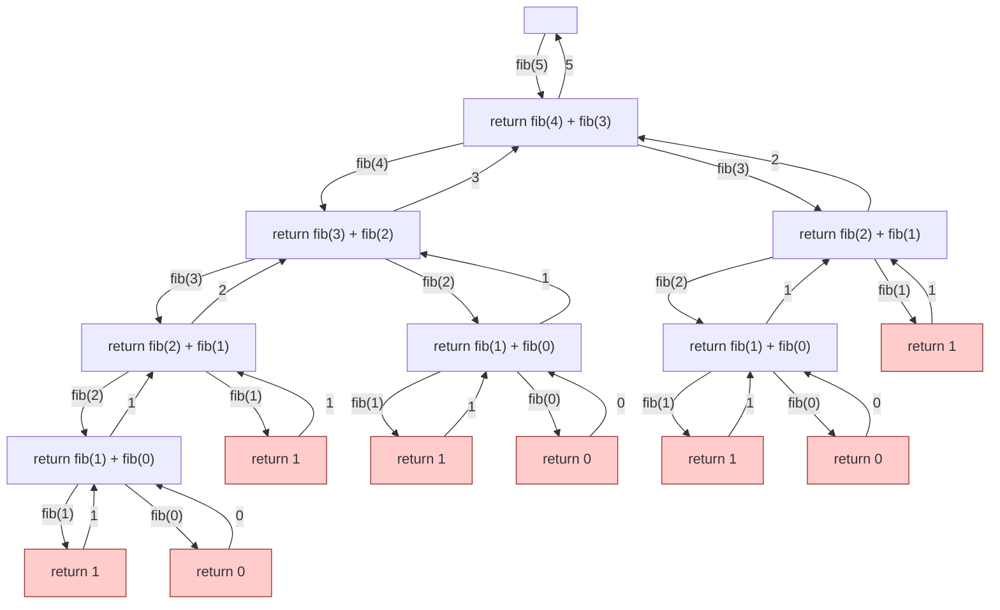
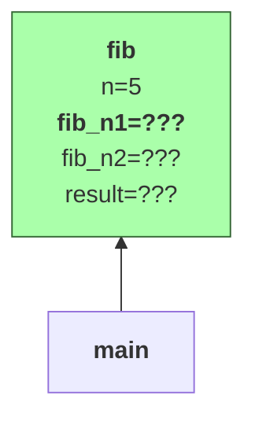
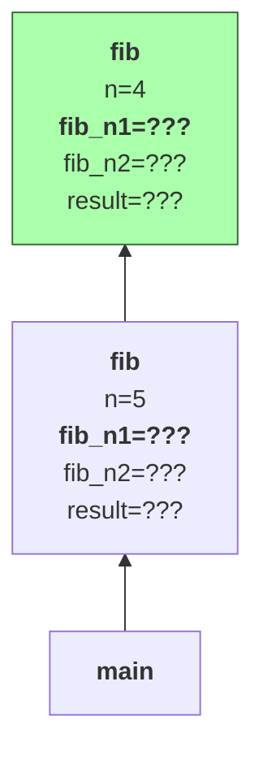
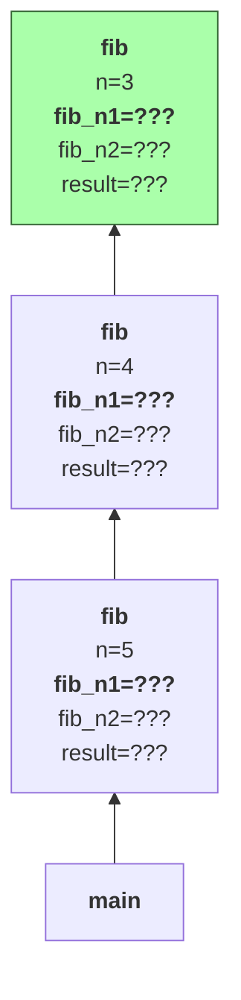
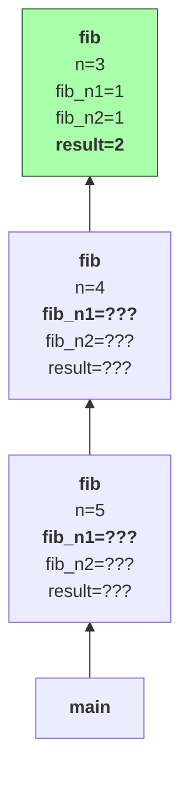
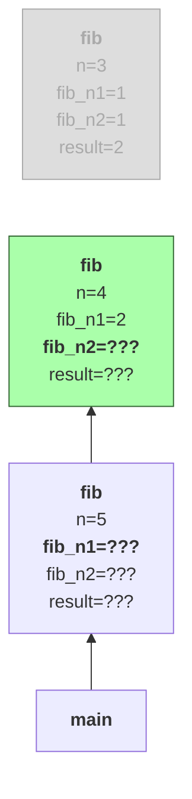
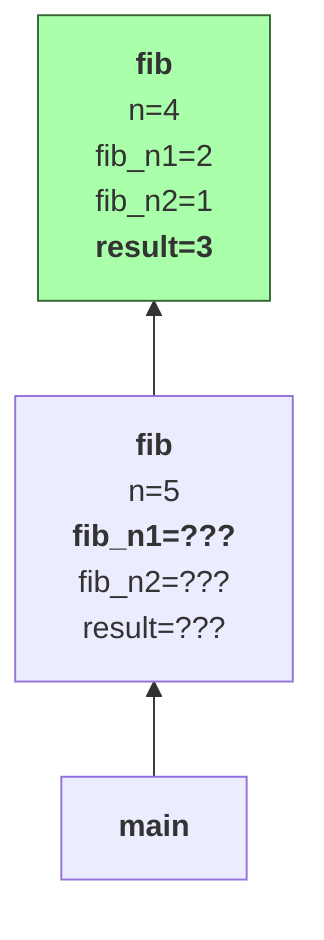
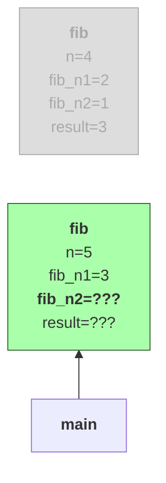
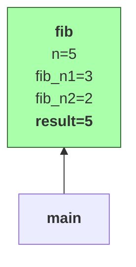
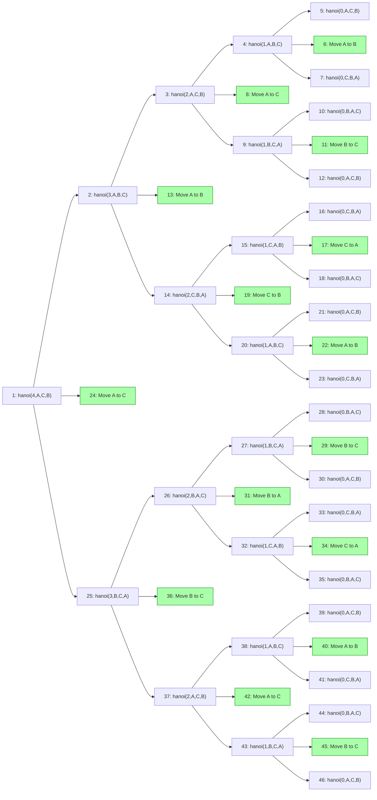

## Wat is recursie?

Wiskundig gezien zijn recursieve functies functies die zichzelf één of meerdere keren oproepen.
Een gekend voorbeeld is **faculteit**: \( n! = n \times (n-1)! \) met \( 0! = 1 \).
Bijvoorbeeld:

\(\begin{align} 
5! & = 5 \times 4! \\\\
& = 5 \times (4 \times 3!) \\\\
& = 5 \times (4 \times (3 \times 2!)) \\\\
& = 5 \times (4 \times (3 \times (2 \times 1!))) \\\\
& = 5 \times (4 \times (3 \times (2 \times (1 \times 0!)))) \\\\
& = 5 \times (4 \times (3 \times (2 \times (1 \times 1)))) \\\\
& = 120
\end{align}\)

Een ander gekend voorbeeld zijn de **Fibonacci**-getallen \\( 0, 1, 1, 2, 3, 5, 8, 13, 21, \ldots \\), gegeven door volgende recursieve vergelijking:
\( F(n) = F(n-1) + F(n-2) \) met \( F(1) = 1 \) en \( F(0) = 0 \).

In Java kunnen we ook recursieve methodes definiëren.
Hier is bijvoorbeeld een recursieve methode om de faculteit van een getal te berekenen:

```java
public static int fac(int n) {
  if (n < 0) throw new IllegalArgumentException("n must be non-negative");
  if (n == 0) return 1;
  return n * fac(n-1);
}
```

Merk op hoe dicht de implementatie aanleunt bij de wiskundige definitie.
Dat geldt ook voor de methode om het n-de Fibonacci-getal te berekenen:

```java
public static int fib(int n) {
  if (n < 0) throw new IllegalArgumentException("n must be non-negative");
  if (n == 0) return 0;
  if (n == 1) return 1;
  return fib(n-1) + fib(n-2);
}
```

Merk op hoe de functie zichzelf tweemaal oproept.

De recursie eindigt wanneer een basisgeval bereikt wordt.
Dat is een situatie (meestal een zeer eenvoudige) waar het antwoord onmiddellijk gekend is, en geen recursieve oproep meer nodig is.
In bovenstaande code voor `fib` zijn de basisgevallen de oproepen waarin `n` kleiner is dan 2.
We zouden ook een versie kunnen maken met meer basisgevallen; op zich maakt dat (buiten een klein beetje efficiëntie-winst) weinig verschil.

```java
public static int fib_alt(int n) {
  if (n < 0) throw new IllegalArgumentException("n must be non-negative");
  if (n == 0) return 0;
  if (n == 1) return 1;
  if (n == 2) return 1;
  if (n == 3) return 2;
  if (n == 4) return 3;
  if (n == 5) return 5;
  return fib_alt(n-1) + fib_alt(n-2);
}
```

Het belangrijkste bij een recursieve functie is dat de ketting van recursieve oproepen ooit eindigt.
Volgende recursieve definitie van Fibonacci zou dus niet goed zijn:

> Waarom niet?

```java
public static int fib_bad(int n) {
  if (n == 0) return 0;
  return fib_bad(n-1) + fib_bad(n-2);
}
```

## Recursie achter de schermen

Wanneer we een recursieve functie uitvoeren, doet Java achter de schermen heel wat boekhouding voor ons.
Bekijk onderstaande illustratie die aangeeft wat er allemaal gebeurt om `fib(5)=5` te berekenen:



### Stack

De uitvoering van recursieve methodes maakt (net zoals de uitvoering van gewone methodes) gebruik van een **stack**.
We herschrijven `fib` lichtjes om de uitleg te vergemakkelijken:

```java
public static int fib(int n) {
  if (n < 0) throw new IllegalArgumentException("n must be non-negative");
  if (n == 0) return 0;
  if (n == 1) return 1;
  int fib_n1 = fib(n-1);
  int fib_n2 = fib(n-2);
  int result = fib_n1 + fib_n2;
  return result;
}
```

Elke methode-oproep voegt een _stackframe_ toe; in dat stackframe worden de waarden van alle parameters (bv. `n` voor `fib` hierboven) en lokale variabelen (`fib_n1`, `fib_n2`, en `result`) bewaard.
Het bovenste stackframe is het actieve stackframe.
Wanneer de methode-oproep voltooid is (bijvoorbeeld na het uitvoeren van een `return`-statement) verdwijnt dat stackframe, en wordt het vorige stackframe terug geactiveerd.

<div style="display: flex; align-items: flex-end; gap: 1em;">
<div>



</div>
<div>



</div>

<div>



</div>

<div style="align-self: center; font-size: 2rem;">...</div>

<div>



</div>

<div>



</div>

<div>


</div>

<div style="align-self: center; font-size: 2rem;">...</div>

<div>



</div>

<div>



</div>

<div style="align-self: center; font-size: 2rem;">...</div>

<div>



</div>

</div>

### Stack overflow

Zoals je hierboven kan zien, groeit de stack bij elke recursieve oproep.
Elke stack-frame neemt een bepaalde hoeveelheid geheugen in.
De totale grootte van de stack is echter beperkt.
Wanneer de stack te groot wordt, krijg je een **stack overflow**.
In Java uit zich dat door het gooien van een `StackOverflowException`.

Je kan de grootte die gereserveerd wordt voor de stack vergroten door bij de uitvoering een argument (`-Xss`) mee te geven aan de Java virtual machine (JVM).
Bijvoorbeeld, om een stack van 4 megabyte te voorzien (de standaardgrootte is gewoonlijk 1 MB):

```
java -Xss4m Program
```

In IntelliJ kan je die optie toevoegen in de 'Run configuration'.

Gewoonlijk zal dat niet nodig zijn; enkel wanneer je gebruik maakt van recursie voor grotere problemen.
Een meer waarschijnlijke oorzaak van een `StackOverflowException` is een recursieve operatie die niet eindigt in een basisgeval.

## Eindigheid en invoergrootte

Indien een recursieve methode niet zorgvuldig gedefinieerd wordt, bestaat de kans dat de recursie nooit stopt, en de methode dus nooit eindigt (tenzij met een `StackOverflowException`).
Bijvoorbeeld, onderstaande recursieve methode `bad`

```java
public static int bad(int n) {
  if (n == 0) return 0;
  return bad(n-2);
}
```

eindigt enkel voor positieve even getallen (overtuig jezelf hiervan).

Om er zeker van te zijn dat een recursieve methode ooit zal eindigen, moeten we kunnen aantonen dat elke recursieve oproep ooit een basisgeval zal bereiken.
Dat is niet altijd eenvoudig of mogelijk.
Neem bijvoorbeeld volgende welgekende functie van Collatz, gedefinieerd voor \\( n \geq 1 \\):

```java
public static boolean collatz(int n) {
  if (n == 1) {
    return true;
  } else if (n % 2 == 0) { // n is even
    return collatz(n / 2);
  } else { // n is oneven > 1
    return collatz(3*n + 1);
  }
}
```

Wanneer we die uitvoeren voor `n=5` krijgen we als waarden voor n achtereenvolgens `5, 16, 8, 4, 2, 1` en eindigt de recursie dus na 6 oproepen.
Voor `n=12` krijgen we `12, 6, 3, 10, 5, 16, 8, 4, 2, 1`, en voor `n=19` krijgen we `19, 58, 29, 88, 44, 22, 11, 34, 17, 52, 26, 13, 40, 20, 10, 5, 16, 8, 4, 2, 1`.
De reeks waarden in deze voorbeelden lijkt dus steeds te eindigen op `n=1`, maar is dit zo voor elke beginwaarde van `n`?
Er zijn geen gekende tegenvoorbeelden, maar er is ook geen bewijs dat dit het geval is voor elke beginwaarde van n.

Bewijzen dat een recursieve functie eindigt is echter wel vanzelfsprekend als elke recursieve oproep de grootte van de invoer strikt kleiner maakt, en de basisgevallen overeenkomen met de kleinst mogelijke invoergrootte(s).
Aangezien een invoergrootte steeds (per definitie) een niet-negatief getal moet zijn, moet een voortdurende verkleining ervan ooit stoppen.

Typische invoergroottes bij recursieve problemen zijn

- de waarde van een parameter, indien dit een natuurlijk getal is (bijvoorbeeld `n` in `fib` hierboven)
- het aantal elementen in een datastructuur (lijst, set, ...) die gebruikt wordt.

> Maakt de collatz-methode de invoer steeds strikt kleiner?

## Recursief denken

Recursie biedt vaak een erg krachtige manier om complexe algoritmische problemen op te lossen.
Je moet hiervoor wel op de juiste manier redeneren over recursie.
Een grote valkuil is nadenken over de volledige uitvoeringsboom, zoals we hierboven getoond hebben voor de Fibonacci-functie.
De complexiteit hiervan is gigantisch, en staat een elegante oplossing en helder redeneren in de weg.

Een betere manier om na te denken over recursie gaat als volgt.
Je wil een probleem van een bepaalde grootte \\( n \\) oplossen.
Stel nu dat je mag veronderstellen dat je (magischerwijze) datzelfde probleem al kan oplossen, maar dan alleen voor alle (strikt kleinere) groottes \\( n' < n \\).
Hoe kan dit je helpen om het volledige probleem op te lossen?
Met andere woorden, welke manieren zie je om een oplossing van een deel van het probleem te transformeren in een oplossing voor het hele probleem?
Of nog anders gezegd: recursie gaat om _vertrouwen_: vertrouw erop dat het kleinere probleem juist opgelost wordt, en besteed enkel aandacht aan hoe je de oplossing voor een kleiner probleem kan gebruiken om de oplossing voor het grotere probleem te vinden.
Eens je deze denkwijze onder de knie hebt, wordt recursie bijna een magisch stuk gereedschap.

We bekijken twee voorbeelden van deze denkwijze.

### Voorbeeld 1: grootste element

Veronderstel dat je het grootste element uit een lijst van getallen wil bepalen (vergeet even dat we dat ook makkelijk kunnen met behulp van een lus).
We noemen de lengte van die lijst \\( n \\).
Stel nu dat we reeds beschikken over een magische oplossing (een functie) om het grootste element te vinden in alle lijsten met een lengte tot en met \\( n-1 \\).
Hoe kunnen we deze oplossing gebruiken om het probleem op te lossen voor een lijst van lengte \\( n \\)?

> Denk hier even zelf over na!

Er zijn verschillende mogelijkheden.
We weten bijvoorbeeld dat het grootste element ofwel het eerste element is, ofwel voorkomt in de rest van de lijst (alle elementen behalve het eerste).
We kunnen onze magische functie dus gebruiken om het grootste element uit de rest van de lijst te zoeken, en dat vervolgens te vergelijken met het eerste.
Dat leidt tot volgende recursieve implementatie:

```java
public static int largestElement(List<Integer> list) {
    if (list.isEmpty()) throw new NoSuchElementException();
    if (list.size() == 1) return list.getFirst();

    var firstElement = list.getFirst();
    var largestRest = largestElement(list.subList(1, list.size()));
    return Math.max(firstElement, largestRest);
}
```

De basisgevallen hier zijn een lege lijst (er is dan geen grootste element) en een lijst met slechts één element (dat ene element moet het grootste element zijn).
Merk op hoe we een `subList` gebruiken om makkelijk een kleinere lijst (zonder het element op index 0) te creëren voor de recursieve oproep.
Zoals je je misschien herinnert, is het resultaat van `subList` een _view_ op de originele lijst --- er worden geen elementen gekopieerd.
Dat is dus zeer efficiënt.

Er waren ook andere oplossingsstrategieën mogelijk met een gelijkaardige denkwijze.
Bijvoorbeeld, we hadden het laatste element kunnen afzonderen in plaats van het eerste.
Of we hadden het maximum van de eerste helft van de elementen kunnen vergelijken met het maximum van de tweede helft:

```java
public static int largestElement_alt(List<Integer> list) {
    if (list.isEmpty()) throw new NoSuchElementException();
    if (list.size() == 1) return list.getFirst();

    int n = list.size();
    var largestFirstHalf = largestElement(list.subList(0, n/2));
    var largestSecondHalf = largestElement(list.subList(n/2, n));
    return Math.max(largestFirstHalf, largestSecondHalf);
}
```

Recursief denken lijkt voor dit voorbeeld misschien wat overbodig.
Het maximum zoeken kan je inderdaad ook heel eenvoudig iteratief (met een for-lus).
Daarom volgt een tweede voorbeeld, waar een iteratieve oplossing niet voor de hand ligt.

### Voorbeeld 2: Toren van Hanoi

Je kent misschien de puzzel van de [toren van Hanoi](https://en.wikipedia.org/wiki/Tower_of_Hanoi).
We hebben drie stapels (A, B, en C), en op elke stapel mogen schijven liggen, van groot (onderaan) naar klein (bovenaan).
De puzzel bestaat eruit om alle schijven van één stapel naar een andere te verplaatsen.
Daarbij zijn er twee regels:

1. Je mag slechts 1 schijf per keer verplaatsen.
2. Een schijf mag nooit op een kleinere schijf terecht komen.


> Hoe moeilijk/lang verwacht je dat een algoritme wordt om deze puzzel op te lossen?

Dit probleem wordt heel eenvoudig als we recursief denken.
We moeten \\( n \\) schijven verplaatsen van een bronstapel (bijvoorbeeld A) naar een doelstapel (bijvoorbeeld C), en we hebben een extra stapel (B) die we als hulpstapel kunnen gebruiken.
We vertrouwen er bovendien op dat we een magische oplossing (recursie!) hebben om \\( n-1 \\) (of minder) schijven te verplaatsen van een willekeurige stapel naar een andere willekeurige stapel, volgens de regels van de puzzel.
Hoe kunnen we die magische oplossing gebruiken om het hele probleem op te lossen?

> Denk hier zelf even over na!

We kunnen eerst de bovenste \\( n-1 \\) schijven verplaatsen van stapel A naar stapel B (de hulpstapel).
De laatste overblijvende schijf op stapel A (de grootste schijf) verplaatsen we nu naar doelstapel C.
Tenslotte verplaatsen we de \\( n-1\\) schijven van hulpstapel B ook naar doelstapel C (opnieuw via onze magische oplossing).
Het basisgeval is heel eenvoudig: indien we 0 schijven moeten verplaatsen, doen we niets.


Dat geeft volgende oplossing in code, met `n` het aantal schijven en `from`, `to`, en `helper` de namen van de stapels, (bijvoorbeeld "A", "B", en "C", of "links", "midden", en "rechts"):

```java
public static void hanoi(int n, String from, String to, String helper) {
  if (n <= 0) return;
  hanoi(n-1, from, helper, to); // verplaats n-1 schijven van `from` naar `helper`, met `to` als hulpstapel
  System.out.println("Verplaats de bovenste schijf van stapel " + from + " naar stapel " + to);
  hanoi(n-1, helper, to, from); // verplaats n-1 schijven van `helper` naar `to`, met `from` als hulpstapel
}
```

Erg kort en elegant, niet?

Als we deze oplossing uitvoeren voor `n=4` en `from="A"`, `to="C"`, en `helper="B"`, krijgen we volgende uitvoer:

```
Verplaats de bovenste schijf van stapel A naar stapel B
Verplaats de bovenste schijf van stapel A naar stapel C
Verplaats de bovenste schijf van stapel B naar stapel C
Verplaats de bovenste schijf van stapel A naar stapel B
Verplaats de bovenste schijf van stapel C naar stapel A
Verplaats de bovenste schijf van stapel C naar stapel B
Verplaats de bovenste schijf van stapel A naar stapel B
Verplaats de bovenste schijf van stapel A naar stapel C
Verplaats de bovenste schijf van stapel B naar stapel C
Verplaats de bovenste schijf van stapel B naar stapel A
Verplaats de bovenste schijf van stapel C naar stapel A
Verplaats de bovenste schijf van stapel B naar stapel C
Verplaats de bovenste schijf van stapel A naar stapel B
Verplaats de bovenste schijf van stapel A naar stapel C
Verplaats de bovenste schijf van stapel B naar stapel C
```

Ga na dat dit een correcte oplossing is voor het probleem, bijvoorbeeld via [deze simulator](https://www.mathsisfun.com/games/towerofhanoi.html).

Ter illustratie: de volledige uitvoeringsboom die bij bovenstaande uitvoer hoort ziet er als volgt uit; je leest de oplossing van boven naar onder af in de groene nodes.
Het spreekt hopelijk voor zich dat denken over recursie in termen van zo'n bijhorende uitvoeringsboom niet de makkelijkste of duidelijkste manier is.



## Recursie vs. iteratie

In sommige gevallen kan je een for- of while-lus eenvoudig herschrijven tot een recursieve methode en omgekeerd.
Die omzetting volgt vaak eenzelfde patroon. Gegeven volgende while- of for-lus (in pseudocode):

{}

```java
R solve(input) {
  initialize result
  initialize helpers
  while (!finished) {
    update result and helpers
  }
  return result
}
```

```java
R solve(input) {
  initialize result
  for (initialize helpers; !finished; update helpers) {
    update result
  }
  return result
}
```

{}

kunnen we volgende equivalente recursieve versie schrijven (opnieuw in pseudo-code):

```java
R solve(input) {
  return solve_worker(input, initialResult, initialHelpers);
}

R solve_worker(input, result, helpers) {
  if (finished) return result;
  update result and helpers
  return solve_worker((smaller) input, result, helpers);
}
```

Bijvoorbeeld, de iteratieve versie om faculteit te berekenen met een for-lus ziet er als volgt uit:

```java
public int factorial(int n) {
  if (n < 0) throw new IllegalArgumentException("n must be positive");
  int result = 1;
  for (int x = n; x > 0; x--) {
    result *= x;
  }
  return result;
}
```

En de bijhorende recursieve versie (volgens bovenstaand schema):

```java
public int factorial(int n) {
  if (n < 0) throw new IllegalArgumentException("n must be positive");
  return factorial_worker(n, 1);
}

private int factorial_worker(int x, int result) {
  if (x <= 0) return result;
  result *= x;
  x--;
  return factorial_worker(x, result);
}
```

De `factorial_worker` methode kunnen we ook nog wat korter schrijven:

```java
public int factorial(int n) {
  if (n < 0) throw new IllegalArgumentException("n must be positive");
  return factorial_worker(n, 1);
}

private int factorial_worker(int n, int result) {
  if (n == 0) return result;
  return factorial_worker(n - 1, n * result);
}
```

Deze recursieve oplossing bestaat uit 2 methodes; je herinnert je misschien nog dat de `fac`-methode aan het begin van deze pagina uit slechts 1 recursieve methode bestond:

```java
public static int fac(int n) {
  if (n < 0) throw new IllegalArgumentException("n must be non-negative");
  if (n == 0) return 1;
  return n * fac(n-1);
}
```

Het verschil is dat we bij `factorial` gebruik maakten van het **worker-wrapper patroon** voor recursie.
Dat patroon zie je vaak opduiken.
De recursieve `factorial_worker`-methode (met 2 parameters) is de _worker_ (daar gebeurt het eigenlijke werk), en de (niet-recursieve) `factorial`-methode met 1 parameter is de _wrapper_ (die roept enkel de worker op met beginwaarden voor de extra parameters).
Hulpvariabelen (hier het voorlopige resultaat, namelijk `result`) worden doorgegeven als parameters van de worker-methode.
Die parameter wordt ook vaak de 'accumulator' genoemd, aangezien die het resultaat bijhoudt van al het werk dat tot dan toe gebeurd is.

De `factorial_worker`-methode is ook **tail-recursive**.
Dat betekent dat de recursieve oproep de laatste bewerking is die gebeurt voor de functie eindigt (ze staat direct achter de 'return').
In sommige programmeertalen (maar niet in Java) worden dergelijke tail-recursive oproepen geoptimaliseerd door de compiler: aangezien er geen werk meer uitgevoerd moet worden na de recursieve oproep, kan het stackframe meteen ook verwijderd worden. Je loopt dan geen risico op een stack overflow door teveel recursieve oproepen.

## Efficiëntie

Wie goed kijkt naar de uitvoeringsboom van `fib(5)` hierboven kan zien dat er delen van de boom zijn die terugkeren.
Bijvoorbeeld, `fib(3)` wordt tweemaal opnieuw berekend, `fib(2)` driemaal, en `fib(1)` komt vijfmaal voor.
Dat is natuurlijk niet erg efficiënt.

Technieken zoals 'dynamisch programmeren' (_dynamic programming_) en _memoization_ kunnen hier soelaas bieden.
We gebruiken deze technieken niet verder binnen deze cursus, maar illustreren hier kort even het achterliggende idee.

Een voorbeeld van hoe _memoization_ gebruikt kan worden voor Fibonacci gaat als volgt (merk op dat we ook het worker-wrapper patroon gebruiken):

```java
public static int fib(int n) {
    if (n < 0) throw new IllegalArgumentException();
    int[] memo = new int[n+1];
    Arrays.fill(memo, -1);
    return fib_memoized(n, memo);
}

private static int fib_memoized(int n, int[] memo) {
    var result = memo[n];
    if (result == -1) {
        if (n == 0) result = 0;
        else if (n == 1) result = 1;
        else result = fib_memoized(n-1, memo) + fib_memoized(n-2, memo);
        memo[n] = result;
    }
    return result;
}
```

We maken gebruik van een array `memo`.
Initieel zijn alle elementen daarvan gelijk aan -1, wat hier betekent dat ze nog niet berekend zijn.
Telkens het n-de Fibonacci-getal berekend wordt, slaan we het op op plaats `memo[n]`.
Wanneer dit getal later opnieuw opgevraagd wordt, berekenen we het niet opnieuw, maar herbruiken we gewoon het resultaat van de vorige keer.

Voor \\( n=20 \\) gebeuren er in de gewone implementatie 6765 oproepen van de `fib`-methode.
De versie met memoization doet in totaal 39 oproepen van `fib_memoized`; alle andere oproepen werden vervangen door het uitlezen van het resultaat uit de `memo`-array.

Je kan dit nog verder optimaliseren: je weet dat elke oproep alleen de vorige twee waarden nodig heeft: om het n-de fibonacci-getal te berekenen heb je enkel het (n-1)'ste en (n-2)'de fibonacci-getal nodig.
Je hoeft dus niet alle waarden bij te houden in een array, enkel de laatste twee (dat kan met twee variabelen).
En in plaats van te vertrekken bij het n-de Fibonacci-getal en naar kleinere Fibonacci-getallen te gaan, kunnen we ook beginnen bij de kleinste Fibonacci-getallen en omhoog gaan tot we uiteindelijk bij het n-de uitkomen.


Dat leidt tot volgende recursieve oplossing (opnieuw met het worker-wrapper patroon), waar `prevprev` en `prev` de vorige twee waarden voorstellen.

```java
public static int fib(int n) {
    if (n < 0) throw new IllegalArgumentException();
    if (n == 0) return 0;
    if (n == 1) return 1;
    return fib_worker(n, 2, 0, 1); // n >= 2
}
private static int fib_worker(int targetN, int currentN, int prevprev, int prev) {
    if (currentN == targetN) return prevprev + prev; // fib(n-2) + fib(n-1)
    return fib_worker(targetN, currentN+1, prev, prevprev+prev);
}
```

Hieronder zie je de oproepen van `fib_worker` om `fib(6)` te berekenen.

| targetN | currentN | prevprev | prev | returns                      |
| ------- | -------- | -------- | ---- | ---------------------------- |
| 6       | 2        | 0        | 1    | `fib_worker(6, 3, 1, 0+1=1)` |
| 6       | 3        | 1        | 1    | `fib_worker(6, 4, 1, 1+1=2)` |
| 6       | 4        | 1        | 2    | `fib_worker(6, 5, 2, 1+2=3)` |
| 6       | 5        | 2        | 3    | `fib_worker(6, 6, 3, 2+3=5)` |
| 6       | 6        | 3        | 5    | `3 + 5 = 8`                  |

Deze versie kan ook makkelijk iteratief geschreven worden:

```java
public static int fib(int n) {
    if (n < 0) throw new IllegalArgumentException();
    if (n == 0) return 0;
    if (n == 1) return 1;
    int prevprev = 0;
    int prev = 1;
    for (int x = 2; x != n; x++) {
      int newprevprev = prev;
      int newprev = prevprev + prev;
      prevprev = newprevprev;
      prev = newprev;
    }
    return prevprev + prev;
}
```

> Onderzoek de gelijkenissen en verschillen tussen de recursieve en iteratieve versie.
