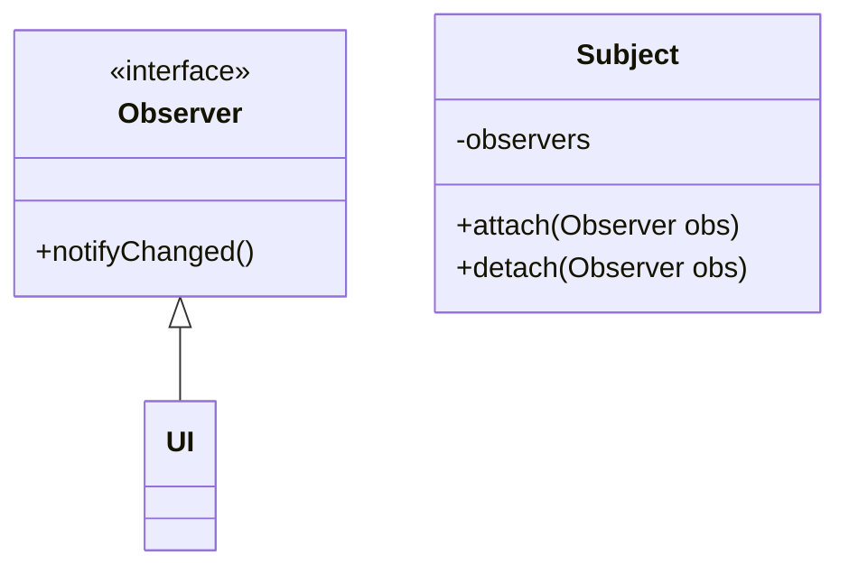
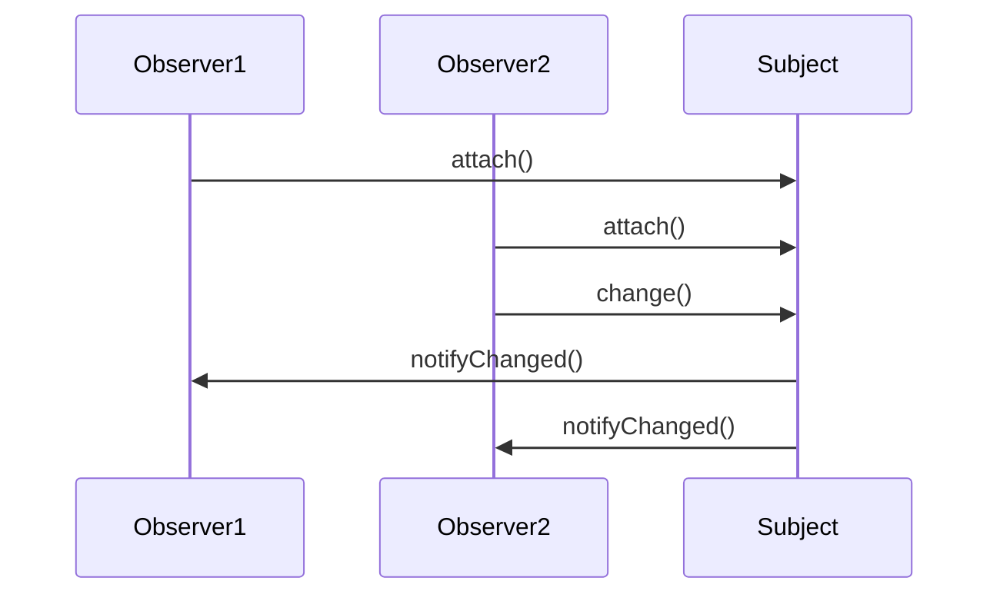
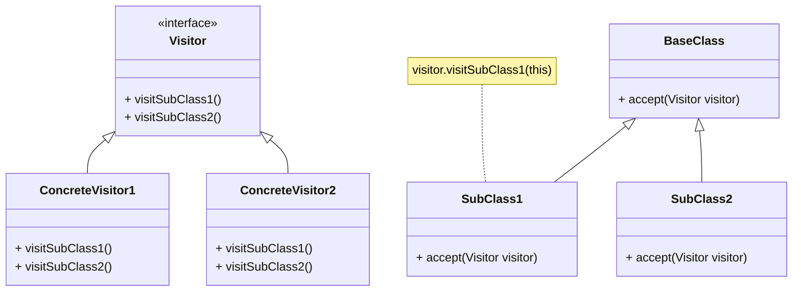
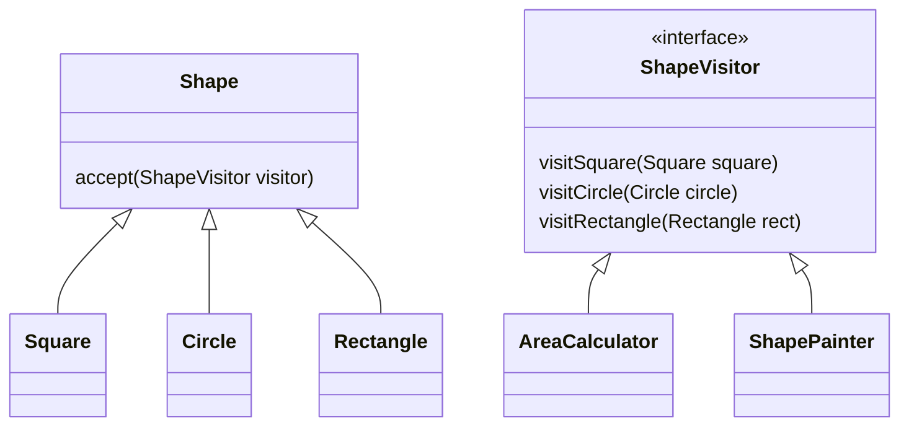
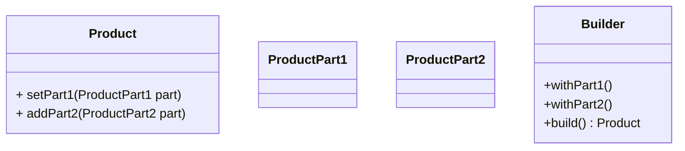

> [!todo]
> 'fluent interface' pattern? (streams, Builder)


## Wat is een ontwerppatroon?

Wanneer we software schrijven, is het niet efficiënt om steeds het wiel opnieuw uit te vinden.
Daarom maken we vaak gebruik van bibliotheken (libraries): code die door iemand anders geschreven en getest werd, en die we zo kunnen herbruiken in ons project.
Het eenvoudigste voorbeeld in de context van dit vak zijn de klassen die deel uitmaken van de Java API (bv. collecties en streams).

Soms is het geen code die we willen herbruiken, maar een idee voor een ontwerp.
Voor bepaalde problemen is de cruciale vraag immers niet 'bestaat er een bibliotheek die dit oplost' maar 'hoe structureer ik mijn software het best gegeven deze context'.
In die situatie spelen **ontwerppatronen** de rol van de bibliotheek (library).
Een ontwerppatroon is een beschrijving van een herbruikbare oplossing voor een vaak terugkerend ontwerpprobleem.

Patronen worden niet uitgevonden, maar omvatten kennis over werkende oplossingen die door middel van ervaring en expertise werd opgebouwd.
De gekendste software engineering ontwerppatronen zijn beschreven in het boek [Design Patterns: Elements of Reusable Object-Oriented Software](https://en.wikipedia.org/wiki/Design_Patterns) (1995).
Dit boek bevat 23 patronen die zich in eerste instantie richten op een goed software-ontwerp, in termen van bijvoorbeeld

- het vermijden van code duplicatie
- het verhogen van de herbruikbaarheid van code
- de kans op fouten te verkleinen door complexiteit te verbergen (abstractie)
- zorgen voor _hoge cohesie_ en _lage koppeling_, dewelke de aanpasbaarheid ten goede komen (zie later).

Een patroon geeft in de eerste plaats een **naam** aan een herbruikbare oplossingsstrategie.
Op die manier gaan patroonnamen deel uitmaken van de woordenschat van een software-ontwerper, en volstaat een zin als "Heb je al eens aan een _visitor_ gedacht?" om een hele oplossingsstrategie te beschrijven aan een collega.

In sommige gevallen is het ontstaan van een patroon het gevolg van een tekortkoming van een programmeertaal.
We zullen later bijvoorbeeld zien dat het visitor-patroon, wat lange tijd populair was, aan relevantie inboet in Java sinds die taal uitgebreid werd met sealed interfaces en pattern matching.
Die laatsten voorzien immers een ingebouwde manier om hetzelfde te doen.
In veel gevallen zijn patronen dan ook taal-afhankelijk.
Een ander voorbeeld: de nood aan het Observer-patroon in Java wordt in C# bijvoorbeeld (gedeeltelijk) weggenomen door de _delegates_- en _event_-concepten in de taal.

Een belangrijk advies om te onthouden (en een regel waar beginnende programmeurs nogal eens tegen zondigen): het is **niet** de bedoeling om **zoveel mogelijk** patronen te gebruiken in je software.
De kunst van het goed toepassen van patronen bestaat erin om de situaties waarin ze nodig zijn te herkennen, maar zeker ook de situaties waarin ze _niet_ nodig zijn.
Elk patroon introduceert immers wat extra complexiteit (meer klassen of interfaces en/of meer methodes), en de ontwerper moet erover waken dat het sop de kool waard blijft.

We bespreken hier een selectie van enkele veelgebruikte patronen; er zijn er nog veel meer.

## Koppeling en cohesie

De kwaliteit van een software-ontwerp wordt vaak bekeken in termen van cohesie en koppeling.
Cohesie en koppeling zijn een maat voor hoe aanpasbaar een software-ontwerp is.
De nood aan ontwerppatronen komt dan ook vaak voort uit het verbeteren van deze eigenschappen.
We starten daarom met een (informele) kennismaking met deze concepten:

- **hoge cohesie**: alle functionaliteit zit vervat in logische, afgescheiden modules (bijvoorbeeld klassen of packages in Java), met elk een welafgelijnd doel, een duidelijke (en beperkte) verantwoordelijkheid, en zonder overtollige ballast;
- **lage koppeling**: er zijn niet teveel afhankelijkheden tussen die modules: elke module is zich enkel bewust van wat strikt noodzakelijk is voor de werking van die module (het _need to know_ principe).

In een systeem met hoge cohesie en lage koppeling is het steeds duidelijk _waar_ een bepaalde aanpassing moet gebeuren (omwille van de hoge cohesie) en zal een aanpassing enkel een _lokaal_ effect hebben, en dus niet doorsijpelen naar de rest van het systeem (omwille van de lage koppeling).

### Oefening: koppeling en cohesie

Bespreek de koppeling en cohesie van onderstaande klasse. Hoe zou je dit kunnen verbeteren?

```java
public class DocumentEditor {
    private StringBuilder content;
    private String filePath;

    public DocumentEditor(String filePath) {
        this.filePath = filePath;
        this.content = new StringBuilder();
        this.loadContentFromFile();
    }

    private void loadContentFromFile() {
        try (BufferedReader reader = new BufferedReader(new FileReader(filePath))) {
            String line;
            while ((line = reader.readLine()) != null) {
                content.append(line).append("\n");
            }
        } catch (IOException e) {
            System.err.println("Error reading file: " + e.getMessage());
        }
    }

    public void addText(String text) {
        content.append(text);
    }

    public void removeText(int startIndex, int endIndex) {
        content.delete(startIndex, endIndex);
    }

    public void save() {
        try (BufferedWriter writer = new BufferedWriter(new FileWriter(filePath))) {
            writer.write(content.toString());
        } catch (IOException e) {
            System.err.println("Error writing to file: " + e.getMessage());
        }
    }

    public String getText() {
        return content.toString();
    }

    public void showDocument(UI ui) {
        ui.displayText(content.toString(), new Font("Times new roman", 12), 20, 20);
    }
}
```

## Model-View-Controller

In de cursus "Software-ontwerp in Java" heb je reeds kennis gemaakt met een design pattern, namelijk _Model-View-Controller_.
We beginnen onze verkenning met dat patroon.

Een van de meest populaire patronen is Model-View-Controller (_MVC_).
Dit patroon stelt voor om UI-logica eenvoudig te scheiden van domein logica door drie aparte lagen te maken.

1. Het model, het belangrijkste, stelt ons domein voor: de objecten waar het om draait in de applicatie.
2. De view, de UI, is de presentatielaag die de gebruiker te zien krijgt als hij de applicatie hanteert. Achterliggend wordt er door de view informatie uit de model-objecten gehaald.
3. De controller handelt acties van de gebruiker (UI events, bv. het klikken op een knop) af, en vertaalt deze naar operaties op het model. De controller verwittigt ook de view dat die zich moet updaten.

Op dit diagram geven de pijlen aan wie wie kent:


graph TD;
V[View]
C[Controller]
M[Model]
C --> V
V --> M
C --> M


De controller kent zowel de view als het model. De view kent enkel het model. Het model kent niemand buiten zichzelf. Op die manier is het eenvoudig om in de applicatie te migreren naar nieuwe presentatievorm, zoals van een typische client-server (desktop) applicatie naar een moderne website. Dit principe kan telkens opnieuw worden toegepast, voor ontelbare applicaties. Men spreekt hier dus van een herhalend patroon, dat kan helpen bij het oplossen van een probleem.

## Observer

In het MVC patroon zou je misschien willen dat de controller de view niet hoeft te vertellen dat er een update moet gebeuren.
Dat vereist namelijk dat de controller weet wanneer er veranderingen gebeurd zijn aan het model die relevant zijn voor de view, of (als de controller de view na elke operatie laat updaten) dat er misschien nodeloos updates van de view gebeuren.

Idealiter vertelt het model zelf aan de view dat er iets gewijzigd is, waardoor de view kan beslissen of die zichzelf moet updaten.
Maar we willen het model onafhankelijk houden van de view (om de koppeling tussen beiden laag te houden).

### Doelstelling

- Breng één of meerdere objecten (van verschillende klassen) op de hoogte van een gebeurtenis in een object van een andere klasse.
- Vermijd dat de gewijzigde klasse moet weten wie er allemaal op de hoogte gebracht moet worden (_lage koppeling_).

Het **observer**-patroon beschrijft een techniek die toelaat dat een klasse 'luistert' naar veranderingen in een andere klasse, zonder dat de klasse die wijzigingen ondergaat moet weten wie er precies luistert, of waarom.

### Structuur

De oplossing bestaat eruit om gebruik te maken van een _Observer_-interface.
Het idee is om de klasse die kan wijzigen (het _Subject_) een lijst van Observer-objecten te laten bijhouden.
Het subject weet niet wat de concrete klassen zijn, enkel dat ze de Observer-interface implementeren.
Een Observer kan zichzelf opgeven als geïnteresseerde (en zich ook weer verwijderen).





Dit patroon maakt gebruik van een **callback**: door de Observer mee te geven aan de subject, kan die later de `notifyChanged`-methode van die Observer oproepen.

Dit patroon wordt soms ook **publish-subscribe** genoemd.
Een klasse (hier Subject) publiceert wijzigingen naar al wie ingeschreven is (de observers).

### In Java

In Java kan je, in plaats van een speciale Observer-interface te maken, ook functionele interfaces (bv. Runnable) en lambda's gebruiken om hetzelfde te bereiken, bijvoorbeeld:

```java
class Subject {
  private List<Runnable> observers;

  public void change() {
    ...
    notifyObservers();
  }

  public void attach(Runnable observer) {
    observers.add(observer);
  }

  public void detach(Runnable observer) {
    observers.remove(observer);
  }

  protected void notifyObservers() {
    for (var observer : this.observers) {
      observer.run();
    }
  }
}


class UI {
  public UI(Subject model) {
    this.model = model;
    model.attach(this::modelUpdated)
  }

  private void modelUpdated() {
    ...
  }
}
```

### Oefening: observer

Gegeven onderstaande klassen om te werken met data over het weer.
De WeatherData-klasse zorgt er op dit moment voor dat er drie displays geupdated worden: CurrentConditionsDisplay, StatisticsDisplay, en ForecastDisplay.
Refactor deze code met behulp van het Observer-patroon, en beschrijf of en hoe dit de koppeling en cohesie verbetert.

```java
public class WeatherData {
    private double temperature;
    private double humidity;
    private double pressure;

    private CurrentConditionsDisplay currentDisplay;
    private StatisticsDisplay statisticsDisplay;
    private ForecastDisplay forecastDisplay;

    public WeatherData(CurrentConditionsDisplay currentDisplay, StatisticsDisplay statisticsDisplay, ForecastDisplay forecastDisplay) {
        this.currentDisplay = currentDisplay;
        this.statisticsDisplay = statisticsDisplay;
        this.forecastDisplay = forecastDisplay;
    }

    public void measurementsChanged() {
        currentDisplay.update(temperature, humidity, pressure);
        statisticsDisplay.update(temperature, humidity, pressure);
        forecastDisplay.update(temperature, humidity, pressure);
    }

    public void setMeasurements(double temperature, double humidity, double pressure) {
        this.temperature = temperature;
        this.humidity = humidity;
        this.pressure = pressure;
        measurementsChanged();
    }

    // Getters and Setters for temperature, humidity, pressure
}

// Display elements
class CurrentConditionsDisplay {
    public void update(double temp, double humidity, double pressure) {
        System.out.println("Current conditions: " + temp + "°C and " + humidity + "% humidity");
    }
}

class StatisticsDisplay {
    public void update(double temp, double humidity, double pressure) {
        System.out.println("Statistics: " + temp + "°C");
    }
}

class ForecastDisplay {
    public void update(double temp, double humidity, double pressure) {
        System.out.println("Forecast: More of the same");
    }
}
```

## Singleton

In sommige gevallen is het belangrijk dat in een applicatie bepaalde functionaliteit gecentraliseerd wordt op één punt.
Denk hierbij bijvoorbeeld aan de configuratie-instellingen, logging, caching, een pool van database-connecties, of communicatie met hardware.
Wanneer je meerdere objecten van dezelfde klasse kan aanmaken die naast elkaar bestaan en bovenstaande functionaliteit aanbieden,
kunnen die objecten elkaars werking misschien verstoren en leiden tot bijvoorbeeld inconsistenties.

Het **singleton**-patroon biedt een manier aan om ten hoogste één instantie van een klasse te maken, die globaal (vanuit de hele applicatie) toegankelijk is.
In dat opzicht laat een singleton toe om een 'globale variabele' te emuleren (iets wat niet bestaat in Java).

### Doelstelling

- Beperk een bepaalde klasse tot één instantie (object) in plaats van meerdere.
- Maak die ene instantie eenvoudig toegankelijk vanaf eender waar in de code.

### Voorbeeld in Java

De eenvoudigste implementatie van een singleton, hiervoor een voorbeeld van een Cache-klasse, ziet er als volgt uit:

```java
public class Cache {
  public static final Cache INSTANCE = new Cache(); // de enige instance

  private Cache() {
    // private constructor
  }

  public Object getItem(String key) { ... }
}

// gebruik:
Object cachedItem = Cache.INSTANCE.getItem(key);
```

We hebben een publiek statisch INSTANCE-veld wat eenmalig geïnitialiseerd wordt met een nieuw Cache-object.
De Cache-constructor is private, zodat er geen andere instanties aangemaakt kunnen worden.
Dat betekent dat de hele applicatie hetzelfde Cache-object zal gebruiken.

### Lazy initialisatie

Als het aanmaken van het object een dure operatie is (bijvoorbeeld opvragen van data uit een bestand of via het netwerk), die niet altijd of onmiddellijk moet gebeuren,
dan kan je ook werken met _lazy_ initialisatie.
Hierbij maak je het object pas aan wanneer het voor de eerste keer opgevraagd wordt.
Je moet dan een methode gebruiken om de enige instantie op te vragen.
Die methode moet nagaan of het instance-veld al geïnintialiseerd is, en indien dat niet zo is, de initialisatie verzorgen:

```java
public class Cache {
  private static Cache INSTANCE = null;

  public static Cache getInstance() {
    if (INSTANCE == null) {
      INSTANCE = new Cache();
    }
    return INSTANCE;
  }

  private Cache() {
    // private constructor
  }
}

// gebruik:
Object cachedItem = Cache.getInstance().getItem(key);
```

#### Concurrency

Het gebruik van lazy initialisatie en concurrency gaan niet goed samen.

> Denk zelf even na wat er mis kan gaan in deze situatie.

Wanneer twee threads tegelijkertijd `getInstance()` oproepen, kan het zijn dat er twee objecten gemaakt worden.
Om dat te vermijden kan je de `getInstance()`-methode `synchronized` maken.
Dat heeft echter als gevolg dat threads slechts één voor één de instance kunnen opvragen, terwijl daar (eens de variabele geïnitialiseerd is) geen reden meer toe is.

Een manier om dit te voorkomen is _double checked locking_ (op zich ook een patroon):

```java
public class Cache {
  private static Cache INSTANCE = null;

  public static Cache getInstance() {
    if (INSTANCE == null) {
      synchronized(Cache.class) { // synchronizeer (op het klasse-object)
        if (INSTANCE == null) {
          INSTANCE = new Cache();
        }
      }
    }
    return INSTANCE;
  }

  private Cache() {
    // private constructor
  }
}
```

> Leg uit waarom dit patroon 1) efficiënter is dan heel de methode synchronized te maken, en 2) de garantie biedt dat er nooit twee instanties zullen gemaakt worden.

> Waarom is de tweede `INSTANCE == null`-check nodig? Kan die niet weg?

### Oefening: singleton

Refactor onderstaande code met het singleton-patroon zodat er in de hele applicatie slechts 1 ConfigurationManager-object bestaat en gebruikt wordt.

```java
public class ConfigurationManager {
    private HashMap<String, String> settings;

    public ConfigurationManager() {
        settings = new HashMap<>();
        loadSettings();
    }

    private void loadSettings() {
        // Simulate loading settings from a file or database
        settings.put("theme", "dark");
        settings.put("language", "en");
    }

    public String getSetting(String key) {
        return settings.getOrDefault(key, "Not Found");
    }

    public void updateSetting(String key, String value) {
        settings.put(key, value);
    }

    public void displaySettings() {
        settings.forEach((key, value) -> System.out.println(key + ": " + value));
    }
}
```

> Vraag: Welke invloed heeft deze refactoring op cohesie en koppeling? Zou je het singleton-patroon best zo veel mogelijk toepassen, of zoveel mogelijk vermijden?

## Visitor

Het visitor-patroon wordt gebruikt om een bewerking (operatie) voor te stellen op een structuur van objecten.
Deze object-structuur bestaat uit een aantal subklassen, en de implementatie van de bewerking is afhankelijk van het precieze subtype.

Je kan dat natuurlijk al doen via overerving, door een operatie (met overriding) toe te voegen aan alle klassen.
Bijvoorbeeld, bij een klasse-structuur van vormen kan je het berekenen van de oppervlakte als `area()`-operatie toevoegen:

```java
abstract class Shape {
  public abstract double area();
}
class Square extends Shape {
  ...
  @Override
  public double area() {
    return side * side;
  }
}
class Circle extends Shape {
  ...
  @Override
  public double area() {
    return radius * radius * Math.PI;
  }
}
```

Dat werkt goed, maar het nadeel hiervan is dat, zodra er meer operaties komen, dat die allemaal in dezelfde klasse terechtkomen.
Dat zorgt voor een negatief effect op de cohesie.
Stel bijvoorbeeld dat we, naast `area`, ook operaties moeten toevoegen voor `circumference`, `transform`, `draw`, `print`, `validate`, `saveToFile`, ...
Al die operaties toevoegen leidt tot een klasse met nog maar weinig cohesie: het enige gemeenschappelijke is dat alle operaties over dezelfde vorm gaan.

Het visitor-patroon biedt een alternatief: we maken, in essentie, een aparte klasse per operatie.

### Doelstelling

De doelstelling van het visitor-patroon is om alle code die gerelateerd is aan één specifieke operatie over meerdere (sub)klassen te bundelen in één klasse.
De subklassen zelf worden onafhankelijk van die operatie; er kunnen makkelijk nieuwe operaties toegevoegd worden zonder alle (sub)klassen aan te moeten passen.

> Wat is het effect op cohesie en koppeling hiervan?

### Structuur

De klassen uit de objectstructuur bevatten enkel een algemene visit-operatie, die de operatie die overeenkomt met hun type oproept op de meegegeven visitor.



### Voorbeeld in Java

Hieronder vind je een voorbeeld van twee visitors op een Shape-hiërarchie.
De eerste visitor berekent de oppervlakte; de tweede tekent de vorm op het scherm.



Het visitor-patroon maakt gebruik van de **double dispatch** techniek om operaties toe te voegen aan klassen zonder die klassen te wijzigen.
Double dispatch betekent dat de operatie die uitgevoerd wordt afhangt van 2 types:

- het type van de visitor (bv. AreaCalculator, ShapePainter)
- het type van de subklasse uit de object-structuur (bv. Square).

Om dat te verwezenlijken wordt de `accept`-methode opgeroepen op de subklasse (dit is de eerste dispatch), dewelke vervolgens de overeenkomstige `visit*`-methode oproept op het visitor-object (dit is de tweede dispatch).

```java
interface ShapeVisitor {
  void visitSquare(Square square);
  void visitCircle(Circle circle);
  void visitRectangle(Rectangle rectangle);
}
abstract class Shape {
  abstract void accept(ShapeVisitor visitor);
}
class Square extends Shape {
  void accept(ShapeVisitor visitor) {
    visitor.visitSquare(this);
  }
}
class Circle extends Shape {
  void accept(ShapeVisitor visitor) {
    visitor.visitCircle(this);
  }
}
class Rectangle extends Shape {
  void accept(ShapeVisitor visitor) {
    visitor.visitRectangle(this);
  }
}

class AreaCalculator implements ShapeVisitor {
  private double result;
  public double getResult() { return result; }

  void visitSquare(Square square) {
    this.result = square.side * square.side;
  }
  void visitCircle(Circle circle) {
    this.result = circle.radius * circle.radius * Math.PI;
  }
  void visitRectangle(Rectangle rect) {
    this.result = rect.width * rect.height;
  }
}

class ShapePainter implements ShapeVisitor {
  void visitSquare(Square square) {
    // code to draw the square in the UI
  }
  void visitCircle(Circle circle) {
    // code to draw the circle in the UI
  }
  void visitRectangle(Rectangle rect) {
    // code to draw the rectangle in the UI
  }
}

Square square = new Square(2.0);
Circle circle = new Circle(2.0);
AreaCalculator calc = new AreaCalculator();
square.accept(calc);
double squareArea = calc.getResult(); // 4.0

ShapePainter painter = new ShapePainter();
circle.accept(painter);
```

### Visitor vs. sealed classes

In het deel rond [records](/advjava/records#sealed-interfaces) hebben we reeds gezien hoe Java sealed classes/interfaces en pattern matching ondersteunt.
We zagen daar ook een voorbeeld van een `area`-methode die gebruikt maakt van pattern matching om, gebundeld in één methode, de oppervlakte van verschillende soorten vormen te berekenen.
Die techniek is een modernere manier om hetzelfde te doen als wat het visitor-patroon beoogt: het makkelijk maken om nieuwe operaties toe te voegen aan een klassestructuur, zonder de cohesie te verminderen.

### Oefening: visitor

Hieronder vind je code voor verschillende hardware-componenten, met twee methodes:

- `display()` om informatie over de component te tonen
- `checkHealth()` om de component te inspecteren.

Introduceer het visitor-patroon en bespreek de impact op koppeling en cohesie.

```java
interface HardwareComponent {
    void checkHealth();
    void display();
}

class CPU implements HardwareComponent {
    private String model;
    private int cores;

    public CPU(String model, int cores) {
        this.model = model;
        this.cores = cores;
    }

    @Override
    public void display() {
        System.out.println("CPU Model: " + model + ", Cores: " + cores);
    }

    @Override
    public void checkHealth() {
        System.out.println("Checking CPU health...");
    }
}

class GPU implements HardwareComponent {
    private String model;
    private int memory;

    public GPU(String model, int memory) {
        this.model = model;
        this.memory = memory;
    }

    @Override
    public void display() {
        System.out.println("GPU Model: " + model + ", Memory: " + memory + "GB");
    }

    @Override
    public void checkHealth() {
        System.out.println("Checking GPU health...");
    }
}

class HardDrive implements HardwareComponent {
    private String type;
    private int capacity;

    public HardDrive(String type, int capacity) {
        this.type = type;
        this.capacity = capacity;
    }

    @Override
    public void display() {
        System.out.println("Hard Drive Type: " + type + ", Capacity: " + capacity + "GB");
    }

    @Override
    public void checkHealth() {
        System.out.println("Checking harddrive health...");
    }
}

public class ComputerSystem implements HardwareComponent {
    private CPU cpu;
    private GPU gpu;
    private HardDrive hd;

    public ComputerSystem(CPU cpu, GPU gpu, HardDrive hd) {
        this.cpu = cpu;
        this.gpu = gpu;
        this.hd = hd;
    }

    @Override
    public void checkHealth() {
        cpu.checkHealth();
        gpu.checkHealth();
        hd.checkHealth();
    }

    @Override
    public void display() {
        cpu.display();
        gpu.display();
        hd.display();
    }
}

public class Main {
  public static void main(String[] args) {
      ComputerSystem sys = new ComputerSystem(new CPU("Intel", 16),
              new GPU("nvidia", 2048),
              new HardDrive("Seagate", 200));
      sys.display();
      sys.checkHealth();
  }
}
```

Gebruik vervolgens ook eens een sealed interface en pattern matching om hetzelfde te bekomen.

## Builder

Het Builder-patroon wordt vaak gebruikt wanneer het (correct) aanmaken van een object (of verzameling objecten) complexer is dan gewoon de constructor oproepen.
Het kan bijvoorbeeld zijn dat er ook heel wat geneste objecten aangemaakt moeten worden, dat er bepaalde initialisatie-methodes opgeroepen moeten worden in een welbepaalde volgorde, dat sommige combinaties van parameters niet toegelaten zijn, etc.
Het builder-patroon is ook erg populair bij het schrijven van tests.
Bij het schrijven van tests moeten er vaak objecten aangemaakt worden, soms met kleine variaties.
Het builder-patroon laat toe om dat te doen zonder veel code te herhalen.

### Doelstelling

De belangrijkste doelstelling van het builder-patroon is het vermijden van uitgebreide (onpraktische) constructoren of initialisatie-procedures, en de constructie-logica in een klasse te plaatsen die enkel daarvoor dient.

### Structuur



Een builder-implementatie maakt vaak gebruik van een **fluent interface**.
Dat betekent dat het builder-object zichzelf teruggeeft als resultaat van elke operatie (behalve de `build`-operatie zelf) zodat je het te bouwen object makkelijk kan configureren met opeenvolgende methode-oproepen.

### Voorbeeld in Java

In Java wordt de builder voor een object vaak als een geneste klasse binnen de te creëren klasse gemaakt, omdat de twee sterk verbonden zijn aan elkaar.

```java
class Smartphone {
  ...

  public static class Builder {
    private int ram;
    private int storage;
    private boolean gps;
    ...
    public Builder standardPhone() {
      this.ram = 8;
      this.storage = 64;
      return this;
    }
    public Builder upgradeRAM(int ram) {
      this.ram = ram;
      return this;
    }
    ...
    public Smartphone build() {
      Smartphone smartphone = new Smartphone();
      smartphone.addRam(new RAM(this.ram));
      smartphone.addStorage(new SSDDrive(this.storage));
      if (this.gps) smartphone.addSensor(new GPS());
      ...
      return smartphone;
    }
  }
}

var smartphone = new Smartphone.Builder()
      .standardPhone()
      .upgradeRAM(16)
      .upgradeStorage(128)
      .includeGPS()
      .build();
```

### Oefening: builder pattern

Hieronder zie je een klasse VacationPackage, met vlak daaronder de code om zo'n object aan te maken via de gewone constructor.
Je ziet dat het niet heel duidelijk is wat de argumenten betekenen.

Introduceer het Builder-patroon in onderstaande code, zodat een VacationPackage-object aangemaakt kan worden zoals helemaal onderaan weergegeven.

```java
public class VacationPackage {
    private final String hotel;
    private final String departureCity;
    private final String destinationCity;
    private final LocalDate departureDate;
    private final LocalDate returnDate;
    private final List<String> tours;
    private final String carRental;
    private final List<String> meals;

    public VacationPackage(String hotel, String departureCity, String destinationCity,
                           LocalDate departureDate, LocalDate returnDate, List<String> tours,
                           String carRental, List<String> meals) {
        this.hotel = hotel;
        this.departureCity = departureCity;
        this.destinationCity = destinationCity;
        this.departureDate = departureDate;
        this.returnDate = returnDate;
        this.tours = tours;
        this.carRental = carRental;
        this.meals = meals;
    }

}

// huidige manier
VacationPackage vacation = new VacationPackage(
    "SeaView Resort", "Cancun", "New York",
    LocalDate.of(2024, 7, 10), LocalDate.of(2024, 7, 20),
    List.of("Chichen Itza Tour", "Snorkeling at Cozumel"),
    "Full-size Car", List.of("Breakfast Buffet", "Dinner Course"));


// gewenste manier
VacationPackage vacation = new VacationPackage.Builder()
    .hotel("SeaView Resort")
    .destinationCity("Cancun")
    .departureCity("New York")
    .departureDate(LocalDate.of(2024, 7, 10))
    .returnDate(LocalDate.of(2024, 7, 20))
    .addTour("Chichen Itza Tour")
    .addTour("Snorkeling at Cozumel")
    .carRental("Full-size Car")
    .addMeal("Breakfast Buffet")
    .addMeal("Dinner Course")
    .build();
```

## Facade

Een software-systeem bestaat gewoonlijk uit meerdere klassen die moeten samenwerken en goed aangestuurd moeten worden om het gewenste resultaat te verkrijgen.
Zeker als die klassen deel zijn van een subsysteem dat door andere subsystemen (en dus door andere programmeurs) gebruikt wordt, legt dat erg veel verantwoordelijkheid bij de programmeurs.

Het facade-patroon komt hieraan tegemoet, door de gedetailleerde bewerkingen te combineren in vaak voorkomende hoog-niveau operaties.
Door de vereenvoudiging verlies je hiermee misschien wel wat mogelijkheden die er wel zouden zijn door de gedetailleerde klassen rechtstreeks aan te spreken.

### Doelstelling

- Scherm een complex stukje software af met behulp van een simpele interface.
- Voorzie éénzelfde interface naar een set van verschillende mogelijke subsystemen. Een Facade is dan een high-level interface die de low-level systemen aanspreekt.

### Voorbeeld in Java

We nemen als voorbeeld een eenvoudig online shopping-systeem; bij het plaatsen van een bestelling komt heel wat kijken:

- de details van het product opzoeken (ProductCatalog)
- nagaan of het product nog voorradig is (InventorySystem)
- de betaling verwerken (PaymentGateway)
- de inventaris aanpassen (InventorySystem)
- het product verzenden (ShippingService)

Een Facade-klasse kan die operaties samenvoegen en, naar de buitenwereld, een eenvoudige `placeOrder`-methode aanbieden.
De complexe details worden zo afgeschermd voor de gebruiker van de Facade-klasse.

```java
class OnlineShoppingFacade {
    private ProductCatalog productCatalog;
    private InventorySystem inventorySystem;
    private PaymentGateway paymentGateway;
    private ShippingService shippingService;

    public OnlineShoppingFacade(
                ProductCatalog catalog,
                InventorySystem inventory,
                PaymentGateway payment,
                ShippingService shipping) {
        this.productCatalog = catalog;
        this.inventorySystem = inventory;
        this.paymentGateway = payment;
        this.shippingService = shipping;
    }

    public void placeOrder(String productId, PaymentDetails paymentDetails) {
        System.out.println("Placing an order for product: " + productId);

        Product product = productCatalog.getProductDetails(productId);
        if (inventorySystem.checkInventory(productId)) {
            if (paymentGateway.processPayment(paymentDetails)) {
                inventorySystem.updateInventory(productId);
                shippingService.arrangeShipping(product);
                System.out.println("Order placed successfully for product: " + productId);
            } else {
                System.out.println("Payment processing failed for product: " + productId);
            }
        } else {
            System.out.println("Product out of stock: " + productId);
        }
    }
}
```

### Oefening: facade

Hieronder vind je verschillende onderdelen van een home theater systeem.
Schrijf een Facade-klasse zodat het starten van een film kan gebeuren met één simpele oproep.

```java
public class Projector {
    public void on() { System.out.println("Projector on."); }
    public void off() { System.out.println("Projector off."); }
    public void setInputDVD() { System.out.println("Projector input set to DVD."); }
}

public class DVDPlayer {
    public void on() { System.out.println("DVD player on."); }
    public void off() { System.out.println("DVD player off."); }
    public void play() { System.out.println("DVD playing."); }
}

public class SurroundSoundSystem {
    public void on() { System.out.println("Surround sound on."); }
    public void off() { System.out.println("Surround sound off."); }
    public void setVolume(int level) { System.out.println("Volume set to " + level); }
}

public class Screen {
    public void down() { System.out.println("Screen down."); }
    public void up() { System.out.println("Screen up."); }
}
```

```java
public class Main {
    public static void main(String[] args) {
        HomeTheaterFacade homeTheater = new HomeTheaterFacade(new Projector(), new DVDPlayer(), new SurroundSoundSystem(), new Screen());
        homeTheater.watchMovie("Inception");
        homeTheater.endMovie();
    }
}
```

## Andere bronnen (optioneel)

Koppeling en cohesie:

- [https://devopedia.org/cohesion-vs-coupling](https://devopedia.org/cohesion-vs-coupling)

Je vindt heel wat informatie over deze en andere ontwerppatronen op het internet, bijvoorbeeld

- [https://refactoring.guru](https://refactoring.guru/)
- [https://martinfowler.com/articles/enterprisePatterns.html](https://martinfowler.com/articles/enterprisePatterns.html)
