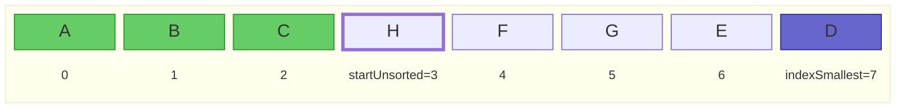
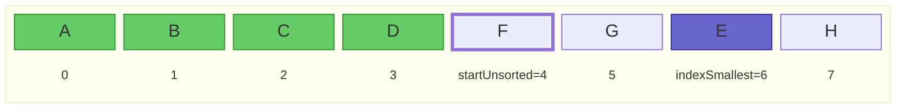
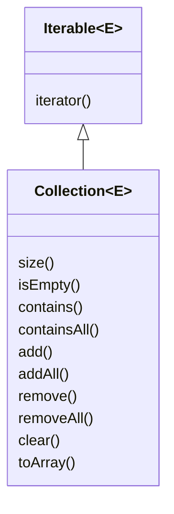
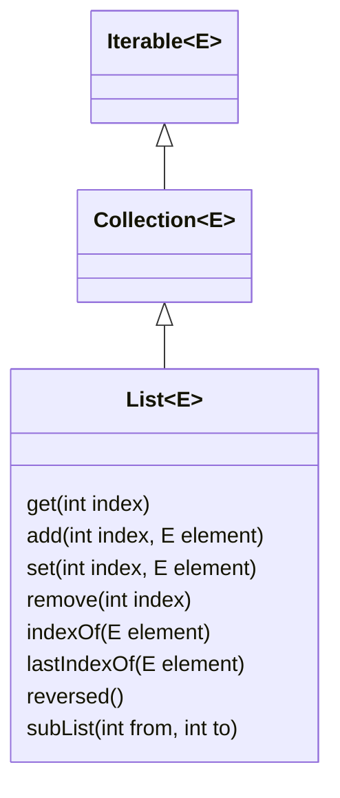
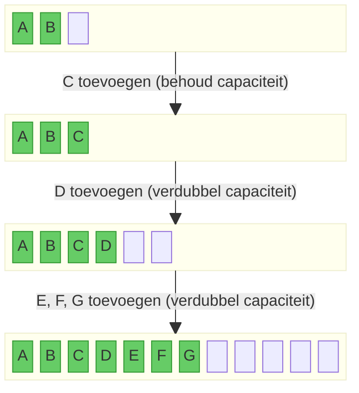
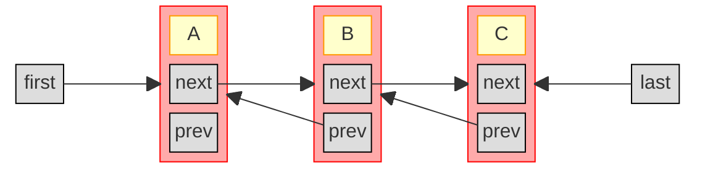

Totnogtoe hebben we enkel gewerkt met een Java array (vaste grootte), en met `ArrayList` (kan groter of kleiner worden).
In dit hoofdstuk kijken we in meer detail naar ArrayList, en behandelen we ook verschillende andere collectie-types in Java.
De meeste van die types vind je ook (soms onder een andere naam) terug in andere programmeertalen.

Je kan je afvragen waarom we andere collectie-types nodig hebben; uiteindelijk kan je (met genoeg werk) alles toch implementeren met een ArrayList? Dat klopt, maar de collectie-types verschillen in welke operaties snel zijn, en welke meer tijd vragen. Om dat wat preciezer te maken, kijken we eerst even naar de notie van **tijdscomplexiteit**.

## Tijdscomplexiteit

Tijdscomplexiteit is een begrip dat gebruikt wordt bij de analyse van algoritmes.
Met tijdscomplexiteit wordt gekwantificeerd hoe snel een algoritme zijn invoer verwerkt.
Het is dus een eigenschap van een (implementatie van een) algoritme, naast bijvoorbeeld de correctheid en leesbaarheid van dat algoritme.

In plaats van tijd (in seconden) wordt er gewoonlijk gekeken naar het aantal specifieke (basis-)operaties (of soms zelfs enkel een bepaalde subset van die basis-operaties).
Het voordeel hiervan is dat, in tegenstelling tot de tijd, het aantal operaties niet afhankelijk is van de snelheid van de processor.
Bijvoorbeeld, bij sorteeralgoritmes wordt soms de vergelijking tussen twee elementen als (enige) basisoperatie gebruikt, of soms elke operatie die een element uit de te sorteren rij gebruikt (bezoekt).
Het totale aantal uitgevoerde basisoperaties is dan (bij benadering) een maat voor de uitvoeringstijd van het algoritme, aangezien elke basisoperatie een bepaalde uitvoeringstijd heeft.

Voor de meeste algoritmes zal een grotere invoer leiden tot meer uit te voeren operaties, en dus een langere uitvoeringstijd.
Bijvoorbeeld, een hele lange lijst sorteren duurt langer dan een kortere lijst sorteren.
De grootte van de invoer wordt met \\(n\\) aangeduid, de tijdscomplexiteit van het algoritme in functie van de invoergrootte met de functie \\(T(n)\\).

We maken bij tijdscomplexiteit onderscheid tussen:

- **Best case**: een invoer (van een bepaalde grootte \\( n \\)) die leidt tot de best mogelijke (kortste) uitvoeringstijd. Bijvoorbeeld, sommige sorteeralgoritmes doen minder werk (en zijn dus snel klaar) als de lijst reeds gesorteerd is.
- **Worst case**: een invoer (van een bepaalde grootte \\( n \\)) die leidt tot de slechtst mogelijke (langste) uitvoeringstijd. Bijvoorbeeld, sommige sorteeralgoritmes hebben erg veel last met een omgekeerd gesorteerde lijst: ze moeten dan heel veel operaties uitvoeren om de lijst gesorteerd te krijgen.
- **Average case**: een invoer (van een bepaalde grootte \\( n \\)) waarover we niets weten en geen veronderstellingen kunnen maken. Bijvoorbeeld, voor sorteeralgoritmes een willekeurige volgorde van elementen, zonder speciale structuur. De uitvoeringstijd in de average case zal ergens tussen die van de worst case en best case liggen.

Belangrijk om te onthouden is dat worst/best/average case dus **niet** gaan over een kleinere of grotere invoer, maar wel over **hoe** die invoer eruit ziet of gestructureerd is.
Bijvoorbeeld, de best case voor een sorteeralgoritme is **niet** de lege lijst. Hoewel er in dat geval amper operaties uitgevoerd moeten worden, zegt dat niet veel: het is logisch dat een kleinere invoer minder tijd vraagt.
We willen bijvoorbeeld weten wélke lijst (van alle mogelijke lijsten van lengte \\(n=1000\\), bijvoorbeeld) het langst duurt om te sorteren.

### Voorbeeld: selection sort

Hieronder vind je een voorbeeld-implementatie van selection sort, een eenvoudig sorteeralgoritme.
In elke iteratie van de lus wordt het reeds gesorteerde deel van de lijst (dat is het deel vóór index `startUnsorted`) uitgebreid met 1 element, namelijk het kleinste nog niet gesorteerde element. Dat element wordt gezocht met de hulpfunctie `indexSmallest`, dewelke de index van het kleinste element in de lijst teruggeeft vanaf een bepaalde index `start`.
Dat kleinste element wordt vervolgens omgewisseld met het element op plaats `startUnsorted`.

Bijvoorbeeld, in de vierde iteratie van de lus ziet de situatie er als volgt uit net voor de `swap`-operatie uitgevoerd wordt:



En in de vijfde iteratie als volgt:



```java
public static <E extends Comparable<E>> void selectionSort(ArrayList<E> list) {
    for (int startUnsorted = 0; startUnsorted < list.size(); startUnsorted++) {
        int indexSmallest = indexOfSmallest(list, startUnsorted);
        Collections.swap(list, startUnsorted, indexSmallest);
    }
}
private static <E extends Comparable<E>> int indexOfSmallest(List<E> list, int start) {
    if (start >= list.size()) return -1;
    int indexSmallestSoFar = start;
    E smallestSoFar = list.get(start);
    for (int i = start+1; i < list.size(); i++) {
        E candidate = list.get(i);
        if (candidate.compareTo(smallestSoFar) < 0) {
            indexSmallestSoFar = i;
            smallestSoFar = candidate;
        }
    }
    return indexSmallestSoFar;
}
```

{}
Merk op hoe de functie het generische type `<E extends Comparable<E>>` gebruikt.
Dat legt op dat elementen in de lijst de interface `Comparable` implementeren, waardoor ze met elkaar vergeleken kunnen worden via de `compareTo`-methode (gebruikt in `indexOfSmallest`).
{}

### Basisoperaties tellen

Afhankelijk van het type algoritme kunnen we verschillende operaties als basisoperatie kiezen.
Als we voor selection sort als basisoperatie de methode `compareTo` nemen, dan zal voor een lijst van lengte \\(n\\):

- tijdens de eerste iteratie het element op index 0 vergeleken worden met alle volgende \\(n-1\\) elementen;
- tijdens de tweede iteratie het element op index 1 vergeleken worden met alle volgende \\(n-2\\) elementen;
- etc.
- tijdens iteratie \\(n-1\\) het element op index \\(n-2\\) vergeleken worden met het laatste element;
- tijdens iteratie \\(n\\) het element op index \\(n-1\\) met geen enkel element vergeleken worden.

Er gebeuren in totaal dus
$$ T(n) = (n-1) + (n-2) + \ldots + 1 + 0 = \frac{n(n-1)}{2} = \frac{n^2}{2} - \frac{n}{2}$$ vergelijkingen van elementen.
Daaruit leren we dat, als we de invoer 10 keer groter maken, we
$$ \frac{T(10n)}{T(n)} = \frac{(10n)^2/2-10n/2}{n^2/2-n/2} = 100 + 90/(n-1) $$
keer zoveel operaties uitvoeren. Als \\( n \\) voldoende groot is, zal de lijst 10 keer langer maken dus neerkomen op ongeveer 100 keer zoveel werk, en dus zal selectionsort 100 keer trager zijn.

In de rest van dit hoofdstuk over datastructuren gaan we verder voornamelijk werken met één specifieke basisoperatie, namelijk het aantal keer dat een element uit het geheugen (of uit een array) bezocht (uitgelezen) worden.

### Grote O-notatie

We kunnen het aantal basisoperaties exact berekenen, zoals hierboven voor selection sort.
Dat is echter veel werk, en vaak hebben we dergelijke precisie niet nodig.
Voor tijdscomplexiteit wordt er daarom veelal gebruik gemaakt van **grote O**-notatie.
Dat is, informeel gezegd, de snelst stijgende term, zonder constanten.
In het voorbeeld van selection sort hierboven is de snelst stijgende term van \\( T(n) \\) de kwadratische term. We noteren dat als
\\( T(n) \in \mathcal{O}(n^2) \\)
of soms gewoon
\\( T(n) = \mathcal{O}(n^2) \\)

Formeel betekent \\( T(n) \in \mathcal{O}(f(n)) \\) dat \\( \exists c, n_0.\ \forall n > n_0.\ T(n)/f(n) \leq c \\). Met andere woorden, zodra \\( n \\) groot genoeg is (groter dan een bepaalde \\(n_0\\)), is de verhouding \\(T(n)/f(n)\\) begrensd door een constante, wat uitdrukt dat \\(T(n)\\) niet sneller stijgt dan \\(f(n)\\).

\\( \mathcal{O}(n^2) \\) is de **complexiteitsklasse** (de verzameling van alle functies die niet sneller dan kwadratisch stijgen), en we zeggen dat selection sort een **kwadratische tijdscomplexiteit** heeft.

{}
Er zijn nog andere notaties die vaak gebruikt worden in de context van tijdscomplexiteit, waaronder grote theta (\\( \Theta \\)), grote omega (\\( \Omega \\)), en tilde (~). Deze hebben allen een andere formele definitie.
In de dagelijkse (informele) praktijk wordt vaak grote O gebruikt, zelfs als eigenlijk een van deze andere bedoeld wordt.
{}

### Vaak voorkomende complexiteitsklassen

Hieronder vind je een tabel met vaak voorkomende complexiteitsklassen.
In de laatste kolom vind je de tijd die zo'n algoritme doet over een invoer van grootte \\(n=1000\\), in de veronderstelling dat het een probleem van grootte \\(n=100\\) kan oplossen in 1 milliseconde.

| Klasse                        | Naam          | \\( T(1000) \\) (als \\( T(100) = 1 \textrm{ms} \\))                                 |
| ----------------------------- | ------------- | ------------------------------------------------------------------------------------ |
| \\( \mathcal{O}(1) \\)        | Constant      | \\(1\ \textrm{ms} \\)                                                                |
| \\( \mathcal{O}(\log n) \\)   | Logaritmisch  | \\(1.5\ \textrm{ms} \\)                                                              |
| \\( \mathcal{O}(n) \\)        | Lineair       | \\(10\ \textrm{ms} \\)                                                               |
| \\( \mathcal{O}(n \log n) \\) | Linearitmisch | \\(15\ \textrm{ms} \\)                                                               |
| \\( \mathcal{O}(n^2) \\)      | Kwadratisch   | \\(100\ \textrm{ms} \\)                                                              |
| \\( \mathcal{O}(n^3) \\)      | Kubisch       | \\(1000\ \textrm{ms} \\)                                                             |
| \\( \mathcal{O}(2^n) \\)      | Exponentieel  | \\( 2^{900}\ \textrm{ms} \\) = \\( 2.7 \times 10^{260}\ \textrm{jaar}\\)             |
| \\( \mathcal{O}(n!) \\)       | Factorieel    | \\( \frac{1000!}{100!}\ \textrm{ms} \\) = \\( 1.4 \times 10^{2399}\ \textrm{jaar}\\) |

Je ziet dat de constante tot en met linearitmische complexiteitsklassen zeer gunstig zijn.
Kwadratisch en kubisch zijn te vermijden, omdat de tijd veel sneller toeneemt dan de grootte van de invoer.
Exponentiële en factoriële algoritmes tenslotte zijn dramatisch en schalen bijzonder slecht naar grotere problemen.
Backtracking-algoritmes (zie later) vallen vaak in deze laatste klassen, en kunnen dus zeer inefficiënt zijn voor grotere problemen.

We zullen deze tijdscomplexiteitsklassen gebruiken om (operaties op) datastructuren te vergelijken.

## De Collection API

We kunnen nu de Java Collections-API verkennen.
Deze API bestaat uit

- interfaces (bv. `Iterable`, `Collection`, `List`, `Set`, `SortedSet`, `Queue`, `Deque`, `Map`, `SortedMap`, en `NavigableMap`)
- implementaties van die interface (bv. `ArrayList`, `LinkedList`, `Vector`, `Stack`, `ArrayDeque`, `PriorityQueue`, `HashSet`, `LinkedHashSet`, `TreeSet`, en `TreeMap`)
- algoritmes voor veel voorkomende operaties (bv. `shuffle`, `sort`, `swap`, `reverse`, ...)

Je vindt een overzicht van de hele API op [deze pagina](https://docs.oracle.com/en/java/javase/21/docs/api/java.base/java/util/doc-files/coll-reference.html).

We beginnen bij de basisinterface: `Iterable`.

## Iterable en Iterator

[`Iterable`](https://docs.oracle.com/en/java/javase/21/docs/api/java.base/java/lang/Iterable.html) maakt eigenlijk geen deel uit van de Java Collections API.
Het is er wel sterk aan verwant.
Een `Iterable` is namelijk een object dat meerdere objecten van hetzelfde type één voor één kan teruggeven.
Er moet slechts 1 methode geïmplementeerd worden, namelijk `iterator()`, die een `Iterator`-object teruggeeft.

Een [`Iterator`](https://docs.oracle.com/en/java/javase/21/docs/api/java.base/java/util/Iterator.html) is een object met twee methodes:

- `hasNext()`, wat aangeeft of er nog objecten zijn om terug te geven, en
- `next()`, wat (als er nog objecten zijn) het volgende object teruggeeft.

Elke keer je `next()` oproept krijg je een ander object, tot `hasNext()` false teruggeeft. Vanaf dan krijg je een exception.

Elke klasse die `Iterable` implementeert, kan gebruikt worden in een 'enhanced for-statement':

```java
Iterable<E> iterable = ...
for (var element : iterable) {
  ... // code die element gebruikt
}
```

Achter de schermen wordt hierbij de iterator gebruikt. Het enhanced for-statement van hierboven is equivalent aan:

```java
Iterable<E> iterable = ...
Iterator<E> iterator = iterable.iterator();
while (iterator.hasNext()) {
  E element = iterator.next();
  ... // code die element gebruikt
}
```

Alle collectie-types die een verzameling elementen voorstellen (dus alles behalve `Map`), implementeren deze interface.
Dat betekent dus dat je elk van die collecties in een enhanced for-lus kan gebruiken.
Je kan daarenboven ook zelf een nieuwe klasse maken die deze interface implementeert, en die vervolgens gebruikt kan worden in een enhanced for-loop.
Dat doen we in volgende oefening.

### Oefening: IntRange

1. Schrijf eerst een klasse `IntRangeIterator` die `Iterator<Integer>` implementeert, en alle getallen teruggeeft tussen twee grensgetallen `lowest` en `highest` die je meegeeft aan de constructor. Je houdt hiervoor enkel de onder- en bovengrens bij, alsook het volgende terug te geven getal.
2. Schrijf nu ook een record `IntRange` die `Iterable<Integer>` implementeert, en die een `IntRangeIterator`-object aanmaakt en teruggeeft.
   Je moet deze klasse nu als volgt kunnen gebruiken:

```java
IntRange range = new IntRange(3, 6);
for (int x : range) {
  System.out.println(x);
}
// Uitvoer:
// 3
// 4
// 5
// 6

```

{}
Java laat niet toe om primitieve types als generische parameters te gebruiken.
Voor elk primitief type bestaat er een wrapper-klasse, bijvoorbeeld `Integer` voor `int`.
Daarom gebruiken we hierboven bijvoorbeeld `Iterator<Integer>` in plaats van `Iterator<int>`.
Achter de schermen worden `int`-waarden automatisch omgezet in `Integer`-objecten en omgekeerd.
Dat heet [auto-boxing en -unboxing](https://docs.oracle.com/javase/tutorial/java/data/autoboxing.html).
Je kan beiden in je code grotendeels door elkaar gebruiken zonder probleem.
{}

## Collection



Zoals je hierboven zag, kan een `Iterable` dus enkel elementen opsommen.
De basisinterface [`Collection`](https://docs.oracle.com/en/java/javase/21/docs/api/java.base/java/util/Collection.html) erft hiervan over maar is iets uitgebreider: het stelt een groep objecten voor.
Er zit nog steeds bitter weinig structuur in een Collection:

- de volgorde van de elementen in een Collection ligt niet vast
- er kunnen wel of geen dubbels in een Collection zitten

De belangrijkste operaties die je op een Collection-object kan uitvoeren zijn

- `iterator()`, geërfd van `Iterable`
- `size()`: de grootte opvragen
- `isEmpty()`: nagaan of de collectie leeg is
- `contains` en `containsAll`: nakijken of een of meerdere elementen in de collectie zit
- `add` en `addAll`: een of meerdere elementen toevoegen
- `remove` en `removeAll`: een of meerdere elementen verwijderen
- `clear`: de collectie volledig leegmaken
- `toArray`: alle elementen uit de collectie in een array plaatsen

Alle operaties die een collectie aanpassen (bv. add, addAll, remove, clear, ...) zijn optioneel.
Dat betekent dat sommige implementaties een `UnsupportedOperationException` kunnen gooien als je die methode oproept.
Niet elke collectie hoeft dus alle operaties te ondersteunen.

## Lijst (List)



Een lijst is een collectie waar alle elementen een vaste plaats hebben.
De elementen in een lijst zijn dus geordend (maar niet noodzakelijk gesorteerd).
Een lijst wordt voorgesteld door de `List` interface, die `Collection` uitbreidt met operaties die kunnen werken met de plaats (index) van een object.

Bijvoorbeeld:

- `get(int index)`: het element op een specifieke plaats opvragen
- `add(int index, E element)`: een element invoegen op een specifieke plaats (en de latere elementen opschuiven)
- `set(int index, E element)`: het element op een specifieke plaats wijzigen
- `remove(int index)`: het element op de gegeven index verwijderen (en de latere elementen opschuiven)
- `indexOf(E element)` en `lastIndexOf(E)`: de eerste en laatste index zoeken waarop het gegeven element voorkomt
- `reversed()`: geeft een lijst terug in de omgekeerde volgorde
- `subList(int from, int to)`: geeft een lijst terug die een deel (slice) van de oorspronkelijke lijst voorstelt

Merk op dat de laatste twee methodes (reversed en subList) een zogenaamde **view** teruggeven op de oorspronkelijke lijst.
Het is dus geen nieuwe lijst, maar gewoon een andere manier om naar de oorspronkelijke lijst te kijken.

Bijvoorbeeld, in onderstaande code:

```java
List<String> alphabet = new ArrayList<>(List.of("A", "B", "C", "D", "E", "F"));
List<String> rev = alphabet.reversed();
alphabet.set(5, "X");
System.out.println(rev);
// => [X, E, D, C, B, A]
List<String> cde = alphabet.subList(2, 5);
cde.clear();
System.out.println(alphabet);
// => [A, B, X]
```

zie je dat

- de lijst `rev` de aanpassing (het laatste element veranderen in `X`) in de oorspronkelijke lijst weerspiegelt
- de sublist leegmaken deze elementen verwijdert uit de oorspronkelijke lijst

Indien je wat Python kent: `subList` is dus de belangrijkste manier om functionaliteit gelijkaardig aan slices te verkrijgen in Java.

### ArrayList

ArrayList is een implementatie van List, waar een Java array gebruikt wordt om de elementen bij te houden.
Aangezien arrays in Java een vaste grootte hebben, kan je niet zomaar elementen toevoegen.
Daarom wordt er een onderscheid gemaakt tussen de de **grootte** van de lijst (het aantal elementen dat er effectief inzit), en de **capaciteit** van de lijst (de lengte van de onderliggende array).
Zolang de grootte kleiner is dan de capaciteit, gebeurt er niets speciaal. Op het moment dat de volledige capaciteit benut is, en er nog een element toegevoegd wordt, wordt een nieuwe (grotere) array gemaakt en worden alle huidige elementen daarin gekopieerd.

Het kopiëren van een lijst is een \\( \mathcal{O}(n) \\) operatie, met \\( n\\) het huidige aantal elementen in de lijst.
Als we elke keer wanneer we een element toevoegen de array één extra plaats geven en de vorige elementen kopiëren, wordt dat al snel erg inefficiënt.
Bijvoorbeeld, stel dat we met een lege array beginnen:

- om het eerste element toe te voegen, moeten we niets kopiëren
- om het tweede element toe te voegen, moeten we één kopie maken (het eerste element naar een array van lengte 2)
- om het derde element toe te voegen, moeten we twee kopieën maken (het eerste en tweede element naar een array van lengte 3)
- om het vierde element toe te voegen 3 kopieën, enzovoort

\\(n\\) elementen toevoegen aan een initieel lege lijst zou dus neerkomen op \\(0+1+...+(n-1) = n(n-1)/2 = \mathcal{O}(n^2)\\) kopieën (operaties).
Daarom wordt de lengte van de lijst niet met 1 verhoogd, maar meteen vermenigvuldigd met een constante (meestal verdubbeld).
Bijvoorbeeld, voor een lijst met capaciteit 3 en twee elementen:



De meeste toevoegingen gebeuren dus in \\(\mathcal{O}(1)\\), maar af en toe kost een toevoeging \\(\mathcal{O}(n)\\) omdat alle elementen gekopieerd moeten worden naar een grotere array.
Als de lijst op een gegeven moment grootte \\(n\\) heeft, en de capaciteit telkens verdubbeld werd wanneer de vorige capaciteit bereikt werd, zijn er dus in totaal \\(n/2 + n/4 + ... \leq n = \mathcal{O}(n)\\) elementen gekopieerd. Gemiddeld werd elk van de \\(n\\) elementen dus met tijdscomplexiteit \\(\mathcal{O}(n)/n = \mathcal{O}(1)\\) toegevoegd[^amort].

[^amort]: Dit heet _geamortiseerde_ (_amortized_) tijdscomplexiteit.

| Operatie    | Complexiteit (best case)                                                                  | Complexiteit (worst case)                          |
| ----------- | ----------------------------------------------------------------------------------------- | -------------------------------------------------- |
| Opvragen    | \\(\mathcal{O}(1)\\)                                                                      | \\(\mathcal{O}(1)\\)                               |
| Invoegen    | \\(\mathcal{O}(1)\\) (einde van lijst), of \\(\mathcal{O}(n)\\) bij uitbreiden capaciteit | \\(\mathcal{O}(n)\\) (begin van lijst)             |
| Verwijderen | \\(\mathcal{O}(1)\\) (laatste element)                                                    | \\(\mathcal{O}(n)\\) (eerste element)              |
| Zoeken      | \\(\mathcal{O}(1)\\) (gezochte element is eerste element)                                 | \\(\mathcal{O}(n)\\) (gezochte element is laatste) |

#### Oefening

Schrijf zelf een simpele klasse `MyArrayList<E>` die werkt zoals de ArrayList uit Java.
Je lijst heeft een initiële capaciteit van 4, maar bevat nog geen elementen.
Voorzie volgende operaties:

- `int size()` die de grootte (het huidig aantal elementen in de lijst) teruggeeft
- `int capacity()` die de huidige capaciteit (het aantal plaatsen in de array) van de lijst teruggeeft
- `E get(int index)` om het element op positie `index` op te vragen (of een `IndexOutOfBoundsException` indien de index ongeldig is)
- `void add(E element)` om een element achteraan toe te voegen (en de onderliggende array dubbel zo groot te maken indien nodig)
- `void remove(int index)` om het element op plaats index te verwijderen (of een `IndexOutOfBoundsException` indien de index ongeldig is)
- `E last()` om het laatste element terug te krijgen (of een `NoSuchElementException` indien de lijst leeg is)

Hier vind je een test die een deel van dit gedrag test:

```java
@Test
public void test_my_arraylist() {
    MyArrayList<String> lst = new MyArrayList<>();
    // initial capacity and size
    assertThat(lst.capacity()).isEqualTo(4);
    assertThat(lst.size()).isEqualTo(0);

    // adding elements
    for (int i = 0; i < 4; i++) {
        lst.add("item" + i);
    }
    assertThat(lst.size()).isEqualTo(4);
    assertThat(lst.capacity()).isEqualTo(4);
    assertThat(lst.last()).isEqualTo("item3");

    // adding more elements
    for (int i = 4; i < 10; i++) {
        lst.add("item" + i);
    }
    assertThat(lst.size()).isEqualTo(10);
    assertThat(lst.capacity()).isEqualTo(16);
    assertThat(lst.last()).isEqualTo("item9");

    // remove an element
    lst.remove(3);
    assertThat(lst.size()).isEqualTo(9);
    assertThat(lst.capacity()).isEqualTo(16);
    assertThat(lst.get(3)).isEqualTo("item4");
    assertThatThrownBy(() -> lst.get(10)).isInstanceOf(IndexOutOfBoundsException.class);
}
```

### LinkedList

Een gelinkte lijst (`LinkedList`) is een andere implementatie van de `List` interface.
Hier wordt er geen array gebruikt, maar wordt de lijst opgebouwd uit knopen (nodes).
Elke knoop bevat

- een waarde `value`
- een verwijzing `next` naar de _volgende_ knoop
- (in een **dubbel gelinkte lijst**) een verwijzing `prev` naar de _vorige_ knoop.

De lijst zelf bevat een verwijzing naar de eerste knoop (`first`), en voor een dubbel gelinkte lijst ook een verwijzing naar de laatste knoop van de lijst (`last`).

Hieronder zie je een grafische voorstelling van een dubbel gelinkte lijst met 3 knopen:



De tijdscomplexiteit van een (dubbel) gelinkte lijst is anders dan die van een ArrayList:

| Operatie    | Complexiteit (best case)                           | Complexiteit (worst case)                  |
| ----------- | -------------------------------------------------- | ------------------------------------------ |
| Opvragen    | \\(\mathcal{O}(1)\\) (begin of einde van de lijst) | \\(\mathcal{O}(n)\\) (midden van de lijst) |
| Invoegen    | \\(\mathcal{O}(1)\\) (begin of einde van de lijst) | \\(\mathcal{O}(n)\\) (midden van de lijst) |
| Verwijderen | \\(\mathcal{O}(1)\\) (begin of einde van de lijst) | \\(\mathcal{O}(n)\\) (midden van de lijst) |
| Zoeken      | \\(\mathcal{O}(1)\\) (begin of einde van de lijst) | \\(\mathcal{O}(n)\\) (midden van de lijst) |

Merk op dat we nooit elementen moeten kopiëren of verplaatsen in een gelinkte lijst, enkel referenties aanpassen.
Het aanpassen van de referenties is steeds \\(\mathcal{O}(1)\\).
Maar: we moeten eerst op de juiste plaats geraken, en dat kost mogelijk \\(\mathcal{O}(n)\\) werk: in een dubbel gelinkte lijst moeten we tot \\(n/2\\) referenties volgen (beginnend bij `first` of `last`).
Vandaar de \\(\mathcal{O}(n)\\) in de laatste kolom in de tabel hierboven.

Een gelinkte lijst is dus de juiste keuze wanneer je verwacht dat je **veel aanpassingen** aan je lijst zal doen.

#### Oefening: Linked list

Schrijf zelf een klasse `MyLinkedList<E>` en voorzie volgende operaties:

- `int size()` om het aantal elementen terug te geven
- `void add(E element)` om het gegeven element achteraan toe te voegen
- `E get(int index)` om het element op positie `index` op te vragen
- `void remove(int index)` om het element op positie `index` te verwijderen

Hieronder vind je enkele tests voor je klasse. Je zal misschien merken dat je implementatie helemaal juist krijgen niet zo eenvoudig is als het op het eerste zicht lijkt.
Gebruik de visuele voorstelling van hierboven, en ga na wat je moet doen om elk van de getekende knopen te verwijderen.

```java
@Test
public void test_my_linkedlist() {
    MyLinkedList<String> lst = new MyLinkedList<>();
    lst.add("element0");
    assertThat(lst.size()).isEqualTo(1);
    assertThat(lst.get(0)).isEqualTo("element0");

    lst.add("element1");
    assertThat(lst.size()).isEqualTo(2);
    assertThat(lst.get(0)).isEqualTo("element0");
    assertThat(lst.get(1)).isEqualTo("element1");

    lst.add("element2");
    assertThat(lst.size()).isEqualTo(3);
    assertThat(lst.get(0)).isEqualTo("element0");
    assertThat(lst.get(1)).isEqualTo("element1");
    assertThat(lst.get(2)).isEqualTo("element2");

    lst.remove(1);
    assertThat(lst.size()).isEqualTo(2);
    assertThat(lst.get(0)).isEqualTo("element0");
    assertThat(lst.get(1)).isEqualTo("element2");

    lst.remove(1);
    assertThat(lst.size()).isEqualTo(1);
    assertThat(lst.get(0)).isEqualTo("element0");
}
```

### Lijsten aanmaken

Je kan natuurlijk steeds een lijst aanmaken door een nieuwe, lege lijst te maken en daaraan je elementen toe te voegen:

```java
List<String> lst = new ArrayList<>();
lst.add("first");
lst.add("second");
...
```

Als je een lijst wil maken met gekende elementen (constanten), dan kan je ook de `List.of()`-methode gebruiken:

```java
List<String> lst = List.of("first", "second", "third");
```

Hierbij moet je wel opletten dat de lijst die je zo maakt **immutable** is. Je kan aan die lijst dus later geen wijzigingen meer aanbrengen via add, remove, etc.
Als je toch een wijzigbare lijst wil maken, kan je een constructor gebruiken die de meegegeven lijst kopieert:

```java
List<String> mutable = new ArrayList<>(List.of("first", "second", "third"));
mutable.add("fourth"); // OK
```

### Operaties op List

In de `Collections`-klasse (niet hetzelfde als de `Collection`-interface!) vind je extra operaties die je kan uitvoeren op lijsten:

- `sort` om een lijst te sorteren
- `shuffle` om een lijst willekeurig te permuteren

#### Comparable

## Wachtrij (Queue)

### LinkedList

### Dequeue ?

### PriorityQueue ?

## Verzameling (Set)

### HashSet

## Afbeelding (Map)

### HashMap

#### Oefening: Multimap

Schrijf een klasse `MultiMap` die een map voorstelt, maar waar bij elke key een _verzameling_ (Set) van waarden hoort in plaats van slechts één waarde.
Gebruik een `Map` in je implementatie.
