```
TODO:
verschil duiden tussen generische parameter (met evt. extends/super) en argument (zonder extends/super, eventueel ook gewoon type)
void do(? extends T param) => oververving laat automatisch al alle subtypes toe

Generische parameter als variabele
- declaratie bovenaan klasse (of voor methode bij generische methode)
- gebruik tussen <> bij extends/implements klasse/interface, parameters van methode, types van variabelen

Niet duidelijk waar extends wel/niet mag
=> verschil parameter/argument
=> in generische methode moet generische parameter T gedeclareerd zijn
bv.
class FightAction implements Action<T extends CanFight>
void execute(? extends A character)
```

[TODO: overerven van generisch type](#overerven-van-een-generisch-type)
[TODO: bounds vs co/contra](#bounds-vs-co-contravariantie-en-wildcards)

Vooraleer we de discussie over datastructuren kunnen starten, is het nuttig om eerst te kijken naar **generics**, aangezien generics veelvuldig gebruikt worden in datastructuren.

Je vindt alle startcode voor dit hoofdstuk [op deze GitHub-repository](https://github.com/KULeuven-Diepenbeek/ses-demos-exercises-student).

## Wat en waarom?

Generics zijn een manier om klassen en methodes te voorzien van type-parameters.
Bijvoorbeeld, neem de volgende klasse `ArrayList`[^1]:

[^1]: Deze klasse is geïnspireerd op de ArrayList-klasse die standaard in Java zit.

```java
class ArrayList {
  private Object[] elements;
  public void add(Object element) { /* ... */  }
  public Object get(int index) { /* ... */  }
}
```

Stel dat we deze klasse makkelijk willen kunnen herbruiken.
Dan moeten we ze algemeen houden, en kunnen we nu nog niet zeggen wat het type is van de elementen van de lijst.
Gaan er Student-objecten in de lijst terechtkomen? Of Animal-objecten?
Dat weten we nog niet.
We kiezen daarom voor `Object`, het meest algemene type in Java.

Maar dat betekent ook dat je nu objecten van verschillende, niet-gerelateerde types kan opnemen in dezelfde lijst, hoewel dat niet de bedoeling is.
Stel bijvoorbeeld dat je een lijst van studenten wil bijhouden, dan houdt de compiler je niet tegen om ook andere types van objecten toe te voegen:

```java
ArrayList students = new ArrayList();

Student student = new Student();
students.add(student);

Animal animal = new Animal();
students.add(animal); // <-- compiler vindt dit OK 🙁
```

Om dat tegen te gaan, zou je afzonderlijke klassen `ArrayListOfStudents`, `ArrayListOfAnimals`, ... kunnen schrijven waar het bedoelde type van elementen wel duidelijk is, en ook afgedwongen wordt door de compiler.
Bijvoorbeeld:

```java
class ArrayListOfStudents {
  private Student[] elements;
  public void add(Student element) { /* ... */  }
  public Student get(int index) { /* ... */  }
}

class ArrayListOfAnimals {
  private Animal[] elements;
  public void add(Animal element) { /* ... */  }
  public Animal get(int index) { /* ... */  }
}
```

Met deze implementaties is het probleem hierboven opgelost:

```java
ArrayListOfStudents students = new ArrayListOfStudents();
students.add(student); // OK
students.add(animal);  // compiler error 👍
```

De prijs die we hiervoor betalen is echter dat we nu veel quasi-identieke implementaties moeten maken, die enkel verschillen in het type van de elementen.
Dat leidt tot veel onnodige en ongewenste code-duplicatie.

Met generics kan je een _type_ gebruiken als parameter voor een klasse (of methode, zie later) om code-duplicatie zoals hierboven te vermijden.
Generics geven je dus een combinatie van de beste eigenschappen van de twee opties die we overwogen hebben:

1. er moet slechts één implementatie gemaakt worden (zoals bij `ArrayList` hierboven), en
2. deze implementatie kan gebruikt worden om lijsten te maken waarbij het gegarandeerd is dat alle elementen een specifiek type hebben (zoals bij `ArrayListOfStudents`).

### Een generische parameter definiëren

In het algemeen zijn er slechts twee plaatsen waar je een nieuwe generische parameter (meestal aangegeven met een _letter_) kan introduceren:

1. Bij de definitie van een **klasse** (of interface, record, ...)
2. Bij de definitie van een **methode** (of constructor)

#### Een generische klasse definiëren

Om een generische **klasse** te definiëren (de eerste optie), zet je de type-parameter tussen `<` en `>` na de naam van de klasse die je definieert.
Vervolgens kan je die parameter (bijna[^static]) overal in die klasse gebruiken als type:

```java
class MyGenericClass<E> {
  // je kan hier (bijna) overal E gebruiken als type
}
```

[^static]: De generische parameter kan _niet_ gebruikt worden in de **statische** velden, methodes, inner classes, ... van de klasse.

Bijvoorbeeld, volgende klasse is een nieuwe versie van de `ArrayList`-klasse van hierboven, maar nu met type-parameter `E`.
De type-parameter wordt vervolgens gebruikt als type van de elements-array, de parameter van de add-method, en het resultaat-type van de get-method:

```java
class ArrayList<E> {
  private E[] elements;
  public void add(E element) { /* ... */  }
  public E get(int index) { /* ... */  }
}
```

Je zal heel vaak zien dat generische type-parameters slechts bestaan uit 1 letter (populaire letters zijn bijvoorbeeld `E`, `R`, `T`, `U`, `V`). Dat is geen vereiste: onderstaande code mag ook, en is volledig equivalent aan die van hierboven.
De reden waarom vaak met individuele letters gewerkt wordt, is om duidelijk te maken dat het over een type-parameter gaat, en niet over een bestaande klasse.

```java
class ArrayList<Element> {
  private Element[] elements;
  public void add(Element element) { /* ... */ }
  public Element get(int index) { /* ... */ }
}
```

{}

Weetje: je kan een generische klasse ook zien als een functie (soms een [_type constructor_](https://en.wikipedia.org/wiki/Type_constructor) genoemd).
Die functie geeft geen object terug op basis van een of meerdere parameters zoals je dat gewoon bent van een functie, maar maakt een nieuw _type_ (een nieuwe klasse) aan, gebaseerd op één of meerdere gegeven type-parameters.
Bijvoorbeeld, `ArrayList<T>` kan je beschouwen als een functie met parameter `T`, die een nieuw type `ArrayListOfStudents` of `ArrayListOfAnimals` aanmaakt wanneer je ze oproept met `T=Student` of `T=Animal`, respectievelijk.
In plaats van `ArrayListOfStudents` schrijven we dat type als `ArrayList<Student>`.
{}

#### Een generische methode definiëren

Naast een generische klasse definiëren is er ook een tweede mogelijkheid, namelijk een generische parameter definiëren die enkel in één **methode** gebruikt kan worden.
Dat doe je door, vóór het terugkeertype, de parameter te declareren, opnieuw tussen `<` en `>`.
Je kan die parameter gebruiken in de methode zelf, en ook in de types van de parameters en het terugkeertype.
Bijvoorbeeld, onderstaande methodes `doSomething` en `doSomethingElse` hebben beiden een generische parameter `T`.
Die parameter hoort enkel bij elke individuele methode; de types van beide methodes staan dus volledig los van elkaar.

```java
class NormalClass {
  public <T> int doSomething(ArrayList<T> elements) {
    // je kan overal in deze methode type T gebruiken
  }
  public static <T> ArrayList<T> doSomethingElse(ArrayList<T> elements, T element) {
    // deze T is onafhankelijk van die van doSomething
  }
}
```

Het is trouwens ook mogelijk om generische klassen en generische methodes te combineren:

```java
class Foo<T> {
  public <U> ArrayList<U> doSomething(ArrayList<T> ts, ArrayList<U> us) {
    // code met T en U
  }
}
```

{}
Onthoud: er zijn slechts 2 plaatsen waar je een nieuwe generische parameter (een 'letter' zoals `T` of `U`) kan introduceren: (1) vlak na de naam van een klasse die je definieert (`class Foo<T> { ... }`), en (2) vóór het terugkeertype van een methode (`public <T> void doSomething(...) { }`). Op alle andere plaatsen waar je naar een generische parameter verwijst (door de letter te gebruiken), moet je ervoor zorgen dat deze eerst gedefinieerd werd op één van deze twee plaatsen.
{}

### Een generische klasse gebruiken

Bij het gebruik van een generische klasse (bijvoorbeeld `ArrayList<E>` van hierboven) moet je een concreet type opgeven voor de type-parameter (`E`).
Bijvoorbeeld, op plaatsen waar je een lijst met enkel studenten verwacht, gebruik je `ArrayList<Student>` als type.
Je kan dan de klasse gebruiken op dezelfde manier als de `ArrayListOfStudents` klasse van hierboven:

```java
ArrayList<Student> students = new ArrayList<Student>();
Student someStudent = new Student();
students.add(someStudent);
// students.add(animal); // <-- niet toegelaten (compiler error) 👍
Student firstStudent = students.get(0);
```

Merk op hoe de compiler afdwingt en garandeert dat er enkel Student-objecten in deze lijst terecht kunnen komen.

Om wat typwerk te besparen, laat Java in veel gevallen ook toe om het type weg te laten bij het instantiëren, met behulp van `<>`.
Dat type kan immers automatisch afgeleid worden van het type van de variabele:

```java
ArrayList<Student> students = new ArrayList<>(); // <- je hoeft geen tweede keer <Student> te typen
```

Het gebruik van generische methodes bespreken we [later](#generische-methodes) in meer detail.

### Meerdere type-parameters

De `ArrayList<E>`-klasse hierboven had één generische parameter (`E`).
Een generische klasse of methode kan ook meerdere type-parameters hebben, bijvoorbeeld een tuple van 3 elementen van mogelijk verschillend type:

```java
class Tuple3<T1, T2, T3> {
  private T1 first;
  private T2 second;
  private T3 third;
  public T1 getFirst() { return first; }
  /* ... */
}
```

Bij het gebruik van deze klasse (bijvoorbeeld bij het aanmaken van een nieuw object) moet je dan voor elke parameter (`T1`, `T2`, en `T3`) een concreet type opgeven:

```java
Tuple3<String, Integer, Student> tuple = new Tuple3<>("John", 23, student);
```

Ook hier kan je met de verkorte notatie `<>` werken om jezelf niet te moeten herhalen.

{}
Het lijkt erg handig om zo'n `Tuple`-type overal in je code te gebruiken waar je drie objecten samen wil behandelen, maar dat wordt afgeraden.
Niet omdat het drie generische parameters heeft (dat is perfect legitiem), maar wel omdat het niets zegt over de betekenis van de velden (wat zit er in 'first', 'second', 'third'?).
Gebruik in plaats van een algemene `Tuple`-klasse veel liever een record waar je de individuele componenten een naam kan geven.
Bijvoorbeeld: `record ExtractedStudentInfo(String firstName, int age, Student student) {}` of `record Point3D(double x, double y, double x) {}`.
{}

## Generische parameters begrenzen (bounds)

Een type-parameter `<E>` zoals we die tot nu toe gezien hebben kan om het even welk type voorstellen.
Soms willen we dat niet, en willen we beperkingen opleggen.
Stel bijvoorbeeld dat we volgende klasse-hierarchie hebben:

<div style="display: grid; grid-template-columns: 1fr 1fr; align-items: center;">

```java
abstract class Animal {
  /* ... */
  abstract void showLike();
}
class Cat extends Animal {
  /* ... */
  void showLike() { System.out.println("Purring"); }
}
class Dog extends Animal {
  /* ... */
  void showLike() { System.out.println("Wagging tail"); }
}
```

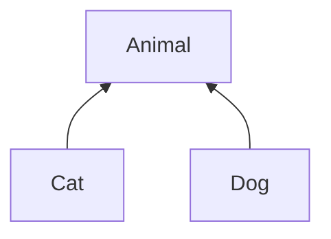

</div>

We maken nu een generische klasse `Food`, geparametriseerd met het type dier (`T`) dat dat voedsel eet:

```java
class Food<T> {
  public void giveTo(T animal) {
    /* ... */
    animal.showLike(); // <= compiler error 🙁
  }
}

Food<Cat> catFood = new Food<>();       // OK
Food<String> stringFood = new Food<>(); // ook OK? 🙁
```

De `Food`-klasse is enkel bedoeld om met `Animal` (en de subklassen van Animal) gebruikt te worden, bijvoorbeeld `Food<Cat>` en `Food<Dog>`.
Maar niets houdt ons op dit moment tegen om ook een `Food<String>` te maken.
Daarenboven zal de compiler (terecht) ook een compilatiefout geven in de methode `giveTo` van `Food`: er wordt een `Animal`-specifieke methode opgeroepen (namelijk `showLike`) op de parameter `animal`, maar die heeft type `T` en dat kan eender wat zijn, bijvoorbeeld ook `String`.
En `String` biedt natuurlijk geen methode `showLike()` aan.

We kunnen daarom aangeven dat type `T` een subtype moet zijn van `Animal` door bij de definitie van de generische parameter `<T extends Animal>` te schrijven.
Je zal dan niet langer `Food<String>` mogen schrijven, aangezien `String` geen subklasse is van `Animal`.
We **begrenzen** dus de mogelijke types die gebruikt kunnen worden voor de type-parameter `T` tot alle types die overerven van `Animal` (inclusief `Animal` zelf).

```java
class Food<T extends Animal> {
  public void giveTo(T animal) {
    /* ... */
    animal.showLike(); // <= OK! 👍
  }
}

Food<Cat> catFood = new Food<>();       // nog steeds OK
Food<String> stringFood = new Food<>(); // <-- compiler error 👍
```

{}
Wanneer je deze materie later opnieuw doorneemt, heb je naast `extends` ook al gehoord van `super` en wildcards (`?`) --- dit wordt [later](#covariantie-en-contravariantie-wildcards) besproken.
Het is belangrijk om op te merken dat je `super` en `?` en **nooit** kan gebruiken bij de _definitie_ van een nieuwe generische parameter (de Java compiler laat dit niet toe).
Dat kan enkel op de plaatsen waar je een generische klasse of methode _gebruikt_.
Onthoud dus: op de plaatsen waar je een nieuwe parameter (een nieuwe 'letter') introduceert, kan je enkel aangeven dat die een subtype van iets moet zijn met behulp van `extends`.
{}

## Generische methodes

```
TODO
Gebruik generische methodes: type opgeven (maar meestal niet nodig - type inference).
```

In de voorbeelden hierboven hebben we steeds een hele klasse generisch gemaakt.
We vermeldden dat het ook mogelijk is om een generische **methode** te definiëren, wat soms nuttig kan zijn.
Dat kan ook in een klasse die zelf geen type-parameters heeft.
Hieronder definiëren we (in een niet-generische klasse `AnimalHelper`) een generische (statische) methode `findHappyAnimals`.
Deze heeft 1 generische parameter `T`, en we leggen meteen ook op dat dat een subtype van `Animal` moet zijn (`<T extends Animal>`).

```java
class AnimalHelper {
  public static <T extends Animal> ArrayList<T> findHappyAnimals(ArrayList<T> animals) { /* ... */ }
}

ArrayList<Cat> cats = new ArrayList<>();
/* ... */
ArrayList<Cat> happyCats = AnimalHelper.findHappyAnimals(cats);
```

Merk op dat we het type `T` zowel gebruiken bij de `animals`-parameter als bij het terugkeertype van de methode.
Zo kunnen we garanderen dat de teruggegeven lijst precies hetzelfde type elementen heeft als de lijst `animals`, zonder dat we al moeten vastleggen welk type dier (bv. `Cat` of `Dog`) dat precies is.
Dus: als we een `ArrayList<Cat>` meegeven aan de methode, krijgen we ook een `ArrayList<Cat>` terug.

Op dezelfde manier kan je ook het type van meerdere parameters (en eventueel het terugkeertype) aan elkaar verbinden.
In het voorbeeld hieronder zie je een methode die paren kan maken tussen dieren; de methode kan gebruikt worden voor elk type dier, maar maakt enkel paren van dezelfde soort.
Je ziet meteen ook een voorbeeld van een generisch record-type `AnimalPair`.

```java
class AnimalHelper {
  public record AnimalPair<T extends Animal>(T male, T female) {} // <= voorbeeld van een generisch record

  public static <T extends Animal> ArrayList<AnimalPair<T>> makePairs(ArrayList<T> males, ArrayList<T> females) {
    /* ... */
  }
}

ArrayList<Cat> maleCats = ...
ArrayList<Cat> femaleCats = ...
ArrayList<Dog> femaleDogs = ...
ArrayList<AnimalPair<Cat>> pairedCats = makePairs(maleCats, femaleCats); // OK

ArrayList<AnimalPair<Animal>> pairedMix = makePairs(maleCats, femaleDogs); // niet OK (compiler error) 👍
```

Als het type `T` niet van belang is omdat het nergens terugkomt (bijvoorbeeld niet in het terugkeertype van de methode en ook niet bij een andere parameter), dan heb je strikt gezien geen generische methode nodig.
Zoals we [later](#covariantie-en-contravariantie-wildcards) zullen zien, kan je dan ook gewoon het wildcard-type `<? extends X>` gebruiken, of `<?>` indien het type niet begrensd moet worden.
In plaats van

```java
  public static <T extends Animal> void feedAll(ArrayList<T> animals) {
    // code die T nergens vermeldt
  }
```

kan je dus ook de generische parameter weglaten, en hetvolgende schrijven:

```java
  public static void feedAll(ArrayList<? extends Animal> animals) { /* ... */ }
```

Je leest deze methode-signatuur als 'de methode `feedAll` neemt als parameter een lijst met elementen van een willekeurig (niet nader bepaald) subtype van `Animal`'.

## Oefeningen (1)

Voor de tests maken we gebruik van [assertJ](https://assertj.github.io/doc).

### Maybe-klasse

1. Schrijf een generische klasse (of record) `Maybe` die een object voorstelt dat nul of één waarde van een bepaald type kan bevatten.
   Dat type wordt bepaald door een generische parameter. Je kan Maybe-objecten enkel aanmaken via de statische methodes `some` en `none`.
   Hieronder vind je twee tests:

```java
@Test
public void maybeWithValue() {
    Maybe<String> maybe = Maybe.some("Yes");
    assertThat(maybe.hasValue()).isTrue();
    assertThat(maybe.getValue()).isEqualTo("Yes");
}

@Test
public void maybeWithoutValue() {
    Maybe<String> maybe = Maybe.none();
    assertThat(maybe.hasValue()).isFalse();
    assertThat(maybe.getValue()).isNull();
}
```

2. Maak de `print`-methode hieronder ook generisch, zodat deze niet enkel werkt voor een `Maybe<String>` maar ook voor andere types dan `String`.

```java
class MaybePrint {
  public static void print(Maybe<String> maybe) {
    if (maybe.hasValue()) {
      System.out.println("Contains a value: " + maybe.getValue());
    } else {
      System.out.println("No value :(");
    }
  }

  public static void main(String[] args) {
    Maybe<String> maybeAString = Maybe.some("yes");
    Maybe<String> maybeAnotherString = Maybe.none();

    print(maybeAString);
    print(maybeAnotherString);
  }
}
```

3. Voeg aan `Maybe` een generische methode `map` toe die een `java.util.function.Function<T, R>`-object als parameter heeft, en die een nieuw Maybe-object teruggeeft, met daarin het resultaat van de functie toegepast op het element als er een element is, of een leeg Maybe-object in het andere geval.
   Zie de tests hieronder voor een voorbeeld van hoe deze map-functie gebruikt wordt:

```java
@Test
public void maybeMapWithValue() {
    Maybe<String> maybe = Maybe.some("Hello");
    Maybe<Integer> result = maybe.map((str) -> str.length());
    assertThat(result.hasValue()).isTrue();
    assertThat(result.getValue()).isEqualTo(5);
}

@Test
public void maybeMapWithValue2() {
    Maybe<String> maybe = Maybe.some("Hello");
    Maybe<String> result = maybe.map((str) -> str + "!");
    assertThat(result.hasValue()).isTrue();
    assertThat(result.getValue()).isEqualTo("Hello!");
}

@Test
public void maybeMapWithoutValue() {
    Maybe<String> maybe = Maybe.none();
    Maybe<Integer> result = maybe.map((str) -> str.length());
    assertThat(result.hasValue()).isFalse();
}
```

4. (optioneel) Herschrijf `Maybe` als een sealed interface met twee record-subklassen `None` en `Some`.
   Geef een voorbeeld van hoe je deze klasse gebruikt met pattern matching.
   Kan je ervoor zorgen dat je getValue() nooit kan oproepen als er geen waarde is (compiler error)?

### (extra) SuccessOrFail

Schrijf een generische klasse (of record) `SuccessOrFail` die een object voorstelt dat precies één element bevat.
Dat element heeft 1 van 2 mogelijke types (die types zijn generische parameters).
Het eerste type stelt het type van een succesvol resultaat voor; het tweede type is dat van een fout.
Je kan objecten enkel aanmaken via de statische methodes `success` en `fail`.
Een voorbeeld van tests voor die klasse vind je hieronder:

```java
@Test
public void success() {
    SuccessOrFail<String, Exception> result = SuccessOrFail.success("This is the result");
    assertThat(result.isSuccess()).isTrue();
    assertThat(result.successValue()).isEqualTo("This is the result");
}

@Test
public void failure() {
    SuccessOrFail<String, Exception> result = SuccessOrFail.fail(new IllegalStateException());
    assertThat(result.isSuccess()).isFalse();
    assertThat(result.failValue()).isInstanceOf(IllegalStateException.class);
}
```

## Generics en subtyping

Stel we hebben klassen `Animal`, `Mammal`, `Cat`, `Dog`, en `Bird` met een overervingsrelatie:

<div style="display: grid; grid-template-columns: 1fr 1fr; align-items: center;">

```java
class Animal { /* ... */ }
class Mammal extends Animal { /* ... */ }
class Cat extends Mammal { /* ... */ }
class Dog extends Mammal { /* ... */ }
class Bird extends Animal { /* ... */ }
```

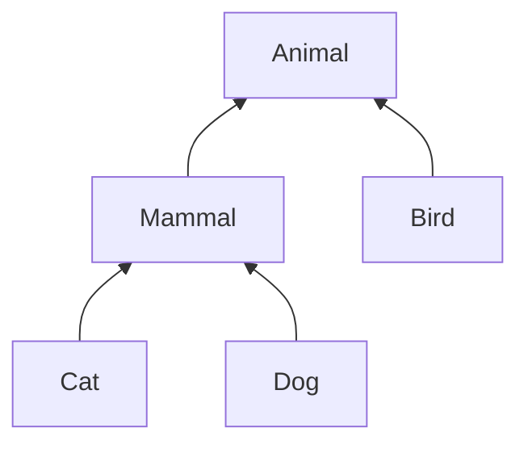

</div>

Een van de basisregels van object-georiënteerd programmeren is dat **overal waar een object van type `X` verwacht wordt, ook een object van een subtype van `X` toegelaten wordt**.
De Java compiler respecteert deze regel uiteraard.
Volgende toekenningen zijn bijvoorbeeld toegelaten:

```java
Animal animal = new Cat();
Mammal mammal = new Dog();
animal = new Bird();
```

maar `mammal = new Bird();` is bijvoorbeeld niet toegelaten, want `Bird` is geen subtype van `Mammal`.

In onderstaande code is de eerste oproep toegelaten (cat heeft type `Cat`, en dat is een subtype van `Mammal`), maar de tweede niet (cat is geen `Dog`) en de derde ook niet (`Cat` is geen subtype van `Bird`):

```java
static void pet(Mammal mammal) { /* ... */ }
static void bark(Dog dog) { /* ... */ }
static void layEgg(Bird bird) { /* ... */ }

Cat cat = new Cat();
pet(cat);    // <- toegelaten (voldoet aan principe)
bark(cat);   // <- niet toegelaten (compiler error) 👍
layEgg(cat); // <- niet toegelaten (compiler error) 👍
```

### Toegepast op lijsten

Een lijst in Java is een geordende groep van elementen van hetzelfde type.
`List<E>` is de interface[^interface] die aan de basis ligt van alle lijsten.
`ArrayList<E>` is een klasse die een lijst implementeert met behulp van een array.
`ArrayList<E>` is een subtype van `List<E>`; dus overal waar een `List`-object verwacht wordt, mag ook een `ArrayList` gebruikt worden.
Later (in het hoofdstuk rond Collections) zullen we ook zien dat er een interface `Collection<E>` bestaat, wat een willekeurige groep van elementen voorstelt: niet enkel een lijst, maar bijvoorbeeld ook verzamelingen (`Set`) of wachtrijen (`Queue`).
`List<E>` is een subtype van `Collection<E>`. Bijgevolg (via transitiviteit) is `ArrayList<E>` dus ook subtype van `Collection<E>`.

In code ziet deze situatie er als volgt uit:

<div style="display: grid; grid-template-columns: 1fr 1fr; align-items: center;">

```java
interface Collection<E> {
  public void add(E element);
  public int size();
  /* ... */
}
interface List<E> extends Collection<E> {
  public E get(int index);
  /* ... */
}
class ArrayList<E> implements List<E> {
  private E[] elements;
  /* ... */
}
interface Set<E> extends Collection<E> { /* ... */ }
interface Queue<E> extends Collection<E> { /* ... */ }
```

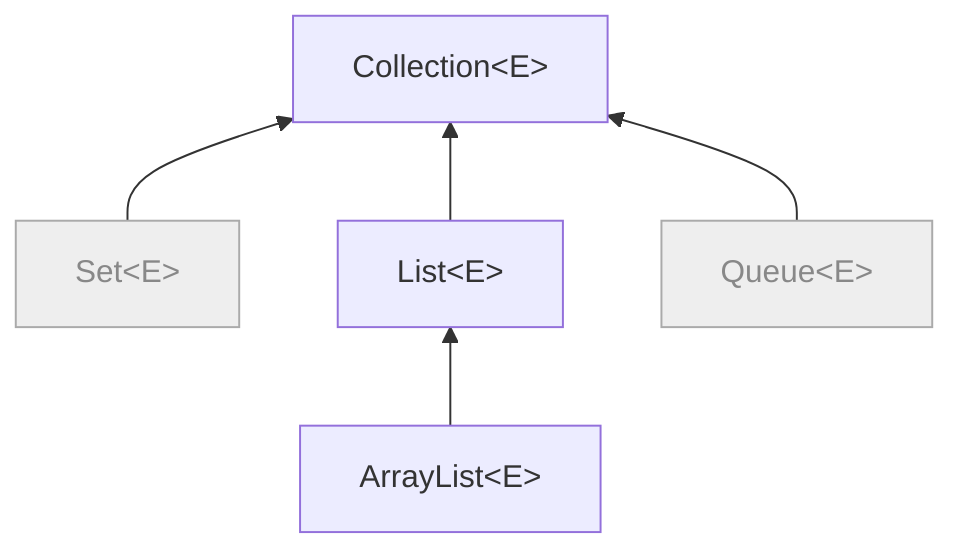

</div>

[^interface]: Een interface kan je zien als een abstracte klasse waarvan alle methodes abstract zijn. Het defineert alle methodes die geïmplementeerd moeten worden, maar bevat zelf geen implementatie.

<div style="display: grid; grid-template-columns: 1fr 1fr; align-items: center; gap: 2rem">

<div>
In deze situatie is hetvolgende geldig:

```java
List<Cat> cats = new ArrayList<Cat>();
Collection<Dog> dogs = new ArrayList<Dog>();
List<Animal> animals = new ArrayList<Animal>();
```

maar hetvolgende kan uiteraard niet:

```java
Collection<Dog> dogs = new ArrayList<Cat>(); // compileert niet 👍
```

</div>

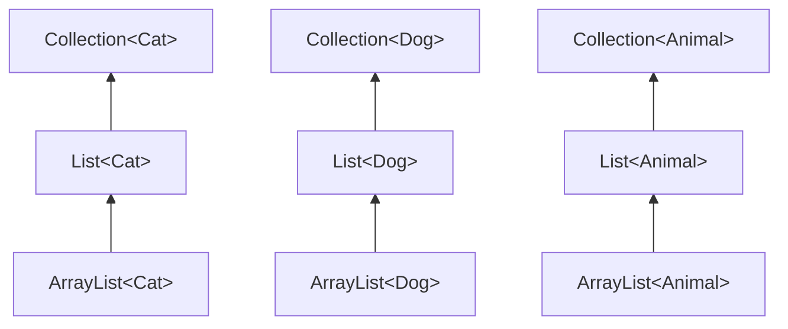

</div>

</div>

Het lijkt misschien logisch dat `ArrayList<Cat>` ook een subtype moet zijn van `ArrayList<Animal>`.
Een lijst van katten lijkt tenslotte toch een speciaal geval te zijn van een lijst van dieren?
Maar dat is niet het geval.

<div style="display: grid; grid-template-columns: 1fr 1fr; align-items: center;">

```java
ArrayList<Animal> = new ArrayList<Cat>(); // compileert niet
```

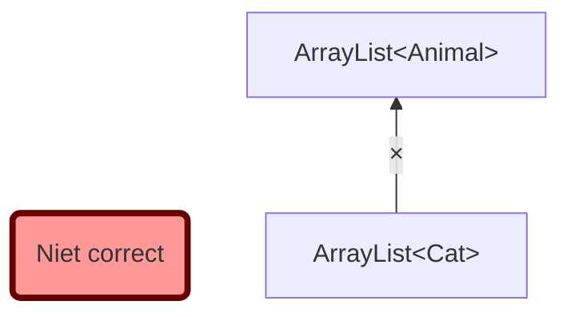

</div>

Waarom niet?
Stel dat `ArrayList<Cat>` toch een subtype zou zijn van `ArrayList<Animal>`. Dan zou volgende code ook geldig zijn:

```java
ArrayList<Cat> cats = new ArrayList<Cat>();
ArrayList<Animal> animals = cats; // <- dit zou geldig zijn (maar is het niet!)
Dog dog = new Dog();
animals.add(dog); // <- OOPS: er zit nu een hond in de lijst van katten 🙁
```

Je zou dus honden kunnen toevoegen aan je lijst van katten zonder dat de compiler je waarschuwt, en dat is niet gewenst.
Om die reden beschouwt Java `ArrayList<Cat>` dus niet als subtype van `ArrayList<Animal>`, ondanks dat `Cat` wél een subtype van `Animal` is.
Hieronder zullen we zien hoe we dit met wildcards in sommige gevallen wel kunnen toelaten.

### Oefening: subtyping

Vetrek van volgende klasse-hiërarchie en zeg van elk van volgende lijnen code of ze toegelaten worden door de Java compiler:

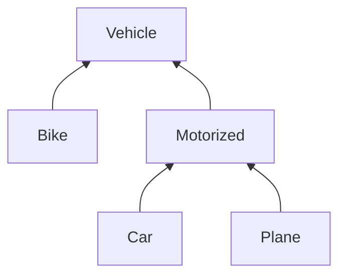

```java
/* 1 */  Motorized myCar = new Car();
/* 2 */  Vehicle yourPlane = new Plane();
/* 3 */  Collection<Vehicle> vehicles = new ArrayList<Vehicle>();
/* 4 */  vehicles.add(myCar);
/* 5 */  List<Car> cars = new ArrayList<Car>();
/* 6 */  List<Vehicle> carsAsVehicles = cars;
```

### Overerven van een generisch type

TODO

Hierboven gebruikten we vooral `ArrayList` als voorbeeld van een generische klasse.
We hebben echter ook gezien dat je zelf generische klassen kan definiëren, en daarvan kan je uiteraard ook overerven.

```java
class Super<T> { ... }

class SubForAnimal<A extends Animal> extends Super<A> { ... }

class SubForCat extends SubAnimal<Cat> { ... }
```

## Covariantie en contravariantie: wildcards

We zagen hierboven dat de types `List<Dog>` en `List<Animal>` niets met elkaar te maken hebben, ondanks het feit dat `Dog` een subtype is van `Animal`.
Dat geldt in het algemeen voor generische types. Bijvoorbeeld, in volgende situatie:

```java
class Shelter<T> { }
class AnimalShelter<A extends Animal> extends Shelter<A> { ... }
```

is `AnimalShelter<Dog>` een subtype van `Shelter<Dog>`, om dezelfde reden dat `ArrayList<Dog>` een subtype is van `List<Dog>`.
Volgende toekenning en methode-oproep zijn dus toegelaten:

```java
Shelter<Dog> shelter = new AnimalShelter<Dog>(); // OK! 👍

public void protectDog(Shelter<Dog> s) { ... }
AnimalShelter<Dog> animalShelter = new AnimalShelter<Dog>();
protectDog(animalShelter); // OK! 👍
```

Dat komt omdat `AnimalShelter` een subtype is van `Shelter`, en de generische parameter bij beiden hetzelfde is.

Als de generische parameters verschillend zijn, is er geen overervingsrelatie.
Bijvoorveeld, tussen `AnimalShelter<Cat>` en `Shelter<Animal>` is er geen overervingsrelatie.
Ook is `Shelter<Cat>` geen subtype van `Shelter<Animal>`.
Het volgende is bijgevolg **niet** toegelaten:

```java
Shelter<Animal> s = new AnimalShelter<Cat>(); // NIET toegelaten

public void protectAnimal(Shelter<Animal> s) { ... }
AnimalShelter<Cat> animalShelter = new AnimalShelter<Cat>(); // wel OK!
protectAnimal(animalShelter); // NIET toegelaten
```

In sommige situaties willen we _wel_ zo'n overervingsrelatie kunnen maken.
We bekijken daarvoor twee soorten relaties, namelijk **covariantie** en **contravariantie**.

{}
**Opgelet**: Zowel covariantie als contravariantie gaan enkel over het **gebruik** van generische klassen.
Meer bepaald beïnvloeden ze wanneer twee generische klassen door de compiler als subtype van elkaar beschouwd worden.
Dat staat los van de **definitie** van een generische klasse --- die definities (en bijhorende begrenzing) blijven onveranderd!
{}

### Covariantie (extends)

Wat als we een methode `copyFromTo` willen schrijven die de dieren uit een gegeven (bron-)lijst toevoegt aan een andere (doel-)lijst van dieren? Bijvoorbeeld:

```java
public static void copyFromTo(ArrayList<Animal> source, ArrayList<Animal> target) {
  for (Animal a : source) { target.add(a); }
}

ArrayList<Animal> animals = new ArrayList<>();
ArrayList<Cat> cats = /* ... */
ArrayList<Dog> dogs = /* ... */
/* ... */
copyFromTo(dogs, animals); // niet toegelaten 🙁
copyFromTo(cats, animals); // niet toegelaten 🙁
```

Volgens de regels die we hierboven gezien hebben, kunnen we deze methode niet gebruiken om de dieren uit een lijst van honden (`ArrayList<Dog>`) of katten (`ArrayList<Cat>`) te kopiëren naar een lijst van dieren (`ArrayList<Animal>`).
Maar dat lijkt wel een zinnige operatie.
Een oplossing kan zijn om verschillende versies van de methode te schrijven:

```java
public static void copyFromCatsTo(ArrayList<Cat> source, ArrayList<Animal> target) {
  for (Cat cat : source) { target.add(cat); }
}
public static void copyFromDogsTo(ArrayList<Dog> source, ArrayList<Animal> target) {
  for (Dog dog : source) { target.add(dog); }
}
public static void copyFromBirdsTo(ArrayList<Bird> source, ArrayList<Animal> target) {
  for (Bird bird : source) { target.add(bird); }
}
```

{}
Merk op dat de oproep `target.add(cat)`, alsook die met `dog` en `bird`, toegelaten is, omdat `Cat`, `Dog` en `Bird` subtypes zijn van `Animal`.
{}

Maar dan lopen we opnieuw tegen het probleem van gedupliceerde code aan.
Een eerste oplossing daarvoor is een generische methode, met een generische parameter die begrensd is (`T extends Animal`):

```java
public static <T extends Animal> void copyFromTo_generic(ArrayList<T> source, ArrayList<Animal> target) {
  for (Animal a : source) { target.add(a); }
}
```

Dat werkt, maar de generische parameter `T` wordt slechts eenmaal gebruikt, namelijk bij de parameter `ArrayList<T> source`.
In zo'n situatie kunnen we ook gebruik maken van het **wildcard-type `<? extends X>`**.
We kunnen bovenstaande methode dus ook zonder generische parameter schrijven als volgt:

```java
public static void copyFromTo_wildcard(ArrayList<? extends Animal> source, ArrayList<Animal> target) {
  for (Animal a : source) { target.add(a); }
}
```

Het type `ArrayList<? extends Animal>` staat dus voor _"elke ArrayList waar het element-type een (niet nader bepaald) subtype is van `Animal`"_.
Volgende code is nu toegelaten:

```java
copyFromTo_wildcard(dogs, animals); // OK! 👍
copyFromTo_wildcard(cats, animals); // OK! 👍
```

Dit heet **covariantie**: omdat `Cat` een subtype is van `Animal`, is `ArrayList<Cat>` een subtype van `ArrayList<? extends Animal>`.
De 'co' in covariantie wijst erop dat de overervingsrelatie tussen `Cat` en `Animal` in dezelfde richting loopt als die tussen `ArrayList<Cat>` en `ArrayList<? extends Animal>` (in tegenstelling tot contravariantie, wat zodadelijk aan bod komt).
Dat zie je op de afbeelding hieronder:

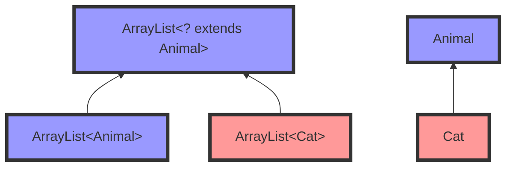

Merk op dat `ArrayList<Animal>` ook een subtype is van `ArrayList<? extends Animal>`.

We kunnen ook de relatie met `Mammal` toevoegen:

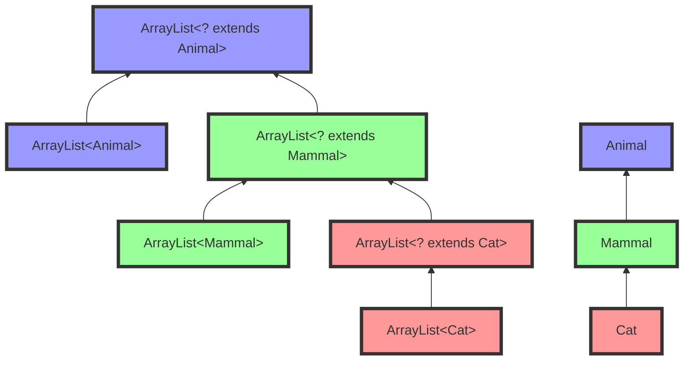

Tenslotte kan je in Java ook `<?>` schrijven (bijvoorbeeld `ArrayList<?>`); dat is een verkorte notatie voor `ArrayList<? extends Object>`. Je interpreteert `ArrayList<?>` dus als _een lijst van een willekeurig maar niet gekend type_. Merk op dat `ArrayList<?>` dus niet hetzelfde is als `ArrayList<Object>`. Een `ArrayList<Cat>` is een subtype van `ArrayList<?>`, maar niet van `ArrayList<Object>`.

Hou er ook rekening mee dat elk voorkomen van `?` voor een ander type staat (of kan staan). Hetvolgende kan dus niet:

```java
public void copyMammalsFromTo(
      ArrayList<? extends Mammal> source,
      ArrayList<? extends Mammal> target) {
  for (Mammal m : source) { target.add(m); } // compileert niet! 🙁
}
```

omdat de eerste `ArrayList<? extends Mammal>` (`source`) bijvoorbeeld een `ArrayList<Cat>` kan zijn, en de tweede (`target`) een `ArrayList<Dog>`. Als je de types van beide parameters wil linken aan elkaar, moet je een generische methode gebruiken (zoals eerder gezien):

```java
public <T extends Mammal> void copyMammalsFromTo(
    ArrayList<T> source,
    ArrayList<T> target) {
  for (Mammal m : source) { target.add(m); } // OK! 👍
}
```

Onderstaande code is ook ongeldig. Waarom?

```java
ArrayList<?> lijst = new ArrayList<String>();
lijst.add("Hello");
```

{}

De `lijst`-variabele is gedeclareerd als een ArrayList van een ongekend type. Op basis van het type van de variabele kan de compiler niet afleiden dat er Strings toegevoegd mogen worden aan de lijst (het zou evengoed een ArrayList van Animals kunnen zijn).
Het feit dat `lijst` geinititialiseerd wordt met `<String>` doet hier niet terzake; enkel het type van de declaratie is van belang.

{}

#### Oefening: covariantie

Maak een schema met de overervingsrelaties tussen

- `List<Cat>`
- `List<? extends Cat>`
- `ArrayList<Cat>`
- `ArrayList<? extends Cat>`
- `List<Animal>`
- `List<? extends Animal>`
- `ArrayList<Animal>`
- `ArrayList<? extends Animal>`

{}

- `ArrayList<Cat>` is een subtype van `List<Cat>` en van `ArrayList<? extends Cat>`.
- `List<Cat>` is een subtype van `List<? extends Cat>`
- `ArrayList<? extends Cat>` is een subtype van `List<? extends Cat>` en van `ArrayList<? extends Animal>`
- `ArrayList<Animal>` is een subtype van `ArrayList<? extends Animal>` en `List<Animal>`
- `List<? extends Cat>`, `ArrayList<? extends Animal>` en `List<Animal>` zijn alledrie subtypes van `List<? extends Animal>`

{}

### Contravariantie (super)

Wat als we een methode willen die de objecten uit een gegeven lijst van katten kopieert naar een lijst van willekeurige dieren? Bijvoorbeeld:

```java
public static void copyFromCatsTo(
      ArrayList<Cat> source,
      ArrayList<Animal> target) {
  for (Cat cat : source) { target.add(cat); }
}

ArrayList<Cat> cats = /* ... */

ArrayList<Cat> otherCats = new ArrayList<>();
ArrayList<Mammal> mammals = new ArrayList<>();
ArrayList<Animal> animals = new ArrayList<>();

copyFromTo(cats, otherCats); // niet toegelaten 🙁
copyFromTo(cats, mammals);   // niet toegelaten 🙁
copyFromTo(cats, animals);   // OK 👍
```

De eerste twee `copyFromTo`-regels zijn niet toegelaten, maar zouden opnieuw erg nuttig kunnen zijn.
Co-variantie met extends helpt ook niet (target zou dan immers ook een `ArrayList<Dog>` kunnen zijn):

```java
public static void copyFromCatsTo(
      ArrayList<Cat> source,
      ArrayList<? extends Animal> target) {
  for (Cat cat : source) { target.add(cat); } // ook niet toegelaten 🙁
}
```

En aparte methodes schrijven leidt opnieuw tot code-duplicatie:

```java
public static void copyFromCatsToCats(ArrayList<Cat> source, ArrayList<Cat> target) {
  for (Cat cat : source) { target.add(a); }
}
public static void copyFromCatsToMammals(ArrayList<Cat> source, ArrayList<Mammal> target) {
  for (Cat cat : source) { target.add(a); }
}
public static void copyFromCatsToAnimals(ArrayList<Cat> source, ArrayList<Animal> target) {
  for (Cat cat : source) { target.add(a); }
}
```

{}
Zou het nuttig zijn om een methode `copyFromCatsToBirds(ArrayList<Cat> source, ArrayList<Bird> target)` te voorzien? Waarom (niet)?
{}

De oplossing in dit geval is gebruik maken van het **wildcard-type `<? super T>`**.
Het type `ArrayList<? super Cat>` staat dus voor _"elke ArrayList waar het element-type een supertype is van `Cat`"_ (inclusief het type `Cat` zelf).
We kunnen dus schrijven:

```java
public static void copyFromCatsTo_wildcard(ArrayList<Cat> source, ArrayList<? super Cat> target) {
  for (Cat cat : source) { target.add(a); }
}
```

en kunnen nu hetvolgende uitvoeren:

```java
copyFromCatsTo_wildcard(cats, otherCats); // OK 👍
copyFromCatsTo_wildcard(cats, mammals);   // OK 👍
copyFromCatsTo_wildcard(cats, animals);   // OK 👍
```

Dit heet **contravariantie**: hoewel `Cat` een **subtype** is van `Animal`, is `ArrayList<? super Cat>` een **supertype** van`ArrayList<Animal>`.
De 'contra' in contravariantie wijst erop dat de overervingsrelatie tussen `Cat` en `Animal` in de omgekeerde richting loopt als die tussen `ArrayList<? super Cat>` en `ArrayList<Animal>`.
Bekijk volgende figuur aandachtig:

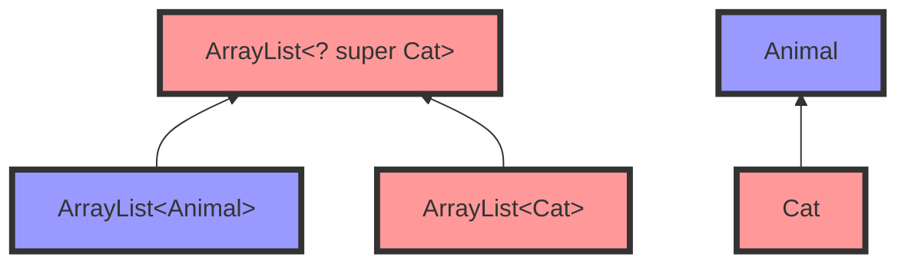

Als we ook `ArrayList<Mammal>`, `ArrayList<? super Mammal>`, en `ArrayList<? super Animal>` toevoegen aan het plaatje, ziet dat er als volgt uit:

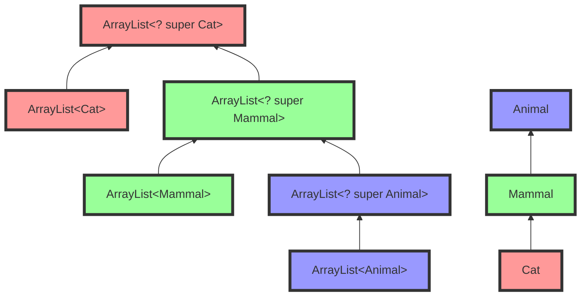

Aan de hand van de kleuren kan je snel zien dat de overervingsrelatie omgekeerd verloopt.

### Covariantie of contravariantie: PECS

Als we covariantie en contravariantie combineren, krijgen we volgend beeld (we focussen op de extends- en super-relatie vanaf `Mammal`):

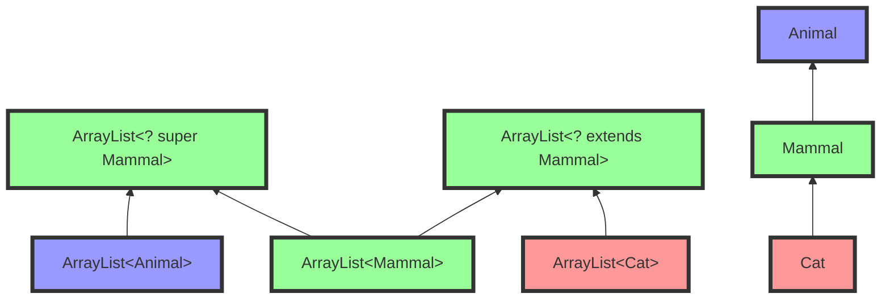

Hier zien we dat `ArrayList<? extends Mammal>` (covariant) als subtypes `ArrayList<Mammal>` en `ArrayList<Cat>` heeft.
Het contravariante `ArrayList<? super Mammal>` heeft óók `ArrayList<Mammal>` als subtype, maar ook `ArrayList<Animal>`.

Hoe weet je nu wanneer je wat gebruikt als type voor een parameter? Wanneer kies je `<? extends T>`, en wanneer `<? super T>`?
Een goede vuistregel is het acroniem **PECS**, wat staat voor **P**roducer **E**xtends, **C**onsumer **S**uper.
Dus:

- Wanneer het object gebruikt wordt als een producent van `T`'s (met andere woorden, het object is een levancier van `T`-objecten voor jouw code, die ze vervolgens gebruikt), gebruik je `<? extends T>`. Dat is logisch: als jouw code met aangeleverde `T`'s omkan, dan kan jouw code ook om met de aanlevering van een subklasse van `T` (basisprincipe objectgeoriënteerd programmeren).
- Wanneer het object gebruikt wordt als een consument van `T`'s (met andere woorden, het neemt `T`-objecten aan van jouw code), gebruik je `<? super T>`. Ook dat is logisch: een object dat beweert om te kunnen met elke superklasse van `T` kan zeker overweg met een `T` die jouw code aanlevert.
- Wanneer het object zowel als consument als als producent gebruikt wordt, gebruik je gewoon `<T>` (dus geen co- of contra-variantie). Er is dan weinig tot geen flexibiliteit meer in het type.

Een voorbeeld om PECS toe te passen: we willen een methode `copyFromTo` die zo flexibel mogelijk is, om elementen uit een lijst van zoogdieren te kopiëren naar een andere lijst.

```java
void copyMammalsFromTo(
    ??? source,
    ??? target) {
  for (Mammal m : source) {
    target.add(m);
  }
}
```

De `source`-lijst is de **producent**: daaruit halen we Mammal-objecten op. Daar gebruiken we dus **extends**:

```java
void copyMammalsFromTo(
    List<? extends Mammal> source,
    ??? target) {
  for (Mammal m : source) {
    target.add(m);
  }
}
```

De `target`-lijst is de **consument**: daar sturen we Mammal-objecten naartoe. Daar gebruiken we dus **super**:

```java
void copyMammalsFromTo(
    List<? extends Mammal> source,
    List<? super Mammal> target) {
  for (Mammal m : source) {
    target.add(m);
  }
}
```

Met deze methode kunnen we nu alle zinvolle operaties uitvoeren, terwijl de zinloze operaties tegengehouden worden door de compiler:

```java
ArrayList<Cat> cats = /* ... */
ArrayList<Dog> dogs = /* ... */
ArrayList<Bird> birds = /* ... */
ArrayList<Mammal> mammals = /* ... */
ArrayList<Animal> animals = /* ... */

copyMammalsFromTo(cats, animals); // OK 👍
copyMammalsFromTo(cats, mammals); // OK 👍
copyMammalsFromTo(cats, cats); // OK 👍

copyMammalsFromTo(mammals, animals); // OK 👍

copyMammalsFromTo(cats, dogs);
// compiler error (Dog is geen supertype van Mammal) 👍

copyMammalsFromTo(birds, animals);
// compiler error (Bird is geen subtype van Mammal) 👍
```

Merk op dat het type Mammal in onze laatste versie van `copyMammalsFromTo` hierboven eigenlijk onnodig is. We kunnen de methode nog verder veralgemenen door er een generische methode van te maken, die werkt voor alle lijsten:

```java
<T> void copyFromTo(
    List<? extends T> source,
    List<? super T> target) {
  for (T element : source) {
    target.add(element);
  }
}
```

Met deze versie kunnen we nu bijvoorbeeld ook Birds kopiëren naar een lijst van dieren:

```java
copyFromTo(birds, animals); // OK 👍
```

### Arrays en type erasure

In tegenstelling tot ArrayLists (en andere generische types), beschouwt Java arrays wel altijd als co-variant.
Dat betekent dat `Cat[]` een subtype is van `Animal[]`.
Volgende code compileert dus (maar gooit een uitzondering bij het uitvoeren):

```java
Animal[] cats = new Cat[2];
cats[0] = new Dog(); // compileert, maar faalt tijdens het uitvoeren
```

De reden hiervoor is, in het kort, dat informatie over generics gewist wordt bij het compileren van de code.
Dit heet **type erasure**.
In de gecompileerde code is een `ArrayList<Animal>` en `ArrayList<Cat>` dus exact hetzelfde.
Er kan dus, tijdens de uitvoering, niet gecontroleerd worden of je steeds het juiste type gebruikt.
Dat moet de compiler dus doen, en die moet het zekere voor het onzekere nemen.

Bij arrays wordt er _wel_ type-informatie bijgehouden na het compileren, en kan dus gecontroleerd worden dat je geen ongeldig getypeerde elementen toevoegt. De compiler hoeft het niet af te dwingen --- maar het wordt wel nog steeds gecontroleerd tijdens de uitvoering, en kan leiden tot een exception.

### Aandachtspunten

#### Enkel bij generische types!

Tenslotte nog een opmerking, aangezien hier vaak fouten tegen gemaakt worden.
Co- en contra-variantie (extends en super dus) zijn enkel van toepassing op **generische** types.
Alles wat we hierboven gezien hebben is dus enkel nuttig op plaatsen waar je een generisch type (`List<T>`, `Food<T>`, ...) gebruikt.
Je kan deze constructies bijgevolg niet gebruiken met gewone types; onderstaande code is dus **ongeldig**:

```java
public void pet(? extends Mammal mammal) { ... } // ONGELDIG! ❌
public void pet(<? extends Mammal> mammal) { ... } // ONGELDIG! ❌
public void pet(<? super Cat> mammal) { ... } // ONGELDIG! ❌
```

Schrijf in dat geval dus gewoon

```java
public void pet(Mammal mammal) { ... }
```

Op die manier kan de methode opgeroepen worden met een `Cat`-object, `Dog`-object, of elk ander type `Mammal`.
Je hebt hier geen co- of contra-variantie van generische types nodig; je maakt gewoon gebruik van subtypes uit objectgeoriënteerd programmeren.

#### Bounds vs co-/contravariantie en wildcards

```
TODO
Nog eens benadrukken wat het verschil is tussen begrenzen van een parameter,
en het gebruik van covariantie/wildcards
```

## Oefeningen (2)

### Shop

Maak een klasse `Shop` die een winkel voorstelt die items (subklasse van `StockItem`) aankoopt.
Een Shop-object wordt geparametriseerd met het type items dat aangekocht kan worden. We beschouwen hier `Fruit` en `Electronics`.

`Shop` heeft twee methodes:

- `buy`, die een lijst van items toevoegt aan de stock;
- `addStockToInventory`, die de lijst van items in stock toevoegt aan de meegegeven inventaris-lijst.

Voor het fruit maak je een abstracte klasse `Fruit`, en subklassen `Apple` en `Orange`.
Maak daarnaast nog een abstracte klasse `Electronics`, met als subklasse `Smartphone`.

Zorg dat onderstaande code (ongewijzigd) compileert en dat de test slaagt:

```java
@Test
public void testGenerics() {
  Shop<Fruit> fruitShop = new Shop<>();
  Shop<Electronics> electronicsShop = new Shop<>();

  List<Apple> apples = List.of(new Apple(), new Apple());
  List<Fruit> oranges = List.of(new Orange(), new Orange(), new Orange());

  List<Smartphone> phones = List.of(new Smartphone(), new Smartphone());

  fruitShop.buy(apples);
  fruitShop.buy(oranges);

  electronicsShop.buy(phones);

  List<StockItem> inventory = new ArrayList<>();
  fruitShop.addStockToInventory(inventory);
  Assertions.assertThat(inventory).hasSize(5);

  electronicsShop.addStockToInventory(inventory);

  Assertions.assertThat(inventory).hasSize(7);
}
```

### Functie compositie

Schrijf een generische functie `compose` die twee functies als parameters heeft, en een nieuwe functie teruggeeft die de compositie voorstelt: eerst wordt de eerste functie uitgevoerd, en dan wordt de tweede functie uitgevoerd op het resultaat van de eerste. Voor types van functies kan je opnieuw `java.util.function.Function<T, R>` gebruiken.
Pas de PECS-regel toe om ook functies te kunnen samenstellen die niet exact overeenkomen qua type.
Bijvoorbeeld, volgende code moet compileren en de test moet slagen:

```java
interface Ingredient {}
record Fruit() implements Ingredient {}
record PeeledFruit(Fruit fruit) implements Ingredient {}
record Chopped(Ingredient food) implements Ingredient {}

@Test
public void testCompose() {
    Function<Fruit, PeeledFruit> peelFruit = (var fruit) -> new PeeledFruit(fruit);
    Function<Ingredient, Chopped> chopIngredient = (var food) -> new Chopped(food);

    var makeFruitSalad = compose(peelFruit, chopIngredient);

    assertThat(makeFruitSalad.apply(new Fruit())).isEqualTo(new Chopped(new PeeledFruit(new Fruit())));
}
```

### Animal food

**Dit is een uitdagende oefening, voor als je je kennis over generics echt wil testen.**

Voeg generics (met grenzen/bounds) toe aan de code hieronder, zodat de code (behalve de laatste regel) compileert,
en de compiler enkel katteneten toelaat voor katten, en hondeneten voor honden:

```java
class Animal {
  public void eat(Food food) { }
}
class Cat extends Animal {}
class Dog extends Animal {}
class Food {}

class Main {
  public static void main(String[] args) {
    Food catFood = new Food();
    Food dogFood = new Food();

    Cat cat = new Cat();
    Dog dog = new Dog();

    cat.eat(catFood); // OK 👍
    dog.eat(dogFood); // OK 👍

    cat.eat(dogFood); // <- moet een compiler error geven! ❌
  }
}
```

(Hint: Begin met het type `Food` te parametriseren met een generische parameter die het `Animal`-type voorstelt dat dit voedsel eet.)

### Self-type

**Dit is een uitdagende oefening, voor als je je kennis over generics echt wil testen.**

Heb je je al eens afgevraagd hoe `assertThat(obj)` uit AssertJ werkt?
Afhankelijk van het type van `obj` dat je meegeeft, worden er andere assertions beschikbaar die door de compiler aanvaard worden:

```java
// een List<String>
List<String> someListOfStrings = List.of("hello", "there", "how", "are", "you");
assertThat(someListOfStrings).isNotNull().hasSize(5).containsItem("hello");

// een String
String someString = "hello";
assertThat(someString).isNotNull().isEqualToIgnoringCase("hello");

// een Integer
int someInteger = 4;
assertThat(someInteger).isNotNull().isGreaterThan(4);

assertThat(someInteger).isNotNull().isEqualToIgnoringCase("hello"); // <= compileert niet ❌
```

Sommige assertions (zoals `isNotNull`) zijn echter generiek, en wil je slechts op 1 plaats implementeren.
Probeer zelf een assertThat-methode te schrijven die werkt zoals bovenstaande, maar waar `isNotNull` slechts op 1 plaats geïmplementeerd is.

Hint 1: maak verschillende klassen, bijvoorbeeld `ListAssertion`, `StringAssertion`, `IntegerAssertion` die de type-specifieke methodes bevatten. Begin met `isNotNull` toe te voegen aan elk van die klassen (dus door de implementatie te kopiëren).

Hint 2: in een zogenaamde 'fluent interface' geeft elke operatie zoals `isNotNull` en `hasSize` het this-object op het einde terug (`return this`), zodat je oproepen na elkaar kan doen. Bijvoorbeeld `.isNotNull().hasSize(5)`.

Hint 3: maak nu een abstracte klasse `GenericAssertion` die `isNotNull` bevat, en waarvan de andere assertions overerven. Verwijder de andere implementaties van `isNotNull`.

Hint 4: In `isNotNull` is geen informatie beschikbaar over het type dat gebruikt moet worden als terugkeertype van `isNotNull`. `assertThat(someString).isNotNull()` moet bijvoorbeeld opnieuw een `StringAssertion` teruggeven. Dat kan je oplossen met generics, en een abstracte methode die het juiste object teruggeeft.

Hint 5: Je zal een zogenaamd 'self-type' moeten gebruiken. Dat is een generische parameter die wijst naar de (sub)klasse zelf.

Hint 6: op [deze pagina](http://web.archive.org/web/20130721224442/http:/passion.forco.de/content/emulating-self-types-using-java-generics-simplify-fluent-api-implementation) wordt uitgelegd hoe AssertJ dit doet. Probeer eerst zelf, zonder dit te lezen!
