Vooraleer we de discussie over datastructuren kunnen starten, is het nuttig om eerst te kijken naar **generics**, aangezien generics veelvuldig gebruikt worden in datastructuren.

## Wat en waarom?

Generics zijn een manier om klassen en methodes te voorzien van type-parameters.
Bijvoorbeeld, neem de volgende klasse `ArrayList`[^1]:

[^1]: Deze klasse is geïnspireerd op de ArrayList-klasse die standaard in Java zit.

```java
class ArrayList {
  private Object[] elements;
  public void add(Object element) { /* ... */  }
  public Object get(int index) { /* ... */  }
}
```

Stel dat we deze klasse makkelijk willen kunnen herbruiken.
Dan moeten we ze algemeen houden, en kunnen we nu nog niet zeggen wat het type is van de elementen van de lijst.
Gaan er Student-objecten in de lijst terechtkomen? Of Animal-objecten?
Dat weten we nog niet.
We kiezen daarom voor `Object`, het meest algemene type in Java.

Maar dat betekent ook dat je nu objecten van verschillende, niet-gerelateerde types kan opnemen in dezelfde lijst, hoewel dat niet de bedoeling is.
Stel bijvoorbeeld dat je een lijst van studenten wil bijhouden, dan houdt de compiler je niet tegen om ook andere types van objecten toe te voegen:

```java
ArrayList students = new ArrayList();

Student student = new Student();
students.add(student);

Animal animal = new Animal();
students.add(animal); // <-- compiler vindt dit OK
```

Om dat tegen te gaan, zou je afzonderlijke klassen `ArrayListOfStudents`, `ArrayListOfAnimals`, ... kunnen schrijven waar het bedoelde type van elementen wel duidelijk is, en ook afgedwongen wordt door de compiler.
Bijvoorbeeld:

```java
class ArrayListOfStudents {
  private Student[] elements;
  public void add(Student element) { /* ... */  }
  public Student get(int index) { /* ... */  }
}

class ArrayListOfAnimals {
  private Animal[] elements;
  public void add(Animal element) { /* ... */  }
  public Animal get(int index) { /* ... */  }
}
```

Met deze implementaties is het probleem hierboven opgelost:

```java
ArrayListOfStudents students = new ArrayListOfStudents();
students.add(student); // OK
students.add(animal);  // compiler error
```

De prijs die we hiervoor betalen is echter dat we nu veel quasi-identieke implementaties moeten maken, die enkel verschillen in het type van de elementen.
Dat leidt tot veel onnodige en ongewenste code-duplicatie.

### Een generische klasse definiëren

Met generics kan je een _type_ gebruiken als parameter voor een klasse om deze code-duplicatie vermijden.
Generics geven je dus een combinatie van beide opties: er moet slechts 1 implementatie gemaakt worden (zoals bij `ArrayList` hierboven), en deze implementatie kan gebruikt worden om lijsten met een specifiek element-type te maken (zoals bij `ArrayListOfStudents`).

De type-parameter staat tussen `<` en `>`, en je kan deze type-parameter vervolgens gebruiken in heel de klasse.
Bijvoorbeeld, volgende klasse is een nieuwe versie van de `ArrayList` klasse van hierboven, maar nu met type-parameter `E`, welke vervolgens gebruikt wordt als type van de elements-array, de parameter van de add-method, en het resultaat-type van de get-method:

```java
class ArrayList<E> {
  private E[] elements;
  public void add(E element) { /* ... */  }
  public E get(int index) { /* ... */  }
}
```

Je zal heel vaak zien dat generische type-parameters slechts bestaan uit 1 letter (bijvoorbeeld `E`, `T`, of `U`). Dat is geen vereiste: onderstaande code mag ook, en is volledig equivalent aan die van hierboven.
De reden waarom vaak met individuele letters gewerkt wordt, is om duidelijk te maken dat het over een type-parameter gaat, en niet over een bestaande klasse.

```java
class ArrayList<Element> {
  private Element[] elements;
  public void add(Element element) { /_ ... _/ }
  public Element get(int index) { /_ ... _/ }
}
```

### Een generische klasse gebruiken

Bij het gebruik van een generische klasse (bijvoorbeeld `ArrayList<E>` van hierboven) moet je een concreet type opgeven voor de type-parameter (`E`).
Bijvoorbeeld, als je een lijst met enkel studenten wil, gebruik je `ArrayList<Student>`.
Je kan dan de klasse gebruiken op dezelfde manier als de `ArrayListOfStudents` klasse van hierboven:

```java
ArrayList<Student> students = new ArrayList<Student>();
Student someStudent = new Student();
students.add(someStudent);
// students.add(animal); // <-- niet toegelaten (compiler error)
Student firstStudent = students.get(0);
```

Merk op hoe de klasse afdwingt en garandeert dat er enkel Student-objecten in terecht kunnen komen.

Om wat typwerk te besparen, laat Java in veel gevallen ook toe om het type weg te laten bij het instantiëren, met behulp van `<>`.
Dat type is immers al bepaald door het type van de variabele:

```java
ArrayList<Student> students = new ArrayList<>(); // <- je hoeft geen tweede keer <Student> te typen
```

### Meerdere type-parameters

De ArrayList-klasse hierboven had één generische parameter (`E`).
Een klasse kan ook meerdere type-parameters hebben, bijvoorbeeld een tuple van 3 elementen van mogelijk verschillend type:

```java
class Tuple3<T1, T2, T3> {
  private T1 first;
  private T2 second;
  private T3 third;
  public T1 getFirst() { return first; }
  /* ... */
}
```

Bij het aanmaken moet je dan voor elke parameter een type opgeven:

```java
Tuple3<String, Integer, Student> tuple = new Tuple3<>("John", 23, student);
```

## Generische parameters begrenzen (bounds)

Een type-parameter `<E>` zoals we die tot nu toe gezien hebben kan om het even welke klasse voorstellen.
Soms willen we dat niet, en willen we beperkingen opleggen.
Stel bijvoorbeeld dat we volgende klasse-hierarchie hebben:

<div style="display: grid; grid-template-columns: 1fr 1fr; align-items: center;">

```java
abstract class Animal { /* ... */ }
class Cat extends Animal { /* ... */ }
class Dog extends Animal { /* ... */ }
```

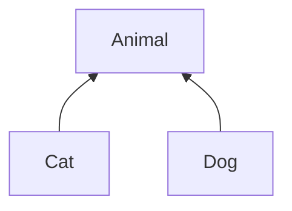

</div>

We maken nu een generische klasse `Food`:

```java
class Food<T> {
  public void giveTo(T animal) { /* ... */ }
}

Food<Cat> catFood = new Food<>();       // OK
Food<String> stringFood = new Food<>(); // ook OK? :(
```

Deze klasse is enkel bedoeld om met (subklassen van) `Animal` gebruikt te worden.
Maar het is ook mogelijk om een `Food<String>` te maken.
Verder zal de compiler ook weigeren om in de methode `giveTo` een `Animal`-specifieke methode op te roepen, omdat de parameter `animal` type `T` heeft, en dat kan eender wat zijn.

We kunnen aangeven dat type `T` een subtype moet zijn van `Animal` via `<T extends Animal>`.
Je zal dan niet langer `Food<String>` mogen schrijven, aangezien `String` geen subklasse is van `Animal`.
We **begrenzen** dus de mogelijke types die gebruikt kunnen worden voor de type-parameter `T`.

```java
class Food<T extends Animal> {
  public void giveTo(T animal) { /* ... */ }
}

Food<Cat> catFood = new Food<>();       // nog steeds OK
Food<String> stringFood = new Food<>(); // <-- compiler error
```

## Generische methodes

Hierboven hebben we steeds een hele klasse generisch gemaakt.
In sommige gevallen kan het ook nuttig zijn om een generische **methode** te definiëren.
Dat kan in een klasse die zelf geen type-parameters heeft:

TODO

```java

```

## Oefeningen (1)

### NonNull-klasse

Schrijf een generische klasse (of record) `NonNull` die een waarde van een bepaald type kan bevatten. Deze waarde mag niet null zijn.
Het type wordt bepaald door de generische parameter.
Hieronder vind je enkele tests voor de klasse.

```java
@Test
void valueIsStored() {
    NonNull<String> someString = new NonNull<>("Hello");
    assertThat(someString.getValue(), is("Hello"));
}
@Test
void nullIsRefused() {
    assertThrows(NullPointerException.class, () -> {
        new NonNull<>(null);
    });
}
```

### Maybe-klasse

1. Schrijf een generische klasse (of record) `Maybe` die een object voorstelt dat nul of één waarde van een bepaald type kan bevatten.
   Dat type wordt bepaald door een generische parameter.

2. Maak de `print`-methode hieronder ook generisch, zodat deze niet enkel werkt voor een `Maybe<String>` maar ook voor andere types dan `String`.

```java
public static void print(Maybe<String> maybe) {
  if (maybe.hasValue()) {
    System.out.println("Contains a value: " + maybe.getValue());
  } else {
    System.out.println("No value :(");
  }
}

Maybe<String> maybeAString = new Maybe<>("yes");
Maybe<String> maybeAnotherString = new Maybe<>(null);

print(maybeAString);
print(maybeAnotherString);
```

### SuccessOrFail

Schrijf een generische klasse (of record) `SuccessOrFail` die een object voorstelt dat precies één element bevat.
Dat element heeft 1 van 2 mogelijke types (die types zijn generische parameters).
Het eerste type stelt het type van een succesvol resultaat voor; het tweede type is dat van een fout.
Je kan objecten enkel aanmaken via de statische methodes `success` en `fail`.
Een voorbeeld van tests voor die klasse vind je hieronder:

```java
@Test
public void success() {
    SuccessOrFail<String, Exception> result = SuccessOrFail.success("This is the result");
    assertThat(result.isSuccess(), is(true));
    assertThat(result.successValue(), is("This is the result"));
}

@Test
public void failure() {
    SuccessOrFail<String, Exception> result = SuccessOrFail.fail(new IllegalStateException());
    assertThat(result.isSuccess(), is(false));
    assertThat(result.failValue(), is(instanceOf(IllegalStateException.class)));
}
```

## Generics en behavioral subtyping (substitutie-principe)

Stel we hebben klassen `Animal`, `Mammal`, `Cat`, `Dog`, en `Bird` met een overervingsrelatie:

<div style="display: grid; grid-template-columns: 1fr 1fr; align-items: center;">

```java
class Animal { /* ... */ }
class Mammal extends Animal { /* ... */ }
class Cat extends Mammal { /* ... */ }
class Dog extends Mammal { /* ... */ }
class Bird extends Animal { /* ... */ }
```

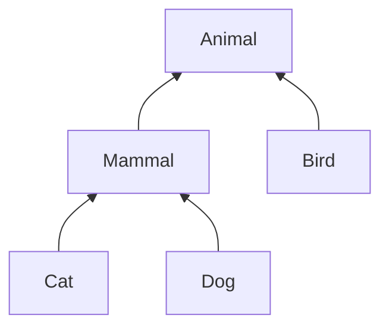

</div>

Het behavioral subtyping-principe (soms ook het Liskov substitutie-principe genoemd) zegt dat **overal waar een object van type `T` verwacht wordt, ook een object van een subtype van `T` toegelaten wordt**.
De Java compiler zal deze regel respecteren.
Bijvoorbeeld, volgende toekenningen maken gebruik van het dit principe, en zijn dus toegelaten:

```java
Animal animal = new Cat();
Mammal mammal = new Dog();
animal = new Bird();
```

maar `mammal = new Bird();` is bijvoorbeeld niet toegelaten.

In onderstaande code is de eerste oproep toegelaten (cat heeft type `Cat`, en dat is een subtype van `Mammal`), maar de tweede niet (cat is geen `Dog`) en de derde ook niet (`Cat` is geen subtype van `Bird`):

```java
static void pet(Mammal mammal) { /* ... */ }
static void bark(Dog dog) { /* ... */ }
static void layEgg(Bird bird) { /* ... */ }

Cat cat = new Cat();
pet(cat);    // <- toegelaten (voldoet aan principe)
bark(cat);   // <- niet toegelaten (compiler error)
layEgg(cat); // <- niet toegelaten (compiler error)
```

### Toegepast op lijsten

Een lijst in Java is een geordende groep van elementen van hetzelfde type.
`List<E>` is de interface[^2] die aan de basis ligt van alle lijsten.
`ArrayList<E>` is een klasse die een lijst implementeert met behulp van een array.
`ArrayList<E>` is een subtype van `List<E>`; volgens het principe kan dus, overal waar een lijst-object verwacht wordt, een lijst gebruikt worden die geïmplementeerd is met arrays.
[Later](/advjava/collections) zullen we ook zien dat er een interface `Collection<E>` bestaat, wat een willekeurige groep van elementen voorstelt: niet enkel een lijst, maar bijvoorbeeld ook verzamelingen (`Set`) of wachtrijen (`Queue`).
`List<E>` is een subtype van `Collection<E>`. Bijgevolg is ook `ArrayList<E>` een subtype van `Collection<E>`.

In code ziet deze situatie er als volgt uit:

<div style="display: grid; grid-template-columns: 1fr 1fr; align-items: center;">

```java
interface Collection<E> {
  public void add(E element);
  public int size();
  /* ... */
}
interface List<E> extends Collection<E> {
  public E get(int index);
  /* ... */
}
class ArrayList<E> implements List<E> {
  private E[] elements;
  /* ... */
}
interface Set<E> extends Collection<E> { /* ... */ }
interface Queue<E> extends Collection<E> { /* ... */ }
```

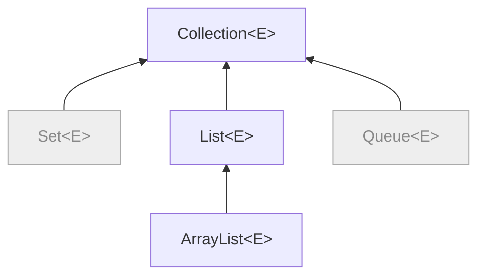

</div>

[^2]: Een interface kan je zien als een abstracte klasse waarvan alle methodes abstract zijn. Het defineert alle methodes die geïmplementeerd moeten worden, maar bevat zelf geen implementatie.

<div style="display: grid; grid-template-columns: 1fr 1fr; align-items: center; gap: 2rem">

<div>
In deze situatie is hetvolgende geldig:

```java
List<Cat> cats = new ArrayList<Cat>();
Collection<Dog> dogs = new ArrayList<Dog>();
List<Animal> animals = new ArrayList<Animal>();
```

maar hetvolgende kan uiteraard niet:

```java
Collection<Dog> dogs = new ArrayList<Cat>(); // compileert niet
```

</div>

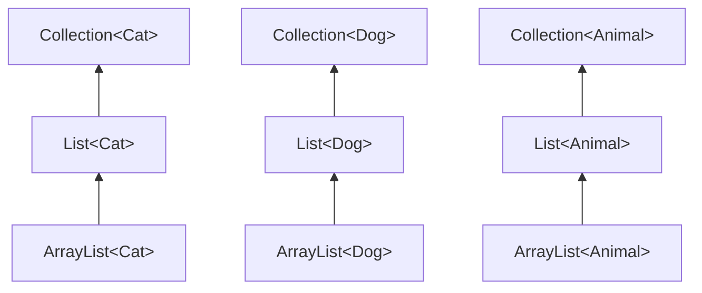

</div>

</div>

Het lijkt misschien logisch dat `ArrayList<Cat>` ook een subtype moet zijn van `ArrayList<Animal>`.
Een lijst van katten lijkt tenslotte toch een speciaal geval te zijn van een lijst van dieren?
Maar dat is niet het geval.

<div style="display: grid; grid-template-columns: 1fr 1fr; align-items: center;">

```java
ArrayList<Animal> = new ArrayList<Cat>(); // compileert niet
```

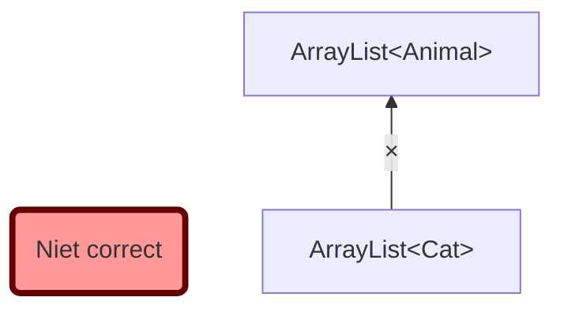

</div>

Waarom niet?
Stel dat `ArrayList<Cat>` toch een subtype zou zijn van `ArrayList<Animal>`. Dan zou volgende code ook geldig zijn:

```java
ArrayList<Cat> cats = new ArrayList<Cat>();
ArrayList<Animal> animals = cats; // <- dit zou geldig zijn (maar is het niet!)
Dog dog = new Dog();
animals.add(dog); // <- OOPS: er zit nu een hond in de lijst van katten
```

Je zou dus honden kunnen toevoegen aan je lijst van katten zonder dat de compiler je waarschuwt, en dat is niet gewenst.
Om die reden beschouwt Java `ArrayList<Cat>` dus niet als subtype van `ArrayList<Animal>`, ondanks dat `Cat` wél een subtype van `Animal` is.

### Oefening: behavioral subtyping

Vetrek van volgende klasse-hiërarchie en zeg van elk van volgende lijnen code of ze toegelaten worden door de Java compiler:

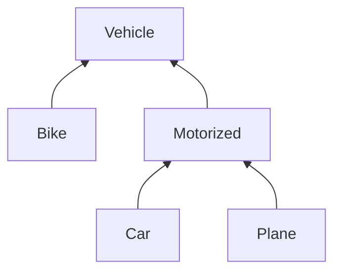

```java
/* 1 */  Motorized myCar = new Car();
/* 2 */  Vehicle yourPlane = new Plane();
/* 3 */  Collection<Vehicle> vehicles = new ArrayList<Vehicle>();
/* 4 */  vehicles.add(myCar);
/* 5 */  List<Car> cars = new ArrayList<Car>();
/* 6 */  List<Vehicle> carsAsVehicles = cars;
```

## Covariantie en contravariantie: wildcards

We zagen hierboven dat `List<Cat>` en `List<Animal>` niets met elkaar te maken hebben, ondanks dat `Cat` een subtype is van `Animal`.
In sommige situaties willen we wel zo'n relatie kunnen leggen.

### Covariantie (extends)

Wat als we een methode willen schrijven die de dieren uit een gegeven lijst toevoegt aan een andere lijst van dieren? Bijvoorbeeld:

```java
public static void copyFromTo(ArrayList<Animal> source, ArrayList<Animal> target) {
  for (Animal a : source) { target.add(a); }
}

ArrayList<Animal> animals = new ArrayList<>();
ArrayList<Cat> cats = /* ... */
ArrayList<Dog> dogs = /* ... */
/* ... */
copyFromTo(dogs, animals); // niet toegelaten
copyFromTo(cats, animals); // niet toegelaten
```

Volgens de regels die we hierboven gezien hebben, kunnen we deze methode nu niet gebruiken om de dieren uit een lijst van honden of katten te kopiëren naar een lijst van dieren.
Maar dat lijkt wel een zinnige operatie.
Een oplossing kan zijn om verschillende versies van de methode te schrijven:

```java
public static void copyFromCatsTo(ArrayList<Cat> source, ArrayList<Animal> target) {
  for (Cat cat : source) { target.add(cat); }
}
public static void copyFromDogsTo(ArrayList<Dog> source, ArrayList<Animal> target) {
  for (Dog dog : source) { target.add(dog); }
}
public static void copyFromBirdsTo(ArrayList<Bird> source, ArrayList<Animal> target) {
  for (Bird bird : source) { target.add(bird); }
}
```

{}
Merk op dat de oproep `target.add(cat)`, alsook die met `dog` en `bird`, toegelaten is, omdat `Cat`, `Dog` en `Bird` subtypes zijn van `Animal`.
{}

Maar dan lopen we opnieuw tegen het probleem van gedupliceerde code aan.
Java voorziet een oplossing, doormiddel van het **wildcard-type `<? extends T>`**.
We kunnen bovenstaande methode dus schrijven als

```java
public static void copyFromTo_wildcard(ArrayList<? extends Animal> source, ArrayList<Animal> target) {
  for (Animal a : source) { target.add(a); }
}
```

Het type `ArrayList<? extends Animal>` staat dus voor _"elke ArrayList waar het element-type een (niet nader bepaald) subtype is van `Animal`"_.
Volgende code is nu toegelaten:

```java
copyFromTo_wildcard(dogs, target); // OK!
copyFromTo_wildcard(cats, target); // OK!
```

Dit heet **covariantie**: omdat `Cat` een subtype is van `Animal`, is `ArrayList<Cat>` een subtype van `ArrayList<? extends Animal>`.
De 'co' in covariantie wijst erop dat de overervingsrelatie tussen `Cat` en `Animal` in dezelfde richting loopt als die tussen `ArrayList<Cat>` en `ArrayList<? extends Animal>` (in tegenstelling tot contravariantie, wat zodadelijk aan bod komt).

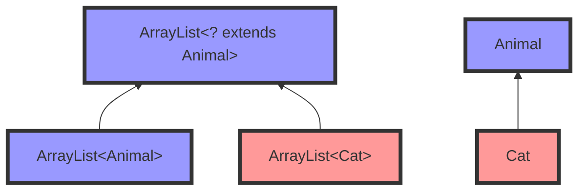

We kunnen ook de relatie met `Mammal` toevoegen:

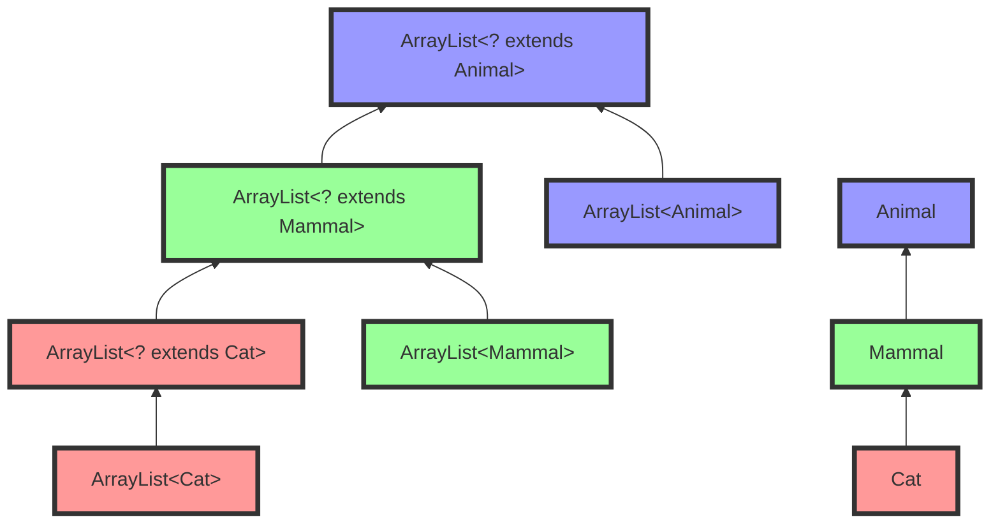

Tenslotte kan je in Java ook `<?>` schrijven; dat is een verkorte notatie voor `<? extends Object>`. Je interpreteert `<?>` dus als _een willekeurig maar niet gekend type_. Merk op dat `<?>` dus niet hetzelfde is als `<Object>`.

TODO: ? is onbekend type; twee verschillende wildcards zijn verschillend type (wil je zelfde? naam geven!)

Onderstaande code is ongeldig. Waarom?

```java
ArrayList<?> lijst = new ArrayList<String>();
lijst.add("Hello");
```

Antwoord: de `lijst`-variabele is gedeclareerd als een ArrayList van een ongekend type. Op basis van het type van de variabele kan de compiler niet afleiden dat er Strings toegevoegd mogen worden aan de lijst (het zou evengoed een ArrayList van Animals kunnen zijn).
Het feit dat `lijst` geinititialiseerd wordt met `<String>` doet hier niet terzake; enkel het type van de declaratie is van belang.

#### Oefening: covariantie

Breid het schema hierboven uit met de wildcard `<? extends Cat>`.

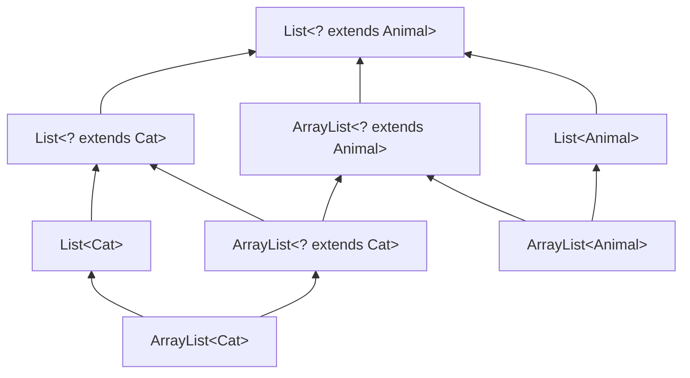

### Contravariantie (super)

Wat als we het omgekeerde willen van hierboven: een methode die de katten uit een gegeven lijst haalt en toevoegt aan een andere lijst van dieren? Bijvoorbeeld:

```java
public static void copyFromCatsTo(ArrayList<Cat> source, ArrayList<Animal> target) {
  for (Cat cat : source) { target.add(a); }
}

ArrayList<Cat> cats = /* ... */

ArrayList<Cat> otherCats = new ArrayList<>();
ArrayList<Mammal> mammals = new ArrayList<>();
ArrayList<Animal> animals = new ArrayList<>();

copyFromTo(cats, otherCats); // niet toegelaten
copyFromTo(cats, mammals);   // niet toegelaten
copyFromTo(cats, animals);   // OK
```

De eerste twee `copyFromTo`-regels zijn niet toegelaten, maar zouden opnieuw erg nuttig kunnen zijn.
Aparte methodes schrijven leidt opnieuw tot code-duplicatie:

```java
public static void copyFromCatsToCats(ArrayList<Cat> source, ArrayList<Cat> target) {
  for (Cat cat : source) { target.add(a); }
}
public static void copyFromCatsToMammals(ArrayList<Cat> source, ArrayList<Mammal> target) {
  for (Cat cat : source) { target.add(a); }
}
public static void copyFromCatsToAnimals(ArrayList<Cat> source, ArrayList<Animal> target) {
  for (Cat cat : source) { target.add(a); }
}
```

{}
Zou het nuttig zijn om een methode `copyFromCatsToBirds(ArrayList<Cat> source, ArrayList<Bird> target)` te voorzien? Waarom (niet)?
{}

De oplossing in dit geval is gebruik maken van het **wildcard-type `<? super T>`**.
Het type `ArrayList<? super Cat>` staat dus voor _"elke ArrayList waar het element-type een supertype is van `Cat`"_ (inclusief het type `Cat` zelf).
We kunnen dus schrijven:

```java
public static void copyFromCatsTo_wildcard(ArrayList<Cat> source, ArrayList<? super Cat> target) {
  for (Cat cat : source) { target.add(a); }
}
```

en kunnen nu hetvolgende uitvoeren:

```java
copyFromCatsTo_wildcard(cats, otherCats); // OK
copyFromCatsTo_wildcard(cats, mammals);   // OK
copyFromCatsTo_wildcard(cats, animals);   // OK
```

Dit heet **contravariantie**: hoewel `Cat` een subtype is van `Animal`, is `ArrayList<Animal>` een subtype van `ArrayList<? super Cat>`.
De 'contra' in contravariantie wijst erop dat de overervingsrelatie tussen `Cat` en `Animal` in de omgekeerde richting loopt als die tussen `ArrayList<? super Cat>` en `ArrayList<Animal>`.

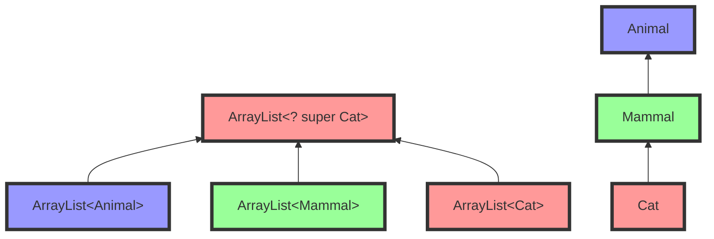

Als we ook `ArrayList<? super Mammal>` en `ArrayList<? super Animal>` toevoegen aan het plaatje, ziet dat er als volgt uit:

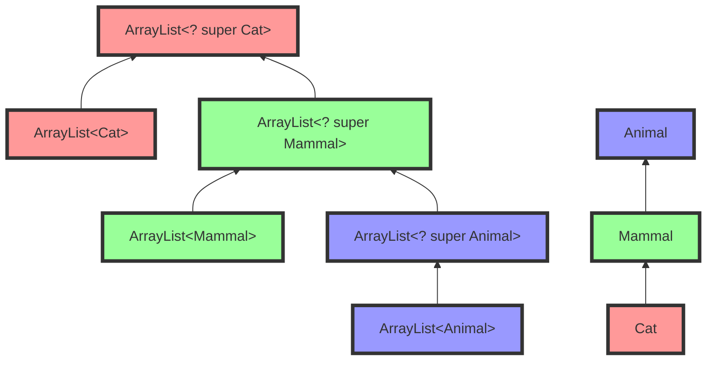

Aan de hand van de kleuren kan je zien dat de overervingsrelatie omgekeerd verloopt.

### Covariant of contravariant: PECS

Als we covariantie en contravariantie combineren, krijgen we volgend beeld (we focussen op de extends- en super-relatie vanaf `Mammal`):

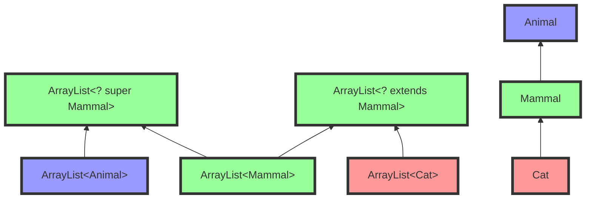

Hier zien we dat, met het covariante `ArrayList<? extends Mammal>`, we een `ArrayList<Mammal>` of `ArrayList<Cat>` kunnen gebruiken.
Met een contravariante `ArrayList<? super Mammal>` kunnen we opnieuw een `ArrayList<Mammal>` gebruiken, maar ook een `ArrayList<Animal>`.

Wanneer gebruik je wat?
PECS: Producer Extends, Consumer Super

### Arrays en type erasure

In tegenstelling tot ArrayLists (en andere generische types), beschouwt Java arrays wel als co-variant.
Dat betekent dat `Cat[]` een subtype is van `Animal[]`.
Volgende code compileert dus (maar gooit een uitzondering bij het uitvoeren):

```java
Animal[] cats = new Cat[2];
cats[0] = new Dog(); // compileert, maar faalt tijdens het uitvoeren
```

De reden hiervoor is, in het kort, dat informatie over generics gewist wordt bij het compileren.
Dit heet **type erasure**.
In de gecompileerde code is een `ArrayList<Animal>` en `ArrayList<Cat>` dus exact hetzelfde.
Er kan dus, tijdens de uitvoering, niet gecontroleerd worden of je steeds het juiste type gebruikt.

Bij arrays wordt er _wel_ type-informatie bijgehouden na het compileren, en kan dus gecontroleerd worden dat je geen ongeldig getypeerde elementen toevoegt.

## Oefeningen (2)

### Fruit

Apple/Orange < Fruit
FruitBasket

### Animal food

**Dit is een uitdagende oefening, voor als je je kennis over generics echt wil testen**

Gebruik generics (met grenzen/bounds) in de code hieronder, zodat de code (behalve de laatste regel) compileert,
en de compiler enkel katteneten toelaat voor katten, en hondeneten voor honden:

```java
class Animal {
  public void eat(Food<?> food) { }
}
class Cat extends Animal {}
class Dog extends Animal {}
class Food<A extends Animal> {}

Food<Cat> catFood = new Food<>();
Food<Dog> dogFood = new Food<>();

Cat cat = new Cat();
Dog dog = new Dog();

cat.eat(catFood); // OK
dog.eat(dogFood); // OK

cat.eat(dogFood); // <- moet een compiler error geven!
```

## Denkvragen

self-type?
e.g., assertThat()

## Extra leermateriaal

Er is erg veel informatie te vinden op het internet over generics in Java.

```

```
