TODO: antipattern 'forEach' + externe mutatie

## Wat en waarom?

[Streams](https://docs.oracle.com/en/java/javase/21/docs/api/java.base/java/util/stream/package-summary.html) vormen een krachtig concept om efficiënt data te verwerken.
Ze vormen een abstractie voor sequentiële en parallele operaties op datasets, zoals filteren, transformeren, en aggregeren, zonder de onderliggende datastructuur te wijzigen.
Bovendien maakt het gebruik van streams het mogelijk om declaratief te programmeren: je beschrijft op hoog niveau _wát_ je met de dataset wilt doen, in plaats van stap voor stap te beschrijven _hoe_ dat moet gebeuren.

Een stream zelf is _geen_ datastructuur of collectie; een stream is een pijplijn --- een ketting van operaties die uitgevoerd moeten worden op de data.
Die operaties kunnen de data filteren, transformeren, groeperen, reduceren, ...
Een stream stelt dus één grote bewerking voor op de data, samengesteld uit meerdere operaties.
Elke stream bestaat uit 3 delen:

- een **bron** voor de data (een _stroom_ van data, vandaar de naam). Die bron kan een datastructuur zijn (bv. een array, ArrayList, HashSet, ...), maar ook andere bronnen zijn mogelijk (bijvoorbeeld een oneindige sequentie van getallen, zoals de natuurlijke getallen)
- **intermediaire operaties** (mogelijk meerdere na elkaar) die de data verwerken (transformeren). Elke operatie neemt het resultaat van de vorige operatie (of de bron) en doet daar iets mee; het resultaat daarvan dient als invoer voor de volgende operatie. Zo krijg je een pijplijn waar de data doorheen stroomt terwijl ze bewerkt wordt.
- een **terminale operatie**: deze beëindigt de ketting en geeft het uiteindelijke resultaat terug.

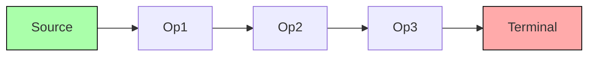

Je kan een stream slechts **éénmaal** doorlopen. Als je na het uitvoeren van de operaties nog een sequentie van operaties wil uitvoeren op dezelfde bron-elementen, moet je een nieuwe stream maken.

Streams zijn ook **lazy**: er worden slechts zoveel elementen verwerkt als nodig om het resultaat te berekenen.
Dat maakt dat de bron oneindig veel elementen mag aanleveren; zolang de rest van de pijplijn er slechts een eindig aantal nodig heeft, vormt dat geen probleem.
Enkel de elementen die nuttig zijn om het resultaat te bekomen worden gebruikt.
We zullen hier later nog op terugkomen.

Een zeer concrete situatie waarin streams nuttig zijn, is wanneer je van plan bent om code te schrijven met volgende vorm:

```java
Collection<E> source = ...
Type1 result = ...
Type2 temp_var = ...
for (E element : source) {
  update temp_var
  if (condition) {
    update result
  }
}
return result;
```

Dit patroon komt zeer vaak voor in code.
Neem, als eenvoudig voorbeeld om te starten, de situatie waarin je de gemiddelde leeftijd wil berekenen van de eerste 20 meerderjarige personen in een lijst.
Je kan dat als volgt schrijven (merk op hoe dit het patroon van hierboven volgt):

```java
List<Person> people = ...
double average = 0;
int count = 0;
for (var person : people) {
    if (person.age() >= 18) {
        average += person.age();
        count++;
    }
}
average /= count;
System.out.println(average);
```

De versie met streams ziet er helemaal anders uit --- je schrijft zelf geen lussen, maar focust je op het beschrijven van de uit te voeren operaties:

```java
List<Person> people = ...
var average = people.stream()
                .mapToInt(Person::age)
                .filter(a -> a >= 18)
                .limit(20)
                .average();
System.out.println(average.getAsDouble());
```

Beide versies doen hetzelfde, maar in de tweede versie is het veel duidelijker wat de bedoeling is:

- neem eerst van elke persoon de leeftijd (`mapToInt`)
- kijk dan enkel naar de leeftijden >= 18 (`filter`)
- kijk vervolgens enkel naar de eerste 20 van die leeftijden (`limit`)
- neem tenslotte het gemiddelde (`average`).

## Lambda functies en methode-referenties

Bij het gebruik van streams zal je veelvuldig gebruik maken van methode-referenties en lambda-functies.
Omdat Java een sterk getypeerde taal is, moeten lambda-functies en methode-referenties ook een type hebben.
Dat gebeurt door een interface te definiëren.
Elke interface met daarin precies één methode kan automatisch gebruikt worden als type voor lambda-functies en methode-referenties (als de types overeen komen).
Als het expliciet de bedoeling is om de interface daarvoor te gebruiken, kan je die interface ook met `@FunctionalInterface` annoteren; de compiler komt dan klagen als je later een extra methode zou proberen toe te voegen.
Bijvoorbeeld:

```java
@FunctionalInterface
interface PersonPredicate {
  public boolean test(Person person);
}

public List<Person> selectPeople(List<Person> people, PersonPredicate predicate) {
    List<Person> result = new ArrayList<>();
    for (Person p : people) {
      if (predicate.test(p)) {
        result.add(p);
      }
    }
    return result;
}

List<Person> people = List.of(new Person("Vandeneynde", 16), new Person("Vervoort", 23));
```

In de code hierboven zie je de `PersonPredicate`-interface, geannoteerd met `@FunctionalInterface`.
Deze definieert één methode die true of false teruggeeft voor een persoon.
De methode `selectPeople` gebruikt deze interface om alle personen te selecteren die voldoen aan de meegegeven voorwaarde.

{}
De implementatie van `selectPeople` voldoet aan het patroon van code waarvoor streams een oplossing kunnen bieden.
Inderdaad, deze operatie komt overeen met de `filter`-methode op streams.
{}

We overlopen nu 5 manieren om de `selectPeople` methode te gebruiken.
Een eerste manier is een klasse maken (bv. `IsAdult`) die de interface implementeert, en die nagaat of de persoon meerderjarig is.
Dat werkt, maar is nogal omslachtig:

```java
/* [1] */
class IsAdult implements PersonPredicate {
  @Override
  public boolean test(Person person) {
    return person.age() >= 18;
  }
}
System.out.println(selectPeople(people, new IsAdult()));
// => [Person[name=Vervoort, age=23]]
```

Een tweede optie is om een anonieme klasse te gebruiken. In het voorbeeld hieronder is dat een anonieme klasse die nagaat of de naam van de persoon begint met "Van".
Ook dat blijft omslachtig:

```java
/* [2] */
System.out.println(selectPeople(people, new PersonPredicate() {
    @Override
    public boolean test(Person person) {
        return person.name().startsWith("Van");
    }
}));
// => [Person[name=Vandeneynde, age=16]]
```

Sinds Java lambda-functies ondersteunt, kan je dergelijke code veel eenvoudiger schrijven.
In \[3] en \[4] hieronder zie je hoe je een lambda-functie kan gebruiken die hetzelfde doet als de vorige voorbeelden, maar dan zonder een klasse te schrijven.
Merk op dat het toegelaten is om de lambda-functies te gebruiken waar een `PersonPredicate` verwacht wordt.
De lambda-functies zijn inderdaad functies die een Person-object als argument hebben, en een boolean teruggeven, en komen dus qua type overeen met de `test`-methode in `PersonPredicate`.

```java
/* [3] */
System.out.println(selectPeople(people, p -> p.age() >= 18));
// => [Person[name=Vervoort, age=23]]

/* [4] */
System.out.println(selectPeople(people, p -> p.name().startsWith("Van")));
// => [Person[name=Vandeneynde, age=16]]
```

Tenslotte kunnen we ook een methode-referentie gebruiken:

```java
/* [5] */
boolean isAdult(Person person) {
  return person.age() >= 18;
}
System.out.println(selectPeople(people, this::isAdult));
```

Dat is vooral nuttig als er al een methode bestaat, of als de implementatie van de methode te omslachtig is om als lambda te schrijven.

In plaats van zelf een interface zoals `PersonPredicate` te schrijven, kan je vaak beroep doen op een voorgedefinieerde functie-interface.
Je vindt de lijst daarvan [in de documentatie](https://docs.oracle.com/en/java/javase/21/docs/api/java.base/java/util/function/package-summary.html).
We lijsten hier de belangrijkste functionele interfaces op die gebruikt worden in de context van streams:

- [`Function<T, R>`](https://docs.oracle.com/en/java/javase/21/docs/api/java.base/java/util/function/Function.html): een functie met 1 argument, die een `T` omzet in een `R`. Er zijn ook varianten voor primitieve resultaat-types, zoals [`ToIntFunction<T>`](https://docs.oracle.com/en/java/javase/21/docs/api/java.base/java/util/function/ToIntFunction.html), die een `T` omzet in een int. Bijvoorbeeld:
  ```java
  Function<Person, String> getLowercaseName = person -> person.name().toLowerCase();
  ToIntFunction<Person> getAge = Person::age;
  ```
- [`Predicate<T>`](https://docs.oracle.com/en/java/javase/21/docs/api/java.base/java/util/function/Predicate.html): een functie met 1 argument van type `T`, die `true` of `false` teruggeeft. Ook hier bestaan varianten voor primitieve types, bijvoorbeeld [`IntPredicate`](https://docs.oracle.com/en/java/javase/21/docs/api/java.base/java/util/function/IntPredicate.html). Bijvoorbeeld:

  ```java
  Predicate<Person> isAdult = person -> person.age() >= 18;
  IntPredicate isNonNegative = i -> i >= 0;
  ```

- [`BiFunction<T, U, R>`](https://docs.oracle.com/en/java/javase/21/docs/api/java.base/java/util/function/BiFunction.html): een functie met 2 argumenten, die een `T` en een `U` omzet in een `R`. Bijvoorbeeld:
  ```java
  BiFunction<Person, Integer, String> f = (person, nbPets) -> "Person " + person.name() + " has " + nbPets + " pets";
  ```
- [`UnaryOperator<T>`](https://docs.oracle.com/en/java/javase/21/docs/api/java.base/java/util/function/UnaryOperator.html): een operator met 1 argument van type `T`, en een resultaat van type `T`. Dit is dus een speciaal geval van een `Function`, namelijk een `Function<T, T>`. Bijvoorbeeld:
  ```java
  UnaryOperator<String> indentOnce = s -> "  " + s;
  ```
- [`BinaryOperator<T>`](https://docs.oracle.com/en/java/javase/21/docs/api/java.base/java/util/function/BinaryOperator.html): een functie met 2 argumenten, beide van type `T`, die een `T` teruggeeft. Dit is dus een speciaal geval van een `BiFunction`, namelijk een `BiFunction<T, T, T>`. Bijvoorbeeld:
  ```java
  BinaryOperator<String> joinWithSpace = (s1, s2) -> s1 + " " + s2;
  ```
- [`Supplier<T>`](https://docs.oracle.com/en/java/javase/21/docs/api/java.base/java/util/function/Supplier.html): een operatie zonder argumenten, die een `T` teruggeeft. Een invocatie van de supplier mag telkens hetzelfde of een ander object teruggeven. Een supplier kan dus gebruikt worden als generator. Bijvoorbeeld:
  ```java
  Supplier<String> constant = () -> "Hello";
  Random rnd = new Random();
  Supplier<Integer> randomInt = rnd::nextInt();
  ```
- [`Consumer<T>`](https://docs.oracle.com/en/java/javase/21/docs/api/java.base/java/util/function/Consumer.html): een operatie met 1 argument van type `T`, met een void return type. De consumer 'verbruikt' het meegegeven object, zonder een resultaat terug te geven. Bijvoorbeeld:
  ```java
  Consumer<Person> printPerson = (person) -> System.out.println(person.name() + " (age " + person.age() + ")");
  ```
- [`BiConsumer<T, U>`](https://docs.oracle.com/en/java/javase/21/docs/api/java.base/java/util/function/BiConsumer.html): een consumer met 2 argumenten van type `T` en `U`, die niets teruggeeft. Bijvoorbeeld:
  ```java
  BiConsumer<Person, Integer> printNTimes = (person, n) -> {
    for (int i = 0; i < n; i++)
      System.out.println(person.name() + " (age " + person.age() + ")");
  };
  ```

## Streams aanmaken

Een stream van `T`-objecten wordt aangeduid met de interface `Stream<T>`.
Voor streams van primitieve types zijn er ook specifieke interfaces, bijvoorbeeld `IntStream`, `DoubleStream`, ...

Om een stream aan te maken, start je steeds met een bron voor de data die verwerkt zal worden.
Dat kan op verschillende manieren.

- Je kan eenvoudig een stream maken van alle elementen in een collectie: elke collectie heeft een `.stream()` operatie die een stream teruggeeft van alle elementen. Dit is de meest courante manier om te werken met streams. Merk op dat een stream zelf geen datastructuur is, en dus ook geen elementen bevat. Een stream lijkt dus meer op een iterator (die de elementen uit de bron een voor een teruggeeft, maar deze niet zelf bevat) dan op een collectie.
  ```java
  people.stream()
  ```
- `Stream.of(T t1, T t2, ...)` maakt een stream met als data exact de opgegeven objecten. Gelijkaardig kan je bijvoorbeeld ook `IntStream.of(int i1, int i2, ...)` gebruiken voor een stream van getallen.
  ```java
  Stream.of(person1, person2, person3)
  ```
- Specifiek voor `IntStream` is er ook `IntStream.range` en `IntStream.rangeClosed` om een IntStream te maken van alle getallen in een bepaald bereik.
  ```java
  IntStream.range(2, 6)       // => 2, 3, 4, 5
  IntStream.rangeClosed(2, 6) // => 2, 3, 4, 5, 6
  ```
- Om een stream te maken van een array, gebruik je `Arrays.stream(arr)`.
  ```java
  String[] names = { "Alice", "Bob", "Eve"};
  Arrays.stream(names)
  ```
- `Stream.concat(s1, s2)` maakt een nieuwe stream door twee streams samen te voegen: eerst komen alle elementen van de eerste stream, daarna die van de tweede stream.
  Opnieuw is er ook een gelijkaardige operatie op `IntStream`.
  ```java
  IntStream.concat(IntStream.range(2, 4), IntStream.range(10, 12)) // => 2, 3, 10, 11
  ```
- `Stream.generate(supplier)` maakt een stream waarbij de elementen aangeleverd worden door de meegegeven Supplier. Die dient dus als generator voor nieuwe elementen.

  ```java
  Stream.generate(() -> "Hello") // => "Hello", "Hello", "Hello", "Hello", ...

  Random rnd = new Random();
  Stream.generate(() -> rnd.nextBoolean()) // => true, false, true, true, true, false, false, true, false, ...
  ```

- `Stream.iterate(seed, unaryOp)` maakt een stream waarvan de elementen gegenereerd worden door `unaryOp` herhaald toe te passen, beginnend bij seed. De elementen van de stream zijn dus `seed, unaryOp(seed), unaryOp(unaryOp(seed)), ...`. Dit is bijvoorbeeld een (oneindige) stream van alle strikt positieve getallen[^1]:
  ```java
  Stream.iterate(1, (n) -> n + 1) // => 1, 2, 3, 4, ...
  ```
- Je kan ook een stream maken via een `StreamBuilder`, die je maakt via `Stream.builder()`. Dat laat toe om elementen één voor één toe te voegen (via `add(...)`), en daar uiteindelijk een stream van te maken via de `build()`-methode. Deze manier geeft je veel controle en is daardoor zeer flexibel, maar zal slechts zeer uitzonderlijk nodig zijn.
  ```java
  var builder = Stream.<String>builder();
  builder.add(str1);
  builder.add(str2);
  var stream = builder.build(); // => str1, str2
  ```

[^1]: Omdat `int` maar een eindig aantal waarden kan hebben (de hoogste waarde is \\( 2^{31}-1 \\)), zal deze stream ooit negatieve getallen beginnen produceren: ..., 2147483646, 2147483647, -2147483648, -2147483647, .... De stream is wel nog steeds oneindig.

## Tussentijdse (intermediate) operaties

Tussentijdse (intermediate) operaties worden uitgevoerd op een stream, en geven een nieuwe stream terug.
De elementen in de nieuwe stream zijn gebaseerd op die van de originele stream, na het toepassen van de operatie.
Je kan de operaties dus na elkaar toepassen om een pijplijn te definiëren (dat is precies de bedoeling van een stream).
Het voorbeeld van daarstraks toont 3 tussentijdse operaties die na elkaar toegepast worden: `mapToInt`, `filter`, en `limit` (`average` is een terminale operatie; zie later).

```java
var average = people.stream()
                .mapToInt(Person::age)
                .filter(a -> a >= 18)
                .limit(20)
                .average();
```

We bespreken hier de meest voorkomende bewerkingen.

### filter

De `filter`-operatie filtert sommige data-elementen uit de stream: enkel de elementen die voldoen aan het meegegeven predicaat worden verder doorgegeven.
Bijvoorbeeld, onderstaande `filter`-operatie verwijdert alle klinkers uit een stream van letters:

```java
Stream.of("A", "B", "C", "D", "E", "F").filter(l -> !"AEIOUY".contains(l)) // => B, C, D, F
```

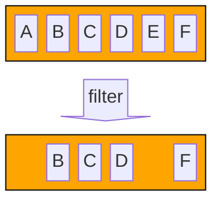

### map, mapToInt, mapToLong, mapToDouble, mapToObject

De `map`-operatie transformeert elk elementen in een stream naar een ander element door een functie toe te passen op elk element.
Bijvoorbeeld, onderstaande map-operatie zet alle strings om naar lowercase:

```java
Stream.of("ALICE", "Bob", "ChaRLIe").map(String::toLowerCase) // => "alice", "bob", "charlie"
```

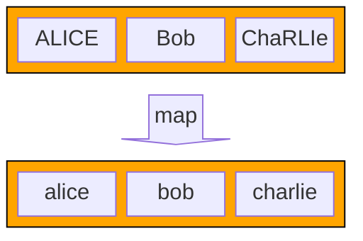

In tegenstelling tot de filter-operatie kan de `map`-operatie het type van de elementen in de stream veranderen. Bijvoorbeeld, onderstaande code vertrekt van een stream van Strings, en eindigt met een stream van Integer-objecten:

```java
Stream.of("ALICE", "Bob", "ChaRLIe").map(String::toLowerCase).map(String::length) // => 5, 3, 7
```

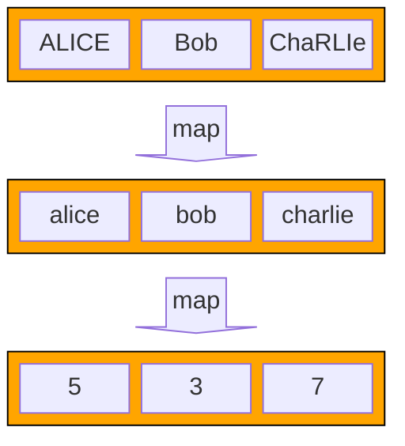

Er zijn ook specifieke map-operaties voor wanneer het resultaat een int, long, of double is.
Bijvoorbeeld, `mapToInt` geeft een `IntStream` terug.

```java
Stream.of("ALICE", "Bob", "ChaRLIe").mapToInt(String::length) // => 5, 3, 7
```

Bij een `IntStream`, `LongStream` en `DoubleStream` geeft de `map`-operatie altijd opnieuw een stream van hetzelfde type (IntStream, LongStream, of DoubleStream).
Wanneer je de getallen in zo'n stream wil omzetten naar een object, kan dat met `mapToObject`:

```java
IntStream.of(1, 2, 3).mapToObject(i -> "Number " + i) // => "Number 1", "Number 2", "Number 3"
```

### limit en takeWhile

De `limit`-operatie beperkt de resultaat-stream tot de eerste \\( n \\) elementen van de bron-stream:

```java
Stream.of("A", "B", "C", "D", "E", "F").limit(3) // => A, B, C
```

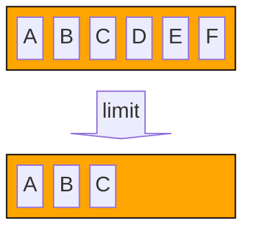

Merk op dat de plaats van `limit` (zoals die van de meeste tussentijdse operaties trouwens) belangrijk is:

```java
Stream.of("A", "B", "C", "D", "E", "F").filter(l -> !"AEIOUY".contains(l)).limit(3) // => B, C, D
```

is iets anders dan

```java
Stream.of("A", "B", "C", "D", "E", "F").limit(3).filter(l -> !"AEIOUY".contains(l)) // => B, C
```

De eerste variant resulteert in de eerste 3 medeklinkers uit de oorspronkelijke stream (je filtert eerst alle klinkers eruit, en neemt dan de eerste 3 overblijvende elementen).
In de tweede variant begin je met de eerste 3 letters, en filtert daaruit dan de klinkers weg.

Soms ken je het aantal elementen niet, maar wil je elementen blijven doorgeven zolang aan een bepaalde voorwaarde voldaan is.
Dat kan met `takeWhile`.
Merk op dat `takeWhile` niet hetzelfde is als `filter`: eenmaal de voorwaarde niet meer voldaan is, worden de volgende elementen niet meer bekeken, ook al zouden die opnieuw voldoen aan de voorwaarde.

```java
Stream.of("Alpha", "Bravo", "Charlie", "Delta").takeWhile(s -> s.length < 6) // => "Alpha", "Bravo"
```

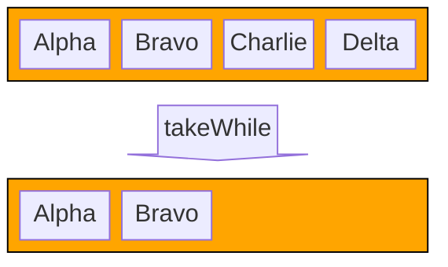

### skip en dropWhile

De `skip`-operatie doet het omgekeerde van `limit`: ze slaat de eerste \\( n \\) elementen over.

```java
Stream.of("A", "B", "C", "D", "E", "F").skip(3) // => D, E, F
```

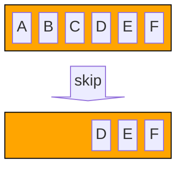

De `dropWhile`-operatie is het omgekeerde van `takeWhile`: ze negeert elementen zolang aan een gegeven voorwaarde voldaan is.

```java
Stream.of("Alpha", "Bravo", "Charlie", "Delta").dropWhile(s -> s.length < 6) // => "Charlie", "Delta"
```

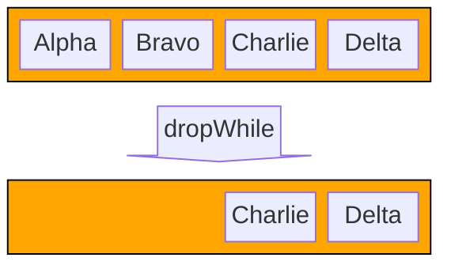

### distinct

De `distinct`-operatie filtert alle dubbele waarden uit de stream. Deze operatie is _stateful_: de waarden die reeds gezien zijn moeten bijgehouden worden.

```java
Stream.of("A", "B", "A", "C", "A", "D").distinct() // => A, B, C, D
```

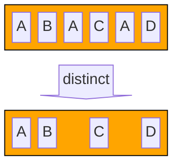

### sorted

De `sorted`-operatie sorteert de waarden in de stream. Deze operatie is _stateful_ (de reeds geziene waarden moeten bijgehouden worden om ze gesorteerd terug te geven), en de operatie vereist ook dat de stream eindig is. Het sorteren kan immers pas uitgevoerd worden wanneer alle elementen gekend zijn.

```java
Stream.of("C", "D", "A", "F", "E", "B").sorted() // => A, B, C, D, E, F
```

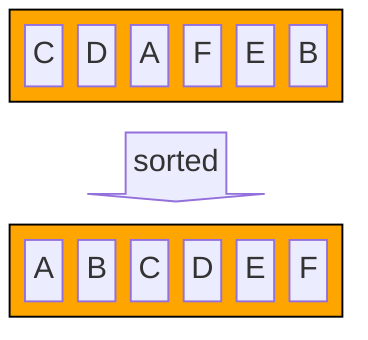

### peek

De `peek`-operatie doet eigenlijk niets: ze geeft alle elementen gewoon door, maar laat toe om een functie uit te voeren voor elk element.
Deze operatie kan bijvoorbeeld handig zijn om te debuggen: je kan ze middenin een pijplijn toevoegen om te kijken welke elementen daar voorbijkomen.

```java
Stream.of("A", "B", "C", "D", "E", "F")
   .limit(3)
   .peek(System.out::println) // => A, B, C
   .filter(l -> !"AEIOUY".contains(l))
```

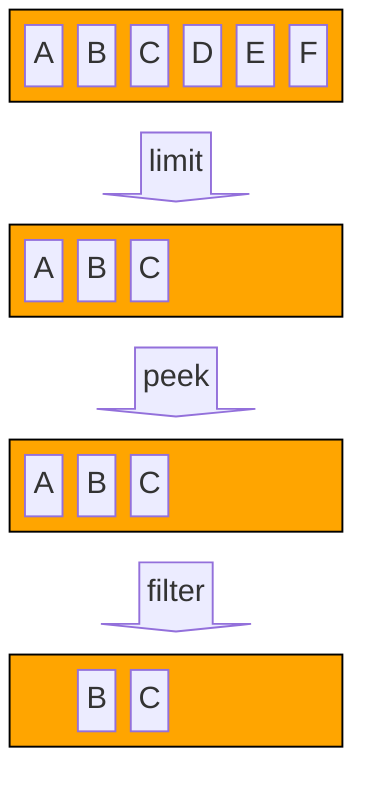

### flatMap

De `flatMap` operatie is gelijkaardig aan de `map`-operatie, maar wordt gebruikt wanneer het resultaat van de map-functie op 1 element opnieuw een stream geeft.
Opnieuw bestaan er specifieke versies `flatMapToInt`, `flatMapToLong`, en `flatMapToDouble` voor wanneer het resultaat een IntStream, LongStream of DoubleStream moet worden.

We gebruiken de `String::chars` methode als voorbeeld; die geeft voor een String een IntStream terug met de char-values van elk karakter (denk: de ASCII of Unicode-waarde van elke letter).

Als we gewoon `map` zouden toepassen, krijgen we een stream van streams (hier: een stream van 3 streams, elk met 2 elementen):

```java
Stream<IntStream> result = Stream.of("Aa", "Bb", "Cc").map(String::chars); // => ['A', 'a'], ['B', 'b'], ['C', 'c']
```

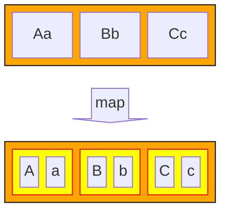

Vaak is dat niet wat we willen: stel dat we één lange stream van char-waarden (ints) willen maken, met daarin de karakters van alle woorden uit de oorspronkelijke stream na elkaar.
In dat geval gebruiken we `flatMap` (of, in dit geval, `flatMapToInt` omdat `chars` een IntStream teruggeeft):

```java
IntStream result = Stream.of("Aa", "Bb", "Cc").flatMapToInt(String::chars); // => 'A', 'a', 'B', 'b', 'C', 'c'
```

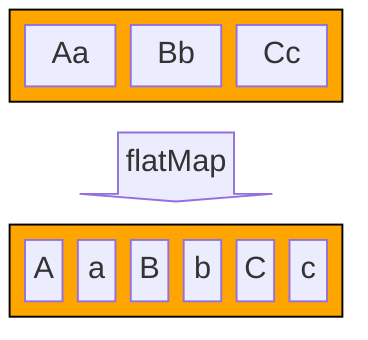

`flatMap` maakt dus in zekere zin een combinatie van een gewone `map`-operatie (die telkens een stream teruggeeft voor elk element), gevolgd door een concatenatie van al die resulterende streams.
De naam komt van het feit dat de resulterende structuur een 'flattened' versie is, waarbij één niveau van nesting weggehaald werd: waar `map` een stream van streams oplevert (bv. `Stream<IntStream>`), krijgen we bij `flatMap` (of hier `flatMapToInt`) één gewone stream terug (hier een `IntStream`).

### mapMulti

De `mapMulti` operatie kan je gebruiken wanneer elk object in de bronstream kan leiden tot meerdere objecten in de doelstream, net zoals bij `flatMap`.
In tegenstelling tot `flatMap`, waar de mapping-operatie een stream moet teruggeven, werkt `mapMulti` anders.
Je moet hier namelijk geen stream teruggeven.
Aan `mapMulti` geef je een `BiConsumer` mee; dat is een functie met 2 argumenten (we noemen die hier `value` en `output`):

- Het eerste argument (`value`) is het element uit de bronstream waarvoor de overeenkomstige elementen in de doelstream bepaald moeten worden
- Het tweede argument (`output`) is een Consumer-functie: elk element wat je daaraan doorgeeft (via de `accept`-methode), komt terecht in de doelstream.

De functie die meegegeven wordt aan `mapMulti` moet dus alle objecten bepalen die voor het gegeven bronobject (`value`) in de doelstream terecht moeten komen, en die één voor één doorgeven aan `output`.

Een voorbeeld maakt dit hopelijk wat duidelijker.
Stel dat we de lijst \\( [1, 2, 3] \\) willen omzetten in \\( [1, 2, 2, 3, 3, 3] \\): elk getal in de bronstream wordt even vaak als zijn waarde herhaald in de doelstream.
We zouden dat met `flatMap` kunnen doen, door telkens een stream te maken van het juiste aantal elementen.
Dat doen we hieronder door een oneindige stream te maken (via `generate`) van telkens hetzelfde element (`value`), en dan elk van die streams te beperken tot de eerste `value` elementen:

```java
IntStream.range(1, 4) // => 1 2 3
         .flatMap((value) -> IntStream.generate(() -> value).limit(value)) // => 1 2 2 3 3 3
```

Dankzij de laziness van streams (zie later) moeten we niet bang zijn dat de oneindige stream zal leiden tot een oneindige uitvoeringstijd; het aantal elementen dat we gebruiken wordt beperkt door de `limit`-operatie, en er zullen er nooit meer dan dat gegenereerd worden.

De versie met `mapMulti` ziet er wat anders (en misschien vertrouwder) uit --- hier kunnen we gewone imperatieve code (lussen) schrijven:

```java
IntStream.range(1, 4) // => 1 2 3
          .mapMulti((value, output) -> {
              for (int i = 1; i <= value; i++) {
                  output.accept(value);
              }
          }) // => 1 2 2 3 3 3
```

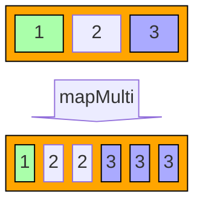

## Terminale (terminal) operaties

Een terminale operatie staat op het einde van de pijplijn, na alle tussentijdse operaties.
Na een terminale operatie kunnen dus geen extra operaties meer uitgevoerd worden met de elementen uit de stream.

De voorbeelden hierboven hadden geen terminale operaties.
Een stream zonder terminale operatie doet niets: er wordt geen enkel element verwerkt, en er wordt geen enkele tussentijdse operatie uitgevoerd.
Het is de terminale operatie die alle verwerking in gang zet.
De reden daarvoor is de **laziness** van streams.

### Laziness (luiheid)

We zeiden eerder al dat streams _lazy_ zijn.
Dat houdt in dat de gedefinieerde operaties niet uitgevoerd worden, tenzij het echt niet anders kan.

Bekijk bijvoorbeeld onderstaande code:

```java
var list = List.of(1, 2, 3, 4, 5, 6, 7, 8, 9, 10);

Stream<Integer> incrementAll = list.stream()
  .map(n -> {
    System.out.println("Processing " + n);
    return n + 1;
  })
  .limit(1);

// [1] hier werd nog niets uitgeprint

incrementAll
  .forEach(n -> {
    System.out.println("Got " + n);
});

// [2] print "Processing 1" en vervolgens "Got 2"
```

We maken een lijst van 10 getallen, voeren `map` uit op een stream van die getallen, en beperken het resultaat tot het eerste element.
Aangekomen op punt \[1] werd er, misschien verrassend, helemaal niets uitgeprint.
Dat betekent dat de lambda-functie die \\( n \\) met 1 verhoogt ook niet uitgevoerd werd: er gebeurde helemaal niets met de getallen uit de lijst.
We definiëren met streams enkel de pijplijn: wat moet er later eventueel gebeuren met de getallen?

Pas wanneer we op punt \[2] komen, en de terminale operatie `forEach` (zie later) uitgevoerd werd, werd er voor de eerste keer "Processing 1" uitgeprint.
Maar dan enkel voor het eerste element: door de `limit`-operatie is er geen nood aan het verwerken van het tweede, derde, ... element, dus dat gebeurt ook nooit.
De code hierboven verwerkt dus enkel het eerste element uit de lijst; met alle andere elementen wordt nooit iets gedaan.

Het is dus belangrijk om in het achterhoofd te houden dat stream-operaties enkel uitgevoerd worden wanneer dat noodzakelijk is, en pas op het allerlaatste moment (als gevolg van een terminale operatie).
Dat is efficiënt, maar kan soms leiden tot verrassende situaties (zoals hierboven).

We bekijken nu enkele vaak voorkomende terminale operaties.

### forEach

De `forEach(fn)` terminale operatie voert de meegegeven functie `fn` uit voor elk element dat het einde van de pijplijn bereikt.
Een heel eenvoudig gebruik hiervan is het uitprinten van alle elementen via `System.out.println`:

```java
Stream.of("C", "D", "A", "F", "E", "B")
   .map(String::toLowerCase)
   .filter(l -> !"aeiouy".contains(l))
   .sorted()
   .forEach(x -> System.out.println(x)); // => b, c, d, f
   // OF:  .forEach(System.out::println);
```

De `forEach`-operatie is dus zowat het streams-equivalent van de enhanced for-loop (`for (var x : collection)`) bij collecties.

### toList, toArray

De terminale operatie `toList` maakt een nieuwe lijst met daarin de elementen op het einde van de pijplijn, in de volgorde dat ze daar toekomen.
Bijvoorbeeld:

```java
List<String> result = Stream.of("C", "D", "A", "F", "E", "B")
   .map(String::toLowerCase)
   .filter(l -> !"aeiouy".contains(l))
   .sorted()
   .toList();
// => result == [b, c, d, f]
```

Gelijkaardig is er ook `toArray`. Deze maakt een `Object[]` array aan met daarin de elementen.

```java
Object[] result = Stream.of("C", "D", "A", "F", "E", "B")
   .map(String::toLowerCase)
   .filter(l -> !"aeiouy".contains(l))
   .sorted()
   .toArray();
```

Door de beperkingen van generics in Java (i.e., je mag niet `new T[n]` schrijven voor een generisch type `T`) kan er enkel een `Object[]` array gemaakt worden, geen `String[]`.
Indien je dat wel wil, moet je een functie meegeven om een lege array van het juiste type en de juiste lengte aan te maken, bijvoorbeeld:

```java
String[] result = Stream.of("C", "D", "A", "F", "E", "B")
   .map(String::toLowerCase)
   .filter(l -> !"aeiouy".contains(l))
   .sorted()
   .toArray(n -> new String[n]);
   // OF: toArray(String[]::new);
```

### count

Zoals de naam aangeeft, telt de `count()`-operatie het aantal elementen op het einde van de stream.
Dat aantal wordt als een `long` teruggegeven, niet als `int`.
Bijvoorbeeld:

```java
long nbConsonants = Stream.of("A", "B", "C", "D", "E", "F")
   .map(String::toLowerCase)
   .filter(l -> !"aeiouy".contains(l))
   .count;
// => nbConsonants == 4L
```

### findFirst en findAny

De operaties `findFirst` en `findAny` geven respectievelijk het eerste en een niet nader bepaald element terug uit de stream.
Merk op dat `findAny` niet 'random' is; er zijn gewoon geen garanties over welk element precies teruggegeven wordt.
`findAny` is vooral nuttig bij parallelle streams (zie later).

Het resultaat van beide methodes is een [`Optional`](https://docs.oracle.com/en%2Fjava%2Fjavase%2F21%2Fdocs%2Fapi%2F%2F/java.base/java/util/Optional.html); die is leeg wanneer de stream leeg is, er er dus geen element is om terug te geven.

```java
Optional<String> result = Stream.of("C", "D", "A", "F", "E", "B")
   .map(String::toLowerCase)
   .filter(l -> !"aeiouy".contains(l))
   .sorted()
   .findFirst();

// => result == Optional["B"]

Optional<String> result = Stream.of("C", "D", "A", "F", "E", "B")
   .map(String::toLowerCase)
   .filter(l -> "XYZ".contains(l))
   .findAny();

// => result == Optional.empty
```

### anyMatch, allMatch, noneMatch

Deze methodes geven true of false terug, afhankelijk van of respectievelijk ten minste 1, elk, of geen enkel element in de stream voldoet aan de meegegeven voorwaarde.

```java
Stream.of("Alpha", "Bravo", "Charlie", "Delta")
  .anyMatch(s -> s.startsWith("A")); // => true

Stream.of("Alpha", "Bravo", "Charlie", "Delta")
  .allMatch(s -> s.length() < 6); // => false

Stream.of("Alpha", "Bravo", "Charlie", "Delta")
  .noneMatch(s -> s.startsWith("X")); // => true
```

### min en max

De `min` en `max` operatie vereisten een `Comparator`-object om elementen te vergelijken met elkaar.
Ze geven een `Optional` terug met het kleinste respectievelijk grootste element, of de lege optional indien de stream geen elementen bevat.

Bijvoorbeeld, onderstaande code geeft het element terug waarin de letter 'a' het vaakst voorkomt.
We maken dus een Comparator gebaseerd op het aantal 'a's in het woord.
Om dat aantal te tellen, maken we opnieuw gebruik van een stream-pipeline, namelijk `chars().filter().count()`:

```java
Stream.of("Alpha", "Bravo", "Charlie", "Delta")
      .max(Comparator.comparing(s -> s.toLowerCase().chars().filter(c -> c == 'a').count())); // => Optional["alpha"]
```

Voor een `IntStream`, `LongStream` en `DoubleStream` hoef je geen Comparator mee te geven; daar worden uiteraard gewoon de getallen zelf vergeleken.

### sum, average, summaryStatistics

De `sum`, `average` en `summaryStatistics` operaties zijn enkel beschikbaar op `IntStream`, `LongStream` en `DoubleStream`.
De eerste twee geven, weinig verrassend, de som en het gemiddelde van de waarden terug.

De `summaryStatistics` operatie geeft een object terug met daarin

- het aantal waarden (count)
- de kleinste waarde (min)
- de gemiddelde waarde (average)
- de grootste waarde (max)
- de totale waarde (sum)

Indien je meer dan één van die resultaten zoekt, is het dus efficiënter om deze methode te gebruiken dan de afzonderlijke operaties (die elk een nieuwe stream moeten doorlopen).

Een voorbeeld:

```java
Stream.of("Alpha", "Bravo", "Charlie", "Delta")
      .mapToInt(String::length)
      .summaryStatistics();
// => IntSummaryStatistics{count=4, min=5, average=5.5, max=7, sum=22}
```

### reduce

De `reduce`-operatie is een zeer veelzijdige operatie.
Ze combineert alle elementen in de stream tot 1 nieuw element (dit is dus bijna de definitie van een terminale operatie).
We beschouwen hier de versie van `reduce` met twee argumenten, die een resultaat teruggeeft van hetzelfde type als de elementen in de stream:

- een _startwaarde_ `identity` van type `T`
- een _accumulator_-functie `accumulator` (een BinaryOperator) die een vorige `T` combineert met de huidige `T` uit de stream, en de nieuwe `T` teruggeeft

Met andere woorden, de `reduce`-operatie op een stream heeft hetvolgende effect:

```java
T result = identity;
for (T element : stream) {
  result = accumulator.apply(result, element);
}
return result;
```

Een andere manier om hiernaar te kijken is dat de accumulator een bewerking is die ingevoegd wordt tussen alle elementen van de stream;
de linker-parameter van de accumulator is de waarde tot dan toe, en de rechterparameter de volgende waarde om mee in rekening te brengen.
Bijvoorbeeld, we kunnen de som van alle elementen ook berekenen via `reduce` in plaats van via `sum`:

```java
IntStream.rangeClosed(1, 5)                 // => 1, 2, 3, 4, 5
   .reduce(0, (sum, value) -> sum + value); // => (((((0 + 1) + 2) + 3) + 4) + 5) = 15
```

Of grafisch:


Weetje: in sommige andere programmeertalen wordt `reduce` ook `fold` genoemd (en de Java-versie van `reduce` is meer specifiek `foldLeft`).

### collect

De laatste terminale operatie die we bekijken is `collect`.
Deze is gelijkaardig aan `reduce`, maar laat toe om de set van terminale operaties uit te breiden via [Collector](https://docs.oracle.com/en/java/javase/21/docs/api/java.base/java/util/stream/Collector.html)-objecten.
Een Collector-object bevat 4 elementen:

- een `supplier`-functie (type Supplier) die wordt gebruikt om een startwaarde (state) te verkrijgen, vergelijkbaar met de `identity` bij `reduce`
- een `accumulator`-functie (type BiConsumer) die een nieuw data-element toevoegt aan het voorlopige resultaat (de state); vergelijkbaar met de accumulator van `reduce`
- een `combiner`-functie (type BinaryOperator) die twee voorlopige resultaten kan combineren (vooral nuttig bij parallelle uitvoering; zie later)
- een `finisher`-functie (type Function) die, op het einde, het voorlopige resultaat omzet naar het finale resultaat.

De supplier, accumulator, combiner en finisher werken conceptueel op de volgende manier:

```java
var tempResult1 = collector.supplier();
for (T element : part 1 of stream) {
  collector.accumulator(tempResult1, element);
}
var tempResult2 = collector.supplier();
for (T element : part 2 of stream) {
  collector.accumulator(tempResult2, element);
}
var tempResult = collector.combiner(tempResult1, tempResult2);
return collector.finisher(tempResult);
```

Schematisch ziet dat er zo uit:


Merk op dat, in tegenstelling tot de accumulator bij `reduce`, er bij die van een collector niets wordt teruggegeven; de verwachting is dat het tijdelijke resultaat zelf geüpdated wordt (en dus stateful is).

We geven één voorbeeld van een Collector-implementatie, namelijk een collector die (voor een stream van Strings) de `StringJoiner`-klasse gebruikt om de strings aan elkaar te plakken, gescheiden door komma's.
(De StringJoiner is een stateful klasse, vergelijkbaar met een StringBuilder).

```java
class StringJoiningCollector implements Collector<String, StringJoiner, String> {
    @Override
    public Supplier<StringJoiner> supplier() {
        return () -> new StringJoiner(", ", "", ""); // separator, prefix, postfix
    }

    @Override
    public BiConsumer<StringJoiner, String> accumulator() {
        return StringJoiner::add;
    }

    @Override
    public BinaryOperator<StringJoiner> combiner() {
        return StringJoiner::merge;
    }

    @Override
    public Function<StringJoiner, String> finisher() {
        return StringJoiner::toString;
    }
}
```

We kunnen deze collector nu als volgt gebruiken:

```java
Stream.of("Alpha", "Bravo", "Charlie", "Delta").collect(new StringJoiningCollector()); // => "Alpha, Bravo, Charlie, Delta"
```

Java bevat reeds enkele handige voorgedefinieerde collectors.
Deze vind je in de [`Collectors`](https://docs.oracle.com/en/java/javase/21/docs/api/java.base/java/util/stream/Collectors.html)-klasse. We bekijken er enkele.

#### Collectors.joining

Deze collector doet wat we hierboven zelf implementeerden: Strings aan elkaar plakken, gescheiden door een separator-string.
We hadden onszelf dus wat werk kunnen besparen, en gewoon hetvolgende schrijven:

```java
Stream.of("Alpha", "Bravo", "Charlie", "Delta").collect(Collectors.joining(", ")); // => "Alpha, Bravo, Charlie, Delta"
```

#### Collectors.toList, Collectors.toSet, Collectors.toCollection

Deze collectors doen wat de naam zegt: ze maken een List, Set, of Collection met daarin de elementen van de stream.
De [`toList`](#tolist-toarray) terminale operatie die we eerder zagen is gewoon een methode om makkelijk deze collector te gebruiken.

Bij `toCollection` ligt niet vast welk type collectie gemaakt moet worden; je moet zelf een functie meegeven om een lege collectie van het gewenste type te maken:

```java
Stream.of("Alpha", "Bravo", "Charlie", "Delta").collect(Collectors.toCollection(() -> new LinkedList<>()));
```

#### Collectors.groupingBy

Deze collector groepeert de elementen in een `Map`, volgens de meegegeven functie om de key te bepalen:

```java
Stream.of("Alpha", "Bravo", "Charlie", "Delta").collect(Collectors.groupingBy(String::length));
// => {5=["Alpha", "Bravo", "Delta"], 7=["Charlie"]}
```

#### Collectors.partitioningBy

Deze collector groepeert de elementen ook in een `Map`, maar nu met als key `true` of `false`, afhankelijk van of het object voldoet aan de meegegeven voorwaarde of niet:

```java
Stream.of("Alpha", "Bravo", "Charlie", "Delta").collect(Collectors.partitioningBy(s -> s.length() < 6))
// => {false=["Charlie"], true=["Alpha", "Bravo", "Delta"]}
```

## Parallelle streams

Vaak kunnen operaties in een stream efficiënt in parallel gebeuren.
Denk bijvoorbeeld aan `map` of `filter`: deze gebeuren element per element, en zijn dus onafhankelijk van wat er met de andere elementen gebeurt.
Je kan in Java daarom ook een parallelle stream aanmaken.
Deze zal, bij uitvoering, meerdere threads gebruiken (via een ForkJoinPool, zie vroeger) om de stream te verwerken.

Het is eenvoudig om een stream parallel te maken: dat kan via de `parallel()` intermediate operatie, of de `parallelStream()`-operatie op collecties.
Er is ook een `sequential()` operatie die de stream sequentieel maakt.
Merk op dat de mode waarin de stream zich bevindt op het moment van de terminale operatie bepaalt hoe de _hele_ stream uitgevoerd wordt; je kan dus geen deel van de operaties parallel en een ander deel sequentieel uitvoeren.

We gaan niet in meer detail in op parallelle streams.

## Oefeningen

Alle oefeningen moeten opgelost worden **zonder for- of while-lussen**.

### Personen

We gaan werken met [een dataset van personen](https://github.com/KULeuven-Diepenbeek/ses-demos-exercises-student/tree/main/streams/src/main/java/streams/exercises/exercise1), onderverdeeld in volwassenen en kinderen:

```java
interface Person { String firstName(); String lastName(); int age(); String zipCode(); }
record Adult(String firstName, String lastName, int age, String zipCode, List<Child> children) implements Person {}
record Child(String firstName, String lastName, int age, String zipCode) implements Person {}
```

De dataset vind je in het bestand `Data.java`, en ziet er als volgt uit:

```java
public static final List<Adult> DATASET = List.of(
        new Adult("John", "Doe", 30, "12345", List.of(
                new Child("Alice", "Doe", 5, "12345"),
                new Child("Liam", "Doe", 7, "12345"))),
  ...
);
```

Los volgende oefeningen op met streams.

1. Print alle namen van de volwassenen in de dataset.
2. Ga na dat alle volwassenen in de dataset inderdaad ouder dan 18 zijn.
3. Ga na of er minstens één volwassene in de dataset zit waarvan de voornaam "Joseph" is.
4. Geef enkele statistieken (minimum, maximum, gemiddelde) van de leeftijd van alle volwassenen in de dataset die ten minste 30 jaar oud zijn.
5. Zoek de volwassene met de langste achternaam.
6. Groepeer alle volwassenen in een Map volgens hun postcode.
7. Geef een String met de 5 oudste volwassenen terug, in het formaat "voornaam achternaam leeftijd", gesorteerd volgens voornaam, 1 persoon per lijn.
8. Tel het totaal aantal kinderen in de dataset.
9. Tel het aantal volwassenen met kinderen in de dataset.
10. Geef het minimum en maximum aantal kinderen dat een volwassene heeft.
11. Zoek alle personen die precies 6 keer zo oud zijn als een van hun kinderen.
12. Maak een lijst van alle kind-objecten in de dataset.
13. Maak een gesorteerde lijst met alle unieke voornamen van alle kinderen in de dataset.
14. Bereken de gemiddelde leeftijd van alle kinderen in de dataset die een ouder hebben die ouder is dan 40.
15. Maak een lijst van alle personen (volwassenen + kinderen) in de dataset, gesorteerd volgens voornaam.
16. Bereken de gemiddelde leeftijd van alle personen (volwassenen + kinderen) in de dataset.

### Extra: mapValues

Schrijf, gebruik makend van streams, een generische methode `mapAllValues(map, function)` die je kan gebruiken om een nieuwe Map te maken waarbij alle waarden vervangen zijn door de gegeven functie erop toe te passen.
Bijvoorbeeld, in onderstaande code gebruiken we deze functie om alle String-values in de map te vervangen door hun lengte:

```java
Map<String, String> myMap = Map.of("first", "333", "second", "55555"); // => {first="333", second="55555"}
Map<String, Integer> result = mapAllValues(myMap, String::length);
System.out.println(result); // => {first=3, second=5}
```

_Hint: gebruik [`Collectors.toMap(...)`](<https://docs.oracle.com/en/java/javase/21/docs/api/java.base/java/util/stream/Collectors.html#toMap(java.util.function.Function,java.util.function.Function)>)_

Denk ook na over geschikte grenzen voor je generische parameters (PECS).
Ook hetvolgende zou moeten werken:

```java
Map<String, String> myMap = Map.of("first", "333", "second", "55555");
Function<Object, Integer> fn = (x) -> x.toString().length();
Map<Object, Object> result = mapAllValues(myMap, fn);
```

## Nog meer streams? (optioneel)

In onderstaande presentatie zie je hoe er momenteel gewerkt wordt om streams nog uitbreidbaarder te maken.
Via de Collector-API kan je, zoals we gezien hebben, zelf al nieuwe collectors toevoegen.
Voor de tussentijdse operaties ben je in de huidige versie van de streams API echter beperkt tot de voorgedefinieerde tussentijdse operaties; maar je kan er veel meer bedenken.
De oplossing die onderzocht wordt komt in de vorm van een `Gatherer`-interface.


Streams (en parallelle streams in het bijzonder) maken gebruik van [`Spliterators`](https://docs.oracle.com/en%2Fjava%2Fjavase%2F21%2Fdocs%2Fapi%2F%2F/java.base/java/util/Spliterator.html).
Dat is een variant op een iterator, die (naast de elementen overlopen, zoals bij een gewone iterator) ook de elementen van een bron (bv. een collectie) in 2 delen kan splitsen.
Bij parallelle streams zal dan elk van die delen afzonderlijk (in een aparte thread) verwerkt worden.
Meer info over Spliterators vind je in onderstaande presentatie.

