## Wat en waarom?

[Streams](https://docs.oracle.com/en/java/javase/21/docs/api/java.base/java/util/stream/package-summary.html) vormen een krachtig concept om efficiënt data te verwerken.
Ze vormen een abstractie voor sequentiële en parallele operaties op datasets, zoals filteren, transformeren, en aggregeren, zonder de onderliggende datastructuur te wijzigen.
Bovendien maakt het gebruik van streams het mogelijk om declaratief te programmeren: je beschrijft op hoog niveau _wát_ je met de dataset wilt doen, in plaats van stap voor stap _hoe_ dat moet gebeuren.

Een stream zelf is _geen_ datastructuur of collectie; een stream is een pijplijn --- een ketting van operaties die uitgevoerd moeten worden op de data.
Die operaties kunnen de data filteren, transformeren, groeperen, reduceren, ...
Een stream bestaat uit 3 delen:

- een **bron** voor de data (een _stroom_ van data, vandaar de naam). Die bron kan een datastructuur zijn (bv. een array, ArrayList, HashSet, ...), maar ook andere bronnen zijn mogelijk (bijvoorbeeld een oneindige sequentie van getallen, zoals de natuurlijke getallen)
- **intermediaire operaties** (mogelijk meerdere na elkaar) die de data verwerken (transformeren). Elke operatie neemt het resultaat van de vorige operatie (of de bron) en doet daar iets mee; het resultaat daarvan dient als invoer voor de volgende operatie.
- een **terminale operatie**: deze beëindigt de ketting en geeft het uiteindelijke resultaat terug.

Je kan een stream slechts **eenmaal** doorlopen. Als je na het uitvoeren van de operaties nog een sequentie van operaties wil uitvoeren met dezelfde elementen, moet je een nieuwe stream maken.

Streams zijn **lazy**: er worden slechts zoveel operaties uitgevoerd als nodig om het resultaat te berekenen.
Dat maakt dat de bron bijvoorbeeld oneindig veel elementen kan aanleveren; zolang de rest van de pijplijn slechts een eindig aantal nodig heeft, vormt dat geen probleem.

Een concrete situatie waarin streams nuttig zijn, is elke keer wanneer je van plan bent om code te schrijven met volgende vorm:

```java
Collection<E> source = ...
Type1 result = ...
Type2 temp_var = ...
for (E element : source) {
  update temp_var
  if (condition on element) {
    update result
  }
}
return result;
```

Neem, als eenvoudig voorbeeld om te starten, de situatie waarin je de gemiddelde leeftijd wil berekenen van de eerste 20 meerderjarige personen in een lijst.
Je kan dat als volgt schrijven (merk op dat we het patroon hierboven volgen):

```java
List<Person> people = ...
double average = 0;
int count = 0;
int index = 0;
while (index < people.size() && count < 20) {
    var person = people.get(index);
    index++;
    if (person.age() >= 18) {
        average += person.age();
        count++;
    }
}
average /= count;
System.out.println(average);
```

De versie met streams ziet er helemaal anders uit --- je schrijft zelf geen lussen, maar focust je op het beschrijven van de uit te voeren operaties:

```java
List<Person> people = ...
var average = people.stream()
                .mapToInt(Person::age)
                .filter(a -> a >= 18)
                .limit(20)
                .average();
System.out.println(average.getAsDouble());
```

Beide versies doen hetzelfde, maar in de tweede versie is het veel duidelijker wat de bedoeling is:

- neem eerst van elke persoon de leeftijd (`mapToInt`)
- kijk dan enkel naar de leeftijden >= 18 (`filter`)
- kijk vervolgens enkel naar de eerste 20 van die leeftijden (`limit`)
- neem tenslotte het gemiddelde (`average`).

## Lambda functies en methode-referenties

Bij het gebruik van streams zal je veelvuldig gebruik maken van methode-referenties en lambda-functies.
Omdat Java een sterk getypeerde taal is, moeten lambda-functies en methode-referenties ook een type hebben.
Dat gebeurt door een interface te definiëren.
Elke interface met daarin precies één methode kan automatisch gebruikt worden als type voor lambda-functies en methode-referenties.
Als het expliciet de bedoeling is om de interface daarvoor te gebruiken, kan je die interface ook met `@FunctionalInterface` annoteren.

Je vindt de lijst met voorgedefinieerde functie-interfaces [in de documentatie](https://docs.oracle.com/en/java/javase/21/docs/api/java.base/java/util/function/package-summary.html).
We lijsten hier de belangrijkste functionele interfaces op die gebruikt worden in de context van streams:

- [`Function<T, R>`](https://docs.oracle.com/en/java/javase/21/docs/api/java.base/java/util/function/Function.html): een functie met 1 argument, die een `T` omzet in een `R`. Er zijn ook varianten voor primitieve resultaat-types, bijvoorbeeld [`ToIntFunction<T>`](https://docs.oracle.com/en/java/javase/21/docs/api/java.base/java/util/function/ToIntFunction.html), die een `T` omzet in een int. De methode-referentie `Person::age` in de code hierboven voldoet aan dit type: het zet een Person-object om in een int (namelijk de leeftijd van die persoon).
- [`Predicate<T>`](https://docs.oracle.com/en/java/javase/21/docs/api/java.base/java/util/function/Predicate.html): een functie met 1 argument van type `T`, die `true` of `false` teruggeeft. Ook hier bestaan varianten voor primitieve types, bijvoorbeeld [`IntPredicate`](https://docs.oracle.com/en/java/javase/21/docs/api/java.base/java/util/function/IntPredicate.html). De lambda-expressie `a -> a >= 18` uit de code hierboven heeft het type IntPredicate: het geeft true terug wanneer de parameter groter dan 18 is.
- [`BiFunction<T, U, R>`](https://docs.oracle.com/en/java/javase/21/docs/api/java.base/java/util/function/BiFunction.html): een functie met 2 argumenten, die een `T` en een `U` omzet in een `R`.
- [`UnaryOperator<T>`](https://docs.oracle.com/en/java/javase/21/docs/api/java.base/java/util/function/UnaryOperator.html): een operator met 1 argument van type `T`, en een resultaat van type `T`. Dit is dus een speciaal geval van een `Function`, namelijk een `Function<T, T>`.
- [`BinaryOperator<T>`](https://docs.oracle.com/en/java/javase/21/docs/api/java.base/java/util/function/BinaryOperator.html): een functie met 2 argumenten, beide van type `T`, die een `T` teruggeeft. Dit is dus een speciaal geval van een `BiFunction`, namelijk een `BiFunction<T, T, T>`.
- [`Supplier<T>`](https://docs.oracle.com/en/java/javase/21/docs/api/java.base/java/util/function/Supplier.html): een operatie zonder argumenten, die een `T` teruggeeft. Een invocatie van de supplier mag telkens hetzelfde of een ander object teruggeven. Een supplier kan dus gebruikt worden als generator.

## Streams aanmaken

Een stream is een object van de klasse `Stream<T>`.
Voor streams van primitieve types zijn er ook specifieke klassen, bijvoorbeeld `IntStream`, `DoubleStream`, ...

Om zo'n stream-object aan te maken, moet je steeds een bron opgeven voor de data die verwerkt zal worden.
Dat kan op verschillende manieren.

- Je kan eenvoudig een stream maken van alle elementen in een collectie: elke collectie heeft een `.stream()` operatie die een stream teruggeeft van alle elementen. Dit is de meest courante manier. Merk op dat een stream zelf geen datastructuur is, en dus ook geen elementen bevat. Een stream lijkt dus meer op een iterator (die de elementen uit een bron een voor een teruggeeft, maar deze niet zelf bevat) dan op een collectie.
  ```java
  people.stream()
  ```
- `Stream.of(T t1, T t2, ...)` maakt een stream met als data exact de opgegeven objecten. Gelijkaardig kan je bijvoorbeeld ook `IntStream.of(int i1, int i2, ...)` gebruiken voor een stream van getallen.
  ```java
  Stream.of(person1, person2, person3)
  ```
- Specifiek voor `IntStream` is er ook `IntStream.range` en `IntStream.rangeClosed` om een IntStream te maken van alle getallen in een bepaald bereik.
  ```java
  IntStream.range(2, 6)       // => 2, 3, 4, 5
  IntStream.rangeClosed(2, 6) // => 2, 3, 4, 5, 6
  ```
- Om een stream te maken van een array, gebruik je `Arrays.stream(arr)`.
  ```java
  String[] names = { "Alice", "Bob", "Eve"};
  Arrays.stream(names)
  ```
- `Stream.concat(s1, s2)` maakt een nieuwe stream door twee streams samen te voegen: eerst komen alle elementen van de eerste stream, daarna die van de tweede stream.
  Opnieuw is er ook een gelijkaardige operatie op `IntStream`.
  ```java
  IntStream.concat(IntStream.range(2, 4), IntStream.range(10, 12)) // => 2, 3, 10, 11
  ```
- `Stream.generate(supplier)` maakt een stream waarbij de elementen aangeleverd worden door de meegegeven Supplier. Die dient dus als generator voor nieuwe elementen.

  ```java
  Stream.generate(() -> "Hello") // => "Hello", "Hello", "Hello", "Hello", ...

  Random rnd = new Random();
  Stream.generate(() -> rnd.nextBoolean()) // => true, false, true, true, true, false, false, true, false, ...
  ```

- `Stream.iterate(seed, unaryOp)` maakt een stream waarvij de elementen gegenereerd worden door `unaryOp` herhaald toe te passen, beginnend bij seed. De elementen van de stream zijn dus `seed, unaryOp(seed), unaryOp(unaryOp(seed)), ...`. Dit is een stream van alle niet-negatieve getallen:
  ```java
  Stream.iterate(0, (n) -> n + 1)
  ```
- Je kan ook een stream maken via een `StreamBuilder`, die je maakt via `Stream.builder()`. Dat laat toe om elementen één voor één toe te voegen (via `add(...)`), en uiteindelijk (via de `build()`-methode) daar een stream van te maken. Deze manier geeft je veel controle en is daardoor zeer flexibel, maar zal slechts zeer uitzonderlijk nodig zijn.
  ```java
  var builder = Stream.<String>builder();
  builder.add(str1);
  builder.add(str2);
  var stream = builder.build(); // => str1, str2
  ```

## Tussentijdse (intermediate) operaties

Tussentijdse (intermediate) operaties worden uitgevoerd op een stream, en geven een nieuwe stream terug.
De elementen in de nieuwe stream zijn gebaseerd op die van de originele stream, na het toepassen van een bewerking.
Je kan de bewerkingen dus na elkaar toepassen om een pijplijn te definiëren (dat is precies de bedoeling van een stream).
Het voorbeeld van daarstraks toont 3 tussentijdse operaties die na elkaar toegepast worden: mapToInt, filter, en limit.

```java
var average = people.stream()
                .mapToInt(Person::age)
                .filter(a -> a >= 18)
                .limit(20)
                .average();
```

We bespreken hier de meest voorkomende bewerkingen.

### filter

De `filter`-operatie filtert sommige data-elementen uit de stream: enkel de elementen die voldoen aan het meegegeven predicaat worden verder gebruikt.
Bijvoorbeeld, onderstaande `filter`-operatie verwijdert alle klinkers uit een stream van letters:

```java
Stream.of("A", "B", "C", "D", "E", "F").filter(l -> !"AEIOUY".contains(l)) // => B, C, D, F
```

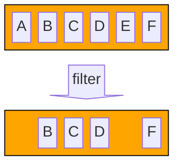

### map, mapToInt, mapToLong, mapToDouble, mapToObject

De `map`-operatie transformeert elk elementen in een stream naar een ander element door een functie toe te passen op elk element.
Bijvoorbeeld, onderstaande map-operatie zet alle strings om naar lowercase:

```java
Stream.of("ALICE", "Bob", "ChaRLIe").map(String::toLowerCase) // => "alice", "bob", "charlie"
```

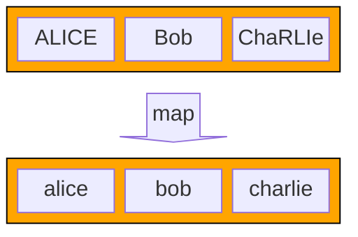

In tegenstelling tot de filter-operatie kan de `map`-operatie het type van de elementen in de stream veranderen. Bijvoorbeeld, onderstaande code vertrekt van een stream van Strings, en eindigt met een stream van Integer-objecten:

```java
Stream.of("ALICE", "Bob", "ChaRLIe").map(String::toLowerCase).map(String::length) // => 5, 3, 7
```

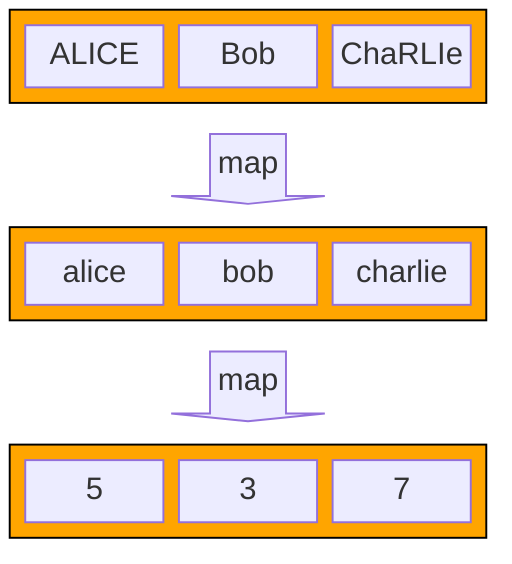

Er zijn ook specifieke map-operaties voor wanneer het resultaat een int, long, of double is.
Bijvoorbeeld, `mapToInt` geeft een `IntStream` terug.

```java
Stream.of("ALICE", "Bob", "ChaRLIe").mapToInt(String::length) // => 5, 3, 7
```

Bij een `IntStream`, `LongStream` en `DoubleStream` geeft de `map`-operatie altijd opnieuw een stream van hetzelfde type (IntStream, LongStream, DoubleStream).
Wanneer je de getallen in zo'n stream wil omzetten naar een object, kan dat met `mapToObject`:

```java
IntStream.of(1, 2, 3).mapToObject(i -> "Number " + i) // => "Number 1", "Number 2", "Number 2"
```

### limit en takeWhile

De `limit`-operatie beperkt de resultaat-stream tot de eerste \\( n \\) elementen van de bron-stream:

```java
Stream.of("A", "B", "C", "D", "E", "F").limit(3) // => A, B, C
```

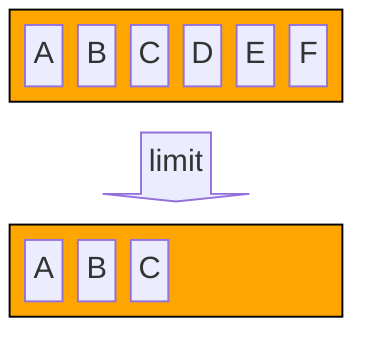

Merk op dat de plaats van `limit` belangrijk is:

```java
Stream.of("A", "B", "C", "D", "E", "F").filter(l -> !"AEIOUY".contains(l)).limit(3) // => B, C, D
```

is iets anders dan

```java
Stream.of("A", "B", "C", "D", "E", "F").limit(3).filter(l -> !"AEIOUY".contains(l)) // => B, C
```

De eerste variant resulteert in de eerste 3 medeklinkers uit de oorspronkelijke stream (je filtert eerst alle klinkers eruit, en neemt de eerste 3 overblijvende elementen).
In de tweede variant krijg je de medeklinkers uit de eerste 3 letters uit de oorspronkelijke stream (je neemt eerst de eerste 3 letters, en filtert daaruit dan de klinkers weg).

Soms ken je het aantal elementen niet, maar wil je elementen doorgeven zolang aan een bepaalde voorwaarde voldaan is.
Dat kan met `takeWhile`.
Merk op dat `takeWhile` niet hetzelfde is als `filter`: eenmaal de voorwaarde niet meer voldaan is, worden de volgende elementen niet meer bekeken, ook al zouden die opnieuw voldoen aan de voorwaarde.

```java
Stream.of("Alpha", "Bravo", "Charlie", "Delta").takeWhile(s -> s.length < 6) // => "Alpha", "Bravo"
```

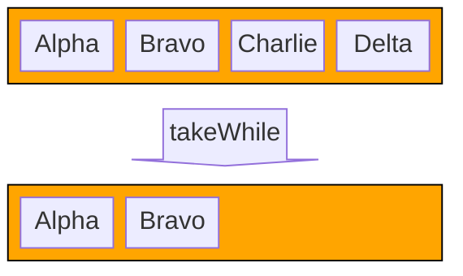

### skip en dropWhile

De `skip`-operatie doet het omgekeerde van `limit`: ze slaat de eerste \\( n \\) elementen over.

```java
Stream.of("A", "B", "C", "D", "E", "F").skip(3) // => D, E, F
```

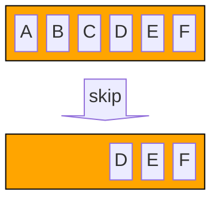

De `dropWhile`-operatie is het omgekeerde van `takeWhile`: ze negeert elementen zolang aan een gegeven voorwaarde voldaan is.

```java
Stream.of("Alpha", "Bravo", "Charlie", "Delta").dropWhile(s -> s.length < 6) // => "Charlie", "Delta"
```

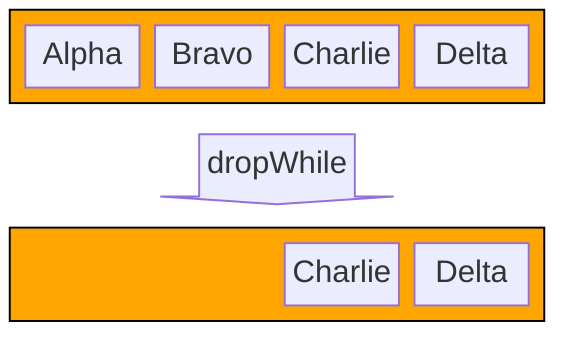

### distinct

De `distinct`-operatie filtert alle dubbele waarden uit de stream. Deze operatie is _stateful_: de waarden die reeds gezien zijn moeten bijgehouden worden.

```java
Stream.of("A", "B", "A", "C", "A", "D").distinct() // => A, B, C, D
```

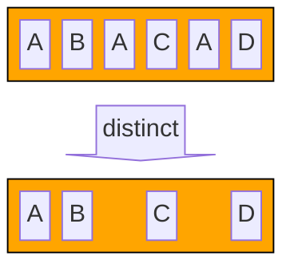

### sorted

De `sorted`-operatie sorteert de waarden in de stream. Deze operatie is _stateful_ (de reeds geziene waarden moeten bijgehouden worden om ze gesorteerd terug te geven), en de operatie vereist ook dat de stream eindig is. De elementen sorteren kan immers pas uitgevoerd worden wanneer alle elementen gekend zijn.

```java
Stream.of("C", "D", "A", "F", "E", "B").sorted() // => A, B, C, D, E, F
```

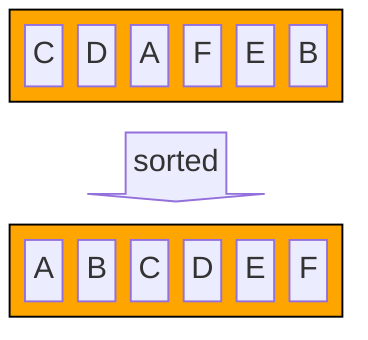

### peek

De `peek`-operatie doet eigenlijk niets: ze geeft alle elementen gewoon door, maar laat toe om een functie uit te voeren voor elk element.
Deze operatie kan bijvoorbeeld handig zijn om te debuggen: je kan ze middenin een pijplijn toevoegen om te kijken welke elementen daar voorbijkomen.

```java
Stream.of("A", "B", "C", "D", "E", "F")
   .limit(3)
   .peek(System.out::println) // => A, B, C
   .filter(l -> !"AEIOUY".contains(l))
```

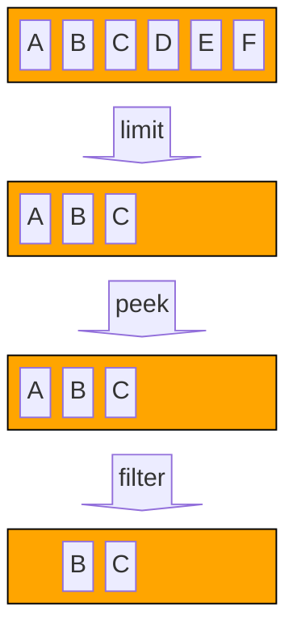

### flatMap

De `flatMap` operatie is gelijkaardig aan de `map`-operatie, maar wordt gebruikt wanneer het resultaat van de map-functie op 1 element opnieuw een stream geeft.
Opnieuw bestaan er specifieke versies `flatMapToInt`, `flatMapToLong`, en `flatMapToDouble` voor wanneer het resultaat een IntStream, LongStream of DoubleStream moet worden.

We gebruiken de `String::chars` methode als voorbeeld; die geeft voor een String een IntStream terug met de char-values van elk karakter (denk: de ASCII of Unicode-waarde van elke letter).

Als we gewoon `map` zouden toepassen, krijgen we een stream van streams:

```java
Stream<IntStream> result = Stream.of("Aa", "Bb", "Cc").map(String::chars); // => ['A', 'a'], ['B', 'b'], ['C', 'c']
```

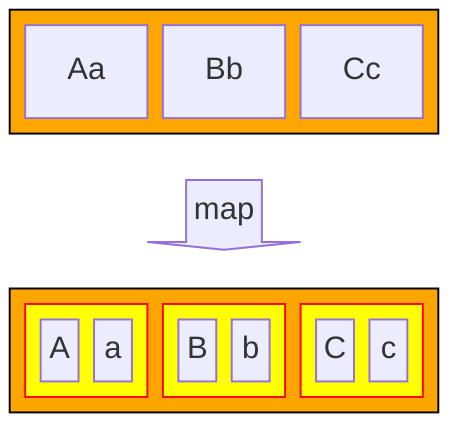

Vaak is dat niet wat we willen: stel dat we één lange stream van char-waarden (ints) willen maken, met daarin de karakters van alle woorden uit de oorspronkelijke stream na elkaar.
In dat geval gebruiken we `flatMap` (of, in dit geval, `flatMapToInt` omdat `chars` een IntStream teruggeeft):

```java
IntStream result = Stream.of("Aa", "Bb", "Cc").flatMapToInt(String::chars); // => 'A', 'a', 'B', 'b', 'C', 'c'
```

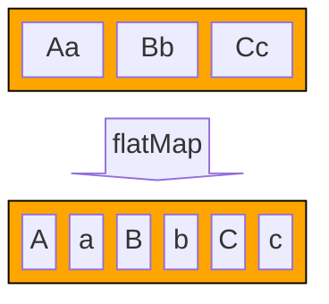

`flatMap` maakt dus in zekere zin een combinatie van een gewone `map`-operatie (die telkens een stream teruggeeft voor elk element), gevolgd door een concatenatie van al die resulterende streams.
De naam komt van het feit dat de resulterende structuur een `flattened` versie is, waarbij één niveau van nesting weggehaald werd: we gaan van een `Stream<IntStream>` bij `map` naar een gewone `IntStream` bij `flatMap` (of hier `flatMapToInt`).

### mapMulti

## Terminale (terminal) operaties

### count

### toList

### toSet

### toArray

### reduce

### collect

#### Collectors.joining

#### Collectors.groupingBy

#### Collectors.summarizingDouble

#### Collectors.partitioningBy

### findFirst en findAny

### anyMatch, allMatch, noneMatch

### forEach

### min en max

### average

### ...

## Laziness

We zeiden eerder al dat streams _lazy_ zijn.
Dat betekent eigenlijk dat de gedefinieerde operaties niet uitgevoerd worden, tenzij het echt niet anders kan.

Bekijk bijvoorbeeld onderstaande code:

```java
var list = List.of(1, 2, 3, 4, 5, 6, 7, 8, 9, 10);

Stream<Integer> incrementAll = list.stream().map(n -> {
    System.out.println("Processing " + n);
    return n + 1;
});

// [1] hier wordt nog niets uitgeprint

incrementAll.limit(1).forEach(n -> {
    System.out.println("Got " + n);
});

// [2] print "Processing 1" en "Got 2"
```

We maken een lijst van 10 getallen, en voeren `map` uit op een stream van die getallen.
Op punt \[1] wordt er, misschien verrassent, helemaal niets uitgeprint.
Dat betekent dat de lambda-functie ook niet uitgevoerd werd: er gebeurde helemaal niets met de getallen uit de lijst.
We definiëren enkel de pijplijn: wat moet er later eventueel gebeuren met de getallen?

Pas wanneer we op punt \[2] komen, en de terminale operatie `forEach` uitgevoerd werd, werd er voor de eerste keer "Processing 1" uitgeprint.
Maar dan enkel voor het eerste element: door de `limit`-operatie is er geen nood aan het verwerken van het tweede, derde, ... element, dus dat gebeurt ook nooit.
De code hierboven verwerkt dus enkel het eerste element uit de lijst; met alle andere elementen wordt nooit iets gedaan.

Het is dus belangrijk om in gedachten te houden dat stream-operaties enkel uitgevoerd worden wanneer dat noodzakelijk is, en pas op het allerlaatste moment (als gevolg van een terminale operatie).

## Parallel streams

### Spliterator

https://www.youtube.com/watch?v=Kv-EZtNzgkg&ab_channel=DouglasSchmidt

## Oefeningen

Alle oefeningen moeten opgelost worden **zonder for- of while-lussen**.

TODO: alle personen <-> incl kinderen?

1. Geef enkele statistieken (minimum, maximum, gemiddelde) van de leeftijd van alle personen in de dataset die ten minste 30 jaar zijn.
2. Ga na of er iemand in de dataset zit waarvan de voornaam "Joseph" is.
3. Groepeer alle personen in een map volgens hun postcode.
4. Tel het aantal kinderen in de dataset.
5. Maak een gesorteerde lijst van alle unieke voornamen van de kinderen van de personen in de dataset.
6. Geef een String met de 5 oudste personen terug, in het formaat "voornaam achternaam leeftijd", gesorteerd volgens voornaam, 1 persoon per lijn.
7. Bereken de gemiddelde leeftijd van alle kinderen in de dataset die een ouder hebben die ouder is dan 40.
8. Zoek de persoon met de langste achternaam.
9. Geef enkele statistieken (minimum, maximum, gemiddelde) over de lengte van de achternamen in de dataset.
10. Zoek alle personen die precies 6 keer zo oud zijn als een van hun kinderen.

### Extra: mapValues

Schrijf, gebruik makend van streams, een generische methode `mapAllValues(map, function)` die je kan gebruiken om een nieuwe Map te maken waarbij alle waarden vervangen zijn door de gegeven functie erop toe te passen.
Bijvoorbeeld, in onderstaande code gebruiken we deze functie om alle String-values in de map te vervangen door hun lengte:

```java
var myMap = Map.of("first", "333", "second", "55555");
var result = mapAllValues(myMap, String::length);
System.out.println(result); // => {first=3, second=5}
```

_Hint: gebruik [`Collectors.toMap(...)`](<https://docs.oracle.com/en/java/javase/21/docs/api/java.base/java/util/stream/Collectors.html#toMap(java.util.function.Function,java.util.function.Function)>)_

Denk ook na over geschikte grenzen voor je generische parameters (PECS).
Ook hetvolgende zou dus moeten werken:

```java
Map<String, String> myMap = Map.of("first", "333", "second", "55555");
Function<Object, Integer> fn = (x) -> x.toString().length();
Map<Object, Object> result = mapAllValues(myMap, fn);
```

## Nog meer streams? (optioneel)

In deze presentatie  zie je hoe er momenteel gewerkt wordt om streams nog uitbreidbaarder te maken.
In de huidige versie van de streams API ben je immers beperkt tot de reeds gedefinieerde tussentijdse operaties, maar je kan er veel meer bedenken.
De oplossing die onderzocht wordt komt in de vorm van een `Gatherer`-interface.
