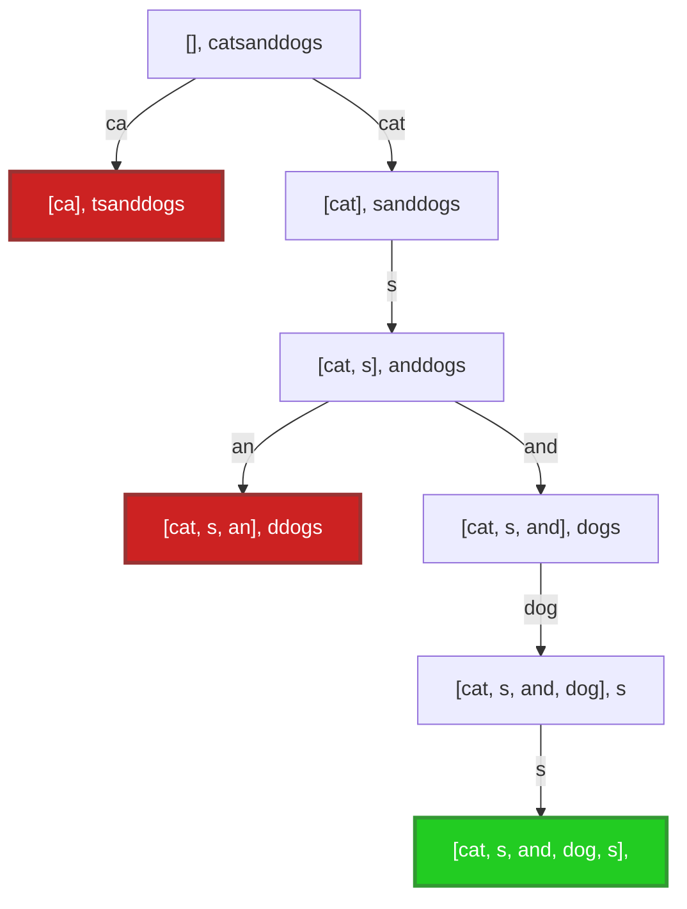
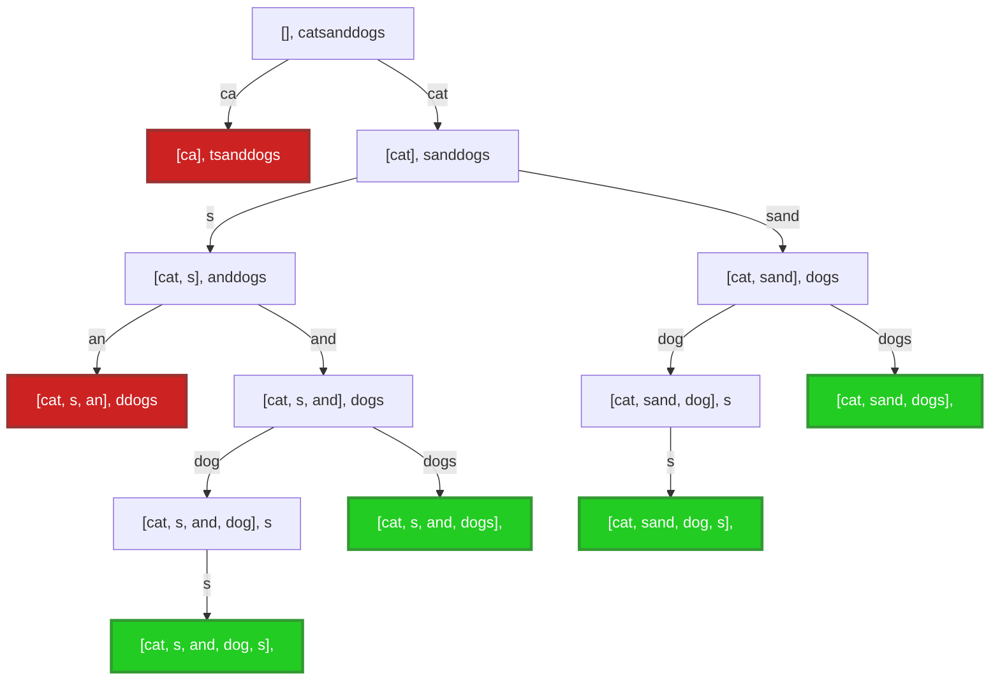
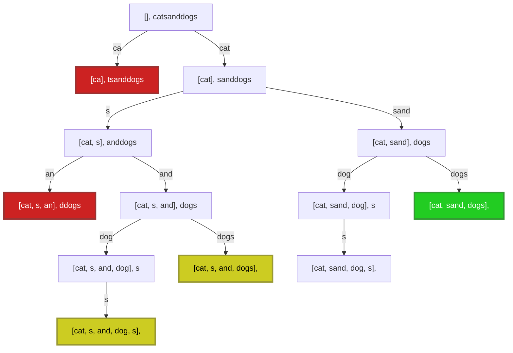

## Wat is backtracking?

Backtracking is een techniek om oplossingen te zoeken voor een probleem.
Je vertrekt van een gedeeltelijke oplossing en breidt die stapsgewijs uit naar een volledige oplossing.
Backtracking is geschikt voor problemen waar je bij elke uitbreiding van de gedeeltelijke oplossing meerdere keuzes kan maken.
Eigen aan backtracking is dat, wanneer een gemaakte keuze niet blijkt te leiden tot een geschikte oplossing, je terugkeert naar dat keuzepunt en een andere keuze maakt.
Een eenvoudig voorbeeld is de weg zoeken in een doolhof: op elke plaats waar je kan kiezen welke richting je uitgaat, maak je een keuze.
Als je later niet meer verder blijkt te kunnen, keer je terug naar die plaats en maak je een andere keuze.


Een backtracking-algoritme maakt meestal gebruik van _recursie_.
De stack die impliciet gebruikt wordt bij recursie is immers heel handig om bij te houden welke keuzes al gemaakt werden, en in welke volgorde.

## Voorbeeld: token segmentatie

Het token segmentatie probleem bestaat erin na te gaan of, gegeven een string en een lijst van tokens, je de string kan bekomen als sequentie van een of meerdere tokens uit de lijst.
Bijvoorbeeld: voor de string `"catsanddogs"` en de tokenlijst `[s, an, ca, cat, dog, and, sand, dogs]` zijn volgende segmentaties mogelijk:

- `cat sand dogs`
- `cat sand dog s`
- `cat s and dog s`
- `cat s and dogs`

Met dezelfde woordenlijst kan de string `acatandadog` niet gesegmenteerd worden.

We zien hieronder hoe we dit probleem kunnen oplossen met backtracking.
We beschouwen drie varianten:

- uitzoeken of er minstens één segmentatie bestaat (en die teruggeven)
- alle mogelijke segmentaties teruggeven
- de segmentatie die het minst aantal tokens gebruikt teruggeven.

## Skelet-programma's

Backtracking-algoritmes volgen vaak een gelijkaardige structuur.
We geven hier eerst deze algemene structuur en passen die toe op het token segmentatie probleem, voor 3 soorten algoritmes:

- Het zoeken van een _willekeurige_ oplossing
- Het zoeken van _alle_ oplossingen
- Het zoeken van een _optimale_ oplossing

Deze algoritmes draaien allemaal rond het gebruik van een **partiële oplossing**: dat is de sequentie van keuzes die je reeds gemaakt hebt, en de toestand waarin je je daardoor bevindt.
In elk van de gevallen zal je een geschikte representatie (datastructuur) moeten kiezen voor je partiële oplossing; die hangt vaak af van het probleem.
We gebruiken in de algemene skelet-programmas hiervoor volgende interfaces (het zal later duidelijk worden waarvoor de methodes dienen):

```java
interface PartialSolution {
    boolean isComplete();
    boolean shouldAbort();
    Collection<Extension> extensions();
    Solution toSolution();
    boolean canImproveUpon(Solution solution);
}

public interface Extension {
    void apply(PartialSolution solution);
    void undo(PartialSolution solution);
}

interface Solution {
    boolean isBetterThan(Solution other);
}
```

In de algoritmes die je zelf schrijft kan je hier natuurlijk van afwijken en zelf kiezen hoe je de oplossingen best voorstelt.
Zelfs zonder deze interfaces te gebruiken is het vaak wel nuttig om eens na te denken over hoe je de operaties uit de interfaces kan uitvoeren met jouw voorstelling.

### Een willekeurige oplossing zoeken

Onderstaande code geeft het skelet om eender welke oplossing voor het probleem te vinden.
Het eigenlijke werk gebeurt in de recursieve `findAnySolution`-methode.
Die zoekt een oplossing voor het hele probleem, vertrekkend van een gegeven partiële oplossing.

- We gaan eerst na of de huidige partiële oplossing een oplossing is voor het hele probleem (hier via de `isComplete()`-methode). Dit is een basisgeval voor de recursie. Als dat het geval is, moeten we niet verder zoeken, en geven we de oplossing terug. Soms moeten we nog enkele bewerkingen doen om de partiële oplossing om te zetten in het verwachte formaat van de oplossing. Dat wordt hier aangeduid met de `toSolution()`-methode.
- Als de partiële oplossing nergens toe leidt (`shouldAbort()`), geven we op. Om dat aan te geven, geven we `null` terug.
- In alle andere gevallen overlopen we elke mogelijke uitbreiding van de partiële oplossing (gegenereerd met `extensions()`).
  We veranderen de partiële oplossing door elk van de uitbreidingen (één voor één) toe te passen (`apply()`).
  Dan zoeken we recursief naar een volledige oplossing, vertrekkend van die uitgebreide partiële oplossing.
  Zodra we zo een (volledige) oplossing bekomen, geven we die terug.
  Als een uitbreiding niet tot een oplossing leidt, maken we ze ongedaan (`undo()`) en proberen we de volgende uitbreiding.
- Als we alle mogelijke uitbreidingen overlopen hebben, en geen oplossing gevonden hebben, geven we op.
  We geven `null` terug.

```java
public Solution solve() {
    PartialSolution initial = createInitialSolution();
    return findAnySolution(initial);
}

private Solution findAnySolution(PartialSolution current) {
    if (current.isComplete()) return current.toSolution();
    if (current.shouldAbort()) return null;
    for (var extension : current.extensions()) {
        extension.apply(current);
        var solution = findAnySolution(current);
        if (solution != null) {
            return solution;
        } else {
            extension.undo(current);
        }
    }
    return null;
}
```

#### Voorbeeld: token segmentatie

We volgen bovenstaand patroon om het token segmentatie probleem op te lossen, waar we op zoek gaan naar een willekeurige oplossing.
Het idee is om stap voor stap een token in de lijst te zoeken dat overeenkomt met het begin van de string, dat token weg te knippen uit het begin van de string, en dat te herhalen tot de hele string is omgezet in een sequentie van tokens.
Als partiële oplossing kiezen daarom we voor een combinatie van

- de reeds gebruikte token-sequentie (initieel een lege lijst)
- het deel van de string dat nog overblijft (initieel de hele string)

Het probleem is opgelost wanneer het overblijvende deel van de string leeg is.

Een uitbreiding (extensie) van de partiële oplossing bestaat uit

- het zoeken van een token dat voorkomt aan het begin van de resterende string
- dat token toevoegen aan de lijst van gebruikte tokens
- de resterende string inkorten, door het token vooraan te verwijderen

Voor het ongedaan maken van de uitbreiding verwijderen we het laatste token terug uit de lijst.
Om de string te herstellen moeten we niets doen, omdat die altijd immutable is.

```java
public static List<String> findAny(String string, List<String> tokens) {
    return findAny(string, tokens, new ArrayList<>());
}

private static List<String> findAny(String remainingString, List<String> allTokens, List<String> usedTokens) {
    if (remainingString.isEmpty()) return usedTokens;
    // if (allTokens.stream().noneMatch(remainingString::startsWith)) return null; // overbodig
    for (String tok : allTokens) {
        if (remainingString.startsWith(tok)) {
            usedTokens.add(tok);
            var shorterString = remainingString.substring(tok.length());
            var solution = findAny(shorterString, allTokens, usedTokens);
            if (solution != null) {
                return solution;
            } else {
                usedTokens.removeLast();
            }
        }
    }
    return null;
}
```

Merk op dat we niet noodzakelijk moeten nagaan of we moeten opgeven (de regel in commentaar); de lus eronder doet al exact hetzelfde.

We kunnen kijken naar de zoekboom die de uitvoering weergeeft.
We beginnen bovenaan en gaan telkens eerst naar links.
Op de pijltjes wordt aangegeven voor welke token we verder zoeken door een recursieve oproep te doen.
Een situatie die niet tot een oplossing kan leiden (geen enkele token komt overeen met het begin van de string) wordt rood gekleurd; we gaan dan terug een knoop naar boven en nemen de volgende tak.
De gevonden oplossing wordt in het groen aangeduid. Eens deze gevonden is, zoeken we niet meer verder.

```java
public static void main(String[] args) {
    System.out.println(findAny("catsanddogs", List.of("s", "an", "ca", "cat", "dog", "and", "sand", "dogs")));
}
```



### Alle oplossingen zoeken

Onderstaande code geeft het skelet om _alle_ oplossingen voor het probleem te vinden.
Dit duurt uiteraard een stuk langer dan enkel de eerste oplossing teruggeven.

Het eigenlijke werk gebeurt in de recursieve `findAllSolutions`-methode.
Die doet grotendeels hetzelfde als de `findAnySolution`-methode hierboven.
Het verschil is dat er nu een extra parameter is, namelijk een collectie van alle tot dan toe gevonden (volledige) oplossingen, `solutionsSoFar`.
Elke keer een nieuwe oplossing gevonden wordt, voegen we die toe aan `solutionsSoFar`.
De extra parameter wordt geïnitialiseerd in `solve` met een lege lijst.

```java
public Collection<Solution> solve() {
    PartialSolution initial = createInitialSolution();
    return findAllSolutions(initial, new ArrayList<>());
}

private Collection<Solution> findAllSolutions(PartialSolution current, Collection<Solution> solutionsSoFar) {
    if (current.isComplete()) {
        solutionsSoFar.add(current.toSolution());
        return solutionsSoFar;
    }
    if (current.shouldAbort()) return solutionsSoFar;
    for (var extension : current.extensions()) {
        extension.apply(current);
        findAllSolutions(current, solutionsSoFar);
        extension.undo(current);
    }
    return solutionsSoFar;
}
```

#### Voorbeeld: token segmentatie

De code voor het token segmentatie probleem volgt het skelet van hierboven.
Belangrijk hierbij is dat we de lijst `usedTokens` kopiëren wanneer we die toevoegen aan de lijst `foundSoFar`.
Dat is noodzakelijk: de `usedTokens`-lijst is immers deel van de partiële oplossing, en die lijst zal later nog aangepast (bijvoorbeeld met `.removeLast()`) wanneer we verder naar oplossingen zoeken.
In het vorige voorbeeld was dit niet essentieel; zodra we een oplossing vonden, gaven we de gevonden lijst meteen terug en stopten we met zoeken.

```java
public static List<List<String>> findAll(String string, List<String> tokens) {
    return findAll(string, tokens, new ArrayList<>(), new ArrayList<>());
}

private static List<List<String>> findAll(String remainingString,
                                          List<String> allTokens,
                                          List<String> usedTokens,
                                          List<List<String>> foundSoFar) {
    if (remainingString.isEmpty()) {
        foundSoFar.add(List.copyOf(usedTokens));
        return foundSoFar;
    };
    // if (allTokens.stream().noneMatch(remainingString::startsWith)) { return foundSoFar; }
    for (String tok : allTokens) {
        if (remainingString.startsWith(tok)) {
            usedTokens.add(tok);
            var shorterString = remainingString.substring(tok.length());
            findAll(shorterString, allTokens, usedTokens, foundSoFar);
            usedTokens.removeLast();
        }
    }
    return foundSoFar;
}
```

In de uitvoeringsboom zien we nu dat alle mogelijkheden overlopen en teruggegeven worden.



### Een optimale oplossing zoeken

Onderstaande code geeft het skelet om een _optimale_ oplossing voor het probleem te vinden.
Dit duurt meestal even lang als alle oplossingen zoeken, maar niet altijd: soms kan je vroeger stoppen met zoeken, wanneer je weet dat het huidige pad nooit meer tot een betere oplossing kan leiden dan de tot dan toe beste.

Het eigenlijke werk gebeurt opnieuw in de recursieve `findOptimalSolution`-methode.
Die doet grotendeels hetzelfde als de recursieve methodes voor alle of willekeurige oplossingen.
Het speciale hier is een extra parameter, namelijk de beste tot dan toe gevonden (volledige) oplossing `bestSoFar`.
Elke keer een nieuwe oplossing gevonden wordt, vergelijken we die met de beste tot dan toe (via `isBetterThan`), en geven de betere van de twee terug.
De extra parameter wordt geïnitialiseerd in `solve` met `null`: er is nog geen oplossing om mee te vergelijken.

Merk op dat we dus niet eerst alle oplossingen zoeken en bijhouden om daarna de beste te selecteren; we houden enkel de beste oplossing tot dan toe bij en vergelijken daarmee.

Daarenboven voegen we nog een optimalisatie toe: als we op een bepaald moment merken dat de huidige partiële oplossing nooit meer kan uitgroeien tot een oplossing die beter is dan de beste reeds gekende oplossing, dan stoppen we met zoeken op basis van die partiële oplossing.
Bijvoorbeeld, wanneer we een kortste pad zoeken in een doolhof en het huidige pad (waarmee we nog niet uit het doolhof zijn) is al langer dan het tot dan toe beste pad (dat wel reeds heel het doolhof oploste), dan hoeven we niet meer verder te zoeken: extra stappen toevoegen zal immers nooit kunnen leiden tot een korter pad.
Deze optimalisatie doen we met de `canImproveUpon`-methode.

```java
public Solution solve() {
    PartialSolution initial = createInitialSolution();
    return findOptimalSolution(initial, null);
}

private Solution findOptimalSolution(PartialSolution current, Solution bestSoFar) {
    if (current.isComplete()) {
        var solution = current.toSolution();
        if (bestSoFar == null || solution.isBetterThan(bestSoFar)) {
            return solution;
        } else {
            return bestSoFar;
        }
    }
    if (current.shouldAbort() ||
            (bestSoFar != null && !current.canImproveUpon(bestSoFar))) {
        return bestSoFar;
    }
    for (var extension : current.extensions()) {
        extension.apply(current);
        bestSoFar = findOptimalSolution(current, bestSoFar);
        extension.undo(current);
    }
    return bestSoFar;
}
```

#### Voorbeeld: token segmentatie

Hieronder passen we dit skelet toe op het token segmentatie probleem.
De optimale oplossing wordt gedefinieerd als de oplossing die de string splitst in het minst aantal tokens.
Wanneer de huidige splitsing al meer tokens bevat dan de beste splitsing die we op dat moment kennen, heeft het geen zin om nog verder te zoeken.

```java
public static List<String> findShortest(String string, List<String> tokens) {
    return findShortest(string, tokens, new ArrayList<>(), null);
}

private static List<String> findShortest(String remainingString,
                                         List<String> allTokens,
                                         List<String> usedTokens,
                                         List<String> bestSoFar) {
    if (remainingString.isEmpty()) {
        var solution = List.copyOf(usedTokens);
        if (bestSoFar == null || solution.size() < bestSoFar.size()) {
            return solution;
        } else {
            return bestSoFar;
        }
    };
    if (allTokens.stream().noneMatch(remainingString::startsWith) ||
          (bestSoFar != null && bestSoFar.size() <= usedTokens.size())) {
        return bestSoFar;
    }
    for (String tok : allTokens) {
        if (remainingString.startsWith(tok)) {
            usedTokens.add(tok);
            var shorterString = remainingString.substring(tok.length());
            bestSoFar = findShortest(shorterString, allTokens, usedTokens, bestSoFar);
            usedTokens.removeLast();
        }
    }
    return bestSoFar;
}

```

De uitvoeringsboom ziet er als volgt uit (de gele knopen zijn oplossingen die op een bepaald moment de beste oplossing waren, maar later vervangen zijn door een nog betere oplossing).



## Efficiëntie van backtracking

Backtracking is vaak niet heel efficiënt.
Bijvoorbeeld, als er \\( k \\) keuzepunten zijn, en je bij elke keuzepunt precies \\( m\\) mogelijkheden hebt, dan zijn er in totaal \\( m^k \\) mogelijke paden die je moet proberen.
Door snel te herkennen wanneer een partiële oplossing niet zal leiden tot een geschikte oplossing, en de zoekoperatie dan onmiddellijk af te breken, kan je het algoritme soms wel een pak efficiënter maken.

### Kopiëren of aanpassen en herstellen

In de skeletten hierboven maakten we steeds gebruik van `apply()` en `undo()`: we passen de partiële oplossing aan (door ze uit te breiden), en maken die aanpassing later weer ongedaan.
Dat gaat makkelijk als de aanpassing eenvoudig ongedaan te maken is, bijvoorbeeld een element toevoegen aan een lijst en dat nadien weer verwijderen.
Als het ongedaan maken niet zo eenvoudig is (bijvoorbeeld omdat er na de aanpassing heel wat herberekend wordt), is het vaak eenvoudiger om de volledige toestand eerst te kopiëren en verder te werken met deze kopie.
Dat vereenvoudigt het uitbreiden en herstellen van de partiële oplossing aanzienlijk, ten koste van een hoger geheugengebruik.

## Oefeningen

### 8-queens

Dit is _de_ klassieker onder de backtracking-algoritmes.
Schrijf een backtracking-algoritme om te zoeken hoe je, op een schaakbord van 8x8 vakjes, 8 koninginnen kan plaatsen zodat ze elkaar niet kunnen slaan.


(Een koningin kan elke andere koningin slaan die zich in dezelfde rij, kolom, of diagonaal bevindt).

<div style="max-width: 150px" >

```goat
* o o * o o *
o * o * o * o
o o * * * o o
* * * @ * * *
o o * * * o o
o * o * o * o
* o o * o o *
```

</div>

**Uitbreiding 1:** Zoek alle oplossingen in plaats van 1 oplossing (voor een bord van 5x5).

**Uitbreiding 2:** Doe dit voor een schaakbord van willekeurige grootte n, in plaats van 8.

### Knight's tour

Nog een klassieker met een schaakbord.
Schrijf een backtracking-algoritme om met een paard, beginnend op positie (0, 0), precies één keer op elk vakje van het bord te komen.

(Een paard beweegt 2 vakjes in een richting, en 1 vakje in de orthogonale richting).

<div style="max-width: 150px" >

```goat
o o o o o o o
o o * o * o o
o * o o o * o
o o o @ o o o
o * o o o * o
o o * o * o o
o o o o o o o
```

</div>

_Hint als je oplossing te lang duurt:_ Begin met een kleiner bord (5x5), en overloop de mogelijke volgende posities volgens de wijzers van de klok.

**Uitbreiding:** Zoek alle oplossingen in plaats van 1 oplossing, voor een klein bord (5x5). Zoek op hoeveel oplossingen er bestaan voor een 8x8 bord.

### SEND+MORE=MONEY

Schrijf een backtracking-algoritme om een letterpuzzel op te lossen zodanig dat de som klopt.
Elke letter komt overeen met een cijfer (0--9), en geen twee letters staan voor hetzelfde cijfer.
De getallen beginnen niet met 0 (geen _leading zeros_).

Bijvoorbeeld:

```
    S E N D
+   M O R E
-----------
  M O N E Y
```

of

- `ONE + TWO = SIX`
- `SUN + FUN = SWIM`
- `CRACK + HACK = ERROR`
- `MATH + MYTH = HARD`
- `BASE + BALL = GAMES`

_Hint_: onderstaande hulpfuncties kunnen misschien handig zijn. Ook `Integer.parseInt(String s)` om een String om te zetten naar een int kan nuttig zijn.

```java
private static String replaceCharWithNumber(String str, char charToReplace, int digit) {
    return str.replace(charToReplace, (char) ('0' + digit));
}

private static boolean containsLetter(String str) {
    return str.chars().anyMatch(Character::isLetter);
}
```

**Uitbreiding:** Laat toe om meer dan twee termen op te tellen, bijvoorbeeld `ONE + TWO + SIX = NINE`.

**Uitbreiding:** Zoek alle oplossingen.

### Uurrooster planner

Schrijf een programma om een conflict-vrije uurrooster te maken voor een aantal vakken.
Bij elk vak hoort een verzameling van personen (bv. leerkracht en studenten).
We vereenvoudigen het uurrooster tot een verzameling van vaste slots waarop vakken ingepland kunnen worden.
Elk slot stellen we voor door een positief getal.
Zo kan slot 1 bijvoorbeeld staan voor maandagmorgen om 8u30, slot 2 voor maandagmorgen om 10u30, etc.

Enkele beperkingen waaraan het rooster moet voldoen:

- (optimaal) Het uiteindelijke uurrooster moet gebruik maken van zo weinig mogelijk slots.
- (conflict-vrij) Een persoon mag nooit voor 2 verschillende vakken in hetzelfde slot ingeroosterd worden.
- (capaciteitsconform) Er mogen nooit meer dan 5 vakken op hetzelfde slot ingepland worden, zodat er steeds voldoende lokalen zijn.

### Woorden samentrekken

Maak een methode die de kortste samentrekking zoekt van een gegeven verzameling van woorden.
We spreken van een samentrekking wanneer het einde van een woord overeenkomt met het begin van het woord dat daarop volgt.
Bijvoorbeeld: `banaananas` is een samentrekking van `ananas` en `banaan`, waar de letters `an` overlappen.

- Voor de woorden `"besturend", "declaratiesysteem", "deelgemeente", "gemeentebesturen", "merendeel", "programmeren", "sturende", "urendeclaraties"` bekom je als kortste samentrekking `"programmerendeelgemeentebesturendeclaratiesysteem"`.

- Voor `[samentrekking, trekkingsdata, datavoorziening, voorzieningsfonds, fondsmanager, managersfuncties, functiesysteem, systeemdata]` wordt dat `samentrekkingsdatavoorzieningsfondsmanagersfunctiesysteemdata`.

Soms bestaat er geen samentrekking.

**Uitbreiding:** Zoek ook de langste samentrekking. Voor het eerste voorbeeld hierboven is dat `programmerendeelgemeentebesturendeclaratiesturendeclaratiesysteem`. Voor het tweede `functiesysteemdatavoorzieningsfondsmanagersfunctiesamentrekkingsdata`.
