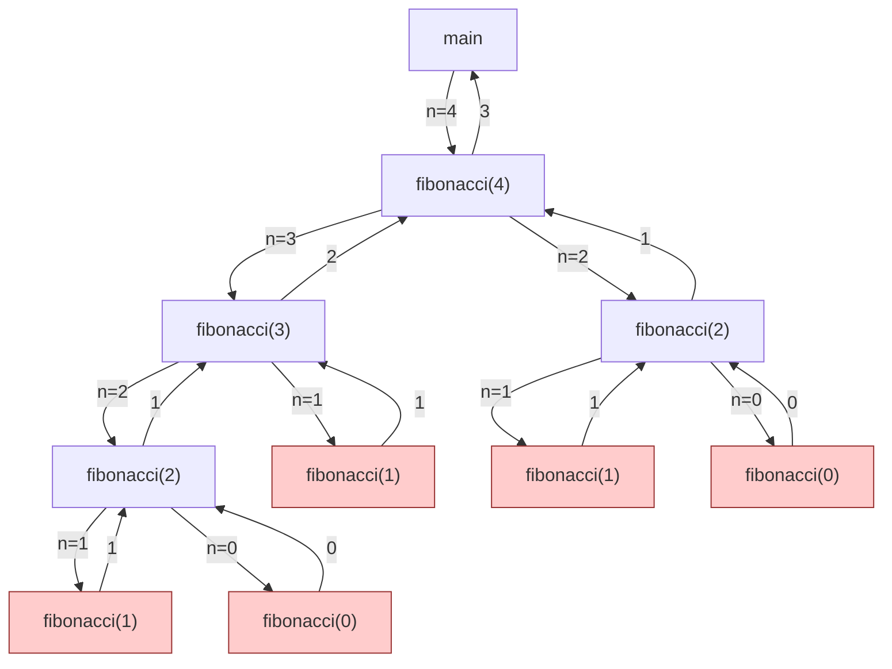

## Wat is recursie?

Wiskundig gezien zijn recursieve functies functies die zichself één of meerdere keren oproepen.
Een gekend voorbeeld is **faculteit**: $$ n! = n \times (n-1)! \quad\textrm{met}\quad 0! = 1 $$

Een ander gekend voorbeeld zijn de **Fibonacci**-getallen:
$$ F(n) = F(n-1) + F(n-2) \quad\textrm{met}\quad F(1) = 1 \quad\textrm{en}\quad F(0) = 0 $$.

In Java kunnen we ook recursieve functies definiëren, bijvoorbeeld om Fibonacci-getallen te berekenen:

```java
public static int fibonacci(int n) {
  if (n < 0) throw new IllegalArgumentException("n must be non-negative");
  if (n == 0) return 0;
  if (n == 1) return 1;
  return fibonacci(n-1) + fibonacci(n-2);
}
```

Merk op hoe de functie zichzelf tweemaal oproept.

De recursie eindigt wanneer een basisgeval bereikt wordt.
Dat is een situatie (meestal een zeer eenvoudige) waar het antwoord onmiddellijk gekend is, en geen recursieve oproep meer nodig is.
In bovenstaande code voor `fibonacci` zijn de basisgevallen de oproepen waarin `n` kleiner is dan 2.

## Eindigheid en invoergrootte

Indien ze niet zorgvuldig gedefinieerd wordt, bestaat de kans dat een recursieve methode nooit eindigt.
Bijvoorbeeld, onderstaande recursieve methode `bad`

```java
public static int bad(int n) {
  if (n == 0) return 0;
  return bad(n-2);
}
```

zou enkel eindigen voor positieve even getallen (overtuig jezelf hiervan).

TODO: Collatz?

Om er zeker van te zijn dat een recursieve methode ooit eindigt, moeten we kunnen aantonen dat elke recursieve oproep ooit een basisgeval zal bereiken.
Dat is niet altijd eenvoudig of mogelijk.
Dat is echter wel vanzelfsprekend als elke recursieve oproep de grootte van de invoer strikt kleiner maakt, en de basisgevallen overeenkomen met de kleinst mogelijke invoergrootte(s).
Aangezien een invoergrootte steeds (per definitie) een niet-negatief getal moet zijn, moet een voortdurende verkleining ervan ooit stoppen.

Typische invoergroottes bij recursieve problemen zijn

- de waarde van een parameter, indien dit een natuurlijk getal is (bijvoorbeeld `n` in fibonacci hierboven)
- het aantal elementen in een datastructuur (lijst, set, ...) die gebruikt wordt

## Recursie achter de schermen

Als we een recursieve functie uitvoeren, doet Java achter de schermen heel wat boekhouding voor ons.
Bekijk onderstaande illustratie die aangeeft wat er gebeurt om `fibonacci(4)` te berekenen:



{}

{}

{}

## Recursief denken

Recursie biedt vaak een erg krachtige manier om complexe algoritmische problemen op te lossen.
Je moet hiervoor wel op de juiste manier redeneren over recursie.
Een grote valkuil is nadenken over de volledige uitvoeringsboom, zoals we hierboven getoond hebben voor fibonacci.
De complexiteit hiervan is gigantisch, en staat een elegante oplossing en helder redeneren in de weg.

Een betere manier om na te denken over recursie gaat als volgt.
Je wil een probleem van een bepaalde grootte (`n`) oplossen.
Stel nu dat je mag veronderstellen dat je (magischerwijze) dat probleem al kan oplossen voor alle (strikt kleinere) groottes `n' < n`.
Hoe kan dit je helpen om het volledige probleem op te lossen?
Met andere woorden, welke manieren zie je om een oplossing van een deel van het probleem te transformeren in een oplossing voor het hele probleem?
Eens je deze denkwijze onder de knie hebt, wordt recursie bijna een magisch stuk gereedschap.

We bekijken twee voorbeelden van deze denkwijze.

### Voorbeeld 1: grootste element

Bijvoorbeeld: je wil het grootste element uit een lijst van getallen bepalen.
We noemen de lengte van die lijst `n`.
Stel nu dat we reeds beschikken over een magische oplossing (een functie) om het grootste element te vinden in alle lijsten met een lengte tot en met `n-1`.
Hoe kunnen we deze oplossing gebruiken om het probleem op te lossen voor een lijst van lengte `n`?

> Denk hier even zelf over na!

Er zijn verschillende mogelijkheden.
We weten bijvoorbeeld dat het grootste element ofwel het eerste element is, ofwel voorkomt in de rest van de lijst (alle elementen behalve het eerste).
We kunnen onze magische functie dus gebruiken om het grootste element uit de rest van de lijst te zoeken, en dat te vergelijken met het eerste.
Dat leidt tot volgende recursieve implementatie:

```java
public static int largestElement(ArrayList<Integer> list) {
  if (list.size() == 0) return NoSuchElementException();
  if (list.size() == 1) return list.get(0);

  var firstElement = list.get(0);
  var largestRest = largestElement(list.subList(1, list.size()));
  if (firstElement >= largestRest) {
    return firstElement;
  } else {
    return largestRest;
  }
}
```

De basisgevallen hier zijn een lege lijst (er is dan geen grootste element) en een lijst met slechts één element (dat ene element moet het grootste element zijn).

Maar er waren ook andere oplossingsstrategieën mogelijk met een gelijkaardige denkwijze.
Bijvoorbeeld, we hadden het laatste element kunnen afzonderen in plaats van het eerste.
Of we hadden het maximum van de eerste helft van de elementen kunnen vergelijken met het maximum van de tweede helft:

```java
public static int largestElement_alt(ArrayList<Integer> list) {
  int n = list.size();
  if (n == 0) return NoSuchElementException();
  if (n == 1) return list.get(0);

  var largestFirstHalf = largestElement(list.subList(0, n/2));
  var largestSecondHalf = largestElement(list.subList(n/2, n));
  if (largestFirstHalf >= largestSecondHalf) {
    return largestFirstHalf;
  } else {
    return largestSecondHalf;
  }
}
```

Recursief denken lijkt voor dit voorbeeld misschien wat overbodig.
Het maximum zoeken kan je inderdaad ook heel eenvoudig iteratief (met een for-lus).
Daarom volgend tweede voorbeeld.

### Voorbeeld 2: Toren van Hanoi

Je kent misschien de puzzel van de [toren van Hanoi](https://en.wikipedia.org/wiki/Tower_of_Hanoi).
We hebben drie stapels (A, B, en C), en op elke stapen mogen schijven liggen, van groot (onderaan) naar klein (bovenaan).
De puzzel bestaat eruit om alle schijven van één stapel naar een andere te verplaatsen.
Daarbij zijn er twee regels:

1. Je mag slechts 1 schijf per keer verplaatsen.
2. Er mag nooit een grote op een kleine schijf terecht komen.

> Hoe moeilijk/lang verwacht je dat een algoritme wordt om deze puzzel op te lossen?

Dit probleem wordt heel eenvoudig als we recursief denken.
We moeten `n` schijven verplaatsen van een bronstapel (bijvoorbeeld A) naar een doelstapel (bijvoorbeeld C), en we hebben een extra stapel (B) die we als hulpstapel kunnen gebruiken.
We mogen bovendien veronderstellen dat we een magische oplossing (recursie!) hebben om `n-1` (of minder) schijven te verplaatsen van een willekeurige stapel naar een andere willekeurige stapel, volgens de regels van de puzzel.
Hoe kunnen we die magische oplossing gebruiken voor het hele probleem?

> Denk hier zelf even over na!

We kunnen eerst de bovenste `n-1` schijven verplaatsen van stapel A naar stapel B (de hulpstapel).
De laatste overblijvende schijf op stapel A (de grootste schijf) verplaatsen we nu naar doelstapel C.
Tenslotte verplaatsen we de `n-1` schijven van hulpstapel B ook naar doelstapel C (opnieuw via onze magische oplossing).
Het basisgeval is heel eenvoudig: indien we 0 schijven moeten verplaatsen, doen we niets.

Dat geeft volgende oplossing in code, met `n` het aantal schijven en `from`, `to`, en `helper` de namen van de stapels, (bijvoorbeeld "A", "B", en "C", of "links", "midden", en "rechts"):

```java
public static void hanoi(int n, String from, String to, String helper) {
  if (n <= 0) return;
  hanoi(n-1, from, helper, to); // verplaats n-1 schijven van `from` naar `helper`, met `to` als hulpstapel
  System.out.println("Verplaats de bovenste schijf van stapel " + from + " naar stapel " + to);
  hanoi(n-1, helper, to, from); // verplaats n-1 schijven van `helper` naar `to`, met `from` als hulpstapel
}
```

Erg kort en elegant, niet?

Als we deze oplossing uitvoeren voor `n=4` en `from="A"`, `to="C"`, en `helper="B"`, krijgen we volgende uitvoer:

```
Verplaats de bovenste schijf van stapel A naar stapel B
Verplaats de bovenste schijf van stapel A naar stapel C
Verplaats de bovenste schijf van stapel B naar stapel C
Verplaats de bovenste schijf van stapel A naar stapel B
Verplaats de bovenste schijf van stapel C naar stapel A
Verplaats de bovenste schijf van stapel C naar stapel B
Verplaats de bovenste schijf van stapel A naar stapel B
Verplaats de bovenste schijf van stapel A naar stapel C
Verplaats de bovenste schijf van stapel B naar stapel C
Verplaats de bovenste schijf van stapel B naar stapel A
Verplaats de bovenste schijf van stapel C naar stapel A
Verplaats de bovenste schijf van stapel B naar stapel C
Verplaats de bovenste schijf van stapel A naar stapel B
Verplaats de bovenste schijf van stapel A naar stapel C
Verplaats de bovenste schijf van stapel B naar stapel C
```

Ga na dat dit een correcte oplossing is voor het probleem, bijvoorbeeld via [deze simulator](https://www.mathsisfun.com/games/towerofhanoi.html).

## Recursie vs. iteratie

In sommige gevallen kan je een recursieve methode eenvoudig herschrijven naar een versie zonder recursie, door middel van iteratie, en omgekeerd.

Bijvoorbeeld, faculteit van hierboven wordt

```java
int result = 1;
for (int i = 1; i <= n; i++) {
  result *= i;
}
return result;
```

De functie factorial is **tail-recursive**: de recursieve oproep is de laatste bewerking die gebeurt voor de functie eindigt.
In dergelijke gevallen is het herschrijven vaak heel eenvoudig.

In andere gevallen moet je zelf de geheugen-stack reconstrueren met een datastructuur.
Bijvoorbeeld, ...

## Worker-wrapper? Accumulator?

## Voorbeelden

### isDivisibleBy

```java
public boolean isDivisibleBy(number, divisor) {

}
```

### Greatest common divisor

```java

```

### Sum of digits

### Palindroom

### Alle prefixen van een String

### Element zoeken in een lijst

Binary search?

ArrayList -> lst.subList()

Linked list?

### Maximum in een lijst zoeken

Uitbreiding: index + element in Pair?

### Reverse list

### Sorteren van een lijst

Selection sort (ahv index maximum)

### Toren van Hanoi (uitbreiding)

Meer stapels

### Trap beklimmen

Hoeveel manieren zijn er om een trap op te gaan, als je bij elke stap kan kiezen om 1 of 2 tredes te nemen?

### Exact betalen

Gegeven een lijst van munten, bepaal of je een bepaald bedrag exact kan betalen.

### Doolhof oplossen

### Alle permutaties berekenen

### Evalueer wiskundige expressie
