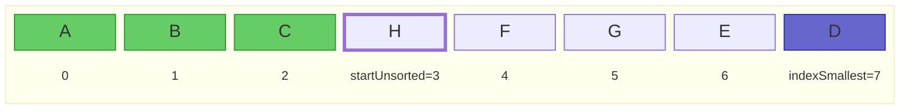
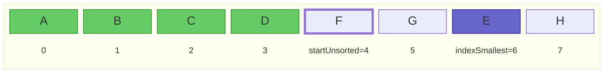

Tijdscomplexiteit is een essentieel begrip bij de analyse van algoritmes (en bijhorende gegevensstructuren).
Met tijdscomplexiteit wordt gekwantificeerd hoe snel een algoritme zijn invoer verwerkt.
Het is dus een eigenschap van een (implementatie van een) algoritme, naast bijvoorbeeld de correctheid en leesbaarheid van dat algoritme.

In tegenstelling tot wat je misschien zou denken, wordt er bij tijdscomplexiteit niet gekeken naar de tijd (in seconden).
In plaats daarvan wordt het totale aantal operaties dat uitgevoerd wordt geteld.
Daarenboven worden niet alle operaties geteld; er wordt een keuze gemaakt voor een verzameling **basisoperaties**.
Het voordeel hiervan is dat, in tegenstelling tot de reële tijd, het aantal operaties niet afhankelijk is van de snelheid van de processor.
Bijvoorbeeld, bij sorteeralgoritmes wordt soms de vergelijking tussen twee elementen als (enige) basisoperatie gebruikt, of soms elke operatie die een element uit de te sorteren rij opvraagt of aanpast.
Het totale aantal uitgevoerde basisoperaties is dan (bij benadering) een maat voor de uitvoeringstijd van het algoritme, aangezien elke basisoperatie een bepaalde reële uitvoeringstijd heeft op een machine.

Voor de meeste algoritmes zal een grotere invoer leiden tot meer uit te voeren operaties (denk aan een lus die vaker herhaald wordt).
Grotere invoer leidt dus tot meer operaties, en daardoor tot een langere uitvoeringstijd.
Zo is het bijvoorbeeld niet meer dan logisch dat een hele lange lijst sorteren langer duurt dan een heel korte lijst sorteren.
De grootte van de invoer wordt met \\(n\\) aangeduid; de tijdscomplexiteit van het algoritme in functie van de invoergrootte met de functie \\(T(n)\\).

## Best, worst, average case

We maken bij tijdscomplexiteit onderscheid tussen:

- **Best case**: een invoer (van een bepaalde grootte \\( n \\)) die leidt tot de best mogelijke (kortste) uitvoeringstijd. Bijvoorbeeld, sommige sorteeralgoritmes doen minder werk (en zijn dus snel klaar) als de lijst al gesorteerd blijkt te zijn.
- **Worst case**: een invoer (van een bepaalde grootte \\( n \\)) die leidt tot de slechtst mogelijke (langste) uitvoeringstijd. Bijvoorbeeld, sommige sorteeralgoritmes hebben erg veel last met een omgekeerd gesorteerde lijst: ze moeten dan heel veel operaties uitvoeren om de lijst gesorteerd te krijgen.
- **Average case**: een invoer (van een bepaalde grootte \\( n \\)) waarover we niets weten en geen veronderstellingen kunnen of willen maken. Bijvoorbeeld, voor sorteeralgoritmes kan dit een willekeurige volgorde (permutatie) van de elementen zijn, zonder speciale structuur. De uitvoeringstijd in de average case zal ergens tussen die van de worst case en best case liggen.

Worst- en best-case zijn in veel gevallen redelijk eenvoudig te bepalen. De average case wordt vaak complexer.

Belangrijk om te onthouden is dat worst/best/average case dus **niet** gaan over een kleinere of grotere invoer, maar wel over **hoe** die invoer eruit ziet of gestructureerd is.
Bijvoorbeeld, de best case voor een sorteeralgoritme is **niet** een lege lijst. Hoewel er in dat geval amper operaties uitgevoerd moeten worden, zegt dat niet veel: het is immers niet meer dan logisch dat een kleinere invoer ook minder tijd vraagt.
Wat we wel willen weten is bijvoorbeeld _wélke_ lijst (van alle mogelijke lijsten van lengte \\(n=1000\\), bijvoorbeeld) het langst duurt om te sorteren met dat bepaald algoritme.

## Voorbeeld: selection sort

Hieronder vind je een voorbeeld-implementatie van selection sort, een eenvoudig sorteeralgoritme.
In elke iteratie van de lus wordt het reeds gesorteerde deel van de lijst (dat is het deel vóór index `startUnsorted`) uitgebreid met 1 element, namelijk het kleinste nog niet gesorteerde element. Dat element wordt gezocht met de hulpfunctie `indexOfSmallest`, dewelke de index van het kleinste element in de lijst teruggeeft vanaf een bepaalde index `start`.
Dat kleinste element wordt vervolgens omgewisseld met het element op plaats `startUnsorted`.
Dat zoeken en omwisselen blijven we doen tot de hele lijst gesorteerd is.

Bijvoorbeeld, in de vierde iteratie van de lus ziet de situatie er als volgt uit net voordat de `swap`-operatie uitgevoerd wordt:



En in de vijfde iteratie als volgt:



```java
public static <E extends Comparable<E>> void selectionSort(ArrayList<E> list) {
    for (int startUnsorted = 0; startUnsorted < list.size(); startUnsorted++) {
        int indexSmallest = indexOfSmallest(list, startUnsorted);
        Collections.swap(list, startUnsorted, indexSmallest);
    }
}
private static <E extends Comparable<E>> int indexOfSmallest(List<E> list, int start) {
    if (start >= list.size()) return -1;
    int indexSmallestSoFar = start;
    E smallestSoFar = list.get(start);
    for (int i = start+1; i < list.size(); i++) {
        E candidate = list.get(i);
        if (candidate.compareTo(smallestSoFar) < 0) {
            indexSmallestSoFar = i;
            smallestSoFar = candidate;
        }
    }
    return indexSmallestSoFar;
}
```

{}
Merk op hoe de functie het generische type `<E extends Comparable<E>>` gebruikt.
Dat legt op dat de elementen (aangeduid met generische type `E`) bovendien de interface `Comparable<E>` moeten implementeren, waardoor ze met elkaar vergeleken kunnen worden via de `compareTo`-methode (gebruikt in `indexOfSmallest`).
Ingebouwde Java-klassen zoals String, Integer, etc. implementeren `Comparable`, waardoor deze methode gebruikt kan worden om lijsten van Strings te sorteren.
Als je deze methode wil gebruiken om objecten van je eigen klasse (bijvoorbeeld `Person`) te sorteren, zal je Person-klasse ook de interface Comparable moeten implementeren om aan te geven hoe personen met elkaar vergeleken moeten worden.
{}

## Basisoperaties tellen

Afhankelijk van het type algoritme kunnen we verschillende operaties als basisoperatie kiezen.
Als we voor selection sort als enige basisoperatie de methode `compareTo` nemen, dan zal voor een lijst van lengte \\(n\\):

- tijdens de eerste iteratie het element op index 0 vergeleken worden met alle volgende \\(n-1\\) elementen;
- tijdens de tweede iteratie het element op index 1 vergeleken worden met alle volgende \\(n-2\\) elementen;
- etc.
- tijdens iteratie \\(n-1\\) het element op index \\(n-2\\) vergeleken worden met het laatste element;
- tijdens iteratie \\(n\\) het element op index \\(n-1\\) met geen enkel element vergeleken worden.

Er gebeuren in totaal dus
\\( T(n) = (n-1) + (n-2) + \ldots + 1 + 0 = \frac{n(n-1)}{2} = \frac{n^2}{2} - \frac{n}{2} \\) vergelijkingen van elementen via `compareTo`.

Daaruit kunnen we ook afleiden dat, als we de invoer 10 keer groter maken, we
\\( \frac{T(10n)}{T(n)} = \frac{(10n)^2/2-10n/2}{n^2/2-n/2} = 100 + 90/(n-1) \\)
keer zoveel operaties uitvoeren. Als \\( n \\) voldoende groot is, zal de lijst 10 keer langer maken dus neerkomen op ongeveer 100 keer zoveel werk, en zal selection sort dus 100 keer trager zijn.

In de rest van dit hoofdstuk over datastructuren gaan we verder voornamelijk werken met één specifieke basisoperatie, namelijk het aantal keer dat een element uit het geheugen (of uit een array) bezocht (uitgelezen) worden.

## Grote O-notatie

We kunnen het aantal basisoperaties exact berekenen, zoals hierboven voor selection sort.
Dat is echter veel werk, en vaak hebben we dergelijke precisie niet nodig.
Voor tijdscomplexiteit wordt er daarom veelal gebruik gemaakt van **grote O**-notatie.
Dat is, informeel gezegd, de snelst stijgende term, zonder constanten.
In het voorbeeld van selection sort hierboven is de snelst stijgende term van \\( T(n) \\) de kwadratische term. We noteren dat als
\\( T(n) \in \mathcal{O}(n^2) \\)
of soms gewoon
\\( T(n) = \mathcal{O}(n^2) \\)

Formeel betekent \\( T(n) \in \mathcal{O}(f(n)) \\) dat \\( \exists c, n_0.\ \forall n > n_0.\ T(n)/f(n) \leq c \\). Met andere woorden, zodra \\( n \\) groot genoeg is (groter dan een bepaalde \\(n_0\\)), is de verhouding \\(T(n)/f(n)\\) begrensd door een constante, wat uitdrukt dat \\(T(n)\\) niet sneller stijgt dan \\(f(n)\\).

\\( \mathcal{O}(n^2) \\) is de **complexiteitsklasse** (de verzameling van alle functies die niet sneller dan kwadratisch stijgen), en we zeggen dat selection sort een **kwadratische tijdscomplexiteit** heeft.

{}
Er zijn nog andere notaties die vaak gebruikt worden in de context van tijdscomplexiteit, waaronder grote theta (\\( \Theta \\)), grote omega (\\( \Omega \\)), en tilde (~). Deze hebben allen een andere formele definitie.
In de dagelijkse (informele) praktijk wordt vaak grote O gebruikt, zelfs als eigenlijk een van deze andere bedoeld wordt.
{}

## Vaak voorkomende complexiteitsklassen

Hieronder vind je een tabel met vaak voorkomende complexiteitsklassen.
In de laatste kolom vind je de tijd die zo'n algoritme doet over een invoer van grootte \\(n=1000\\), in de veronderstelling dat het een probleem van grootte \\(n=100\\) kan oplossen in 1 milliseconde.

| Klasse                        | Naam          | \\( T(1000) \\) (als \\( T(100) = 1 \textrm{ms} \\))                                 |
| ----------------------------- | ------------- | ------------------------------------------------------------------------------------ |
| \\( \mathcal{O}(1) \\)        | Constant      | \\(1\ \textrm{ms} \\)                                                                |
| \\( \mathcal{O}(\log n) \\)   | Logaritmisch  | \\(1.5\ \textrm{ms} \\)                                                              |
| \\( \mathcal{O}(n) \\)        | Lineair       | \\(10\ \textrm{ms} \\)                                                               |
| \\( \mathcal{O}(n \log n) \\) | Linearitmisch | \\(15\ \textrm{ms} \\)                                                               |
| \\( \mathcal{O}(n^2) \\)      | Kwadratisch   | \\(100\ \textrm{ms} \\)                                                              |
| \\( \mathcal{O}(n^3) \\)      | Kubisch       | \\(1000\ \textrm{ms} \\)                                                             |
| \\( \mathcal{O}(2^n) \\)      | Exponentieel  | \\( 2^{900}\ \textrm{ms} \\) = \\( 2.7 \times 10^{260}\ \textrm{jaar}\\)             |
| \\( \mathcal{O}(n!) \\)       | Factorieel    | \\( \frac{1000!}{100!}\ \textrm{ms} \\) = \\( 1.4 \times 10^{2399}\ \textrm{jaar}\\) |

Je ziet dat de constante tot en met linearitmische complexiteitsklassen zeer gunstig zijn.
Kwadratisch en kubisch zijn te vermijden, omdat de tijd veel sneller toeneemt dan de grootte van de invoer.
Exponentiële en factoriële algoritmes tenslotte zijn dramatisch en schalen bijzonder slecht naar grotere problemen.
Backtracking-algoritmes (zie later) vallen vaak in deze laatste klassen, en kunnen dus zeer inefficiënt zijn voor grotere problemen.

We zullen deze tijdscomplexiteitsklassen gebruiken om (operaties op) datastructuren te vergelijken.

{}
Tijdscomplexiteit met grote O geeft bij benadering aan hoe het aantal operaties dat een algoritme moet uitvoeren stijgt wanneer de grootte van de invoer stijgt.
{}