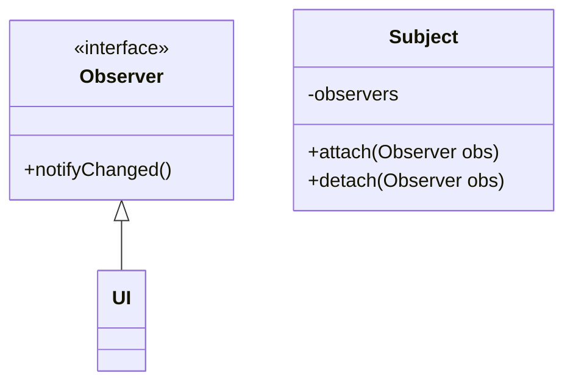
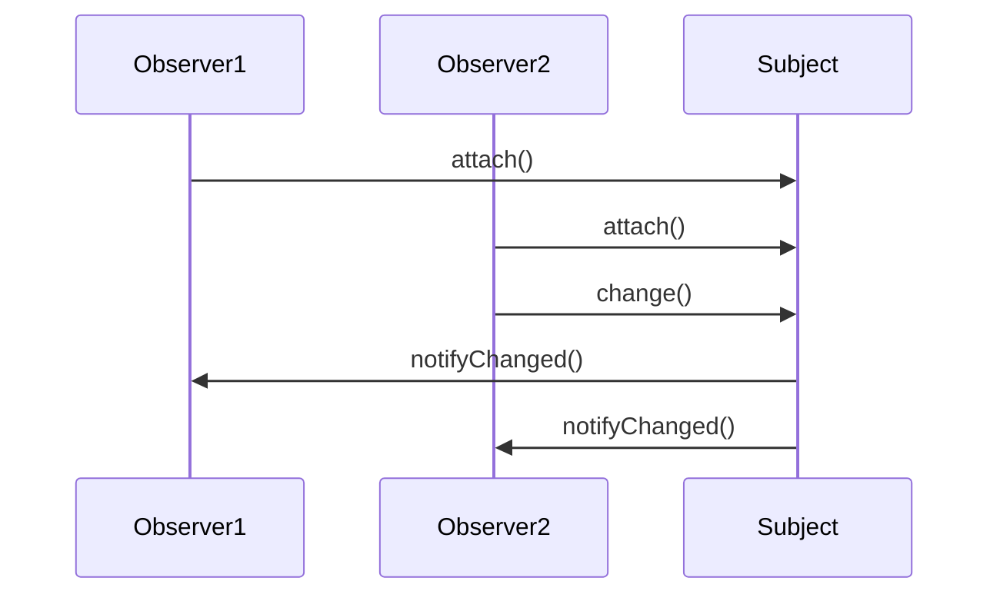

## Wat is een patroon?

Wanneer we software schrijven, is het niet efficiënt om steeds het wiel opnieuw uit te vinden.
Daarom maken we vaak gebruik van bibliotheken (libraries): code die door iemand anders geschreven en getest werd, en die we zo kunnen herbruiken in ons project.
Het eenvoudigste voorbeeld in de context van dit vak zijn de klassen die deel uitmaken van de Java API (bv. collecties en streams).

Soms is het geen code die we willen herbruiken, maar een idee voor een ontwerp.
Voor bepaalde problemen is de cruciale vraag immers niet 'bestaat er een bibliotheek die dit oplost' maar 'hoe structureer ik mijn software het best gegeven deze context'.
In die situatie spelen **ontwerppatronen** de rol van de bibliotheek (library).
Een ontwerppatroon is een beschrijving van een herbruikbare oplossing voor een vaak terugkerend ontwerpprobleem.
Patronen worden niet uitgevonden, maar omvatten kennis over werkende oplossingen die door middel van ervaring en expertise werden opgebouwd.
De meest populaire software engineering design patterns zijn beschreven in het boek [Design Patterns: Elements of Reusable Object-Oriented Software](https://en.wikipedia.org/wiki/Design_Patterns) (1995).
Deze patronen richten zich in eerste instantie op een goed software-ontwerp, in termen van _lage koppeling_ en _hoge cohesie_.
Dat houdt kort gezegd in dat functionaliteit vervat zit in logische, afgescheiden modules (bijvoorbeeld klassen of packages in Java), en dat er niet teveel afhankelijkheden zijn tussen die modules.
In een systeem met hoge cohesie en lage koppeling is het steeds duidelijk waar een aanpassing moet gebeuren (hoge cohesie) en zal een aanpassing enkel een lokaal effect hebben, en dus niet doorsijpelen naar de rest van het systeem (lage koppeling).

Een patroon geeft in de eerste plaats een **naam** aan een herbruikbare oplossingsstrategie.
Op die manier gaan patroonnamen deel uitmaken van het ontwerpvocabularium, en volstaat een zin als "Heb je al eens aan een _visitor_ gedacht?" om een hele oplossingsstrategie te beschrijven aan een collega.

In sommige gevallen is het ontstaan van een patroon het gevolg van een tekortkoming van een programmeertaal.
We zullen later bijvoorbeeld zien dat het visitor-patroon, wat lange tijd populair was in Java, aan relevantie inboet sinds de taal uitgebreid werd met sealed interfaces en pattern matching.
Die laatsten voorzien immers een ingebouwde manier om hetzelfde te doen.
In veel gevallen zijn patronen dan ook taal-afhankelijk.
De nood aan het Observer-patroon in Java wordt in C# bijvoorbeeld (gedeeltelijk) weggenomen door de _delegates_- en _event_-constructies in de taal.

In de cursus "Software-ontwerp in Java" heb je reeds kennis gemaakt met een design pattern, namelijk _Model-View-Controller_.
We beginnen onze verkenning met dat patroon.

## Model-View-Controller

Een van de meest populaire patronen is Model-View-Controller (_MVC_).
Dit patroon stelt voor om UI-logica eenvoudig te scheiden van domein logica door drie aparte lagen te maken.

1. Het model, het belangrijkste, stelt ons domein voor: de objecten waar het om draait in de applicatie.
2. De view, de UI, is de presentatielaag die de gebruiker te zien krijgt als hij de applicatie hanteert. Achterliggend wordt er door de view informatie uit de model-objecten gehaald.
3. De controller handelt acties van de gebruiker (UI events, bv. het klikken op een knop) af, en vertaalt deze naar operaties op het model. De controller verwittigt ook de view dat die zich moet updaten.

Op dit diagram geven de pijlen aan wie wie kent:


graph TD;
V[View]
C[Controller]
M[Model]
C --> V
V --> M
C --> M


De controller kent zowel de view als het model. De view kent enkel het model. Het model kent niemand buiten zichzelf. Op die manier is het eenvoudig om in de applicatie te migreren naar nieuwe presentatievorm, zoals van een typische client-server applicatie naar een moderne website. Dit principe kan telkens opnieuw worden toegepast, voor ontelbare applicaties. Men spreekt hier dus van een herhalend patroon, dat kan helpen bij het oplossen van een probleem.

## Observer

In het MVC patroon zou je misschien willen dat de controller de view niet hoeft te vertellen dat er een update moet gebeuren.
Dat vereist namelijk dat de controller weet wanneer er veranderingen gebeurd zijn aan het model die relevant zijn voor de view, of (als de controller de view na elke operatie laat updaten) dat er misschien nodeloos updates van de view gebeuren.

Idealiter vertelt het model zelf aan de view dat er iets gewijzigd is, waardoor de view kan beslissen of die zichzelf moet updaten.
Maar we willen het model onafhankelijk houden van de view.

### Doelstelling

- Breng één of meerdere objecten (van verschillende klassen) op de hoogte van een gebeurtenis in een object van een andere klasse.
- Vermijd dat de gewijzigde klasse moet weten wie er allemaal op de hoogte gebracht moet worden (_lage koppeling_).

Het **observer**-patroon beschrijft een techniek die toelaat dat een klasse 'luistert' naar veranderingen in een andere klasse, zonder dat de klasse die wijzigingen ondergaat moet weten wie er precies luistert, of waarom.

### Structuur

De oplossing bestaat eruit om gebruik te maken van een _Observer_-interface.
Het idee is om de klasse die kan wijzigen (het _Subject_) een lijst van Observer-objecten te laten bijhouden.
Het subject weet niet wat de concrete klassen zijn, enkel dat ze de Observer-interface implementeren.
Een Observer kan zichzelf opgeven als geïnteresseerde (en zich ook weer verwijderen).





Dit patroon maakt gebruik van een **callback**: door de Observer mee te geven aan de subject, kan die later de `notifyChanged`-methode van die Observer oproepen.

Dit patroon wordt soms ook **publish-subscribe** genoemd.
Een klasse (hier Subject) publiceert wijzigingen naar al wie ingeschreven is (de observers).

### In Java

In Java kan je, in plaats van een speciale Observer-interface te maken, ook functionele interfaces (bv. Runnable) en lambda's gebruiken om hetzelfde te bereiken, bijvoorbeeld:

```java
class Subject {
  private List<Runnable> observers;

  public void change() {
    ...
    notifyObservers();
  }

  public void attach(Runnable observer) {
    observers.add(observer);
  }

  public void detach(Runnable observer) {
    observers.remove(observer);
  }

  protected void notifyObservers() {
    for (var observer : this.observers) {
      observer.run();
    }
  }
}


class UI {
  public UI(Subject model) {
    this.model = model;
    model.attach(this::modelUpdated)
  }

  private void modelUpdated() {
    ...
  }
}
```

## Singleton

In sommige gevallen is het belangrijk dat in een applicatie bepaalde functionaliteit gecentraliseerd wordt op één punt.
Denk hierbij bijvoorbeeld aan een pool van database-connecties, logging, caching, of communicatie met hardware.
Wanneer je meerdere objecten van eenzelfde klasse kan aanmaken, kunnen die objecten elkaars werking misschien verstoren.

Het **singleton**-patroon biedt een manier aan om ten hoogste één instantie van een klasse te maken, die globaal toegankelijk is.
In dat opzicht laat een singleton toe om een 'globale variabele' te emuleren (iets wat niet bestaat in Java).

### Doelstelling

- Beperk een bepaalde klasse tot één instantie (object), in plaats van meerdere.
- Maak die ene instantie eenvoudig toegankelijk vanaf eender waar in de code.

### Voorbeeld

De eenvoudigste implementatie van een singleton ziet er als volgt uit:

```java
public class Cache {
  public static final Cache INSTANCE = new Cache(); // de enige instance

  private Cache() {
    // private constructor
  }
}
```

We hebben een publiek statisch INSTANCE-veld wat eenmalig geïnitialiseerd wordt met een nieuw Cache-object.
De Cache-constructor is privaat, zodat er geen andere instanties aangemaakt kunnen worden.

### Lazy initialisatie

Als het aanmaken van het object een dure operatie is, die niet steeds nodig is, kan je ook werken met _lazy_ initialisatie.
Hierbij maak je het object aan wanneer het voor de eerste keer opgevraagd wordt.
Je kan dat dan niet doen met een veld, maar je moet een methode gebruiken:

```java
public class Cache {
  private static Cache INSTANCE = null;

  public static Cache getInstance() {
    if (INSTANCE == null) {
      INSTANCE = new Cache();
    }
    return INSTANCE;
  }

  private Cache() {
    // private constructor
  }
}
```

#### Lazy initialisatie en concurrency

Het gebruik van lazy initialisatie en concurrency gaan niet goed samen.

> Denk zelf even na wat er mis kan gaan in deze situatie

Wanneer twee threads tegelijkertijd `getInstance()` oproepen, kan het zijn dat er twee objecten gemaakt worden.
Om dat te vermijden kan je de `getInstance()`-methode `synchronized` maken.
Dat heeft echter als gevolg dat threads slechts één voor één de instance kunnen opvragen, terwijl daar (eens de variabele geinitialiseerd is) geen reden meer toe is.

Een ander patroon is _double checked locking_:

```java
public class Cache {
  private static Cache INSTANCE = null;

  public static Cache getInstance() {
    if (INSTANCE == null) {
      synchronized(Cache.class) { // synchronizeer (op het klasse-object)
        if (INSTANCE == null) {
          INSTANCE = new Cache();
        }
      }
    }
    return INSTANCE;
  }

  private Cache() {
    // private constructor
  }
}
```

> Leg uit waarom dit patroon 1) efficiënter is dan heel de methode synchronized te maken, en 2) de garantie biedt dat er nooit twee instanties zullen gemaakt worden.

> Waarom is de tweede `INSTANCE == null`-check nodig? Kan die niet weg?

### Denkvragen

Dit patroon klinkt aanlokkelijk: eenvoudig, lost problemen op, dus waarom niet overal toepasse? Denk eens na over de verantwoordelijkheden van objecten. Waarom zou je zo veel mogelijk moeten **vermijden** om dit patroon toe te passen?

## Visitor

Het visitor-patroon wordt gebruikt om een operatie voor te stellen op een object-structuur.
De object-structuur bestaat uit een aantal subklassen, en de implementatie van de operatie is afhankelijk van het precieze subtype.

Je kan dat natuurlijk al doen via overerving, door de operatie toe te voegen aan alle klassen.
Bijvoorbeeld, bij een klasse-structuur van vormen kan je het berekenen van de oppervlakte als `area()`-operatie toevoegen:

```java
abstract class Shape {
  public abstract void area();
}
class Square extends Shape {
  public void area() {
    return side * side;
  }
}
class Circle extends Shape {
  public void area() {
    return radius * radius * Math.PI;
  }
}
```

Dat werkt goed, maar het nadeel hiervan is dat, zodra er meer operaties komen, dat die allemaal in dezelfde klasse terechtkomen.
Dat zorgt voor een negatief effect op de cohesie.
Stel bijvoorbeeld dat we, naast `area`, ook operaties moeten toevoegen voor `circumference`, `transform`, `draw`, `print`, `validate`, `saveToFile`, ...
Al die operaties toevoegen leidt tot een klasse met nog maar weinig cohesie: het enige gemeenschappelijke is dat alle operaties over dezelfde vorm gaan.

Het visitor-patroon biedt een alternatief: we maken, in essentie, een aparte klasse per operatie.

```java
interface ShapeVisitor<T> {
  T visitSquare(Square square);
  T visitCircle(Circle circle);
}
abstract class Shape {
  abstract <T> T accept(ShapeVisitor<T> visitor);
}
class Square extends Shape {
  void accept(ShapeVisitor visitor) {
    return visitor.visitSquare(this);
  }
}
class Circle extends Shape {
  void accept(ShapeVisitor visitor) {
    return visitor.visitCircle(this);
  }
}

class AreaCalculator implements ShapeVisitor<Double> {
  double visitSquare(Square square) {
    return square.side * square.side;
  }
  double visitCircle(Circle circle) {
    return circle.radius * circle.radius * Math.PI;
  }
}

Square square = new Square(2.0);
Circle circle = new Circle(2.0);
AreaCalculator calc = new AreaCalculator();
double squareArea = square.accept(calc); // 4.0
double circleArea = circle.accept(calc); // 12.566
```

Het visitor-patroon maakt gebruik van de **double dispatch** techniek om operaties toe te voegen aan klassen zonder die klassen te wijzigen.
Double dispatch betekent dat de operatie die uitgevoerd wordt afhangt van 2 types:

- het type van de visitor (bv. AreaCalculator)
- het type van de subklasse uit de object-structuur (bv. Square).

Om dat te verwezenlijken wordt de `accept`-methode opgeroepen op de subklasse, dewelke vervolgens de overeenkomstige `visit*`-methode oproept op het visitor-object.

### Voorbeeld

### Visitor vs. sealed classes

## Factory method

## Builder

## Port-adapter
