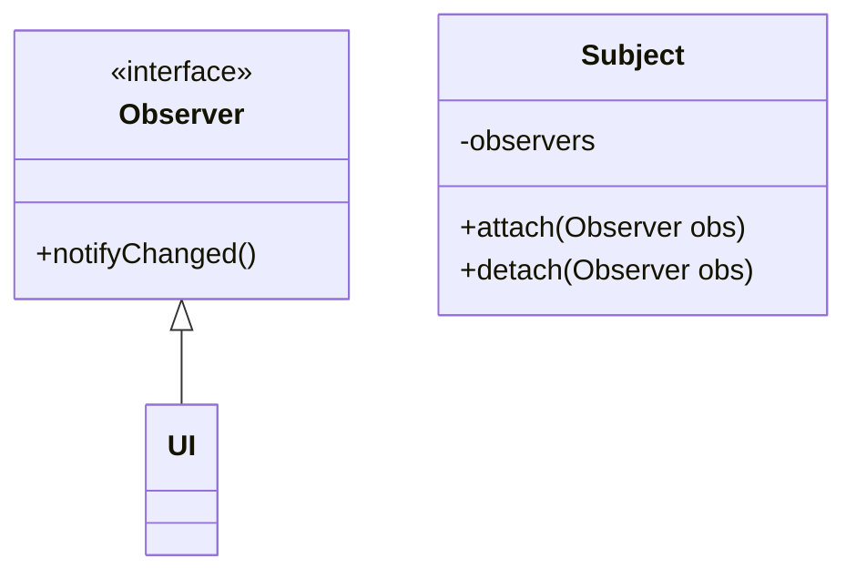

## Wat is een patroon?

Wanneer we software schrijven, is het niet efficiënt om steeds het wiel opnieuw uit te vinden.
Daarom maken we vaak gebruik van bibliotheken (libraries): code die door iemand anders geschreven en getest werd, en die we zo kunnen herbruiken in ons project.
Het eenvoudigste voorbeeld in de context van dit vak zijn de klassen die deel uitmaken van de Java API (bv. collecties en streams).

Soms is het geen code die we willen herbruiken, maar een idee voor een ontwerp.
Voor bepaalde problemen is de cruciale vraag immers niet 'bestaat er een bibliotheek die dit oplost' maar 'hoe structureer ik mijn software het best gegeven deze context'.
In die situatie spelen **ontwerppatronen** de rol van de bibliotheek (library).
Een ontwerppatroon is een beschrijving van een herbruikbare oplossing voor een vaak terugkerend ontwerpprobleem.
Patronen worden niet uitgevonden, maar omvatten kennis over werkende oplossingen die door middel van ervaring en expertise werden opgebouwd.
De meest populaire software engineering design patterns zijn beschreven in het boek [Design Patterns: Elements of Reusable Object-Oriented Software](https://en.wikipedia.org/wiki/Design_Patterns) (1995).

Een patroon geeft in de eerste plaats een **naam** aan een herbruikbare oplossingsstrategie.
Op die manier gaan patroonnamen deel uitmaken van het ontwerpvocabularium, en volstaat een zin als "Heb je al eens aan een _visitor_ gedacht?" om een hele oplossingsstrategie te beschrijven aan een collega.

In sommige gevallen is het ontstaan van een patroon het gevolg van een tekortkoming van een programmeertaal.
We zullen later bijvoorbeeld zien dat het visitor-patroon, wat lange tijd populair was in Java, aan relevantie inboet sinds de taal uitgebreid werd met sealed interfaces en pattern matching.
Die laatsten voorzien immers een ingebouwde manier om hetzelfde te doen.
In veel gevallen zijn patronen dan ook taal-afhankelijk.
De nood aan het Observer-patroon in Java wordt in C# bijvoorbeeld (gedeeltelijk) weggenomen door de _delegates_- en _event_-constructies in de taal.

In de cursus "Software-ontwerp in Java" heb je reeds kennis gemaakt met een design pattern, namelijk _Model-View-Controller_.
We beginnen onze verkenning met dat patroon.

## Model-View-Controller

Een van de meest populaire patronen is Model-View-Controller (_MVC_).
Dit patroon stelt voor om UI-logica eenvoudig te scheiden van domein logica door drie aparte lagen te maken.

1. Het model, het belangrijkste, stelt ons domein voor: de objecten waar het om draait in de applicatie.
2. De view, de UI, is de presentatielaag die de gebruiker te zien krijgt als hij de applicatie hanteert. Achterliggend wordt er door de view informatie uit de model-objecten gehaald.
3. De controller handelt acties van de gebruiker (UI events, bv. het klikken op een knop) af, en vertaalt deze naar operaties op het model. De controller verwittigt ook de view dat die zich moet updaten.


graph TD;
V[View]
C[Controller]
M[Model]
C --> V
V --> M
C --> M


De controller kent zowel de view als het model. De view kent enkel het model. Het model kent niemand buiten zichzelf. Op die manier is het eenvoudig om in de applicatie te migreren naar nieuwe presentatie lagen, zoals van een typische client-server applicatie naar een moderne website, gehost op een (virtuele) server. Dit principe kan telkens opnieuw worden toegepast, voor ontelbare applicaties. Men spreekt hier dus van een herhalend patroon, dat kan helpen bij het oplossen van een probleem.

## Observer

In het MVC patroon zou je misschien willen dat de controller de view niet hoeft te vertellen dat er een update moet gebeuren.
Dat vereist namelijk dat de controller weet wanneer er veranderingen gebeuren die relevant zijn voor de view, of (als de controller de view na elke operatie laat updaten) dat er misschien nodeloos updates van de view gebeuren.

Idealiter vertelt het model aan de view dat er iets gewijzigd is, waardoor de view kan beslissen of die zichzelf moet updaten.
Maar we willen het model onafhankelijk houden van de view.

### Doelstelling

- Breng één of meerdere objecten (van verschillende klassen) op de hoogte van een gebeurtenis in een object van een andere klasse.
- Vermijd dat de gewijzigde klasse moet weten wie er allemaal op de hoogte gebracht moet worden (_lage koppeling_).

Het **observer**-patroon laat toe dat een klasse 'luistert' naar veranderingen in een andere klasse, zonder dat de klasse die wijzigingen ondergaat moet weten wie er precies luistert, of waarom.

### Structuur

We doen dat door gebruik te maken van een _Observer_-interface.
Het idee is om de klasse die kan wijzigen (de _Subject_) een lijst van Observer-objecten te laten bijhouden.
Het subject weet niet wat de concrete klassen zijn, enkel dat ze de Observer-interface implementeren.



Dit patroon wordt soms ook **publish-subscribe** genoemd.
Een klasse (hier Subject) publiceert wijzigingen naar al wie ingeschreven is (de observers).

### In Java

In Java kan je, in plaats van een speciale Observer-interface te maken, ook functionele interfaces (bv. Runnable) en lambda's gebruiken om hetzelfde te bereiken, bijvoorbeeld:

```java
class Subject {
  private List<Runnable> observers;

  public void change() {
    ...
    notifyObservers();
  }

  public void attach(Runnable observer) {
    observers.add(observer);
  }

  public void detach(Runnable observer) {
    observers.remove(observer);
  }

  protected void notifyObservers() {
    for (var observer : this.observers) {
      observer.run();
    }
  }
}


class UI {
  public UI(Subject model) {
    this.model = model;
    model.attach(this::modelUpdated)
  }

  private void modelUpdated() {
    ...
  }
}
```

## Singleton

In sommige gevallen is het belangrijk dat in een applicatie bepaalde functionaliteit gecentraliseerd wordt op één punt.
Denk hierbij bijvoorbeeld aan een pool van database-connecties, logging, caching, of communicatie met hardware.
Wanneer je meerdere objecten van eenzelfde klasse kan aanmaken, kunnen die objecten elkaars werking misschien verstoren.

Het **singleton**-patroon biedt een manier aan om ten hoogste één instantie van een klasse te maken, die globaal toegankelijk is.

### Doelstelling

- Beperk een bepaalde klasse tot één instantie (object), in plaats van meerdere.
- Maak die ene instantie eenvoudig toegankelijk vanaf eender waar in de code.

### Voorbeeld

#### 2. Probleemstelling

Tien gebruikers die op de site terecht komen wensen allemaal hun winkelwagentje te raadplegen. Er zijn maar twee DB connecties beschikbaar, dit opgelegd door de database zelf. Iemand moet die dus beheren (locken, vrijgeven, locken, ... - dit heet _database pooling_).

Als we twee instanties van `DBHandle` maken, kunnen er plots 2x2 connecties open worden gemaakt naar de database. Die zal dit ook blokkeren, wat resulteert in 2 klanten die een crash ervaren, en twee die hun winkelwagen kunnen raadplegen zonder verdere problemen.


graph TD;
A[ShoppingResource Inst1]
B[ShoppingResource Inst2]
C[DBHandle Inst1]
D[DBHandle Inst2]
A -->|nieuwe instance| C
B -->|nieuwe instance| D


De `getCart()` methode mag dus in geen geval telkens een nieuwe `DBHandle` aanmaken.

#### 3. Oplossing

We hebben in dit geval een _singleton_ instance nodig:

<div class="devselect">

```kt
@Path("/shoppingcart")
class ShoppingResource {
    @GET
    fun getCart(): ShoppingCart {
        return DBHandle.getShoppingCart()
    }
}
```

```java
@Path("/shoppingcart")
public class ShoppingResource {
    @GET
    public ShoppingCart getCart() {
        return DBHandle.getInstance().getShoppingCart();
    }
}
```

</div>

Waarbij de klasse `DBHandle` wordt uitgebreid tot:

<div class="devselect">

```kt
object DBHandle {
    fun getShoppingCart(): ShoppingCart {
        // SELECT * FROM ...
    }
}
```

```java
public class DBHandle {
    private static DBHandle instance;

    public static DBHandle getInstance() {
        if(instance == null) {
            instance = new DBHandle();
        }
        return instance;
    }

    private DBHandle() {
    }

    public ShoppingCart getShoppingCart() {
        // SELECT * FROM ...
    }
}
```

</div>

{}
Merk op dat [Kotlin ingebouwde features heeft voor singleton](https://blog.mindorks.com/how-to-create-a-singleton-class-in-kotlin): namelijk het `object` keyword dat `class` vervangt in bovenstaande code. Dit is véél meer werk in Java. De "Java way" moet ook gekend zijn! Bijkomend, Kotlin heeft geen `static` keyword. <br/>
Om te begrijpen wat er gebeurt in de JVM kan je de Kotlin-compiled bytecode inspecteren via menu _Tools - Kotlin - Show Kotlin Bytecode_. Een `object` bevat automatisch een statische referentie naar zichzelf, zoals we in Java handmatig moeten schrijven: `public static final DBHandle INSTANCE;`. Calls naar Kotlin's `DBHandle.getShoppingCart()` worden automatisch vervangen door Java's `DBHandle.INSTANCE.getShoppingCart();`
{}


graph TD;
A[ShoppingResource Inst1]
B[ShoppingResource Inst2]
C[DBHandle Inst]
A -->|zelfde instance| C
B -->|zelfde instance| C


Op die manier is het aanmaken van een `DBHandle` instance beperkt tot de klasse zelf, door de `private` constructor. In de statische methode wordt er eerst gecontroleerd of de instantie `null` is of niet. In principe zou er maar één keer tijdens de uitvoering van het programma de `new DBHandle()` regel worden uitgevoerd[^conc].

[^conc]: Dit klopt niet helemaal als we kijken naar concurrency problemen, waarbij twee gebruikers op exact hetzelfde tijdstip de methode aanroepen. Dit laten we buiten beschouwing voor dit vak.

### Eigenschappen van dit patroon

- Definiëer de enige instantie als een ontoegankelijke `static` variabele, die door één enkele `public static` methode wordt bewaakt.
- Singleton klassen hebben enkel een `private` constructor om te voorkomen dat dit nog elders kan worden aangemaakt.
- Er wordt meestal een `null` check gedaan, zodat de code die de getter aanroept dit niet opnieuw moet doen. Dit voorkomt onnodige duplicatie op verschillende plaatsen in de codebase.

## <a name="oef"></a>Labo oefeningen

Clone of fork <i class='fab fa-github'></i> GitHub project https://github.com/KULeuven-Diepenbeek/ses-patterns-singleton-template

### Opgave 1

Hierin is bovenstaande voorbeeld verwerkt, maar nog zonder Singleton... Voer de unit testen uit in `src/main/test`: het resultaat zijn gefaalde testen (ROOD), omdat `DBHandle` verschillende keren wordt aangemaakt. Zorg er voor dat alle testen slagen (GROEN) door het singleton patroon te implementeren!

### Opgave 2

Pas ook `ShoppingCartResource` aan naar een singleton. Is dat nodig om de database niet te overbelasten, als de andere klasse reeds een singleton is, of niet?

### Opgave 3

[sessy library](/extra/sessy):

1. identificeer welke klassen een kans maken om een Singleton te worden. Denk aan bovenstaande voorbeeld. Is er reeds ergens een Singleton patroon geïmplementeerd?
2. Pas het patroon toe waar jij denkt dat het nodig is.
3. Hoe kan je afleiden welke gebruikte frameworks op bepaalde plekken Singleton klasses hebben?

## Denkvragen

- Dit patroon klinkt aanlokkelijk: eenvoudig, lost problemen op, dus waarom niet overal toepassen. Denk eens na over de verantwoordelijkheden van objecten. Waarom zou je zo veel mogelijk moeten **vermijden** om dit patroon toe te passen? Wie mag wel `DBHandle.getInstance()` (of in geval van Kotlin, de functies zelf) aanroepen, en wie niet?
- Wat gebeurt er als 10 mensen tegelijkertijd de eerste keer de `getInstance()` methode aanroepen? Hoe kunnen we dit oplossen?

### Singleton en multi-threading

## Factory method

## Visitor

### Visitor vs. sealed classes

## Builder

## Port-adapter
